# 🏛️ ClinicOS — Architecture.md

> **The deep architectural reference for the ClinicOS frontend.**
> This document explains _how_ and _why_ the system is shaped the way it is. It is subordinate to — and must stay consistent with — the single source of truth: **[Brain.md](./Brain.md)**.
> For the exhaustive, section-by-section master treatment, see **[Frontend-Foundation-Blueprint.md](./Frontend-Foundation-Blueprint.md)** (the 40-section master document).

---

## Table of contents

1. [Purpose & relationship to the canon](#1-purpose--relationship-to-the-canon)
2. [Architectural goals & the forces](#2-architectural-goals--the-forces)
3. [The three pillars: FSD + DDD + Clean Architecture](#3-the-three-pillars-fsd--ddd--clean-architecture)
4. [The 7 layers in detail](#4-the-7-layers-in-detail)
5. [The Dependency Rule & its enforcement](#5-the-dependency-rule--its-enforcement)
6. [Slice anatomy](#6-slice-anatomy)
7. [Bounded contexts & the patient journey](#7-bounded-contexts--the-patient-journey)
8. [Data flow & the backend-independence pipeline](#8-data-flow--the-backend-independence-pipeline)
9. [Dependency injection & composition](#9-dependency-injection--composition)
10. [State architecture](#10-state-architecture)
11. [Routing architecture](#11-routing-architecture)
12. [Cross-cutting concerns architecture](#12-cross-cutting-concerns-architecture)
13. [Multi-tenancy & RBAC architecture](#13-multi-tenancy--rbac-architecture)
14. [Offline & sync architecture](#14-offline--sync-architecture)
15. [Scalability](#15-scalability)
16. [Platform reach](#16-platform-reach)
17. [Fitness functions](#17-fitness-functions-architectural-invariants)

---

## 1. Purpose & relationship to the canon

This document is the **architectural reference manual** for ClinicOS. It is the place a developer or AI agent goes to understand _the shape of the system_: its layers, its dependency rules, its data flow, and the reasoning behind every load-bearing decision.

It does **not** re-litigate the rules — those are ratified in **[Brain.md](./Brain.md)**. This document **explains and operationalizes** them. Where Brain.md says _"the UI never talks to the backend directly"_ (Product Law #6), this document shows you the exact pipeline, the TypeScript, and the sequence diagram that makes it true.

| This document answers…                            | Canonical authority                                                    |
| ------------------------------------------------- | ---------------------------------------------------------------------- |
| _Why_ are there 7 layers and what may each do?    | [Brain.md §5](./Brain.md)                                              |
| _How_ is the Dependency Rule enforced?            | [Brain.md §5.1](./Brain.md)                                            |
| _How_ does data flow from HTTP to component?      | [Brain.md §5.3](./Brain.md)                                            |
| Where does each kind of state live?               | [Brain.md §9](./Brain.md)                                              |
| How does offline work end-to-end?                 | [Brain.md §10](./Brain.md)                                             |
| The full 40-section treatment of any of the above | [Frontend-Foundation-Blueprint.md](./Frontend-Foundation-Blueprint.md) |

> **Cross-linking discipline.** This document does **not** duplicate the design-token catalogue, the component library, the naming tables, or the folder tree. Those live in [Frontend-Bible.md](./Frontend-Bible.md), [Naming-Convention.md](./Naming-Convention.md), and [Folder-Structure.md](./Folder-Structure.md) respectively. When you need a token name, an i18n key convention, or a file-naming rule, follow the link — do not re-derive it here.

---

## 2. Architectural goals & the forces

ClinicOS is a healthcare SaaS designed to live **10+ years without a rewrite** (Brain.md §1). Architecture is the art of choosing which things are _hard to change_ and making sure they are the _least likely to change_. The following forces are the design pressure on every decision in this document.

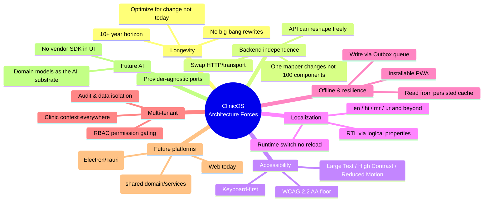

### 2.1 The forces, and the architectural answer to each

| Force                    | What it threatens                                      | Architectural answer                                                                                                                          |
| ------------------------ | ------------------------------------------------------ | --------------------------------------------------------------------------------------------------------------------------------------------- |
| **10-year horizon**      | Coupling to _today's_ framework/API rots the codebase. | Clean Architecture: stable **domain models** at the center; volatile concerns (HTTP, framework, UI) at the edges and inverted via interfaces. |
| **Backend independence** | A backend reshape forces a UI rewrite.                 | The **DTO → mapper → Model** pipeline (§8). The UI only ever sees Models.                                                                     |
| **Accessibility**        | Bolt-on a11y is always incomplete.                     | A11y is a _layer concern of `shared/ui`_ + fitness functions (§17). Tokens carry focus rings, target sizes, contrast.                         |
| **Localization**         | Hardcoded strings are unremovable later.               | i18n keys are mandatory; linted (§17). Logical CSS properties make RTL free.                                                                  |
| **Offline**              | Naive apps lose writes when the network drops.         | Query persistence (reads) + **Outbox** (writes) + service worker shell (§14).                                                                 |
| **Multi-tenant**         | Cross-tenant data leakage; role confusion.             | A **clinic context** + **permission-gated rendering** woven through `app` and `entities/session` (§13).                                       |
| **Future platforms**     | Web-only assumptions block mobile/desktop.             | The **domain/services layer is platform-agnostic**; only `shared/ui` + `app` shell are platform-specific (§16).                               |
| **Future AI**            | Vendor lock-in; UI coupled to a model SDK.             | Domain Models are the substrate AI reasons over; AI access is a **port** behind an interface, never an SDK import in a component.             |

> **The single sentence that ties them together:** _We make the **domain** the most stable thing in the system, and we push every volatile concern (backend shape, transport, framework, platform, vendor) to a replaceable edge behind an interface._

---

## 3. The three pillars: FSD + DDD + Clean Architecture

ClinicOS combines three disciplines that each answer a **different question**. Confusing them is the most common architectural mistake; keeping them distinct is what makes the system legible.

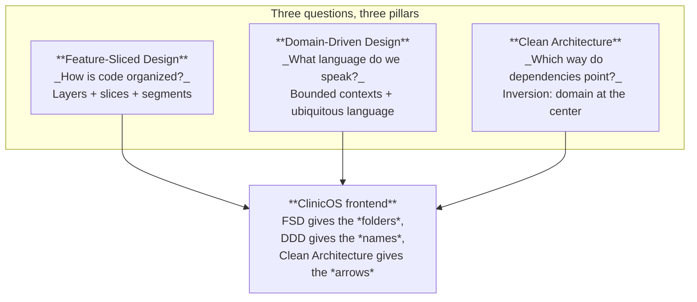

### 3.1 Feature-Sliced Design — the _structure_

FSD answers **"where does this file go?"** It partitions the codebase into **layers** (horizontal, by architectural responsibility) and **slices** (vertical, by business domain), and each slice into **segments** (`ui`, `model`, `api`, `lib`, `config`). It gives us a flat, predictable, scalable folder system where any engineer can find anything in seconds (see [Folder-Structure.md](./Folder-Structure.md) for the canonical tree).

### 3.2 Domain-Driven Design — the _language_

DDD answers **"what do we call things, and where are the boundaries?"** It gives us the **ubiquitous language** (Patient, Appointment, Vitals, Prescription, Queue…) shared by product, design, backend, and frontend, and it carves the system into **bounded contexts** that follow the patient journey (§7). In FSD terms: DDD nouns become **`entities`**, DDD capabilities (verbs) become **`features`**, and DDD long-running processes become **`processes`**.

### 3.3 Clean Architecture — the _dependency inversion_

Clean Architecture answers **"which way may dependencies point?"** The answer: **inward, toward the stable domain.** Concrete, volatile details (the HTTP client, the backend's JSON shape, React itself) depend on **abstractions** (Repository interfaces, Domain Models); the abstractions never depend on the details. This is what the **Repository / Service / DTO** pipeline (§8) implements.

### 3.4 How they combine

| Concern                     | Pillar that owns it          | Manifested in ClinicOS as                                               |
| --------------------------- | ---------------------------- | ----------------------------------------------------------------------- |
| Folder/layer boundaries     | FSD                          | `app/processes/pages/widgets/features/entities/shared`                  |
| Naming & context boundaries | DDD                          | `entities/patient`, `features/record-vitals`, `processes/patient-visit` |
| Direction of dependencies   | Clean Architecture           | Repository interface in `entities`, HTTP impl injected at the edge      |
| Public-API encapsulation    | FSD (slices) + Clean (ports) | every slice's `index.ts` is its only legal surface                      |

> **Why three pillars and not one framework?** See the decision block in §5 — the short version is that no single off-the-shelf pattern simultaneously solves _organization at scale_, _shared language across roles_, and _replaceable backends_. We compose three proven, independently-evolving disciplines instead of betting on one monolithic prescription.

---

## 4. The 7 layers in detail

The layers are listed **top → bottom**. The cardinal rule: **a layer may import only from layers strictly below it, and only through their public `index.ts`.** (Formalized and enforced in §5.)

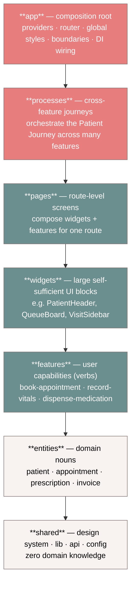

> **Reading the arrows:** an arrow `A --> B` means _"A may depend on B."_ There is **no upward arrow and no sideways arrow.** A `feature` may not import another `feature`; composition of two features happens one level up (in a `page` or `process`).

### 4.1 `app` — the composition root

|                    |                                                                                                                                                                                                                                                                             |
| ------------------ | --------------------------------------------------------------------------------------------------------------------------------------------------------------------------------------------------------------------------------------------------------------------------- |
| **Responsibility** | Bootstrap the entire application exactly once.                                                                                                                                                                                                                              |
| **MAY**            | Mount providers (Query, i18n, theme/token, auth/session, error boundaries, telemetry); define the router; wire **Dependency Injection** (instantiate repositories from interfaces, choose `HttpClient` vs MSW); load global CSS / token roots; register the service worker. |
| **MAY NOT**        | Contain business logic or domain rendering. `app` _composes_; it does not _implement_. No DTOs, no domain models defined here.                                                                                                                                              |
| **Imports from**   | every layer below (it is the top).                                                                                                                                                                                                                                          |

### 4.2 `processes` — cross-feature journeys

|                    |                                                                                                                                                                              |
| ------------------ | ---------------------------------------------------------------------------------------------------------------------------------------------------------------------------- |
| **Responsibility** | Orchestrate **multi-step, multi-feature** business journeys — most importantly the Patient Journey (§7). A process is the only place that may _coordinate_ several features. |
| **MAY**            | Sequence features (Check-In → Vitals → Queue), hold journey-level state machine, drive transitions, compose pages.                                                           |
| **MAY NOT**        | Render low-level UI directly (delegate to widgets/features); know backend shapes (that's `entities/api`).                                                                    |
| **Imports from**   | pages, widgets, features, entities, shared.                                                                                                                                  |

### 4.3 `pages` — route-level screens

|                    |                                                                                                                                                     |
| ------------------ | --------------------------------------------------------------------------------------------------------------------------------------------------- |
| **Responsibility** | One screen per route. Compose widgets and features into a coherent layout; own the page's loading/empty/error/success orchestration (Brain.md §11). |
| **MAY**            | Compose multiple features + widgets; read route params; define the page-level error boundary.                                                       |
| **MAY NOT**        | Contain reusable business logic (push it down to a feature/entity); be imported by another page.                                                    |
| **Imports from**   | widgets, features, entities, shared.                                                                                                                |

### 4.4 `widgets` — large self-sufficient UI blocks

|                    |                                                                                                                                                                                                      |
| ------------------ | ---------------------------------------------------------------------------------------------------------------------------------------------------------------------------------------------------- |
| **Responsibility** | Big, **self-contained, reusable** composite UI blocks that may combine several entities/features but present as one unit (e.g. `QueueBoard`, `PatientHeader`, `VisitTimeline`).                      |
| **MAY**            | Compose features + entities; own a per-widget error boundary; be reused across pages.                                                                                                                |
| **MAY NOT**        | Be route-aware in a way that couples to one page; import another widget upward. (Widget→widget composition is allowed only downward via public API and should be rare — prefer composing in a page.) |
| **Imports from**   | features, entities, shared.                                                                                                                                                                          |

### 4.5 `features` — user capabilities (verbs)

|                    |                                                                                                                                                                                       |
| ------------------ | ------------------------------------------------------------------------------------------------------------------------------------------------------------------------------------- |
| **Responsibility** | A single **user capability**: a verb the user performs. `book-appointment`, `record-vitals`, `dispense-medication`, `collect-payment`. This is where most interaction logic lives.    |
| **MAY**            | Use entities + shared; own its own form (RHF + Zod), its mutation hooks, its local UI state (Zustand slice if needed).                                                                |
| **MAY NOT**        | **Import another feature** (the most-enforced rule). Coordinate sibling features — that is a `process`/`page` job. Define the canonical domain model of a noun (that's the `entity`). |
| **Imports from**   | entities, shared.                                                                                                                                                                     |

### 4.6 `entities` — domain nouns

|                    |                                                                                                                                                                                                                                                                                         |
| ------------------ | --------------------------------------------------------------------------------------------------------------------------------------------------------------------------------------------------------------------------------------------------------------------------------------- |
| **Responsibility** | The canonical representation of a **domain noun**: its **Model** type, its **Repository** (interface + impl), its **DTO/schema/mapper**, its read query-hooks, and its presentational pieces (e.g. a `PatientAvatar`, `AppointmentBadge`). This is the home of the ubiquitous language. |
| **MAY**            | Define Domain Models; define Repository interfaces and their HTTP implementations; expose read hooks (`usePatient`); render _entity-level_ presentational UI.                                                                                                                           |
| **MAY NOT**        | Import features/widgets/pages/processes; contain cross-entity workflow; talk to another entity's internals (only via that entity's public API).                                                                                                                                         |
| **Imports from**   | shared (and, sparingly and only via public API, lower entities it strictly depends on — see §5 cross-entity note).                                                                                                                                                                      |

### 4.7 `shared` — the foundation, zero domain knowledge

|                    |                                                                                                                                                                                                                                              |
| ------------------ | -------------------------------------------------------------------------------------------------------------------------------------------------------------------------------------------------------------------------------------------- |
| **Responsibility** | The reusable, **domain-agnostic** foundation: the design-system UI kit (`shared/ui`), the `HttpClient` interface + impl (`shared/api`), generic libs (`shared/lib`: dates, money, result types), global config, the i18n + token primitives. |
| **MAY**            | Provide primitives usable anywhere; define the `HttpClient` _interface_; expose design-system components driven by tokens.                                                                                                                   |
| **MAY NOT**        | Know **anything** about Patient, Appointment, or any clinic concept. If a file in `shared` mentions a domain noun, it is misplaced.                                                                                                          |
| **Imports from**   | nothing internal (only third-party + other `shared` modules).                                                                                                                                                                                |

> **Decision block — Why these 7 layers?**
>
> - **Why.** A flat "components / utils / api" structure does not scale past a few dozen features and gives no rule for _where logic belongs_ or _what may depend on what_. FSD's 7 layers give every file an unambiguous home and a one-directional dependency graph.
> - **Benefits.** Predictable navigation; enforced low coupling; parallel team work (§15); the domain (`entities`) is insulated from UI churn.
> - **Trade-offs.** More folders and ceremony up front; juniors must learn the layer rule before contributing. Some "obvious" co-locations are forbidden (a feature can't just import a sibling feature).
> - **Alternatives considered.** (1) _Flat by type_ (`/components`, `/hooks`, `/api`) — rejected: collapses at scale, no dependency rule. (2) _Atomic Design only_ — rejected: organizes _visuals_, not _domain/dependencies_. (3) _Nx/Module-per-feature with no layers_ — rejected: lacks the language layer (DDD) and the inward dependency rule.
> - **Future scalability.** Layers + slices are the substrate for code-ownership and (optionally) micro-frontends (§15).
> - **Enterprise considerations.** Auditable boundaries, lintable invariants (§17), and clear ownership lines map cleanly to team topologies and compliance review.

---

## 5. The Dependency Rule & its enforcement

### 5.1 Formal statement

> **For any import `X → Y`:** `layer(Y)` must be **strictly lower** than `layer(X)` in the order
> `app > processes > pages > widgets > features > entities > shared`,
> **and** the import must target `Y`'s public API (`Y/index.ts`), never a deep internal path.
> **Same-layer** imports between sibling **slices** are forbidden (one exception, tightly controlled: a lower entity may be a public dependency of a higher entity — see §5.4).

### 5.2 Why downward-only

Downward-only dependencies guarantee an **acyclic** dependency graph. Acyclicity is what lets us:

- **Reason locally.** Changing a `feature` can never break an `entity` (nothing below depends on anything above).
- **Code-split cleanly.** No cycles means routes/features tree-shake and lazy-load predictably (§11).
- **Test in isolation.** Lower layers have no knowledge of higher ones, so they're unit-testable without mocks of the world.

A _sideways_ dependency (feature→feature) re-introduces cycles and coupling through the back door, which is why it is the rule we enforce hardest.

### 5.3 Why public-API-only (`index.ts`)

Each slice's `index.ts` is its **contract**. Internals (`ui/`, `model/`, `api/`) are free to be refactored as long as the public API holds. Deep imports (`features/record-vitals/model/store`) couple consumers to internals and freeze refactors. Forcing every cross-slice import through `index.ts` makes the slice a true **module with an interface** — the FSD analogue of Clean Architecture's "depend on abstractions."

### 5.4 Cross-entity note

Some entities legitimately reference others (an `Appointment` references a `Patient`). This is allowed **only** when (a) the dependency is strictly downward in a declared entity ordering, (b) it goes through the depended-upon entity's public `index.ts`, and (c) it imports **types/models**, not internal stores. When two entities would need to depend on each other, that mutual logic belongs **up** in a `feature` or `process`, never sideways.

### 5.5 How it is enforced — `eslint-plugin-boundaries`

Architecture is **linted, not hoped for** (Brain.md §4). Sketch of the config:

```js
// .eslintrc.cjs  (sketch — see Folder-Structure.md for the canonical version)
module.exports = {
  plugins: ['boundaries', 'import'],
  settings: {
    // 1) Tell the plugin what each layer "is" by path.
    'boundaries/elements': [
      { type: 'app', pattern: 'src/app/*' },
      { type: 'processes', pattern: 'src/processes/*' },
      { type: 'pages', pattern: 'src/pages/*' },
      { type: 'widgets', pattern: 'src/widgets/*' },
      { type: 'features', pattern: 'src/features/*' },
      { type: 'entities', pattern: 'src/entities/*' },
      { type: 'shared', pattern: 'src/shared/*' },
    ],
  },
  rules: {
    // 2) The Dependency Rule: each layer may import only the layers below it.
    'boundaries/element-types': [
      'error',
      {
        default: 'disallow',
        rules: [
          {
            from: 'app',
            allow: ['processes', 'pages', 'widgets', 'features', 'entities', 'shared'],
          },
          { from: 'processes', allow: ['pages', 'widgets', 'features', 'entities', 'shared'] },
          { from: 'pages', allow: ['widgets', 'features', 'entities', 'shared'] },
          { from: 'widgets', allow: ['features', 'entities', 'shared'] },
          { from: 'features', allow: ['entities', 'shared'] }, // ❌ NOT "features"
          { from: 'entities', allow: ['shared'] }, // cross-entity: see §5.4
          { from: 'shared', allow: ['shared'] },
        ],
      },
    ],
    // 3) Public-API-only: forbid deep imports past a slice's index.ts.
    'boundaries/no-private': ['error', { allowUncles: false }],
    'boundaries/entry-point': [
      'error',
      {
        default: 'disallow',
        rules: [
          { target: ['features', 'entities', 'widgets', 'processes', 'pages'], allow: 'index.ts' },
        ],
      },
    ],
    // 4) Keep import order/hygiene (sorted, no cycles).
    'import/no-cycle': 'error',
    'import/no-internal-modules': [
      'error',
      {
        /* mirror of entry-point */
      },
    ],
  },
};
```

The same rules run in CI as a **fitness function** (§17). A PR that imports a sibling feature, or deep-imports past an `index.ts`, fails the build — there is no human-judgment step to bypass.

> **Decision block — Linted boundaries vs. convention/code-review.**
>
> - **Why.** Conventions decay; reviewers tire. A 10-year codebase needs the rule enforced _mechanically_, identically for humans and AI agents.
> - **Benefits.** Zero-drift architecture; instant feedback in the editor; AI agents get the same hard wall as humans; onboarding cost drops (the linter teaches the rule).
> - **Trade-offs.** Config maintenance; occasional false-positives needing a documented `eslint-disable` (which itself is reviewed). Some legitimate refactors require touching the config.
> - **Alternatives considered.** (1) _Code-review only_ — rejected, doesn't scale and is inconsistent. (2) _Nx module boundaries_ — viable, but we already use FSD path conventions and want editor-time feedback without adopting the full Nx graph. (3) _TypeScript project references_ — complements but doesn't express the layer matrix as ergonomically.
> - **Future scalability.** The element matrix extends naturally to per-team `code-ownership` and to micro-frontend split points (§15).
> - **Enterprise considerations.** Boundary violations become auditable CI artifacts; compliance can prove that, e.g., `shared` contains no PHI-aware domain logic.

---

## 6. Slice anatomy

Every `feature` and `entity` slice has the **same five segments** plus a public `index.ts`. This uniformity is what makes the codebase navigable at scale.

```
<layer>/<slice-name>/
├── index.ts      ← PUBLIC API — the ONLY legal import surface
├── ui/           ← components (presentational + container)
├── model/        ← types, Domain Model, zustand store, selectors
├── api/          ← dto, schema, mapper, repository, query/mutation hooks, endpoints
├── lib/          ← slice-local pure helpers
└── config/       ← slice constants, feature flags
```

> Segment naming, casing, and the canonical full tree are owned by [Folder-Structure.md](./Folder-Structure.md) and [Naming-Convention.md](./Naming-Convention.md). This section shows the _architectural meaning_ of each segment, not the naming table.

### 6.1 Real example — `features/record-vitals`

```
features/record-vitals/
├── index.ts                       // export { RecordVitalsForm } from "./ui/RecordVitalsForm";
│                                  // export { useRecordVitals } from "./api/useRecordVitals";
├── ui/
│   ├── RecordVitalsForm.tsx        // RHF + Zod form, token-driven, fully localized
│   └── VitalsFieldGroup.tsx
├── model/
│   ├── record-vitals.schema.ts     // Zod form schema (input validation)
│   └── record-vitals.types.ts      // form values type
├── api/
│   └── useRecordVitals.ts          // useMutation → calls vitalsRepository.record(...)
├── lib/
│   └── computeBmi.ts               // pure helper, no I/O
└── config/
    └── ranges.ts                   // BP/temp normal ranges (constants)
```

```ts
// features/record-vitals/index.ts — the PUBLIC API
export { RecordVitalsForm } from './ui/RecordVitalsForm';
export { useRecordVitals } from './api/useRecordVitals';
export type { RecordVitalsValues } from './model/record-vitals.types';
// NOTE: ./model/record-vitals.schema and ./lib/computeBmi are intentionally NOT exported.
```

```ts
// features/record-vitals/api/useRecordVitals.ts
import { useMutation, useQueryClient } from '@tanstack/react-query';
import { useVitalsRepository } from '@/entities/vitals'; // entity public API (downward ✅)
import type { RecordVitalsValues } from '../model/record-vitals.types';

export function useRecordVitals(patientId: string) {
  const repo = useVitalsRepository(); // injected impl (see §9)
  const qc = useQueryClient();
  return useMutation({
    mutationFn: (values: RecordVitalsValues) => repo.record(patientId, values),
    onSuccess: (vitals) => {
      // Server state lives ONLY in Query — invalidate, never mirror into Zustand (§10).
      qc.invalidateQueries({ queryKey: ['patient', patientId, 'vitals'] });
    },
  });
}
```

Notice the feature imports **`entities/vitals`** (downward, via public API) and **never** another feature. The mutation lives in the feature; the **Repository** that knows the backend lives in the **entity**.

### 6.2 Real example — `entities/patient`

```
entities/patient/
├── index.ts                        // public API: model type, hooks, repository hook, UI atoms
├── ui/
│   └── PatientAvatar.tsx           // entity-level presentational UI (token-driven)
├── model/
│   └── patient.model.ts            // the STABLE Domain Model (UI-shaped)
├── api/
│   ├── patient.dto.ts              // raw backend shape
│   ├── patient.schema.ts           // Zod schema validating the DTO at the boundary
│   ├── patient.mapper.ts           // toModel / toDto (the only bilingual file)
│   ├── patient.repository.ts       // interface + HTTP impl
│   └── usePatient.ts               // read query hook
└── config/
    └── patient.keys.ts             // query-key factory
```

```ts
// entities/patient/index.ts — the PUBLIC API
export type { Patient } from './model/patient.model';
export { usePatient } from './api/usePatient';
export { createHttpPatientRepository } from './api/patient.repository';
export type { PatientRepository } from './api/patient.repository';
export { PatientAvatar } from './ui/PatientAvatar';
// dto / schema / mapper are INTERNAL — never exported.
```

The full TypeScript for the DTO, schema, mapper, model, repository, service, and hook is given in §8, using `patient` as the worked example.

---

## 7. Bounded contexts & the patient journey

ClinicOS is the operating system for the **lifetime patient journey** (Brain.md §1). Each step is a **bounded context** with its own ubiquitous language. The mapping below is the bridge between DDD contexts and FSD slices.

| Bounded context  | Primary entities                 | Key features (verbs)                             | Process orchestration |
| ---------------- | -------------------------------- | ------------------------------------------------ | --------------------- |
| **Appointment**  | `appointment`, `patient`, `slot` | `book-appointment`, `reschedule-appointment`     | `patient-visit`       |
| **Check-In**     | `visit`, `patient`               | `check-in-patient`                               | `patient-visit`       |
| **Vitals**       | `vitals`                         | `record-vitals`                                  | `patient-visit`       |
| **Queue**        | `queue`, `queue-token`           | `manage-queue`, `call-next`                      | `patient-visit`       |
| **Consultation** | `encounter`, `note`              | `write-consultation-note`, `order-investigation` | `patient-visit`       |
| **Prescription** | `prescription`, `medication`     | `prescribe-medication`                           | `patient-visit`       |
| **Pharmacy**     | `dispense`, `stock`              | `dispense-medication`, `adjust-stock`            | `pharmacy-fulfilment` |
| **Billing**      | `invoice`, `payment`             | `collect-payment`, `apply-discount`              | `billing-cycle`       |
| **Follow-Up**    | `follow-up`, `appointment`       | `schedule-follow-up`                             | `patient-visit`       |
| **Records**      | `medical-record`                 | `view-medical-record`, `export-record`           | —                     |

### 7.1 The journey as a state machine

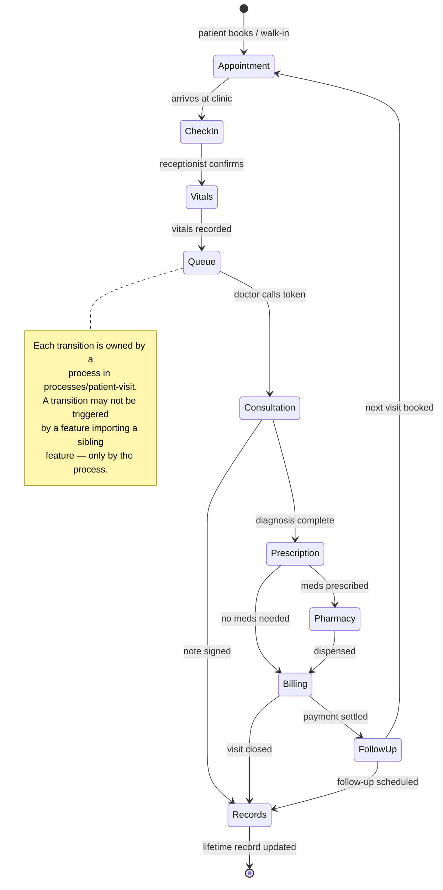

> **Architectural payoff:** because each context maps to its own entities/features, a context can evolve (new pharmacy rules, new billing provider) **without touching its neighbors**. The `processes/patient-visit` orchestrator is the single place that knows the _order_ of the journey; the contexts themselves are ignorant of each other.

---

## 8. Data flow & the backend-independence pipeline

This is **the most important contract in the system** (Brain.md §5.3). It is the mechanism that makes Product Laws #6 and #7 — _the UI never talks to the backend directly_ and _the frontend is backend-independent_ — literally true.

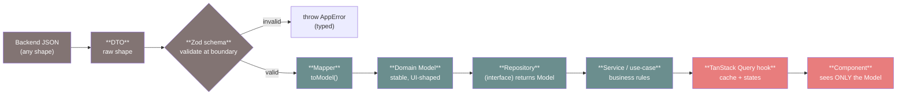

The **boundary** is the Zod-validated DTO. Everything to the _left_ of the Model is volatile (the backend may reshape it freely); everything to the _right_ of the Model is stable (components never change when the backend does). The mapper is the **single bilingual file** that knows both shapes.

### 8.1 Full worked example — `entities/patient`

**(1) DTO — the raw backend shape**

```ts
// entities/patient/api/patient.dto.ts
// Mirrors EXACTLY what the backend sends today. May be ugly. Never leaks past the mapper.
export interface PatientDto {
  patient_id: string;
  patient_first_nm: string;
  patient_last_nm: string | null;
  dob: string; // "1959-04-12"
  sex: 'M' | 'F' | 'O' | null;
  phone_e164: string | null;
  preferred_lang: string | null;
  clinic_id: string;
}
```

**(2) Schema — Zod validation at the boundary**

```ts
// entities/patient/api/patient.schema.ts
import { z } from 'zod';

export const patientDtoSchema = z.object({
  patient_id: z.string().min(1),
  patient_first_nm: z.string().min(1),
  patient_last_nm: z.string().nullable(),
  dob: z.string().regex(/^\d{4}-\d{2}-\d{2}$/),
  sex: z.enum(['M', 'F', 'O']).nullable(),
  phone_e164: z.string().nullable(),
  preferred_lang: z.string().nullable(),
  clinic_id: z.string().min(1),
});

export type ParsedPatientDto = z.infer<typeof patientDtoSchema>;
```

**(3) Model — the stable, UI-shaped Domain type**

```ts
// entities/patient/model/patient.model.ts
// This is the ONLY shape components, features, widgets, pages ever see.
export type Sex = 'male' | 'female' | 'other' | 'unknown';

export interface Patient {
  id: string;
  firstName: string;
  lastName: string | null;
  fullName: string; // derived, presentation-friendly
  dateOfBirth: Date;
  ageYears: number; // derived
  sex: Sex;
  phone: string | null;
  preferredLanguage: string | null;
  clinicId: string;
}
```

**(4) Mapper — the only bilingual file**

```ts
// entities/patient/api/patient.mapper.ts
import { differenceInYears } from '@/shared/lib/date'; // shared, domain-agnostic
import type { Patient, Sex } from '../model/patient.model';
import type { PatientDto } from './patient.dto';
import { patientDtoSchema } from './patient.schema';

const SEX_MAP: Record<NonNullable<PatientDto['sex']>, Sex> = {
  M: 'male',
  F: 'female',
  O: 'other',
};

export function toPatientModel(raw: unknown): Patient {
  // Validate at the boundary — a backend shape change surfaces HERE, loudly, not deep in the UI.
  const dto = patientDtoSchema.parse(raw) as PatientDto;
  const dob = new Date(dto.dob);
  const fullName = [dto.patient_first_nm, dto.patient_last_nm].filter(Boolean).join(' ');
  return {
    id: dto.patient_id,
    firstName: dto.patient_first_nm,
    lastName: dto.patient_last_nm,
    fullName,
    dateOfBirth: dob,
    ageYears: differenceInYears(new Date(), dob),
    sex: dto.sex ? SEX_MAP[dto.sex] : 'unknown',
    phone: dto.phone_e164,
    preferredLanguage: dto.preferred_lang,
    clinicId: dto.clinic_id,
  };
}
// toDto(model): for writes — symmetric, omitted for brevity.
```

> **This is the 10-year payoff.** When the backend renames `patient_first_nm → firstName`, you edit **one file** (`patient.mapper.ts` + `patient.dto.ts` + the schema). **Zero** components, features, widgets, or pages change. That is Brain.md §5.3 made concrete.

**(5) Repository — interface + HTTP implementation (depends on `HttpClient`)**

```ts
// entities/patient/api/patient.repository.ts
import type { HttpClient } from '@/shared/api'; // INTERFACE, not fetch/axios
import type { Patient } from '../model/patient.model';
import { toPatientModel } from './patient.mapper';

// The PORT — the stable abstraction the rest of the app depends on.
export interface PatientRepository {
  getById(id: string): Promise<Patient>;
  search(query: string, clinicId: string): Promise<Patient[]>;
}

// The ADAPTER — one concrete impl. Returns Models, never DTOs.
export function createHttpPatientRepository(http: HttpClient): PatientRepository {
  return {
    async getById(id) {
      const raw = await http.get(`/patients/${id}`);
      return toPatientModel(raw); // boundary crossed here
    },
    async search(query, clinicId) {
      const raw = await http.get(`/patients`, { params: { q: query, clinic_id: clinicId } });
      return (raw as unknown[]).map(toPatientModel);
    },
  };
}
```

**(6) Service / use-case — framework-agnostic business rules**

```ts
// entities/patient/api/patient.service.ts  (or a feature, when the rule is verb-specific)
import type { PatientRepository } from './patient.repository';
import type { Patient } from '../model/patient.model';

// Pure use-case: no React, no HTTP. Orchestrates repositories + business policy.
export function createPatientService(repo: PatientRepository) {
  return {
    async getPatientForVisit(id: string): Promise<Patient> {
      const patient = await repo.getById(id);
      // business rule example: minors may require guardian flagging downstream
      return patient;
    },
  };
}
```

**(7) TanStack Query hook — the only React-aware step**

```ts
// entities/patient/api/usePatient.ts
import { useQuery } from '@tanstack/react-query';
import { usePatientRepository } from './patient.di'; // injected impl (see §9)
import { patientKeys } from '../config/patient.keys';

export function usePatient(id: string) {
  const repo = usePatientRepository();
  return useQuery({
    queryKey: patientKeys.detail(id),
    queryFn: () => repo.getById(id), // returns Patient (Model)
    staleTime: 60_000,
  });
}
```

**(8) Component — sees only the Model**

```tsx
// e.g. widgets/patient-header/ui/PatientHeader.tsx
import { useTranslation } from 'react-i18next';
import { usePatient, PatientAvatar } from '@/entities/patient'; // public API only

export function PatientHeader({ patientId }: { patientId: string }) {
  const { t } = useTranslation('patient');
  const { data: patient, isLoading, isError } = usePatient(patientId);

  if (isLoading) return <PatientHeaderSkeleton />; // §11 of Brain (4 states)
  if (isError || !patient) return <ErrorState messageKey="patient.header.error" />;

  return (
    <header>
      <PatientAvatar patient={patient} />
      <h1>{patient.fullName}</h1>
      {/* localized, token-driven; the component never knew `patient_first_nm` existed */}
      <p>{t('patient.header.age', { count: patient.ageYears })}</p>
    </header>
  );
}
```

### 8.2 Sequence — a read, end to end

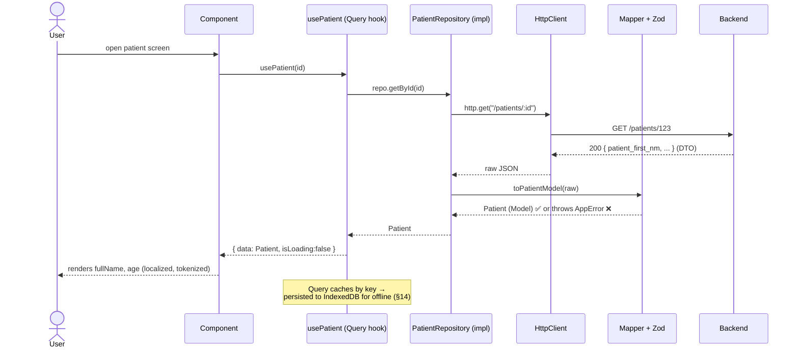

> **Decision block — DTO/Mapper/Repository pipeline.**
>
> - **Why.** A 10-year SaaS _will_ see its backend reshaped many times. The UI must not be hostage to backend JSON.
> - **Benefits.** Backend independence (one-file changes); a single validation boundary (bad data fails loud and early, not deep in render); testability (mock the Repository interface); the Model is a clean, derived, localization/formatting-friendly shape.
> - **Trade-offs.** More files per entity (dto + schema + mapper + model + repo); boilerplate that juniors must learn; a tiny runtime cost for Zod parsing.
> - **Alternatives considered.** (1) _Consume DTOs directly in components_ — rejected: couples the whole UI to backend shape (the exact thing we forbid). (2) _Codegen types from OpenAPI and use them as the model_ — rejected as the _only_ layer: generated types still leak backend shape; we may _generate the DTO_ but the **Model is hand-owned**. (3) _GraphQL to shape on the server_ — possible future transport, but we still keep the mapper boundary so the client stays transport-agnostic.
> - **Future scalability.** New transports (GraphQL, gRPC-web, WebSocket) become new Repository implementations; the Model and every component are untouched. AI features read/write **Models**, never DTOs.
> - **Enterprise considerations.** The Zod boundary is the natural place for PHI validation, redaction policy, and audit hooks; the Repository is the natural seam for per-tenant routing and request signing.

---

## 9. Dependency injection & composition

The Repository is an **interface** (port). The **HTTP implementation** (adapter) is chosen and wired **at the edge** — in `app` — and provided to the tree. Components and hooks ask for _the interface_; they never instantiate a concrete repository or import `fetch`/`axios`.

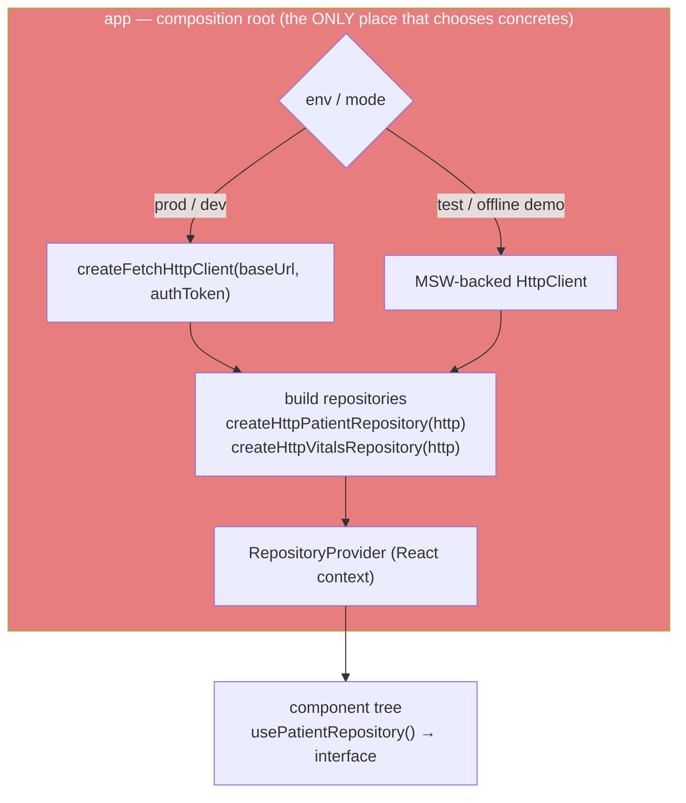

### 9.1 The wiring code

```ts
// shared/api/http-client.ts — the PORT (domain-agnostic, lives in shared)
export interface HttpClient {
  get(url: string, opts?: { params?: Record<string, unknown> }): Promise<unknown>;
  post(url: string, body: unknown): Promise<unknown>;
  put(url: string, body: unknown): Promise<unknown>;
  del(url: string): Promise<unknown>;
}
```

```ts
// app/di/container.ts — the composition root
import { createFetchHttpClient } from '@/shared/api';
import { createHttpPatientRepository, type PatientRepository } from '@/entities/patient';
import { createHttpVitalsRepository, type VitalsRepository } from '@/entities/vitals';

export interface Repositories {
  patient: PatientRepository;
  vitals: VitalsRepository;
}

export function buildRepositories(
  http = createFetchHttpClient(import.meta.env.VITE_API_URL),
): Repositories {
  return {
    patient: createHttpPatientRepository(http),
    vitals: createHttpVitalsRepository(http),
  };
}
```

```tsx
// app/di/RepositoryProvider.tsx — provide the interfaces to the tree
import { createContext, useContext } from 'react';
import { buildRepositories, type Repositories } from './container';

const RepoContext = createContext<Repositories | null>(null);

export function RepositoryProvider({
  value,
  children,
}: {
  value?: Repositories;
  children: React.ReactNode;
}) {
  return (
    <RepoContext.Provider value={value ?? buildRepositories()}>{children}</RepoContext.Provider>
  );
}

export function useRepositories(): Repositories {
  const ctx = useContext(RepoContext);
  if (!ctx) throw new Error('RepositoryProvider missing');
  return ctx;
}
```

```ts
// entities/patient/api/patient.di.ts — the entity exposes a typed accessor
import { useRepositories } from '@/app/di/RepositoryProvider'; // NOTE: provided via context, not a hard upward import in practice
export function usePatientRepository() {
  return useRepositories().patient; // returns the INTERFACE
}
```

> Implementation note: to keep `entities` from importing `app` (which would violate the rule), the `useRepositories` accessor is itself a `shared` primitive (a generic DI context factory), and `app` only _fills_ it. The entity depends on `shared`, never `app`. The diagram above is the _conceptual_ wiring; the _import_ direction stays legal.

### 9.2 Swapping the backend with zero component edits

| Change                          | What you edit                                                            | Components touched |
| ------------------------------- | ------------------------------------------------------------------------ | ------------------ |
| Point at a new API host         | `VITE_API_URL` env                                                       | **0**              |
| Switch `fetch` → `axios`        | one `createAxiosHttpClient` in `shared/api`, swap in `buildRepositories` | **0**              |
| Run fully offline / demo on MSW | inject the MSW-backed `HttpClient` in `app/di`                           | **0**              |
| Backend renames a field         | the entity's `mapper` + `dto` + `schema`                                 | **0**              |
| Move one entity to GraphQL      | a new `createGraphqlPatientRepository` impl                              | **0**              |

> **Decision block — DI via composition root + interfaces.**
>
> - **Why.** Inversion of control is what makes the backend (and transport, and test doubles) swappable. Choosing concretes _once, at the edge_ keeps the core pure.
> - **Benefits.** Trivial test setup (inject fakes), offline/demo mode (inject MSW), and transport migration without touching the UI. The dependency graph stays inward-pointing (Clean Architecture).
> - **Trade-offs.** Indirection: a reader must follow the provider to find the concrete impl. A small amount of context plumbing.
> - **Alternatives considered.** (1) _Direct imports of concrete repos in hooks_ — rejected: hard-couples to one impl, breaks tests/offline. (2) _A heavyweight DI container (InversifyJS)_ — rejected as overkill; React context + factory functions are enough and tree-shake better. (3) _Module-level singletons_ — rejected: defeats per-tenant/per-test isolation.
> - **Future scalability.** Per-tenant repositories, request signing, and feature-flagged backends all slot into `buildRepositories`. Mobile/desktop shells (§16) build their own container with platform `HttpClient`s.
> - **Enterprise considerations.** The composition root is the audited place where auth tokens, tenant routing, and telemetry interceptors are attached — one chokepoint, easy to review.

---

## 10. State architecture

There are **four kinds of state**, each with exactly **one** home (Brain.md §9). The cardinal anti-pattern is **mirroring server data into Zustand** — it creates two sources of truth that drift.

| State kind             | Home                       | Why here                                                                                                                                              | Example                                                  |
| ---------------------- | -------------------------- | ----------------------------------------------------------------------------------------------------------------------------------------------------- | -------------------------------------------------------- |
| **Server state**       | **TanStack Query**         | It is _cached remote data_ with its own lifecycle (stale/refetch/invalidate). Query owns dedup, retries, background refresh, and offline persistence. | patients, appointments, vitals, invoices                 |
| **Client / app state** | **Zustand** (sliced)       | Truly client-owned, cross-component, non-remote. Selector-based, tiny.                                                                                | active clinic, theme, locale, auth session, sidebar open |
| **Form state**         | **React Hook Form**        | High-frequency keystroke updates belong local & uncontrolled for performance; validated by Zod.                                                       | the record-vitals form                                   |
| **URL state**          | **Router / search params** | Must be shareable, bookmarkable, restorable across reloads.                                                                                           | queue filters, active tab, pagination, date range        |
| **Ephemeral**          | `useState`/`useReducer`    | Lives and dies with one component.                                                                                                                    | a dropdown's open flag                                   |

### 10.1 Decision matrix — "where does this piece of state go?"

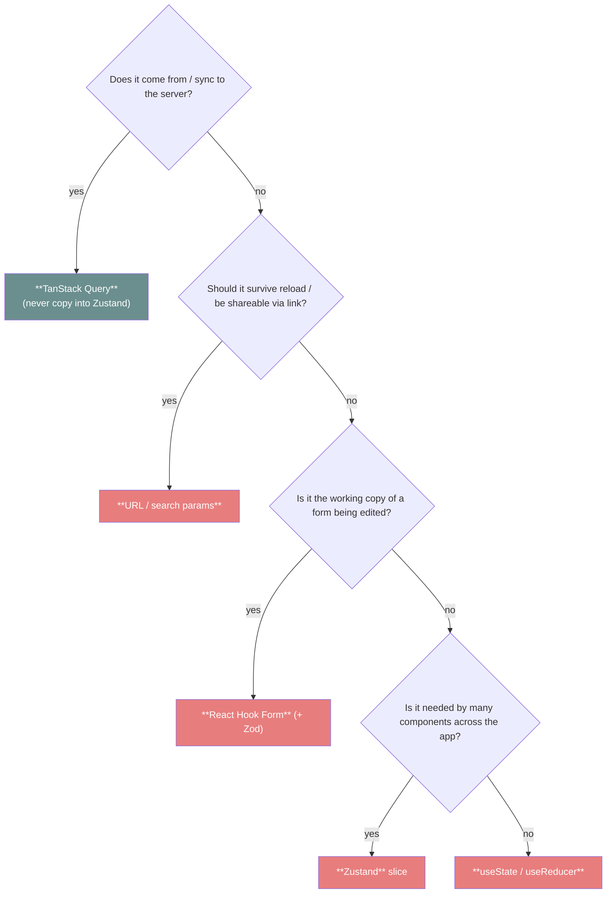

### 10.2 Why server data must NOT be mirrored into Zustand

- **Two sources of truth diverge.** Query refetches in the background; a Zustand copy goes stale silently → the user sees inconsistent data across screens.
- **You lose Query's machinery.** Caching, dedup, retry, `staleTime`, `invalidateQueries`, optimistic updates, and **offline persistence** (§14) all key off the Query cache. Copying data out forfeits them.
- **Invalidation becomes manual and error-prone.** With Query, a mutation invalidates a key and _every_ consumer updates. With a Zustand mirror, you must hand-propagate every change.

> **Rule of thumb:** if a value has a server-side identity, it lives in Query; Zustand holds only _which_ server thing is active (e.g. `activeClinicId`, `selectedPatientId`), never the _data_ of that thing.

> **Decision block — Four-home state model.**
>
> - **Why.** Conflating server and client state is the #1 source of stale-data bugs and re-render storms. Separating by _nature of the data_ gives each kind the right tool.
> - **Benefits.** Single source of truth per datum; smaller stores; predictable invalidation; offline persistence "for free" via Query; shareable URLs.
> - **Trade-offs.** Developers must internalize the matrix; "where does this go?" is a real (but answerable) question on every PR.
> - **Alternatives considered.** (1) _Redux for everything_ — rejected: turns server caching into hand-rolled boilerplate Query already solves; heavy. (2) _Everything in Zustand_ — rejected: re-implements caching badly, the mirroring anti-pattern. (3) _Server-state in URL_ — rejected beyond filters: URLs aren't a cache.
> - **Future scalability.** Slices and query-key factories scale to hundreds of features without a central store bottleneck. AI-driven views read the Query cache like any other consumer.
> - **Enterprise considerations.** Clear data-residency story: server data is never silently duplicated client-side beyond the auditable Query/IndexedDB cache, which matters for PHI handling.

---

## 11. Routing architecture

Routing uses **React Router v6 (data router)** (Brain.md §4). The route tree is owned by `app`; screens are `pages`; every route is **code-split**, and protected routes are **permission-gated** (§13).

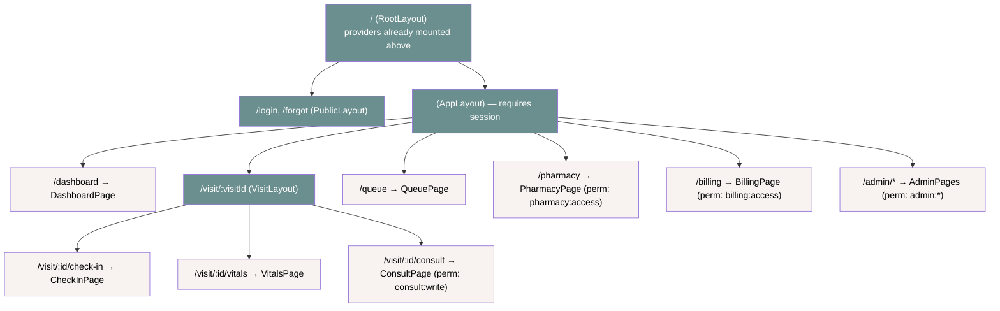

### 11.1 Code-splitting + guards + layout routes

```tsx
// app/router/routes.tsx
import { lazy } from 'react';
import { createBrowserRouter } from 'react-router-dom';
import { AppLayout } from '@/app/layouts/AppLayout';
import { VisitLayout } from '@/app/layouts/VisitLayout';
import { RequireAuth, RequirePermission } from '@/app/guards'; // composed in app

const DashboardPage = lazy(() => import('@/pages/dashboard')); // route-level code split
const VitalsPage = lazy(() => import('@/pages/vitals'));
const ConsultPage = lazy(() => import('@/pages/consult'));
const PharmacyPage = lazy(() => import('@/pages/pharmacy'));

export const router = createBrowserRouter([
  {
    element: <AppLayout />, // layout route (chrome, nav, error boundary)
    children: [
      {
        path: '/',
        element: (
          <RequireAuth>
            <DashboardPage />
          </RequireAuth>
        ),
      },
      {
        path: '/visit/:visitId',
        element: (
          <RequireAuth>
            <VisitLayout />
          </RequireAuth>
        ), // nested layout
        children: [
          { path: 'vitals', element: <VitalsPage /> },
          {
            path: 'consult',
            element: (
              <RequirePermission perm="consult:write">
                {' '}
                {/* permission-gated route */}
                <ConsultPage />
              </RequirePermission>
            ),
          },
        ],
      },
      {
        path: '/pharmacy',
        element: (
          <RequirePermission perm="pharmacy:access">
            <PharmacyPage />
          </RequirePermission>
        ),
      },
    ],
  },
]);
```

- **Code-splitting per route.** Each page is `lazy()`-imported → its bundle loads only when navigated to. The acyclic dependency graph (§5) guarantees clean split points.
- **Layout routes.** `AppLayout`/`VisitLayout` render shared chrome + an `<Outlet/>`; child routes plug in. Each layout owns a **route-level error boundary** (§12).
- **Guarded routes.** `RequireAuth` (session present) and `RequirePermission` (RBAC, §13) wrap protected elements; unauthorized → redirect or a localized "no access" state.

> **Decision block — Data router + lazy routes + guard components.**
>
> - **Why.** A 10-year app needs lazy loading (fast first paint), nested layouts (consistent chrome), and centralized auth/permission gating.
> - **Benefits.** Small initial bundle; per-route error isolation; declarative guards; future loaders/actions available without re-architecting.
> - **Trade-offs.** Lazy boundaries need Suspense fallbacks (skeletons, per Brain.md §11); guard composition adds wrappers.
> - **Alternatives considered.** (1) _File-based routing (Next/Remix)_ — viable but couples to a meta-framework; we keep Vite + explicit routes for control and platform reach (§16). (2) _Hand-rolled router_ — rejected. (3) _Loaders for all data_ — optional; we default to Query hooks so the same data layer serves web/mobile/desktop.
> - **Future scalability.** Route tree maps 1:1 to micro-frontend split points (§15); permission gating extends to any new context.
> - **Enterprise considerations.** Centralized guards are the audited enforcement point for RBAC; route-level boundaries contain blast radius of a failing screen.

---

## 12. Cross-cutting concerns architecture

Cross-cutting concerns are **composed as providers in `app`** — the composition root — so they wrap the whole tree exactly once and nothing below has to know they exist.

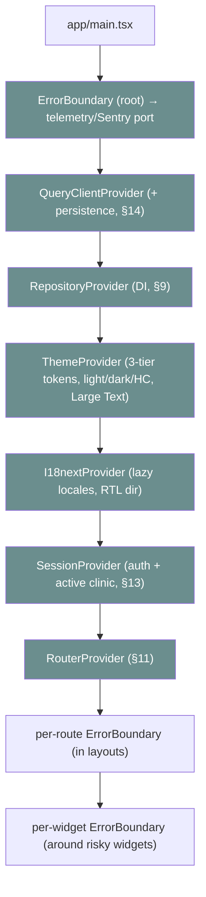

| Concern                    | Where composed                                                               | Architectural note                                                                                                                                                                                                                    |
| -------------------------- | ---------------------------------------------------------------------------- | ------------------------------------------------------------------------------------------------------------------------------------------------------------------------------------------------------------------------------------- |
| **Error boundaries**       | root (catch-all) + per-route (in layouts) + per-widget (around risky blocks) | Layered isolation: a failing `QueueBoard` widget shows a localized retry card without taking down the page; a failing page doesn't kill the shell. Errors are typed `AppError` and reported via the telemetry **port**.               |
| **i18n provider**          | `app`, wraps everything                                                      | `dir` (LTR/RTL) set at provider level; locale bundles lazy-loaded; runtime switch without reload (Brain.md §8). Consumed everywhere via `useTranslation` + keys.                                                                      |
| **Theme / token provider** | `app`                                                                        | Applies the 3-tier token roots and theme attribute (light/dark/high-contrast, Large Text Mode). Components consume **semantic/component tokens only** (Brain.md §6) — see [Frontend-Bible.md](./Frontend-Bible.md) for the catalogue. |
| **Auth / session**         | `app` (`SessionProvider`)                                                    | Holds the auth session + active clinic in a Zustand slice; provides it to guards (§11) and RBAC (§13).                                                                                                                                |
| **Telemetry**              | `app`, behind a port                                                         | Sentry / Web Vitals / OpenTelemetry sit behind an `analytics`/`telemetry` interface (Brain.md §4). **No vendor SDK is imported in a component** — components emit domain events through the port.                                     |

```tsx
// shared/ui/feedback/ErrorBoundary.tsx — reusable, token-driven, localized
export class ErrorBoundary extends React.Component<
  { fallbackKey: string; onError?: (e: Error) => void },
  { hasError: boolean }
> {
  state = { hasError: false };
  static getDerivedStateFromError() {
    return { hasError: true };
  }
  componentDidCatch(error: Error) {
    this.props.onError?.(error); /* → telemetry port */
  }
  render() {
    if (this.state.hasError) return <ErrorState messageKey={this.props.fallbackKey} />;
    return this.props.children;
  }
}
```

> **Decision block — Cross-cutting concerns as composed providers behind ports.**
>
> - **Why.** Cross-cutting concerns must be applied uniformly and be swappable without touching consumers.
> - **Benefits.** One wiring point; uniform behavior; vendor independence (telemetry/analytics behind ports); layered error isolation limits blast radius.
> - **Trade-offs.** Provider nesting depth in `app`; discipline to never reach for a vendor SDK directly.
> - **Alternatives considered.** (1) _Per-feature error handling_ — rejected: inconsistent, leaks vendor calls into the domain. (2) _Direct Sentry import in components_ — rejected: vendor lock-in. (3) _HOC sprawl_ — rejected in favor of a few top-level providers.
> - **Future scalability.** New cross-cutting concern (e.g. AI assist overlay) = one new provider in `app`. Ports let us change telemetry/analytics vendors without code churn.
> - **Enterprise considerations.** Centralized telemetry port is where PHI scrubbing and consent gating live; one audited place for error/observability policy.

---

## 13. Multi-tenancy & RBAC architecture

ClinicOS is **multi-tenant** (Super Admin → many clinics; Brain.md §3). The frontend enforces tenant context and **role-based access control** by _gating rendering and routes_, never by trusting the client alone (the backend is the authority; the frontend mirrors it for UX).

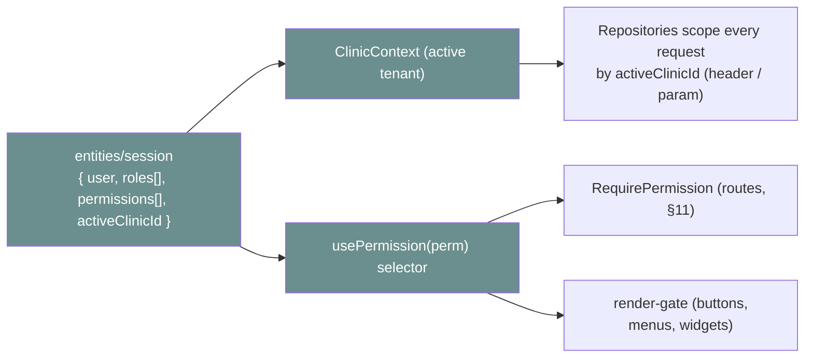

### 13.1 Clinic (tenant) context

The **active clinic** lives in a Zustand session slice (it's client-owned "which tenant am I in", not server data). Repositories read it and **scope every request** — the tenant id is attached as a header/param in the `HttpClient` interceptor wired at the composition root (§9). This means _no feature has to remember to pass `clinicId`_; it's ambient and enforced centrally.

### 13.2 Permission-gated rendering

```tsx
// entities/session/ui/Can.tsx — declarative render-gate
import { usePermission } from '../model/usePermission';

export function Can({
  perm,
  children,
  fallback = null,
}: {
  perm: string;
  children: React.ReactNode;
  fallback?: React.ReactNode;
}) {
  return usePermission(perm) ? <>{children}</> : <>{fallback}</>;
}
```

```tsx
// usage in a feature/widget — never branch on raw role strings, always on permissions
import { Can } from '@/entities/session';

<Can perm="prescription:write">
  <PrescribeButton />
</Can>;
```

- **Gate on _permissions_, not roles.** Roles map to permission sets server-side; UI checks granular permissions (`billing:refund`) so role re-definitions don't ripple through the UI.
- **Routes and UI both gated.** `RequirePermission` (§11) hides whole screens; `<Can>` hides actions/affordances within a screen.
- **Defense in depth.** The frontend gate is **UX only**; the backend independently authorizes every request (the Repository sends the scoped, signed request). A hidden button is convenience, not security.

> **Decision block — Permission-gated, tenant-scoped frontend.**
>
> - **Why.** Multi-tenant healthcare demands strict data isolation and role-appropriate UIs, with no cross-tenant leakage.
> - **Benefits.** Ambient tenant scoping (no per-call boilerplate); granular, role-stable permission checks; consistent gating for routes and actions; clean audit story.
> - **Trade-offs.** Permission taxonomy must be designed and kept in sync with backend; over-gating can hide features confusingly (mitigated by clear "no access" states).
> - **Alternatives considered.** (1) _Role checks scattered in components_ — rejected: brittle, leaks role logic everywhere. (2) _Tenant id passed manually per call_ — rejected: error-prone, easy to forget → leakage. (3) _Client-only authorization_ — rejected: never trust the client; backend is authoritative.
> - **Future scalability.** New contexts add permissions, not new gating mechanisms. Tenant scoping extends to per-tenant theming/feature-flags.
> - **Enterprise considerations.** Central tenant interceptor + permission selectors are the audited PHI-isolation and least-privilege enforcement points; supports SSO/role federation later.

---

## 14. Offline & sync architecture

Offline is **designed-in** (Brain.md §10). Reads come from a **persisted Query cache**; writes go through an **Outbox** that queues mutations and replays them when connectivity returns; the **service worker** caches the app shell (installable PWA).

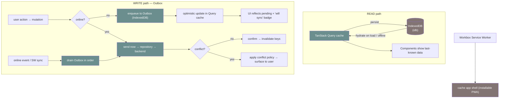

### 14.1 The Outbox, sketched

```ts
// shared/lib/outbox/outbox.ts — domain-agnostic queue (lives in shared)
export interface OutboxItem {
  id: string;
  createdAt: number;
  kind: string; // e.g. "vitals.record"
  payload: unknown; // serialized mutation input
  attempts: number;
}

export interface Outbox {
  enqueue(item: Omit<OutboxItem, 'id' | 'createdAt' | 'attempts'>): Promise<void>;
  drain(handlers: Record<string, (payload: unknown) => Promise<void>>): Promise<void>;
}
```

- **Reads while offline.** Query's `persistQueryClient` hydrates the cache from IndexedDB on startup, so the last-known patient/queue/vitals data renders instantly and offline. Refetch resumes when online.
- **Writes while offline.** A mutation that can't reach the server is **enqueued** and **optimistically applied** to the Query cache; the UI shows a "pending sync" indicator. On reconnect (`online` event or SW background sync) the Outbox **drains in order**, each item replayed through its Repository.
- **Conflict policy.** On replay, the Repository may detect a server conflict (e.g. version mismatch). The Outbox applies the declared policy (last-write-wins, server-wins, or surface-to-user) — **never silent data loss** (Brain.md §10).
- **Shell.** Workbox caches the static shell so the PWA launches with no network.

> **Decision block — Persisted cache (reads) + Outbox (writes) + SW shell.**
>
> - **Why.** Clinics have flaky connectivity; losing a recorded vital or a payment is unacceptable. Offline must be a property of the architecture, not a feature toggle.
> - **Benefits.** Instant, offline-capable reads; durable writes with optimistic UX; installable PWA; the same Query layer powers online and offline.
> - **Trade-offs.** Optimistic + replay needs conflict handling and careful idempotency; persisted PHI in IndexedDB must be encrypted/scoped and cleared on logout.
> - **Alternatives considered.** (1) _Online-only_ — rejected: fails the clinic reality. (2) _Full local-first DB (e.g. CRDT/SQLite-wasm)_ — powerful but heavy; kept as a _future_ option for specific contexts, not the default. (3) _Naive retry without a queue_ — rejected: loses ordering and durability.
> - **Future scalability.** The Outbox is transport-agnostic (works with any Repository impl) and extends to background sync, partial sync per context, and (future) CRDT merge for collaborative editing.
> - **Enterprise considerations.** IndexedDB PHI requires encryption-at-rest, tenant scoping, and wipe-on-logout; the Outbox is the audited durability boundary for clinical writes.

---

## 15. Scalability

The FSD layer/slice structure is what lets ClinicOS grow to **hundreds of features and many teams** without collapsing into a big ball of mud.

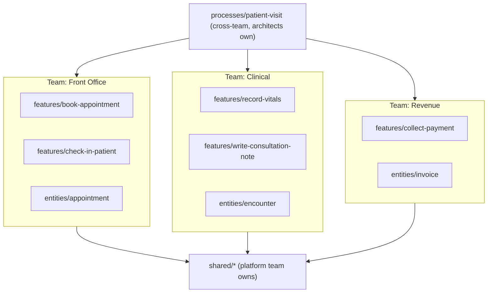

### 15.1 How structure absorbs scale

- **Slices are units of ownership.** A `CODEOWNERS` file assigns each slice/folder to a team. Because slices can't reach into each other's internals (only public APIs, §5), a team can refactor freely behind its `index.ts`.
- **The Dependency Rule prevents entanglement.** With feature→feature imports banned, adding the 300th feature can't silently couple to the 12th. New features attach via `processes`/`pages`, keeping the graph acyclic.
- **`shared` is a contract owned by a platform team.** Domain teams consume it; they don't fork it. Changes to `shared` are reviewed centrally.
- **Parallelism.** Independent slices → independent PRs, independent test suites, independent deploy-readiness. The fitness functions (§17) keep everyone honest mechanically.

### 15.2 Micro-frontends — a _future_ option, not today's default

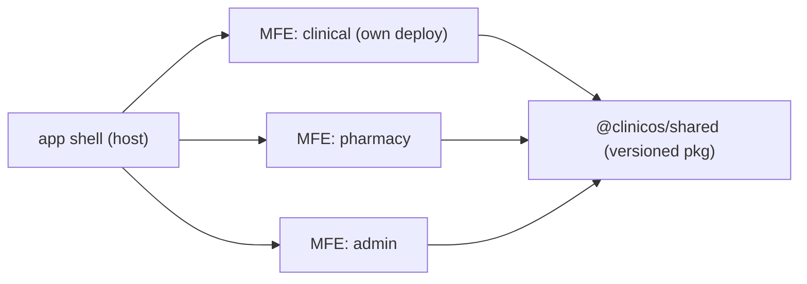

The layer/route boundaries are _already_ the natural split points: a context (pharmacy, admin) could become an independently-deployed micro-frontend behind the `app` shell, sharing `shared` as a versioned package.

> **Decision block — FSD-driven scalability; micro-frontends deferred.**
>
> - **Why.** We need many teams to ship in parallel for a decade without coupling, but we don't want distributed-systems complexity before we need it.
> - **Benefits (modular monolith today).** Simple single deploy, one type-check, shared tokens/i18n with zero version skew, easy cross-context refactors, fast CI.
> - **Trade-offs.** One repo/deploy means a bad change can block everyone (mitigated by ownership + fitness functions); the whole app ships together.
> - **Alternatives considered.** (1) _Micro-frontends now_ — rejected as premature: runtime integration cost, version skew of shared/tokens, harder a11y/i18n consistency. (2) _Many independent SPAs_ — rejected: fragments the patient journey and the design system. (3) _Nx monorepo with libs_ — compatible and a likely evolution; our FSD slices map onto Nx libs cleanly.
> - **Future scalability.** When a context's team and deploy cadence diverge enough, promote it to an MFE along the existing route/layer boundary; `shared` becomes a versioned package.
> - **Enterprise considerations.** `CODEOWNERS` + lintable boundaries give auditable ownership and change-control; MFE split (later) enables independent compliance/release trains per context.

---

## 16. Platform reach

The same **core** must serve future **web, tablet, desktop (Electron/Tauri), and mobile**. The architecture makes this possible by keeping the **domain and services layer platform-agnostic** and isolating platform specifics to the **shell** and **UI primitives**.

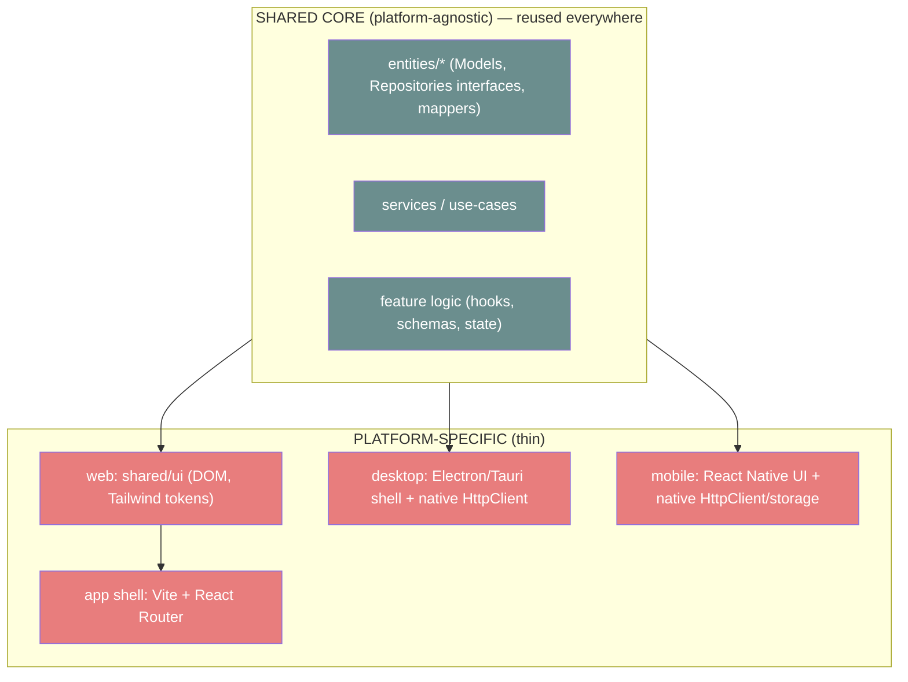

| Layer                                                             | Shared across platforms?            | Notes                                                                                                                   |
| ----------------------------------------------------------------- | ----------------------------------- | ----------------------------------------------------------------------------------------------------------------------- |
| `entities` (Models, Repository **interfaces**, mappers, services) | **Shared**                          | Pure TS, no DOM — reusable in web, desktop, RN.                                                                         |
| Repository **implementations** (`HttpClient`)                     | **Shared interface, platform impl** | Web uses `fetch`; desktop may use a native client; mobile a native fetch/storage. Swapped at the composition root (§9). |
| Feature **logic** (hooks, Zod schemas, state machines)            | **Mostly shared**                   | React-flavored but DOM-free logic ports to RN.                                                                          |
| `shared/ui` (design-system components)                            | **Platform-specific**               | Web = DOM + Tailwind tokens; mobile = RN primitives bound to the _same token values_.                                   |
| `app` shell (router, providers)                                   | **Platform-specific**               | Vite/React Router (web), Electron/Tauri (desktop), RN navigation (mobile).                                              |
| Tokens / i18n keys                                                | **Shared values**                   | The token _contract_ and i18n _keys_ are shared; only the rendering binding differs.                                    |

The key insight: **`entities` and services contain no DOM and no platform calls** — they depend only on the `HttpClient` _interface_ and pure libs. That makes the expensive, domain-rich part of the app the part that ports for free; only the comparatively thin UI/shell is rewritten per platform.

> **Decision block — Platform-agnostic core, platform-specific shell.**
>
> - **Why.** A 10-year clinic OS will outlive "web-only"; we must not bake DOM/browser assumptions into the domain.
> - **Benefits.** Domain/services/feature-logic reuse across web/desktop/mobile; consistent business rules and validation everywhere; token/i18n contract shared so brand and language stay uniform.
> - **Trade-offs.** Requires discipline to keep DOM out of `entities`/services; UI must be reimplemented per platform (not "write once run anywhere" for pixels).
> - **Alternatives considered.** (1) _Single cross-platform UI framework for everything_ — rejected: compromises web quality/a11y and couples to one runtime. (2) _Separate codebases per platform_ — rejected: duplicates domain logic, guarantees drift. (3) _PWA-only forever_ — viable near-term (we ship a PWA, §14) but doesn't cover native desktop/mobile needs.
> - **Future scalability.** Adding a platform = new shell + new `HttpClient`/storage impl + UI binding to existing tokens; the core is untouched. AI features live in the shared services layer and are available on every platform.
> - **Enterprise considerations.** One source of truth for clinical rules/validation across platforms reduces compliance surface and divergence risk; the `HttpClient`/storage seam localizes platform security review.

---

## 17. Fitness functions (architectural invariants)

We treat architecture as **testable**. A _fitness function_ is an automated check that an architectural invariant still holds. These run in CI and block merges — they are the mechanical guardians of everything above.

| #   | Invariant                                  | Enforced by                                                       | Fails the build when…                              |
| --- | ------------------------------------------ | ----------------------------------------------------------------- | -------------------------------------------------- |
| 1   | **Dependency Rule** (downward-only)        | `eslint-plugin-boundaries` `element-types` (§5.5)                 | a layer imports a higher/illegal layer             |
| 2   | **No feature → feature imports**           | `boundaries` (features allow only `entities`,`shared`)            | one feature imports a sibling feature              |
| 3   | **Public-API-only** (no deep imports)      | `boundaries/entry-point` + `import/no-internal-modules`           | an import targets a path past a slice's `index.ts` |
| 4   | **No dependency cycles**                   | `import/no-cycle`                                                 | any import cycle exists                            |
| 5   | **No hardcoded strings**                   | `eslint-plugin-i18next` / custom rule                             | a human-readable literal isn't an i18n key         |
| 6   | **No hardcoded visual values**             | custom lint (no raw hex/px in components)                         | a color/size/space bypasses tokens                 |
| 7   | **`shared` has zero domain knowledge**     | `boundaries` (shared allows only `shared`) + naming lint          | a `shared` file references a domain noun           |
| 8   | **UI never imports `fetch`/`axios`/DTOs**  | restricted-imports rule                                           | a component imports an HTTP lib or a `*.dto`       |
| 9   | **No server data mirrored into Zustand**   | review checklist + lint heuristic (no Query data set into stores) | a store is fed from a Query result                 |
| 10  | **Accessibility**                          | `jsx-a11y` + `jest-axe`/Playwright-axe                            | a component violates WCAG-checkable rules          |
| 11  | **Every async surface has 4 states**       | component test convention + checklist                             | loading/empty/error/success missing                |
| 12  | **Logical CSS properties only** (RTL-safe) | stylelint logical-properties rule                                 | `margin-left`/`right` used instead of `*-inline-*` |

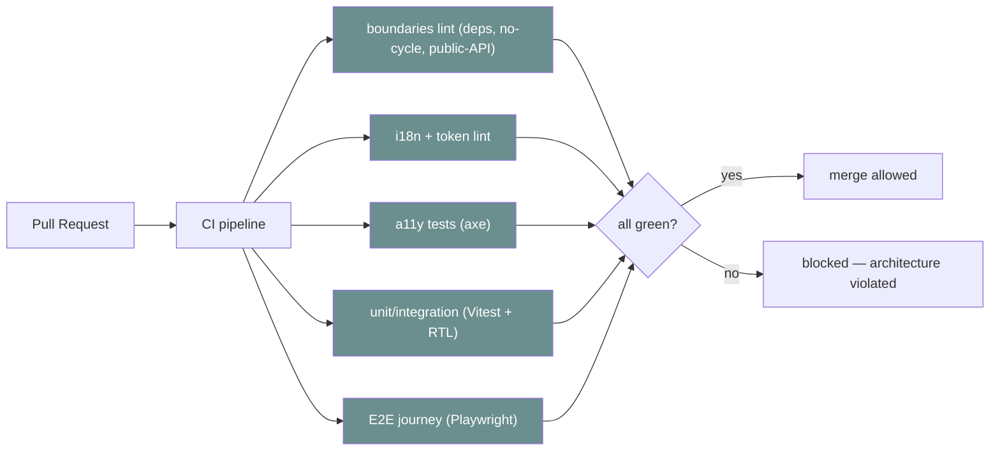

> **Decision block — Architecture as fitness functions.**
>
> - **Why.** Documented rules that aren't tested rot. For a 10-year, multi-team, human+AI codebase, invariants must be _executable_.
> - **Benefits.** Drift is impossible to merge; AI agents and humans hit identical walls; onboarding is enforced by tooling; reviews focus on intent, not boundary policing.
> - **Trade-offs.** Up-front investment in lint rules and tests; occasional documented exceptions; CI time.
> - **Alternatives considered.** (1) _Docs + discipline only_ — rejected, doesn't survive scale. (2) _Periodic architecture audits_ — useful but reactive; fitness functions are preventive. (3) _Manual review gates_ — necessary for intent, insufficient for invariants.
> - **Future scalability.** New invariants become new checks; the matrix grows with the system. Micro-frontend boundaries (§15) and platform splits (§16) add their own fitness functions.
> - **Enterprise considerations.** CI artifacts are auditable evidence of architectural and a11y/i18n compliance — directly useful for healthcare audits and certifications.

---

## Appendix — cross-reference map

| If you need…                                      | Go to                                                                  |
| ------------------------------------------------- | ---------------------------------------------------------------------- |
| The ratified rules & tech stack                   | [Brain.md](./Brain.md)                                                 |
| The full 40-section master treatment              | [Frontend-Foundation-Blueprint.md](./Frontend-Foundation-Blueprint.md) |
| Tokens, components, a11y/i18n catalogue           | [Frontend-Bible.md](./Frontend-Bible.md)                               |
| The canonical folder tree & slice anatomy details | [Folder-Structure.md](./Folder-Structure.md)                           |
| File/symbol/import naming tables                  | [Naming-Convention.md](./Naming-Convention.md)                         |
| Day-to-day React/TS coding standards              | [Coding-Standards.md](./Coding-Standards.md)                           |
| The ALWAYS/NEVER rulebook                         | [Developer-Rules.md](./Developer-Rules.md)                             |
| Definition-of-Done & PR gates                     | [Project-Checklist.md](./Project-Checklist.md)                         |
| Rules for AI agents in this repo                  | [AI-Rules.md](./AI-Rules.md)                                           |

---

_Last updated: 2026-06-27 · Owner: Frontend Architecture · Status: **Foundation v1** · Canonical source: [Brain.md](./Brain.md)_
