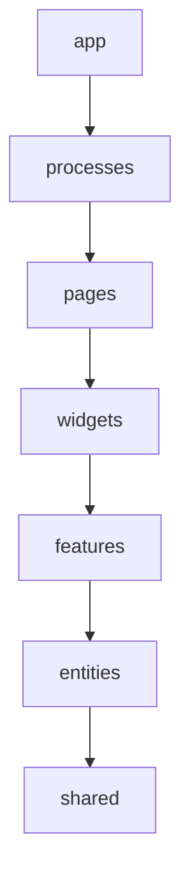

# 📚 ClinicOS — Documentation-Guidelines.md

> **How ClinicOS documents itself.** This document is the canon for _writing_, _placing_, _reviewing_, and _retiring_ documentation across the ClinicOS frontend.
> It is itself a canon document (see [Brain.md](./Brain.md) §13) and obeys the **Decision Contract** ([Brain.md](./Brain.md) §14): every decision states **Why · Benefits · Trade-offs · Alternatives · Future scalability · Enterprise considerations**.

**Read [Brain.md](./Brain.md) first.** It is the single source of truth; this file tells you how everything _downstream_ of it is written and kept alive.

---

## 1. Purpose & Documentation Philosophy

### 1.1 Purpose

This document defines:

- The **documentation hierarchy** — what lives where, and which document wins when two disagree.
- The **ADR process** — how architectural decisions are proposed, ratified, recorded, and superseded.
- The **Decision Block** — the mandatory 6-field format that makes every decision auditable.
- The **per-slice README**, **code comment**, **JSDoc/TSDoc**, and **Storybook** conventions.
- The **style guide**, **diagram standard**, and the **rituals that keep docs alive** over a 10-year horizon.

If you are about to write code, a decision, or a feature, this file tells you what documentation that work _also_ requires before it is "done."

### 1.2 Philosophy — docs are part of the product

ClinicOS is architected for **10+ years without a rewrite** ([Brain.md](./Brain.md) §1). Code is read far more often than it is written, and over a decade most readers will be people — and AI agents — who were not in the room when the code was authored. Documentation is the mechanism that lets the _intent_ survive longer than the _author_.

Our governing principles:

1. **Docs are part of the product.** A feature is not shipped because the code merged; it is shipped when a future developer or AI agent can understand, extend, and operate it. Undocumented behavior is unmaintained behavior.
2. **"If it isn't documented, it isn't done."** Documentation is a Definition-of-Done gate, not an afterthought. See [Project-Checklist.md](./Project-Checklist.md).
3. **Docs live with code.** Documentation is version-controlled in the repo, reviewed in the same PR as the code it describes, and travels with the branch. Docs in a wiki or a doc tool drift; docs in `git` are diffed, reviewed, and bisected like code. This is **docs-as-code** (see the decision block in §13).
4. **Optimize for two audiences: future developers and AI agents.** Write so that a developer who joins in year 7 — and an AI agent reading the repo cold — can both act correctly without asking. That means: explicit over implicit, examples-first, cross-linked, and obeying the same canon AI agents are bound to ([AI-Rules.md](./AI-Rules.md)).
5. **Simplicity beats cleverness** ([Brain.md](./Brain.md) §2, law 8). If a junior can't read the doc, rewrite the doc.

> **Golden loop reminder** ([Brain.md](./Brain.md) §0): Read Brain → Find the right layer → Use the public API → Consume tokens & i18n keys → Never break the Dependency Rule → **Update the docs.** The last step is not optional.

---

## 2. The Documentation System / Hierarchy

ClinicOS documentation is a **layered system**, mirroring the layered architecture ([Brain.md](./Brain.md) §5). Each layer has a narrower scope and a shorter half-life than the one above it. **Higher layers win conflicts.**

```
┌──────────────────────────────────────────────────────────────┐
│  Brain.md                       SOURCE OF TRUTH + INDEX        │  ← wins all conflicts
├──────────────────────────────────────────────────────────────┤
│  Canon docs                     Foundation-wide contracts      │
│  Architecture · Bible · Standards · Rules · Folder · Naming ·  │
│  AI-Rules · Checklist · Blueprint · (this) Doc-Guidelines      │
├──────────────────────────────────────────────────────────────┤
│  ADRs  (docs/adr/NNNN-*.md)     Point-in-time DECISIONS        │  ← immutable history
├──────────────────────────────────────────────────────────────┤
│  Per-slice READMEs              Feature / entity contracts     │  ← live beside the slice
├──────────────────────────────────────────────────────────────┤
│  Code comments / JSDoc / TSDoc  In-context "why"              │
├──────────────────────────────────────────────────────────────┤
│  Storybook                      Living UI documentation        │
├──────────────────────────────────────────────────────────────┤
│  API / repository contracts     DTO ↔ Model boundary docs      │
└──────────────────────────────────────────────────────────────┘
```

**Conflict resolution rule:** If a slice README contradicts a canon doc, the canon doc wins and the README is a bug. If a canon doc contradicts Brain.md, Brain.md wins. If reality contradicts Brain.md, you have found an _unratified decision_ — open an ADR (§3).

### 2.1 What to document where

| You are documenting…                                                    | Put it in…                                                                                       | Format                | Half-life                    |
| ----------------------------------------------------------------------- | ------------------------------------------------------------------------------------------------ | --------------------- | ---------------------------- |
| A foundational, repo-wide truth or law                                  | **Brain.md**                                                                                     | Canon                 | Years                        |
| A Foundation-wide contract (architecture, tokens, naming, rules)        | The relevant **canon doc** ([Brain.md](./Brain.md) §13)                                          | Canon                 | Years                        |
| _Why_ we chose X over Y; a change to a tech-stack/layer/dependency rule | **ADR** in `docs/adr/`                                                                           | ADR template (§3)     | Permanent (immutable record) |
| A reusable decision pattern referenced by many docs                     | **Decision Block** inline in the owning doc (§4)                                                 | 6-field block         | Lives with its doc           |
| What a feature/entity slice does + its public API                       | **Per-slice `README.md`** (§5)                                                                   | README template       | Lives with the slice         |
| _Why_ a specific function/branch exists                                 | **Code comment** ("why not what", §6)                                                            | `//` / `/* */`        | Lives with the code          |
| The contract of a public export (from `index.ts`)                       | **JSDoc/TSDoc** (§6)                                                                             | Doc comment           | Lives with the symbol        |
| How a shared UI component looks, behaves, and is used                   | **Storybook** story + docs (§7)                                                                  | `*.stories.tsx` + MDX | Lives with the component     |
| The shape of a backend payload + its mapping to a Model                 | **API/repository contract docs** — DTO Zod schema + mapper + slice README "Domain model" section | Code + README         | Lives with `api/`            |
| How to clone, install, and run the repo                                 | **Root README / getting-started / CONTRIBUTING** (§8)                                            | Markdown              | Months                       |
| A user-facing string                                                    | **i18n catalog** — _not documentation_ (§12)                                                     | i18n keys             | Continuous                   |

> **Single-source rule:** Each fact has **exactly one home**. Everywhere else, you _link_ to that home — you never copy it (§9, DRY via cross-links). When a fact moves, you fix one place.

---

## 3. ADR (Architecture Decision Record) Process

An **ADR** captures a single architectural decision: the context that forced it, the decision made, its status, and its consequences. ADRs are the **immutable historical record** of _why ClinicOS is the way it is_. Canon docs say _what is true now_; ADRs say _how and why we got here_.

### 3.1 When an ADR is REQUIRED

Open an ADR **before** merging when the change does any of the following:

- **Introduces, removes, or replaces a dependency** — anything that alters the authoritative tech stack ([Brain.md](./Brain.md) §4). Adding a library is a decision, not a convenience.
- **Changes a layer or the layer set** ([Brain.md](./Brain.md) §5.1) — adding/removing a layer, or changing what a layer may import.
- **Breaks or amends the Dependency Rule** (`app → processes → pages → widgets → features → entities → shared`). Any exception must be an _accepted_ ADR; otherwise the lint boundary stands.
- **Adds a new global store** (a new Zustand slice in the app-global state) or changes where a kind of data lives ([Brain.md](./Brain.md) §9). Caching server data outside TanStack Query, for example, requires an ADR to even be discussed.
- **Changes a cross-cutting contract** — the DTO→Mapper→Model pipeline ([Brain.md](./Brain.md) §5.3), the four async states ([Brain.md](./Brain.md) §11), the token tiers ([Brain.md](./Brain.md) §6), the i18n strategy ([Brain.md](./Brain.md) §8), the offline/Outbox strategy ([Brain.md](./Brain.md) §10), or auth/permission model.
- **Establishes a new pattern** other slices are expected to copy (a new repository style, a new error taxonomy, a new routing convention).
- **Bumps the Foundation version** (v1 → v2…), which is itself recorded as an ADR (§10.5).

**When an ADR is NOT needed:** implementing a feature _within_ the existing rules, fixing a bug, refactoring without changing a contract, or copy/styling tweaks within the token system. If you are merely _using_ the foundation correctly, document it in the slice README — not an ADR.

> Rule of thumb: **If the change would make Brain.md or a canon doc out of date, it needs an ADR first.** The ADR is ratified, _then_ the canon doc is updated to reflect the new "now," with a link back to the ADR.

### 3.2 Where ADRs live & how they are numbered

- **Location:** `docs/adr/`
- **Filename:** `NNNN-kebab-case-title.md` — zero-padded 4-digit sequence, e.g. `docs/adr/0007-adopt-tanstack-query-v5.md`.
- **Numbering:** Monotonic, never reused. The number is permanent even after the ADR is superseded.
- **Index:** `docs/adr/README.md` is a generated/maintained table of all ADRs with their status (a "log"). ADR `0000-record-architecture-decisions.md` bootstraps the practice itself.

### 3.3 ADR lifecycle (status)

```
proposed ──► accepted ──► superseded
    │
    └──► rejected
```

| Status                 | Meaning                                                                                                                                                                |
| ---------------------- | ---------------------------------------------------------------------------------------------------------------------------------------------------------------------- |
| **proposed**           | Open for review; not yet binding. The PR introducing it is in discussion.                                                                                              |
| **accepted**           | Ratified and binding. Canon docs are updated to match. This is the active decision.                                                                                    |
| **rejected**           | Considered and declined. Kept for the record so we don't re-litigate it.                                                                                               |
| **superseded by NNNN** | No longer in force; a newer ADR replaces it. **The old ADR is never deleted or edited** beyond marking its status and linking forward. The superseding ADR links back. |

**Immutability rule:** Once **accepted**, an ADR's body is frozen. To change a decision you write a _new_ ADR that supersedes it. This preserves the audit trail — essential for a healthcare system where "why did we do this in 2026?" must be answerable in 2034 (enterprise/compliance, §13).

### 3.4 ADR template

Every ADR uses this exact skeleton. The standard ADR fields (Context, Decision, Status, Consequences) are **augmented with the mandatory Decision Block** ([Brain.md](./Brain.md) §14) — an ADR is not ratified without all six.

```markdown
# ADR NNNN — <Short decision title>

- **Status:** proposed | accepted | rejected | superseded by ADR-NNNN
- **Date:** YYYY-MM-DD
- **Deciders:** <names / roles>
- **Supersedes:** ADR-NNNN (if any)
- **Tags:** dependency | layer | dependency-rule | state | token | i18n | offline | auth | foundation

## Context

What forces this decision? The problem, constraints, and the product/architecture
pressures (link Brain.md sections and any prior ADRs). State the facts neutrally.

## Decision

The change we are making, stated as a present-tense directive
("We will use X for Y"). One decision per ADR.

## Decision Block (mandatory — see Brain.md §14)

- **Why:** The core rationale.
- **Benefits:** What we gain.
- **Trade-offs:** What we knowingly give up / the costs.
- **Alternatives considered:** Options A, B, C — and why each was not chosen.
- **Future scalability:** How this holds up at 10×/100× scale and over the 10-year horizon.
- **Enterprise considerations:** Multi-tenancy, security, audit/compliance (healthcare),
  accessibility, localization, performance, operability.

## Consequences

What becomes easier and what becomes harder once accepted. New constraints this
imposes on future slices. Follow-up work, migrations, or lint rules required.

## References

Links: related ADRs, canon docs, PRs, external sources.
```

> See §4 for the Decision Block used standalone inside _non-ADR_ docs.

---

## 4. The Mandatory Decision Block (the 6 fields)

Every architectural decision recorded **anywhere** in the canon — not only in ADRs — must carry a **Decision Block**. This is the enforcement mechanism for [Brain.md](./Brain.md) §14. A decision without all six fields is **not ratified** and a reviewer must block the PR ([Developer-Rules.md](./Developer-Rules.md), [Project-Checklist.md](./Project-Checklist.md)).

### 4.1 The six fields

| Field                         | Answers                                                          | Reviewer rejects if…                    |
| ----------------------------- | ---------------------------------------------------------------- | --------------------------------------- |
| **Why**                       | What problem forces this?                                        | It restates _what_ without _why_.       |
| **Benefits**                  | What do we gain?                                                 | Vague ("it's better").                  |
| **Trade-offs**                | What do we knowingly give up?                                    | Empty — every real decision has a cost. |
| **Alternatives**              | What else was considered, and why rejected?                      | "None considered."                      |
| **Future scalability**        | Does it survive 10×/100× and 10 years?                           | Only addresses today.                   |
| **Enterprise considerations** | Multi-tenant, security, audit/compliance, a11y, i18n, perf, ops? | Healthcare/enterprise angle ignored.    |

### 4.2 Example Decision Block

> **Decision: TanStack Query is the only home for server state.**
>
> - **Why:** Server data (patients, appointments) must have exactly one source of truth to avoid stale/duplicated caches across screens in a long-running patient journey ([Brain.md](./Brain.md) §9).
> - **Benefits:** Built-in caching, deduping, background refetch, and cache persistence to IndexedDB for offline reads ([Brain.md](./Brain.md) §10); components subscribe to remote state without bespoke sync code.
> - **Trade-offs:** A second state library alongside Zustand; developers must learn query-key discipline and the "never copy server data into Zustand" rule.
> - **Alternatives:** (a) Redux Toolkit Query — heavier, more boilerplate, conflicts with our Zustand choice; (b) hand-rolled fetch + Context — re-implements caching badly; (c) SWR — capable but weaker mutation/offline story than TanStack v5 for the Outbox.
> - **Future scalability:** Query keys scale per-entity and per-tenant; persistence + Outbox pattern extend cleanly to full offline-first as clinic count grows.
> - **Enterprise considerations:** Per-tenant cache isolation via query keys; no PHI leaks between clinics; offline cache encryption handled at the IndexedDB layer; audit of mutations flows through the repository boundary.

---

## 5. Per-Slice README Convention

Every **feature** and **entity** slice ([Brain.md](./Brain.md) §5.2) carries a `README.md` at its root, beside `index.ts`. This README is the slice's contract for the next developer or AI agent who must consume or change it. **No slice is "done" without it** (§1.2).

```
features/book-appointment/
├── README.md        ← slice contract (this section)
├── index.ts         ← PUBLIC API
├── ui/  model/  api/  lib/  config/
```

### 5.1 Required sections

| Section           | Must contain                                                                                                                                                                                             |
| ----------------- | -------------------------------------------------------------------------------------------------------------------------------------------------------------------------------------------------------- |
| **Purpose**       | One paragraph: the user capability (a verb, for features) or domain noun (for entities), and the primary task/CTA it serves ([Brain.md](./Brain.md) §2).                                                 |
| **Public API**    | The exact exports from `index.ts` — components, hooks, types, services. This is the _only_ legal import surface ([Brain.md](./Brain.md) §5.2). Deep imports are forbidden and linted.                    |
| **Domain model**  | The Model type(s) the slice owns or consumes, and a pointer to the DTO↔Model mapper ([Brain.md](./Brain.md) §5.3). For entities, the canonical shape lives here.                                         |
| **Dependencies**  | Which **lower** layers/slices it uses (entities, shared). Must respect the Dependency Rule — a feature never imports another feature directly ([Brain.md](./Brain.md) §5.1). List external libs touched. |
| **State**         | Where this slice's data lives per [Brain.md](./Brain.md) §9 (Query keys it owns, any Zustand slice, form schemas).                                                                                       |
| **i18n & tokens** | Namespaces/keys it owns; confirmation it hardcodes no strings or visual values ([Brain.md](./Brain.md) §6, §8).                                                                                          |
| **Owners**        | Owning team/individual + reviewers. Drives doc ownership (§10).                                                                                                                                          |

### 5.2 Skeleton

```markdown
# feature/book-appointment

## Purpose

Lets a receptionist book an appointment in one screen, one primary CTA.

## Public API (from index.ts)

- `<BookAppointmentForm />` — container component
- `useBookAppointment()` — mutation hook
- `BookAppointmentInput` — Zod-validated input type

## Domain model

Consumes `Appointment`, `Patient` (entities). Maps via `appointment.mapper.ts`.

## Dependencies

entities/appointment · entities/patient · shared/ui · shared/api
External: react-hook-form, zod. Imports NO other feature.

## State

Query key: `['appointments', clinicId]`. Form: react-hook-form + zod. No global store.

## i18n & tokens

Namespace `booking.*`. No hardcoded strings/colors/sizes.

## Owners

@scheduling-team · Reviewer: @frontend-arch
```

---

## 6. Code Documentation

Code-level docs answer **"why"**, never **"what"** — the code already says _what_. We document the public surface exhaustively and the implementation sparingly but meaningfully.

### 6.1 JSDoc/TSDoc on all public APIs

**Every export from a slice's `index.ts`** (and every exported symbol from `shared/`) carries a **TSDoc** comment. The public API is a contract; contracts are documented.

```typescript
/**
 * Books an appointment for a patient at the active clinic.
 *
 * Server state lives in TanStack Query; on success the `['appointments', clinicId]`
 * cache is invalidated. Offline, the mutation is queued via the Outbox (see Brain.md §10).
 *
 * @param input - Validated booking input (see {@link BookAppointmentInput}).
 * @returns A mutation result; `error` is a typed {@link AppError}.
 * @throws Never throws synchronously — failures surface through `error`.
 * @see Architecture.md §data-flow
 */
export function useBookAppointment(): UseBookAppointmentResult {
  /* … */
}
```

Rules:

- Document **intent, side effects, error behavior, and cross-cutting interactions** (cache invalidation, Outbox, tenancy) — not the obvious signature.
- Use `@param`, `@returns`, `@throws`, `@see`, `@deprecated`, `@example` where they add value.
- **Types are documentation.** Prefer expressing constraints in the type system (strict TS, [Brain.md](./Brain.md) §4) over prose. A precise type needs less comment.
- Internal (non-exported) helpers do **not** require TSDoc — but do require a "why" comment if they are non-obvious.

### 6.2 The "why not what" comment rule

```typescript
// ❌ BAD — restates the code
// increment retry count by 1
retries += 1;

// ✅ GOOD — explains the non-obvious why
// Backend returns 409 on duplicate booking when two receptionists race;
// we retry once because the second attempt reconciles against the Outbox.
retries += 1;
```

A comment that could be deleted without losing information **should** be deleted. Comments that encode _reasons, constraints, gotchas, links to ADRs/tickets, and domain rules_ are the ones that earn their place over 10 years.

### 6.3 Documenting repositories / services / mappers

These are the backbone of backend independence ([Brain.md](./Brain.md) §5.3) and get extra care:

- **Repository** (interface): TSDoc each method with its **Model** contract (returns Models, never DTOs), error types, and which `HttpClient` endpoint it maps to. The _interface_ is the documented contract; the impl is detail.
- **Service / use-case**: document the **business rule** it enforces and the repositories it orchestrates. This is where domain language ([Brain.md](./Brain.md) §5) is pinned down.
- **Mapper**: a comment at the top stating it is the _single_ place that knows both DTO and Model shapes; note any lossy or defaulted fields. When the backend renames a field, this comment is the map a future dev follows.

### 6.4 Documenting components

- **Props are documented by their TypeScript types** — a Storybook props/controls table is generated automatically from the prop types and TSDoc on each prop. Write a one-line TSDoc per non-obvious prop; do not maintain a hand-written props table (it drifts; §9).
- Behavioral nuances (focus management, the four async states it renders, a11y roles, reduced-motion handling per [Brain.md](./Brain.md) §7, §11) go in the component's **Storybook docs** (§7), not in prose scattered in code.
- A component's "how to use me" lives in **Storybook**; its "why I exist" lives in the **slice README**.

---

## 7. Storybook as Living Documentation

Storybook is the **executable, always-current documentation** of the UI. Because stories render real components, they cannot silently go stale the way prose can — a broken story breaks CI.

### 7.1 Mandatory coverage

- **Every shared UI component** (`shared/ui/*`) has stories. This is a Definition-of-Done gate ([Brain.md](./Brain.md) §4, [Project-Checklist.md](./Project-Checklist.md)).
- Each component ships:
  - **Stories** covering its key states — including all four cross-cutting states where applicable: **Loading, Empty, Error, Success** ([Brain.md](./Brain.md) §11).
  - A **docs page** (autodocs/MDX) with a usage summary, a **props/controls table auto-generated from types** (§6.4), and do/don't guidance.
  - The **a11y addon** enabled — axe runs in Storybook; violations are visible to authors and gated in CI ([Brain.md](./Brain.md) §7).
  - **Theme + mode coverage:** stories render under light, dark, high-contrast, **Large Text Mode**, and RTL where relevant ([Brain.md](./Brain.md) §6, §7, §8). Tokens are the contract — stories prove components respond to token re-mapping without edits.

### 7.2 Usage guidelines

- Stories are **examples-first documentation** (§9): a developer should be able to copy a story and use the component correctly.
- Use the **controls** addon to document the prop surface interactively rather than describing it in prose.
- Stories consume **tokens and i18n keys** like real code — never hardcode colors, sizes, or English strings in a story ([Brain.md](./Brain.md) §2, laws 4–5).
- Keep stories close to the component (`Component.stories.tsx` beside `Component.tsx`).

---

## 8. README / Onboarding Documentation

Onboarding docs get a developer (or an AI agent) from zero to a running, contributing state. They are short, current, and link into the canon rather than restating it.

| File                          | Owns                      | Must answer                                                                                                                                                                 |
| ----------------------------- | ------------------------- | --------------------------------------------------------------------------------------------------------------------------------------------------------------------------- |
| **Root `README.md`**          | The 60-second overview    | What is ClinicOS? Where is the canon ([Brain.md](./Brain.md))? How do I run it? Link to everything below.                                                                   |
| **`docs/getting-started.md`** | First-run path            | Clone → install → env → `dev` → run tests → Storybook. Copy-paste commands that work.                                                                                       |
| **`CONTRIBUTING.md`**         | The contribution contract | Branch/PR flow, commit conventions (Changesets), the docs-as-DoD rule, link to [Developer-Rules.md](./Developer-Rules.md) & [Project-Checklist.md](./Project-Checklist.md). |
| **Environment setup**         | Reproducible local env    | Node/PNPM versions, `.env.example`, MSW mock toggle ([Brain.md](./Brain.md) §4), required secrets (never commit real ones).                                                 |

Rules:

- The root README is a **map, not an encyclopedia** — it points to Brain.md as the source of truth and never duplicates architecture content (§9).
- Onboarding commands are **tested** (ideally in CI) so "getting started" never rots.
- Every new contributor's first PR includes reading Brain.md → [Architecture.md](./Architecture.md) → [Folder-Structure.md](./Folder-Structure.md) ([Brain.md](./Brain.md) §0).

---

## 9. Documentation Style Guide

Optimize every doc for **scannability** and for **two readers: a future developer and an AI agent.**

### 9.1 Voice & tone

- **Direct, present tense, active voice.** "The repository returns Models" — not "Models will be returned by the repository."
- **Imperative for rules.** "Consume tokens." "Never hardcode strings."
- **Plain language.** If a junior can't follow it, simplify it ([Brain.md](./Brain.md) §2, law 8). No unexplained jargon; define a term once and link thereafter.
- **No emojis in body prose** (section header glyphs in canon titles are the only exception, matching existing canon docs).

### 9.2 Structure & scannability

- **Examples-first.** Lead with a concrete example or snippet, then explain. Developers copy; they rarely read top-to-bottom.
- **Tables over paragraphs** for any "X maps to Y" relationship (what-to-document-where, props, conventions).
- **Short sections, descriptive headings, anchorable IDs.** Number sections so they can be cross-referenced (e.g. "[Brain.md](./Brain.md) §5.3").
- **Code blocks are fenced and language-tagged** (`typescript`, `markdown`, `mermaid`).
- **Callouts** (`>`) for rules, warnings, and decision blocks.

### 9.3 DRY via cross-links, not duplication

- **Every fact has one home** (§2.1). Link to it; do not copy it. Copied facts drift and become lies.
- Reference canon by **document + section** so links survive edits (e.g. "see [Brain.md](./Brain.md) §9").
- If you feel the urge to paste a block of another doc, **link instead** and, if needed, summarize in one sentence with the link.
- When two docs would overlap, decide which one _owns_ the fact; the other links to it.

### 9.4 Diagrams

Use **Mermaid** for diagrams so they live in the repo as text, diff cleanly, and render on GitHub (§11).

---

## 10. Keeping Documentation Alive

Docs rot unless rotting is made expensive and currency is made cheap. These rituals do that.

### 10.1 Docs change in the same PR as the code

The **non-negotiable rule:** any PR that changes behavior, a public API, a contract, or a decision **must** update the affected docs _in the same PR_. A code change with stale docs is an incomplete change and is blocked. This is the operational meaning of "if it isn't documented, it isn't done" (§1.2).

### 10.2 Doc ownership

- Every canon doc has an **Owner** (see each doc's footer; e.g. _Owner: Frontend Architecture_).
- Every slice README names **Owners** (§5.1).
- Owners are accountable for accuracy and review doc changes in their area.

### 10.3 The "docs review" checklist item

[Project-Checklist.md](./Project-Checklist.md) (Definition-of-Done / PR gate) includes explicit docs items, which reviewers enforce:

- [ ] Affected canon docs / slice README updated in this PR.
- [ ] New decision carries a complete **Decision Block** (6 fields, §4).
- [ ] ADR opened if the change matches an ADR trigger (§3.1).
- [ ] Public exports have TSDoc (§6.1); comments follow "why not what" (§6.2).
- [ ] New/changed shared UI component has stories + docs + a11y (§7).
- [ ] No fact duplicated across docs (DRY, §9.3); cross-links used.

### 10.4 Detecting stale docs

- **CI link-checking** fails the build on broken internal links.
- **Storybook + tests** are executable docs — they break loudly when they drift (§7).
- **TSDoc lint** flags undocumented public exports.
- **"Last updated" footers** on canon docs surface aging; a doc untouched while its area changes is a review smell.
- **Periodic doc audits** (per Foundation version, §10.5) re-validate that canon still matches reality; mismatches become ADRs.

### 10.5 Versioning the Foundation

The foundation is versioned (**Foundation v1, v2, …**) — see Brain.md's footer status. A version bump means a coherent set of canon-level changes has landed.

- Bumping the Foundation version is recorded as an **ADR** (§3.1) summarizing the set of accepted ADRs it rolls up.
- Canon docs carry the current Foundation version in their footer; a doc lagging the current version is flagged for audit.
- Superseded canon guidance is never deleted silently — the superseding ADR explains the migration (§3.3).

---

## 11. Diagrams Standard

**Mermaid is the standard** for all architecture, sequence, and state diagrams. Diagrams are code: they live in the Markdown, are reviewed in PRs, and render natively on GitHub and in Storybook docs.

| Diagram kind                  | Use Mermaid type      | For                                                                                                                                          |
| ----------------------------- | --------------------- | -------------------------------------------------------------------------------------------------------------------------------------------- |
| **Architecture / dependency** | `flowchart` / `graph` | Layers and the Dependency Rule ([Brain.md](./Brain.md) §5.1), slice anatomy.                                                                 |
| **Sequence**                  | `sequenceDiagram`     | The DTO→Mapper→Model→Service→Query→Component flow ([Brain.md](./Brain.md) §5.3); request lifecycles.                                         |
| **State**                     | `stateDiagram-v2`     | The patient-journey state transitions ([Brain.md](./Brain.md) §1); ADR lifecycle (§3.3); the four async states ([Brain.md](./Brain.md) §11). |

Example:



**Keeping diagrams in sync:**

- A diagram lives in the **same doc as the thing it describes**, so it is reviewed alongside that thing.
- **Never** screenshot a diagram into the repo — store the Mermaid source. Images can't be diffed and silently rot.
- When the architecture changes, updating the Mermaid source is part of the same PR (§10.1).
- Prefer **one canonical diagram per fact** (DRY, §9.3); other docs link to it.

---

## 12. Localization: Product Copy vs Documentation

There are two kinds of text, and they are governed differently. Do not confuse them.

|              | **Documentation**                           | **Product copy (UI strings)**                                                                                 |
| ------------ | ------------------------------------------- | ------------------------------------------------------------------------------------------------------------- |
| **Language** | **English only.**                           | **Every language** (en, hi, mr, ur, …) ([Brain.md](./Brain.md) §8).                                           |
| **Home**     | `.md` files in the repo.                    | **i18n catalogs / keys** — never hardcoded ([Brain.md](./Brain.md) §2, law 4; §8).                            |
| **Audience** | Developers + AI agents.                     | Patients, doctors, receptionists, low-literacy & non-English users ([Brain.md](./Brain.md) §3).               |
| **Rule**     | Write clear English; do not translate docs. | `namespace.area.element` keys, ICU plurals/gender, RTL via logical properties, runtime switch without reload. |

- **Documentation is engineering communication** and stays in **English** — translating canon docs would create drift across versions and is out of scope.
- **Product copy is a feature** and is **fully localized**; no human-readable string (including `aria-label`s and error messages) is ever hardcoded in code, stories, or examples ([Brain.md](./Brain.md) §8).
- A doc that contains UI string examples shows the **i18n key**, not a hardcoded sentence, to model the correct pattern.

---

## 13. Decision Block — Docs-as-Code + ADRs

> **Decision: ClinicOS documents with docs-as-code (Markdown + Mermaid in-repo) governed by a canon hierarchy, with ADRs as the immutable record of architectural decisions.**
>
> - **Why:** Over a 10-year horizon ([Brain.md](./Brain.md) §1) the people and AI agents reading the code will not be its authors. Intent must survive the author. Docs that live with the code — reviewed in the same PR, diffed, bisected — are the only docs that stay true; external wikis drift. ADRs preserve _why_ decisions were made, which canon ("what is true now") docs cannot, and which a healthcare system must be able to answer years later.
> - **Benefits:** Single source of truth ([Brain.md](./Brain.md)) with a clear conflict-resolution order; docs reviewed and version-controlled like code; executable docs (Storybook, tests, link-checks) that fail loudly when stale; a permanent, auditable decision trail via numbered ADRs; one optimized format for both human and AI readers; DRY via cross-links so a fact is fixed in one place.
> - **Trade-offs:** Real authoring discipline — every behavior-changing PR also updates docs, and reviewers must enforce it; the Decision Block's six fields add friction to recording decisions; an immutable ADR log grows monotonically and must be navigated via its index; contributors must learn the hierarchy and the "one fact, one home" rule.
> - **Alternatives considered:** (a) **External wiki / Notion / Confluence** — easy editing, but it drifts from code, isn't reviewed in PRs, and can't be bisected; rejected. (b) **Auto-generated docs only** (TypeDoc/Storybook with no prose canon) — captures _what_ but never _why_ or cross-cutting laws; rejected as insufficient. (c) **Heavyweight doc platform with required translations** — high overhead, encourages drift across languages/versions; rejected (docs stay English, §12). (d) **No formal ADRs, decisions in PR descriptions** — decisions become unfindable once PRs scroll out of view; rejected.
> - **Future scalability:** Markdown + Mermaid scale to hundreds of slices and ADRs with zero tooling lock-in; the layered hierarchy lets the canon stay small while detail pushes down to slice READMEs and code; ADR numbering and Foundation versioning (§10.5) absorb a decade of decisions; the format is equally consumable by future AI agents and tooling.
> - **Enterprise considerations:** Healthcare/compliance demands an **auditable record of architectural decisions** — ADRs provide it, immutably and dated. Docs-in-repo inherit the same access controls, review, and history as code (no separate doc-system access surface). The single-source + cross-link discipline prevents conflicting guidance that could lead to non-compliant implementations. Accessibility and localization rules are documented as first-class, enforceable contracts ([Brain.md](./Brain.md) §7, §8), and AI agents are bound by the same canon as humans ([AI-Rules.md](./AI-Rules.md)).

---

## Related canon

[Brain.md](./Brain.md) · [Frontend-Foundation-Blueprint.md](./Frontend-Foundation-Blueprint.md) · [Architecture.md](./Architecture.md) · [Frontend-Bible.md](./Frontend-Bible.md) · [Folder-Structure.md](./Folder-Structure.md) · [Naming-Convention.md](./Naming-Convention.md) · [Coding-Standards.md](./Coding-Standards.md) · [Developer-Rules.md](./Developer-Rules.md) · [AI-Rules.md](./AI-Rules.md) · [Project-Checklist.md](./Project-Checklist.md)

---

_Last updated: 2026-06-27 · Owner: Documentation Engineering + Frontend Architecture · Status: **Foundation v1**_
