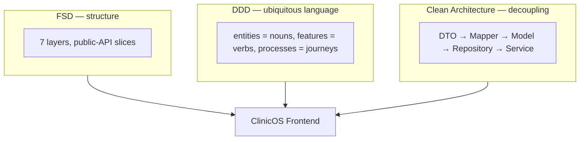
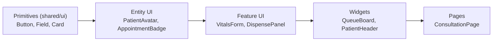
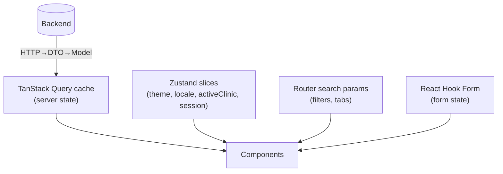
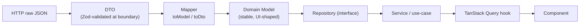
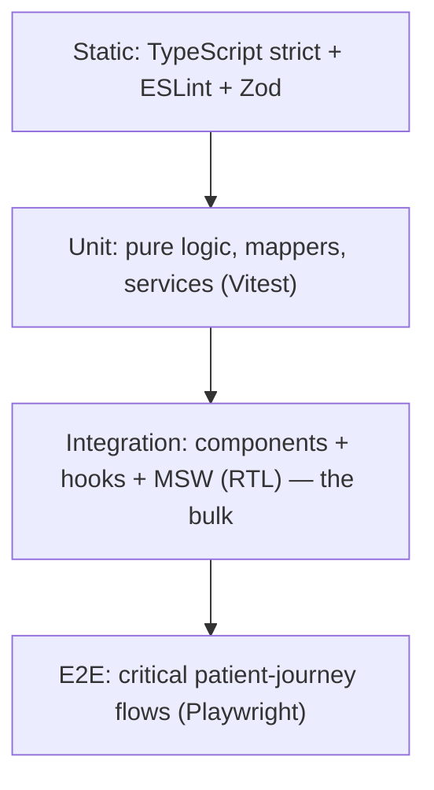
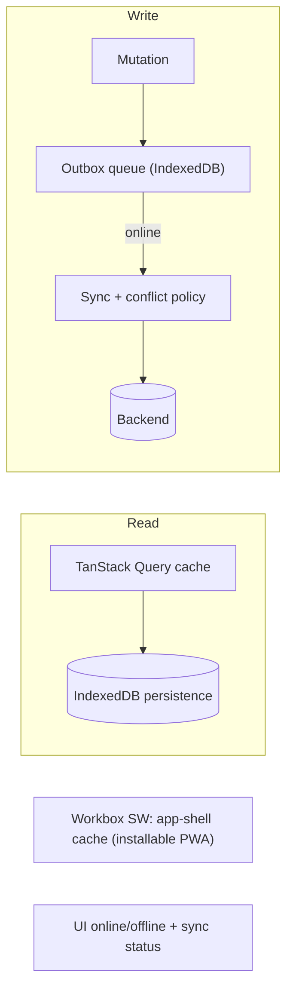
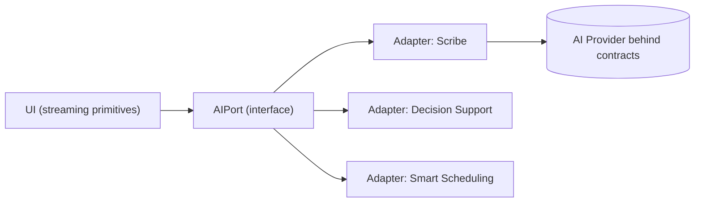

# 🏛️ ClinicOS — Frontend Foundation Blueprint

> **The 40-section master architecture document.** This is the flagship of the ClinicOS canon — the most important document we own.
>
> **Purpose:** This blueprint is the constitutional foundation of the ClinicOS frontend. It captures _every_ foundational architectural decision — philosophy, layering, state, data flow, security, accessibility, localization, resilience, and forward-compatibility — with the full reasoning behind each. It exists so that any engineer or AI agent, in year one or year ten, can understand not just _what_ we built but _why_, and can extend it without a rewrite. Everything here is consistent with — and subordinate to — the single source of truth, [Brain.md](./Brain.md).

---

## Table of Contents

| #   | Section                                                      | #   | Section                                                            |
| --- | ------------------------------------------------------------ | --- | ------------------------------------------------------------------ |
| 1   | [Frontend Philosophy](#1-frontend-philosophy)                | 21  | [Reusable Component Rules](#21-reusable-component-rules)           |
| 2   | [Engineering Principles](#2-engineering-principles)          | 22  | [Performance Rules](#22-performance-rules)                         |
| 3   | [Project Architecture](#3-project-architecture)              | 23  | [Accessibility Rules](#23-accessibility-rules)                     |
| 4   | [Application Layers](#4-application-layers)                  | 24  | [Localization Rules](#24-localization-rules)                       |
| 5   | [Folder Architecture](#5-folder-architecture)                | 25  | [Security Rules](#25-security-rules)                               |
| 6   | [Feature Architecture](#6-feature-architecture)              | 26  | [Testing Strategy](#26-testing-strategy)                           |
| 7   | [Shared Layer Architecture](#7-shared-layer-architecture)    | 27  | [Documentation Strategy](#27-documentation-strategy)               |
| 8   | [Component Strategy](#8-component-strategy)                  | 28  | [Developer Experience Strategy](#28-developer-experience-strategy) |
| 9   | [Design System Strategy](#9-design-system-strategy)          | 29  | [Error Handling Philosophy](#29-error-handling-philosophy)         |
| 10  | [State Management Strategy](#10-state-management-strategy)   | 30  | [Loading State Philosophy](#30-loading-state-philosophy)           |
| 11  | [API Communication Strategy](#11-api-communication-strategy) | 31  | [Empty State Philosophy](#31-empty-state-philosophy)               |
| 12  | [Repository Pattern](#12-repository-pattern)                 | 32  | [Success State Philosophy](#32-success-state-philosophy)           |
| 13  | [Service Pattern](#13-service-pattern)                       | 33  | [Notification Strategy](#33-notification-strategy)                 |
| 14  | [Dependency Rules](#14-dependency-rules)                     | 34  | [Logging Strategy](#34-logging-strategy)                           |
| 15  | [Code Organization](#15-code-organization)                   | 35  | [Monitoring Strategy](#35-monitoring-strategy)                     |
| 16  | [Naming Standards](#16-naming-standards)                     | 36  | [Analytics Strategy](#36-analytics-strategy)                       |
| 17  | [File Naming Standards](#17-file-naming-standards)           | 37  | [Offline Strategy](#37-offline-strategy)                           |
| 18  | [Folder Naming Standards](#18-folder-naming-standards)       | 38  | [Future AI-Ready Strategy](#38-future-ai-ready-strategy)           |
| 19  | [Import Rules](#19-import-rules)                             | 39  | [Scalability Strategy](#39-scalability-strategy)                   |
| 20  | [Export Rules](#20-export-rules)                             | 40  | [Enterprise Best Practices](#40-enterprise-best-practices)         |

**Sibling documents (deep-dive references):** [Architecture.md](./Architecture.md) · [Frontend-Bible.md](./Frontend-Bible.md) · [Folder-Structure.md](./Folder-Structure.md) · [Naming-Convention.md](./Naming-Convention.md) · [Coding-Standards.md](./Coding-Standards.md) · [Developer-Rules.md](./Developer-Rules.md) · [AI-Rules.md](./AI-Rules.md) · [Project-Checklist.md](./Project-Checklist.md)

> **The Decision Contract (from [Brain.md](./Brain.md) §14):** every architectural decision below is accompanied by a compact block stating **Why · Benefits · Trade-offs · Alternatives considered · Future scalability · Enterprise considerations.** If a decision lacks these, it is not ratified.

---

## 1. Frontend Philosophy

ClinicOS is **not** a clinic management app — it is a _Clinic Operating System_, the digital nervous system that orchestrates the entire lifetime patient journey:

```
Appointment → Check-In → Vitals → Queue → Consultation → Prescription
   → Pharmacy → Billing → Follow-Up → Recovery → Lifetime Medical Record
```

Every arrow is a **state transition in a long-running domain process**. Our philosophy follows directly from the eight non-negotiable product laws in [Brain.md](./Brain.md) §2:

1. **One Screen · One Primary Task · One Primary CTA.** A receptionist checking in a patient sees check-in — not a dashboard, not billing.
2. **Calm by default.** A clinic is often stressful; the software must lower the temperature, not raise it.
3. **Accessibility is a feature, not a setting.** WCAG 2.2 AA is the _floor_, not the ceiling.
4. **Every string is localized; every visual value is a token.** No exceptions, enforced by lint.
5. **The UI never touches the backend directly.** It speaks to _services_ and _repositories_.
6. **The frontend is backend-independent.** APIs can be reshaped without a UI rewrite.
7. **Optimize for change, not for today.** Architect for **10+ years without a rewrite**.
8. **Simplicity beats cleverness.** If a junior can't read it, we rewrite it.

**Litmus test for every screen:** _Could a non-technical 65-year-old complete the primary task on the first try, in their own language?_

> **Decision — Adopt a "Clinic Operating System" framing over a CRUD-app framing**
>
> | Facet                         | Statement                                                                                                                                                    |
> | ----------------------------- | ------------------------------------------------------------------------------------------------------------------------------------------------------------ |
> | **Why**                       | The product is a long-lived domain process engine, not a set of forms; framing drives every downstream architectural choice (FSD layers, processes, outbox). |
> | **Benefits**                  | Aligns code structure with the patient journey; makes the system legible to clinicians and engineers alike; resists feature sprawl.                          |
> | **Trade-offs**                | Higher up-front design cost; demands discipline (layers, tokens, i18n) before shipping the first screen.                                                     |
> | **Alternatives considered**   | Page-first CRUD app (fast start, collapses under domain growth); microfrontends from day one (premature, ops-heavy).                                         |
> | **Future scalability**        | Process-centric framing absorbs new journeys (tele-consult, lab orders, AI scribe) as additional `processes`, not rewrites.                                  |
> | **Enterprise considerations** | Auditability, multi-tenancy, and compliance are first-class concerns of an "OS," budgeted from day one rather than retrofitted.                              |

---

## 2. Engineering Principles

These principles are the lens through which every PR is reviewed. They operationalize the philosophy.

| Principle                               | What it means in ClinicOS                                                                           |
| --------------------------------------- | --------------------------------------------------------------------------------------------------- |
| **Separation of concerns**              | UI renders, services decide, repositories fetch, mappers translate. No layer does another's job.    |
| **Dependency inversion**                | UI depends on _interfaces_ (`PatientRepository`, `HttpClient`, `AnalyticsPort`), never concretions. |
| **Single source of truth**              | Server data lives only in TanStack Query; visual values only in tokens; copy only in i18n.          |
| **Explicit over implicit**              | Typed `AppError`, typed DTOs, typed events. No `any`, no magic strings.                             |
| **Locality of behavior**                | A slice owns its UI, model, and api together — change is local, not scattered.                      |
| **Fail loud in dev, soft in prod**      | Zod throws at the boundary in dev; error boundaries degrade gracefully for users.                   |
| **Composition over inheritance**        | Small components and hooks composed; no deep class hierarchies.                                     |
| **Make the right thing the easy thing** | Generators, lint rules, and public APIs make the correct path the path of least resistance.         |

> **Decision — Architecture is _linted_, not merely documented**
>
> | Facet                         | Statement                                                                                                         |
> | ----------------------------- | ----------------------------------------------------------------------------------------------------------------- |
> | **Why**                       | Documentation drifts; ESLint (`boundaries`, `import-sort`, `jsx-a11y`, i18n) makes the rules executable.          |
> | **Benefits**                  | The Dependency Rule, Token Rule, and i18n Rule are enforced in CI, not in code review goodwill.                   |
> | **Trade-offs**                | Lint config is itself an artifact to maintain; occasional false positives need escape hatches with justification. |
> | **Alternatives considered**   | Convention-by-docs only (drifts); human-only review (doesn't scale, inconsistent).                                |
> | **Future scalability**        | New layers/rules are added once to lint and apply repo-wide instantly.                                            |
> | **Enterprise considerations** | Mechanical enforcement is auditable and onboarding-friendly; new hires can't accidentally violate boundaries.     |

---

## 3. Project Architecture

ClinicOS frontend = **Feature-Sliced Design (FSD)** for _structure_ + **Domain-Driven Design (DDD)** for _language_ + **Clean Architecture** (Repository/Service/DTO) for _decoupling_.



- **FSD** answers _"where does this file go?"_ — a predictable, sliced, layered tree.
- **DDD** answers _"what do we call this?"_ — `patient`, `appointment`, `prescription` are entities; `book-appointment`, `record-vitals` are features; the patient journey is a process.
- **Clean Architecture** answers _"how do we stay backend-independent?"_ — the DTO→Model pipeline (§11–13).

> See [Architecture.md](./Architecture.md) for full diagrams and data-flow walkthroughs.

> **Decision — Combine FSD + DDD + Clean Architecture rather than picking one**
>
> | Facet                         | Statement                                                                                                                                        |
> | ----------------------------- | ------------------------------------------------------------------------------------------------------------------------------------------------ |
> | **Why**                       | Each answers a different question; together they cover structure, language, and decoupling without overlap.                                      |
> | **Benefits**                  | Predictable file placement, domain-aligned naming, and a hard seam against backend churn.                                                        |
> | **Trade-offs**                | Three mental models to learn; more boilerplate per slice (index, ui, model, api).                                                                |
> | **Alternatives considered**   | Atomic Design only (UI-only, no domain/data story); plain "feature folders" (no enforced dependency direction); Nx-style libs (heavier tooling). |
> | **Future scalability**        | Hundreds of slices remain navigable; new domains slot in as new entities/features.                                                               |
> | **Enterprise considerations** | Multiple squads work in parallel on isolated slices with minimal merge conflict and clear ownership.                                             |

---

## 4. Application Layers

Seven layers. **Imports flow downward only** — never upward, never sideways except via a slice's public API.

```
┌─────────────────────────────────────────────┐
│  app        composition root: providers,     │  ← bootstraps everything
│             router, global styles, boundaries│
├─────────────────────────────────────────────┤
│  processes  cross-feature journeys           │  ← the Patient Journey orchestration
├─────────────────────────────────────────────┤
│  pages      route-level screens              │  ← compose widgets/features
├─────────────────────────────────────────────┤
│  widgets    large self-sufficient UI blocks  │
├─────────────────────────────────────────────┤
│  features   user capabilities (verbs)        │  ← book-appointment, record-vitals
├─────────────────────────────────────────────┤
│  entities   domain nouns                     │  ← patient, appointment, prescription
├─────────────────────────────────────────────┤
│  shared     design system, lib, api, config  │  ← zero domain knowledge
└─────────────────────────────────────────────┘
```

| Layer       | Owns                                                                 | ClinicOS example                                           | May import     |
| ----------- | -------------------------------------------------------------------- | ---------------------------------------------------------- | -------------- |
| `app`       | Providers, router, global error/suspense boundaries, theme bootstrap | `<AppProviders>`, route tree                               | all below      |
| `processes` | Multi-feature journeys, cross-slice orchestration                    | `patient-journey`, `check-in-flow`                         | pages↓         |
| `pages`     | One route = one screen; compose widgets/features                     | `ConsultationPage`, `QueuePage`                            | widgets↓       |
| `widgets`   | Large composite blocks reused across pages                           | `QueueBoard`, `PatientHeader`                              | features↓      |
| `features`  | A single user capability (verb)                                      | `book-appointment`, `record-vitals`, `dispense-medication` | entities↓      |
| `entities`  | Domain nouns + their model/api/ui                                    | `patient`, `appointment`, `prescription`, `invoice`        | shared↓        |
| `shared`    | Design system, lib, api client, config, i18n                         | `Button`, `httpClient`, `tokens`, `useDebounce`            | nothing domain |

> **Decision — Seven fixed layers with a strict downward dependency direction**
>
> | Facet                         | Statement                                                                                                    |
> | ----------------------------- | ------------------------------------------------------------------------------------------------------------ |
> | **Why**                       | A clear vertical gradient (generic → domain → composition) prevents tangled imports and cyclic coupling.     |
> | **Benefits**                  | Any file's blast radius is bounded; refactors and deletions are safe; reasoning is local.                    |
> | **Trade-offs**                | "Where does this go?" sometimes needs judgement (widget vs. feature); some indirection.                      |
> | **Alternatives considered**   | Flat `src/components` + `src/pages` (cyclic deps inevitable); domain-only modules (no UI-composition story). |
> | **Future scalability**        | New capabilities are new features/widgets; the layer count never grows.                                      |
> | **Enterprise considerations** | Ownership maps cleanly to layers/slices for CODEOWNERS and squad boundaries.                                 |

---

## 5. Folder Architecture

The canonical top-level tree. Full detail in [Folder-Structure.md](./Folder-Structure.md).

```
clinicos-frontend/
├── src/
│   ├── app/                      # composition root
│   │   ├── providers/            # QueryClient, Router, Theme, I18n, ErrorBoundary
│   │   ├── router/               # route tree, lazy routes, guards
│   │   ├── styles/               # token CSS layers, global resets
│   │   └── index.tsx
│   ├── processes/
│   │   └── patient-journey/      # orchestrates Appointment → … → Record
│   ├── pages/
│   │   ├── consultation/
│   │   ├── queue/
│   │   └── billing/
│   ├── widgets/
│   │   ├── queue-board/
│   │   └── patient-header/
│   ├── features/
│   │   ├── book-appointment/
│   │   ├── record-vitals/
│   │   ├── dispense-medication/
│   │   └── generate-invoice/
│   ├── entities/
│   │   ├── patient/
│   │   ├── appointment/
│   │   ├── prescription/
│   │   └── invoice/
│   └── shared/
│       ├── ui/                   # design-system primitives (Button, Card, Field…)
│       ├── api/                  # HttpClient interface + impl, base query client
│       ├── config/               # env, feature flags, constants
│       ├── lib/                  # pure helpers (date, money, a11y, result)
│       ├── i18n/                 # i18next setup, locale loaders
│       └── tokens/               # generated token bindings
├── public/locales/{en,hi,mr,ur}/ # translation namespaces
├── tests/                        # e2e (Playwright), test utils
├── .storybook/
└── tooling/                      # eslint-boundaries, generators, codegen
```

Every slice (`features/*`, `entities/*`) shares the same internal anatomy — see §6.

> **Decision — One canonical tree, generated by scaffolding, enforced by lint**
>
> | Facet                         | Statement                                                                                                  |
> | ----------------------------- | ---------------------------------------------------------------------------------------------------------- |
> | **Why**                       | Predictability removes "where does this live?" friction and makes the codebase navigable by muscle memory. |
> | **Benefits**                  | Fast onboarding; tooling can rely on structure (codegen, boundaries, ownership).                           |
> | **Trade-offs**                | Rigidity; the occasional file that doesn't fit forces a deliberate decision.                               |
> | **Alternatives considered**   | Free-form `src/` (chaos at scale); package-per-feature monorepo (heavier, premature).                      |
> | **Future scalability**        | Tree scales to hundreds of slices; can graduate to a monorepo with the same boundaries.                    |
> | **Enterprise considerations** | Structure maps to CODEOWNERS, security review scopes, and per-domain release notes.                        |

---

## 6. Feature Architecture

Every feature and entity slice looks identical — a **public API barrel** plus segmented internals.

```
features/record-vitals/
├── index.ts          ← PUBLIC API (the ONLY legal import surface)
├── ui/               ← components (presentational + container)
│   ├── VitalsForm.tsx
│   └── VitalsForm.test.tsx
├── model/            ← types, zustand store, selectors, domain mappers
│   ├── vitals.types.ts
│   └── vitals.store.ts
├── api/              ← repository, dto, mappers, query/mutation hooks
│   ├── vitals.dto.ts
│   ├── vitals.mapper.ts
│   ├── vitals.repository.ts
│   └── useRecordVitals.ts
├── lib/              ← slice-local pure helpers (e.g. BP classification)
└── config/           ← slice constants, feature flags
```

The public API exposes _only_ what consumers need:

```ts
// features/record-vitals/index.ts
export { VitalsForm } from './ui/VitalsForm';
export { useRecordVitals } from './api/useRecordVitals';
export type { Vitals, VitalsInput } from './model/vitals.types';
// Everything else (dto, mapper, store internals) stays private.
```

Deep-importing past `index.ts` is **forbidden and linted**.

> **Decision — Public-API barrel per slice; deep imports forbidden**
>
> | Facet                         | Statement                                                                                                           |
> | ----------------------------- | ------------------------------------------------------------------------------------------------------------------- |
> | **Why**                       | The barrel is a contract; internals can be refactored freely as long as the surface holds.                          |
> | **Benefits**                  | Encapsulation, safe refactors, tree-shakeable explicit exports, clear consumer expectations.                        |
> | **Trade-offs**                | One extra file per slice; must remember to export new public symbols.                                               |
> | **Alternatives considered**   | Direct deep imports (couples consumers to internals); `index.ts` re-export of _everything_ (defeats encapsulation). |
> | **Future scalability**        | Internals (e.g. swapping Zustand store shape) change without touching consumers.                                    |
> | **Enterprise considerations** | Slice owners control their published surface; breaking changes are visible in the barrel diff.                      |

---

## 7. Shared Layer Architecture

`shared` is the foundation: **zero domain knowledge**. It must never import `patient`, `appointment`, or any entity.

| Segment         | Contents                                                                                | Rule                                                               |
| --------------- | --------------------------------------------------------------------------------------- | ------------------------------------------------------------------ |
| `shared/ui`     | Design-system primitives: `Button`, `Card`, `Field`, `Dialog`, `Skeleton`, `EmptyState` | Token-driven, a11y-complete, Storybook-documented, no domain props |
| `shared/api`    | `HttpClient` interface + fetch impl, base `QueryClient`, interceptors                   | UI never imports this directly; repositories do                    |
| `shared/lib`    | Pure helpers: `Result<T,E>`, `money`, `formatDate`, `cn`, `useDebounce`                 | Pure, tested, framework-light                                      |
| `shared/config` | Env parsing (Zod), feature flags, app constants                                         | Single typed source for environment                                |
| `shared/i18n`   | i18next init, locale loaders, `dir` helpers                                             | Keys live in `public/locales`                                      |
| `shared/tokens` | Generated TS bindings to CSS-variable tokens                                            | Mirror of the 3-tier token system                                  |

```ts
// shared/lib/result.ts — explicit success/failure without throwing across layers
export type Result<T, E = AppError> = { ok: true; value: T } | { ok: false; error: E };

export const ok = <T>(value: T): Result<T, never> => ({ ok: true, value });
export const err = <E>(error: E): Result<never, E> => ({ ok: false, error });
```

> **Decision — `shared` is strictly domain-agnostic and reusable across products**
>
> | Facet                         | Statement                                                                                                       |
> | ----------------------------- | --------------------------------------------------------------------------------------------------------------- |
> | **Why**                       | A domain-free base layer is portable, independently testable, and the bedrock of the Dependency Rule.           |
> | **Benefits**                  | `shared` could be extracted to an `@clinicos/ui` package; primitives are reused everywhere.                     |
> | **Trade-offs**                | Discipline required: tempting to leak domain types into shared "for convenience."                               |
> | **Alternatives considered**   | A "common" dumping ground (becomes a domain spaghetti hub); per-feature duplication (inconsistency).            |
> | **Future scalability**        | Extractable into a versioned internal package consumed by multiple ClinicOS surfaces (web, kiosk, patient app). |
> | **Enterprise considerations** | A vetted, accessible primitive set reduces a11y/security review surface across the org.                         |

---

## 8. Component Strategy

We split components by responsibility, layered Atomic-style _inside_ FSD:



| Kind               | Concern                                   | Holds state?    | Example                       |
| ------------------ | ----------------------------------------- | --------------- | ----------------------------- |
| **Presentational** | Render props → markup                     | No (props only) | `VitalsCard`                  |
| **Container**      | Wires hooks/services to presentational    | Hooks only      | `VitalsFormContainer`         |
| **Primitive**      | Token-driven DS atom, CVA variants        | Local UI only   | `Button`, `Field`             |
| **Compound**       | Coordinated multi-part (`Tabs`, `Dialog`) | Context-local   | `Dialog.Root/Trigger/Content` |

```tsx
// shared/ui/Button/Button.tsx — token-driven, CVA variants, a11y-first
const button = cva(
  'inline-flex items-center justify-center rounded-md font-medium ' +
    'focus-visible:outline-none focus-visible:ring-2 focus-visible:ring-[var(--color-focus-ring)] ' +
    'disabled:opacity-60 transition-[background-color] duration-[var(--duration-fast)]',
  {
    variants: {
      intent: {
        primary: 'bg-[var(--button-primary-bg)] text-[var(--button-primary-fg)]',
        secondary: 'bg-[var(--button-secondary-bg)] text-[var(--button-secondary-fg)]',
      },
      size: { md: 'h-11 px-4 text-[length:var(--text-body-md)]', lg: 'h-14 px-6' },
    },
    defaultVariants: { intent: 'primary', size: 'md' },
  },
);
```

> **Decision — Presentational/Container split + CVA token-driven primitives**
>
> | Facet                         | Statement                                                                                                      |
> | ----------------------------- | -------------------------------------------------------------------------------------------------------------- |
> | **Why**                       | Pure render units are trivially testable and reusable; containers isolate data concerns.                       |
> | **Benefits**                  | High reuse, fast RTL tests, theme-switching for free via tokens, no logic duplication.                         |
> | **Trade-offs**                | More files (a form is split into container + presentational).                                                  |
> | **Alternatives considered**   | Smart-everywhere components (hard to test/reuse); inline Tailwind without CVA (variant drift, no type-safety). |
> | **Future scalability**        | Primitives evolve centrally; product surfaces consume the same atoms.                                          |
> | **Enterprise considerations** | Storybook + a11y stories make the DS auditable and contractually stable.                                       |

---

## 9. Design System Strategy

The design system is a **3-tier CSS-variable token contract** (from [Brain.md](./Brain.md) §6). Components consume **semantic/component** tokens only — never primitives, never hardcoded values.

```
Primitive  →  Semantic   →  Component
--color-rose-500   --color-primary    --button-primary-bg
--space-4          --space-md         --card-padding
--radius-lg        --radius-surface   --dialog-radius
```

**Brand anchors** (full ramps in [Frontend-Bible.md](./Frontend-Bible.md)):

| Brand role          | Hex       | Primitive family | Semantic                        |
| ------------------- | --------- | ---------------- | ------------------------------- |
| Primary             | `#E87D7D` | `rose`           | `--color-primary` (CTA, active) |
| Secondary / Surface | `#F8F3F0` | `sand`           | `--color-surface` / app bg      |
| Accent              | `#6B8E8E` | `teal`           | `--color-accent`                |
| Neutral             | `#827473` | `stone`          | `--color-text-muted`, borders   |

**Typography:** Plus Jakarta Sans (headings) · Inter (body). Fixed scale tokens only (`display, h1–h6, body-lg/md/sm, caption, overline`). **Large Text Mode** scales the root token so the whole UI grows proportionally. Themes (light, dark, high-contrast) re-map the _semantic_ tier; components never change.

> **Decision — 3-tier CSS-variable tokens, Tailwind theme reads only from tokens**
>
> | Facet                         | Statement                                                                                                                         |
> | ----------------------------- | --------------------------------------------------------------------------------------------------------------------------------- |
> | **Why**                       | One indirection layer (semantic) lets us re-theme, support high-contrast and Large Text, and rebrand without touching components. |
> | **Benefits**                  | Theme switching is a CSS-variable remap; brand changes are localized; a11y modes are first-class.                                 |
> | **Trade-offs**                | Verbose `var(--token)` references; a token-naming governance burden.                                                              |
> | **Alternatives considered**   | Hardcoded Tailwind colors (no theming, no high-contrast); CSS-in-JS runtime theming (runtime cost, SSR friction).                 |
> | **Future scalability**        | New themes/brands/white-label tenants = new semantic maps only.                                                                   |
> | **Enterprise considerations** | White-labeling per clinic chain and contrast-compliance audits are configuration, not code changes.                               |

---

## 10. State Management Strategy

**Where data lives is a law, not a preference** (from [Brain.md](./Brain.md) §9).

| Data kind                                                        | Home                        | Rule                                                  |
| ---------------------------------------------------------------- | --------------------------- | ----------------------------------------------------- |
| Server data (patients, appointments, queue)                      | **TanStack Query**          | Single source of truth; **never** copied into Zustand |
| Global UI/app state (theme, locale, active clinic, auth session) | **Zustand** (sliced)        | Small, selector-based                                 |
| Form state                                                       | **React Hook Form**         | Local to the form                                     |
| URL state (filters, tabs, pagination)                            | **Router / search params**  | Shareable, restorable                                 |
| Ephemeral component state                                        | **`useState`/`useReducer`** | Keep it local                                         |



**Anti-pattern (forbidden):** caching the queue or patient list in Zustand. Server data has _one_ home: Query.

> **Decision — Strict separation of server state (Query) from client state (Zustand)**
>
> | Facet                         | Statement                                                                                                                                  |
> | ----------------------------- | ------------------------------------------------------------------------------------------------------------------------------------------ |
> | **Why**                       | Server and client state have different lifecycles (caching, invalidation, staleness vs. ephemeral UI); conflating them causes desync bugs. |
> | **Benefits**                  | Automatic caching/refetch/dedupe/optimistic updates from Query; tiny, predictable Zustand stores.                                          |
> | **Trade-offs**                | Two libraries to learn; developers must internalize "which home?"                                                                          |
> | **Alternatives considered**   | Redux Toolkit for everything (boilerplate, manual cache logic); Query-only (awkward for pure UI state); Context-only (re-render storms).   |
> | **Future scalability**        | Query scales to real-time (queue) via WebSocket-driven invalidation; Zustand slices stay small.                                            |
> | **Enterprise considerations** | Clear data ownership simplifies offline/outbox reasoning and audit of what's cached client-side (PHI).                                     |

---

## 11. API Communication Strategy

The **backend-independence pipeline** — the single most important contract in ClinicOS.



- **DTO** = raw backend shape, validated with Zod at the boundary (`api/dto`).
- **Mapper** = pure `toModel`/`toDto`; the only place that knows both shapes.
- **Model** = stable, UI-shaped domain type. Components only ever see this.
- **Repository** = interface + impl; returns Models, depends on `HttpClient`.
- **Service** = business rules orchestrating repositories; framework-agnostic.

```ts
// shared/api/http-client.ts — the swappable boundary; UI never imports this
export interface HttpClient {
  get<T>(url: string, init?: RequestInit): Promise<unknown>;
  post<T>(url: string, body: unknown, init?: RequestInit): Promise<unknown>;
  // …put/patch/delete
}
```

**Result:** Backend renames `patient_first_nm` → `firstName`? Change _one mapper_. Zero component edits. That is "10 years without a rewrite" in practice.

> **Decision — DTO→Mapper→Model pipeline with Zod validation at the boundary**
>
> | Facet                         | Statement                                                                                                                        |
> | ----------------------------- | -------------------------------------------------------------------------------------------------------------------------------- |
> | **Why**                       | The wire format is the backend's concern; the UI must depend on a stable, owned domain model.                                    |
> | **Benefits**                  | Backend churn is absorbed in mappers; runtime validation catches contract drift early; types are trustworthy.                    |
> | **Trade-offs**                | Boilerplate (dto + schema + mapper per entity); mapper maintenance.                                                              |
> | **Alternatives considered**   | Use raw API types directly (couples UI to backend, breaks on rename); codegen-only types without validation (no runtime safety). |
> | **Future scalability**        | Swap REST→GraphQL→gRPC-web by changing repositories/mappers; UI untouched.                                                       |
> | **Enterprise considerations** | Zod boundary is a security control (reject malformed/oversized payloads) and a contract-testing anchor.                          |

---

## 12. Repository Pattern

A repository is an **interface** describing _what_ data operations exist, decoupled from _how_ (HTTP, MSW, IndexedDB).

```ts
// entities/patient/api/patient.repository.ts
import type { Patient, PatientId } from '../model/patient.types';

export interface PatientRepository {
  getById(id: PatientId): Promise<Patient>;
  search(query: string): Promise<Patient[]>;
  create(input: NewPatient): Promise<Patient>;
}

// HTTP implementation — returns Models, never DTOs
export function createHttpPatientRepository(http: HttpClient): PatientRepository {
  return {
    async getById(id) {
      const raw = await http.get(`/patients/${id}`);
      return toPatient(PatientDtoSchema.parse(raw)); // validate → map → Model
    },
    async search(query) {
      const raw = await http.get(`/patients?q=${encodeURIComponent(query)}`);
      return PatientListDtoSchema.parse(raw).map(toPatient);
    },
    async create(input) {
      const raw = await http.post('/patients', toPatientDto(input));
      return toPatient(PatientDtoSchema.parse(raw));
    },
  };
}
```

> **Decision — Repository interface + injected `HttpClient`; returns Models only**
>
> | Facet                         | Statement                                                                                              |
> | ----------------------------- | ------------------------------------------------------------------------------------------------------ |
> | **Why**                       | Inverts the dependency: services/hooks depend on an interface, enabling swap, mock, and offline impls. |
> | **Benefits**                  | MSW and IndexedDB repositories drop in for tests/offline; never leaks DTOs upward.                     |
> | **Trade-offs**                | An interface + impl pair per entity; light DI wiring at the composition root.                          |
> | **Alternatives considered**   | Calling `fetch` in hooks (untestable, leaky); fat data-access singletons (hidden coupling).            |
> | **Future scalability**        | Add a caching/offline repository decorator without touching callers.                                   |
> | **Enterprise considerations** | Centralizes audit logging, retry, and tenant-header injection in one place.                            |

---

## 13. Service Pattern

A service encodes **business rules / use-cases** that span repositories. It is framework-agnostic — no React, no Query.

```ts
// features/dispense-medication/model/dispense.service.ts
export function createDispenseService(deps: {
  prescriptions: PrescriptionRepository;
  inventory: InventoryRepository;
}) {
  return {
    async dispense(prescriptionId: PrescriptionId): Promise<Result<DispenseReceipt>> {
      const rx = await deps.prescriptions.getById(prescriptionId);
      if (rx.status !== 'active') return err(new AppError('rx.not_active'));

      const shortfall = await deps.inventory.checkStock(rx.items);
      if (shortfall.length) return err(new AppError('inventory.insufficient', { shortfall }));

      const receipt = await deps.inventory.deduct(rx.items);
      await deps.prescriptions.markDispensed(prescriptionId);
      return ok(receipt);
    },
  };
}
```

Query hooks call services; components call hooks. The service knows nothing about UI.

> **Decision — Pure, framework-agnostic services for cross-repository use-cases**
>
> | Facet                         | Statement                                                                                                        |
> | ----------------------------- | ---------------------------------------------------------------------------------------------------------------- |
> | **Why**                       | Business rules (dispense, bill, queue-prioritize) outlive any UI library and must be unit-testable in isolation. |
> | **Benefits**                  | Rules tested without rendering; reusable across web/kiosk/patient-app; UI stays thin.                            |
> | **Trade-offs**                | Another layer; simple CRUD features may feel over-engineered (allowed to skip when trivial).                     |
> | **Alternatives considered**   | Rules in components/hooks (untestable, duplicated); rules in the backend only (loses client-side UX guards).     |
> | **Future scalability**        | Services compose into `processes` for full-journey orchestration; portable to React Native.                      |
> | **Enterprise considerations** | Clinical rules live in a reviewable, test-covered, framework-independent core — compliance-friendly.             |

---

## 14. Dependency Rules

Enforced by `eslint-plugin-boundaries`. **Imports flow downward only.**

```
app → processes → pages → widgets → features → entities → shared
```

| From ↓ / May import → | app | processes | pages | widgets | features | entities | shared |
| --------------------- | --- | --------- | ----- | ------- | -------- | -------- | ------ |
| **app**               | –   | ✅        | ✅    | ✅      | ✅       | ✅       | ✅     |
| **processes**         | ❌  | –         | ✅    | ✅      | ✅       | ✅       | ✅     |
| **pages**             | ❌  | ❌        | –     | ✅      | ✅       | ✅       | ✅     |
| **widgets**           | ❌  | ❌        | ❌    | –       | ✅       | ✅       | ✅     |
| **features**          | ❌  | ❌        | ❌    | ❌      | ❌\*     | ✅       | ✅     |
| **entities**          | ❌  | ❌        | ❌    | ❌      | ❌       | ❌\*     | ✅     |
| **shared**            | ❌  | ❌        | ❌    | ❌      | ❌       | ❌       | –      |

`*` A feature may **never** import another feature directly — compose them only in `processes`/`pages`. Entities should not import sibling entities; cross-entity logic belongs in a feature/service.

> **Decision — A single, lint-enforced, downward-only dependency direction**
>
> | Facet                         | Statement                                                                           |
> | ----------------------------- | ----------------------------------------------------------------------------------- |
> | **Why**                       | One rule eliminates cyclic dependencies and keeps the graph a DAG.                  |
> | **Benefits**                  | Mechanical CI enforcement; predictable refactors; clean code-splitting boundaries.  |
> | **Trade-offs**                | Occasionally forces lifting shared logic up to `processes` or down to `shared`.     |
> | **Alternatives considered**   | Honor-system conventions (drift); allow sibling feature imports (tangles, cycles).  |
> | **Future scalability**        | The DAG enables reliable route-level code-splitting and future monorepo extraction. |
> | **Enterprise considerations** | Boundaries align with team ownership; violations are blocked pre-merge.             |

> Full ALWAYS/NEVER list in [Developer-Rules.md](./Developer-Rules.md).

---

## 15. Code Organization

Within any slice, organize by **segment** (`ui`, `model`, `api`, `lib`, `config`) — never by file type globally. Co-locate tests, stories, and styles with their subject.

```
record-vitals/
├── ui/VitalsForm.tsx
├── ui/VitalsForm.test.tsx        ← co-located test
├── ui/VitalsForm.stories.tsx     ← co-located story
├── model/vitals.store.ts
└── api/vitals.repository.ts
```

**Rules of thumb:** one component per file; a file ≤ ~200 lines is a smell-check; extract hooks when a component's logic grows; keep pure logic out of components and in `lib`/`model`.

> **Decision — Co-location by segment within slices over global type-based folders**
>
> | Facet                         | Statement                                                                                  |
> | ----------------------------- | ------------------------------------------------------------------------------------------ |
> | **Why**                       | Change is usually local to a feature; co-location keeps everything you touch in one place. |
> | **Benefits**                  | Less file-jumping; deleting a feature deletes everything; tests/stories never orphaned.    |
> | **Trade-offs**                | The same _kind_ of file is scattered across slices (mitigated by naming conventions).      |
> | **Alternatives considered**   | Global `components/`, `hooks/`, `tests/` (high cross-cutting churn, orphaned files).       |
> | **Future scalability**        | Slices stay self-contained as the app grows to hundreds of features.                       |
> | **Enterprise considerations** | Clean slice boundaries support per-feature ownership, review, and removal.                 |

---

## 16. Naming Standards

Naming carries the ubiquitous language. Summary (full rules in [Naming-Convention.md](./Naming-Convention.md)):

| Thing                 | Convention                     | Example                     |
| --------------------- | ------------------------------ | --------------------------- |
| Component             | `PascalCase`                   | `VitalsCard`                |
| Hook                  | `useThing`                     | `usePatient`                |
| Store                 | `thing.store.ts`               | `auth.store.ts`             |
| Service               | `thing.service.ts`             | `billing.service.ts`        |
| Repository            | `thing.repository.ts`          | `patient.repository.ts`     |
| Mapper / DTO / Schema | `thing.mapper/.dto/.schema.ts` | `patient.mapper.ts`         |
| Types                 | `thing.types.ts`               | `queue.types.ts`            |
| Constant              | `UPPER_SNAKE_CASE`             | `MAX_QUEUE_SIZE`            |
| Boolean               | `is/has/can/should` prefix     | `isCheckedIn`               |
| Event handler         | `handleX` / prop `onX`         | `handleSubmit`              |
| i18n key              | `namespace.area.element`       | `vitals.form.bloodPressure` |

> **Decision — Domain-aligned, role-suffixed naming as a ubiquitous-language carrier**
>
> | Facet                         | Statement                                                                                                        |
> | ----------------------------- | ---------------------------------------------------------------------------------------------------------------- |
> | **Why**                       | Names should reveal both role (`.repository`) and domain (`patient`) at a glance and match how clinicians speak. |
> | **Benefits**                  | Searchable, predictable, self-documenting; tooling can target by suffix.                                         |
> | **Trade-offs**                | Verbosity; requires shared discipline.                                                                           |
> | **Alternatives considered**   | Terse/abbreviated names (ambiguous); type-only names without domain (`service.ts` everywhere).                   |
> | **Future scalability**        | New roles get new suffixes; conventions scale across thousands of files.                                         |
> | **Enterprise considerations** | Consistent vocabulary smooths onboarding, audits, and cross-team communication.                                  |

---

## 17. File Naming Standards

| File type                                            | Pattern              | Example               |
| ---------------------------------------------------- | -------------------- | --------------------- |
| React component                                      | `PascalCase.tsx`     | `QueueBoard.tsx`      |
| Hook                                                 | `useThing.ts`        | `useRecordVitals.ts`  |
| Store                                                | `thing.store.ts`     | `queue.store.ts`      |
| Service / Repository / Mapper / DTO / Schema / Types | `thing.<role>.ts`    | `dispense.service.ts` |
| Unit/integration test                                | `*.test.ts(x)`       | `VitalsForm.test.tsx` |
| E2E test                                             | `*.spec.ts`          | `check-in.spec.ts`    |
| Story                                                | `*.stories.tsx`      | `Button.stories.tsx`  |
| Barrel                                               | `index.ts`           | (public API only)     |
| Constants                                            | `thing.constants.ts` | `queue.constants.ts`  |

> **Decision — Role-suffixed file names with co-located test/story conventions**
>
> | Facet                         | Statement                                                                                               |
> | ----------------------------- | ------------------------------------------------------------------------------------------------------- |
> | **Why**                       | The suffix declares a file's architectural role independent of folder, enabling lint/codegen targeting. |
> | **Benefits**                  | Glob-able (`**/*.repository.ts`), instantly recognizable, tooling-friendly.                             |
> | **Trade-offs**                | Longer file names.                                                                                      |
> | **Alternatives considered**   | Folder-encodes-role only (loses signal when files move); no convention (inconsistent).                  |
> | **Future scalability**        | Automated audits and codegen rely on stable suffixes.                                                   |
> | **Enterprise considerations** | Security/compliance scans can target roles (e.g. every `.repository.ts` for audit hooks).               |

---

## 18. Folder Naming Standards

| Folder kind              | Convention                                          | Example                               |
| ------------------------ | --------------------------------------------------- | ------------------------------------- |
| Slice / feature / entity | `kebab-case` (verb for features, noun for entities) | `book-appointment`, `patient`         |
| Segment                  | fixed lowercase                                     | `ui`, `model`, `api`, `lib`, `config` |
| Layer                    | fixed lowercase plural                              | `features`, `entities`, `widgets`     |
| Locale                   | BCP-47 lowercase                                    | `en`, `hi`, `mr`, `ur`                |

Features are **verbs** (capabilities); entities are **nouns** (domain concepts). This distinction is load-bearing for the Dependency Rule.

> **Decision — `kebab-case` slices; verbs for features, nouns for entities**
>
> | Facet                         | Statement                                                                                                     |
> | ----------------------------- | ------------------------------------------------------------------------------------------------------------- |
> | **Why**                       | Cross-platform-safe casing; the verb/noun rule encodes the FSD feature-vs-entity boundary in the name itself. |
> | **Benefits**                  | No case-sensitivity bugs across OSes; folder names self-classify the slice's layer.                           |
> | **Trade-offs**                | Requires judgement on borderline slices (is it a verb or a noun?).                                            |
> | **Alternatives considered**   | `camelCase`/`PascalCase` folders (case-sensitivity pitfalls on Linux CI vs. Windows/macOS).                   |
> | **Future scalability**        | Hundreds of slices remain unambiguously classified.                                                           |
> | **Enterprise considerations** | Predictable paths feed CODEOWNERS globs and CI path-filters.                                                  |

---

## 19. Import Rules

- **Always import via a slice's public API** (`@/features/record-vitals`), never deep paths.
- Use the `@/` path alias from `src/`; no `../../../` chains.
- Import order (auto-sorted): node/builtin → external → `@/shared` → `@/entities` → `@/features` → `@/widgets` → relative.
- Type-only imports use `import type`.

```ts
import { useTranslation } from 'react-i18next'; // external
import { Button, Field } from '@/shared/ui'; // shared
import { PatientAvatar } from '@/entities/patient'; // entity (public API)
import type { Vitals } from './model/vitals.types'; // relative type
```

> **Decision — Public-API + path-alias imports, lint-sorted**
>
> | Facet                         | Statement                                                                                           |
> | ----------------------------- | --------------------------------------------------------------------------------------------------- |
> | **Why**                       | Stable import surfaces and aliases make moving files painless and keep the dependency graph honest. |
> | **Benefits**                  | Refactor-safe, readable, enforceable; eliminates fragile relative chains.                           |
> | **Trade-offs**                | Alias config in TS/Vite/ESLint/Vitest must stay in sync (set once).                                 |
> | **Alternatives considered**   | Relative imports everywhere (brittle on moves); barrel-of-everything (breaks tree-shaking).         |
> | **Future scalability**        | Aliases map cleanly onto future monorepo package names.                                             |
> | **Enterprise considerations** | Deterministic imports simplify dependency and license auditing.                                     |

---

## 20. Export Rules

- **Named exports only** (one rare exception: a route's lazily-loaded page component may default-export for `React.lazy`).
- A slice's `index.ts` re-exports **only** its public surface.
- Export types alongside implementations from the same public API.
- Never re-export third-party libraries through a barrel (kills tree-shaking).

```ts
// ✅ entities/appointment/index.ts
export { AppointmentBadge } from './ui/AppointmentBadge';
export { useAppointment } from './api/useAppointment';
export type { Appointment, AppointmentStatus } from './model/appointment.types';
```

> **Decision — Named exports + curated public-API barrels**
>
> | Facet                         | Statement                                                                                                |
> | ----------------------------- | -------------------------------------------------------------------------------------------------------- |
> | **Why**                       | Named exports give stable, refactor-safe, tree-shakeable symbols; curated barrels enforce encapsulation. |
> | **Benefits**                  | Reliable autocomplete and rename; smaller bundles; clear public vs. private.                             |
> | **Trade-offs**                | `React.lazy` needs a sanctioned default-export carve-out.                                                |
> | **Alternatives considered**   | Default exports (rename drift, weak autocomplete); export-\* barrels (leak internals, bloat).            |
> | **Future scalability**        | Public surfaces become versioned package APIs without churn.                                             |
> | **Enterprise considerations** | Explicit surfaces make breaking-change detection and semver discipline tractable.                        |

---

## 21. Reusable Component Rules

A component qualifies for `shared/ui` only if it is **domain-free, token-driven, accessible, and documented**.

**Checklist to promote a component to `shared/ui`:**

- [ ] No domain props (`patient`, `appointment`) — generic props only.
- [ ] Consumes semantic/component tokens; zero hardcoded visual values.
- [ ] Keyboard + screen-reader complete; passes axe.
- [ ] `forwardRef` where a DOM ref is meaningful; controlled + uncontrolled where relevant.
- [ ] Storybook stories incl. loading/empty/error/RTL/large-text variants.
- [ ] i18n-ready (no embedded copy; labels passed in).

Domain-flavored composites (e.g. `VitalsCard`) live in their **entity/feature**, _composed from_ shared primitives.

> **Decision — Strict promotion bar for `shared/ui`; domain composites stay in slices**
>
> | Facet                         | Statement                                                                                                       |
> | ----------------------------- | --------------------------------------------------------------------------------------------------------------- |
> | **Why**                       | A reusable primitive must be universally safe; domain leakage poisons reuse and the Dependency Rule.            |
> | **Benefits**                  | A small, trustworthy, audited primitive set; domain UI stays where its context lives.                           |
> | **Trade-offs**                | Some duplication across slices before a pattern earns promotion (intentional — premature abstraction is worse). |
> | **Alternatives considered**   | Promote everything early (leaky, churny abstractions); never share (inconsistent, duplicated).                  |
> | **Future scalability**        | The vetted set anchors a multi-surface design system (web/kiosk/patient).                                       |
> | **Enterprise considerations** | A curated primitive library shrinks the a11y/security review surface org-wide.                                  |

---

## 22. Performance Rules

Performance is a clinical concern: a doctor mid-consult cannot wait. Targets — **LCP < 2.5s, INP < 200ms, CLS < 0.1** on mid-range Android over 3G.

| Lever          | Practice                                                                                    |
| -------------- | ------------------------------------------------------------------------------------------- |
| Code-splitting | Route-level lazy chunks per page; processes/widgets split on demand                         |
| Data           | TanStack Query caching, `staleTime` tuning, prefetch on intent (hover/focus)                |
| Lists          | Virtualize long lists (queue, patient history)                                              |
| Rendering      | Stable keys, memo selective hot paths, avoid prop-drilling re-renders via Zustand selectors |
| Assets         | `lucide-react` tree-shaken icons; font-display swap; responsive images                      |
| Skeletons      | Reserve layout to keep CLS ~0; never spinner-shift                                          |
| Budgets        | CI bundle-size budgets per chunk; Lighthouse CI gate                                        |

> **Decision — Performance budgets enforced in CI against real-device targets**
>
> | Facet                         | Statement                                                                                       |
> | ----------------------------- | ----------------------------------------------------------------------------------------------- |
> | **Why**                       | Many clinic devices are low-end Android on weak networks; perf is accessibility for them.       |
> | **Benefits**                  | Regressions blocked pre-merge; consistently fast journeys; better Web Vitals → better outcomes. |
> | **Trade-offs**                | Budget maintenance; occasional friction when a chunk must grow (requires justification).        |
> | **Alternatives considered**   | "Optimize later" (debt compounds); manual profiling only (inconsistent, unenforced).            |
> | **Future scalability**        | Budgets scale per-route; new heavy features must split, not bloat the core.                     |
> | **Enterprise considerations** | Predictable performance underpins SLAs and rural-clinic deployments.                            |

---

## 23. Accessibility Rules

WCAG **2.2 AA** is the floor (AAA for text contrast where feasible) — see [Brain.md](./Brain.md) §7.

- Keyboard-navigable everything; visible token-driven `:focus-visible` rings.
- Semantic HTML first; ARIA only to fill gaps.
- Screen-reader labels via i18n keys; live regions for async status (queue updates, save).
- **High-contrast**, **Reduced-motion**, **Large Text Mode** as first-class themes.
- **Never signal by color alone** — pair with icon/text/shape (color-blind safe).
- Touch targets ≥ 44px (≥ 56px in Large Mode).
- Dialogs trap and restore focus; skip-to-content on every page.
- **axe/jest-axe + Playwright a11y checks are a CI gate.**

> **Decision — Accessibility is a non-negotiable, CI-gated feature**
>
> | Facet                         | Statement                                                                                                                       |
> | ----------------------------- | ------------------------------------------------------------------------------------------------------------------------------- |
> | **Why**                       | Our users include elderly, low-literacy, and disabled patients; inaccessible = unusable, and healthcare carries legal mandates. |
> | **Benefits**                  | Wider reach, legal compliance, better UX for everyone (curb-cut effect).                                                        |
> | **Trade-offs**                | More upfront effort per component; automated checks catch only ~40% (manual audits still required).                             |
> | **Alternatives considered**   | A11y as a later pass (always slips, costly retrofits); manual-only (inconsistent, unenforced).                                  |
> | **Future scalability**        | New components inherit accessible primitives by default.                                                                        |
> | **Enterprise considerations** | Reduces regulatory/legal risk (ADA-equivalent); enables public-sector clinic contracts.                                         |

> Full rules: [Frontend-Bible.md](./Frontend-Bible.md) (A11y).

---

## 24. Localization Rules

Localization is always-on (from [Brain.md](./Brain.md) §8). **No hardcoded human-readable text — ever** (linted).

- **i18next + react-i18next + ICU**; namespaced keys (`feature.area.element`); ICU plurals/gender.
- All text — including `aria-label` and error messages — uses keys.
- Languages now: **English, Hindi, Marathi, Urdu**; later: unlimited.
- **RTL** (Urdu) via `dir` + CSS **logical properties** (`margin-inline-start`, never `margin-left`).
- **Runtime language switch without reload**; locale bundles lazy-loaded.
- Locale-aware dates/numbers/currency via `Intl`.

```tsx
const { t } = useTranslation('vitals');
<Field label={t('form.bloodPressure')} aria-label={t('form.bloodPressure')} />;
```

> **Decision — i18next + ICU, key-only UI, RTL via logical properties**
>
> | Facet                         | Statement                                                                                                      |
> | ----------------------------- | -------------------------------------------------------------------------------------------------------------- |
> | **Why**                       | A multilingual, multi-script (incl. RTL) user base makes hardcoded English a non-starter.                      |
> | **Benefits**                  | Add a language without code changes; correct plurals/gender; reload-free switching; RTL "for free."            |
> | **Trade-offs**                | Every string needs a key; translation pipeline to manage; ICU learning curve.                                  |
> | **Alternatives considered**   | Hardcoded strings (untranslatable); physical CSS properties (RTL breaks); FormatJS-only (heavier React story). |
> | **Future scalability**        | Unlimited locales; lazy bundles keep payload flat as languages grow.                                           |
> | **Enterprise considerations** | Localization is a market-expansion lever and a compliance need (informed consent in patient's language).       |

---

## 25. Security Rules

Healthcare = **PHI** (Protected Health Information). Security is foundational, not a feature flag.

| Concern                                   | Rule in ClinicOS                                                                                                                                                                                        |
| ----------------------------------------- | ------------------------------------------------------------------------------------------------------------------------------------------------------------------------------------------------------- |
| **PHI on the client**                     | Treat patient data as toxic-by-default. Keep PHI only in the Query cache for as long as needed; clear on logout, tenant switch, and idle timeout.                                                       |
| **No PHI in logs/analytics/localStorage** | Logging, Sentry, and analytics ports **scrub/deny PHI fields** by allowlist. Never persist PHI to `localStorage`; offline cache (IndexedDB) is encrypted-at-rest where supported and cleared on logout. |
| **Token storage**                         | Access token in memory; refresh via **httpOnly, Secure, SameSite cookie** (not JS-readable). No JWT in `localStorage`. Short-lived access tokens + silent refresh.                                      |
| **RBAC / permission-gated UI**            | Capability checks via `usePermission('vitals:write')`; a `<Can>` guard hides/disables actions. **Server is the source of truth — client gating is UX, not security.**                                   |
| **XSS**                                   | No `dangerouslySetInnerHTML` (lint-blocked); React escaping by default; sanitize any rich text; strict CSP headers.                                                                                     |
| **CSRF**                                  | Cookie-based auth paired with CSRF tokens / SameSite; mutations carry anti-CSRF where applicable.                                                                                                       |
| **Dependency supply chain**               | Pinned versions + lockfile; `npm audit`/Snyk in CI; provenance checks; Renovate with review gates; minimal transitive surface.                                                                          |
| **Audit trail**                           | Sensitive reads/writes (open record, dispense, bill) emit audit events through the audit port — _who, what, when, which tenant_ — without PHI payloads.                                                 |
| **Session / idle timeout**                | Idle timeout with warning modal → auto-logout; absolute session cap; clears caches and Zustand session slice on expiry.                                                                                 |
| **Multi-tenant isolation**                | Active clinic/tenant in session; every request carries the tenant context; switching tenants **purges** the Query cache and tenant-scoped stores to prevent cross-tenant leakage.                       |

```tsx
// shared/ui — permission-gated action (UX layer; server still authorizes)
<Can permission="prescription:dispense" fallback={null}>
  <Button intent="primary" onClick={dispense}>
    {t('pharmacy.dispense')}
  </Button>
</Can>
```

> **Decision — PHI-first, defense-in-depth client security model**
>
> | Facet                         | Statement                                                                                                          |
> | ----------------------------- | ------------------------------------------------------------------------------------------------------------------ |
> | **Why**                       | A breach of PHI is catastrophic (legal, financial, ethical); the client is an attack surface and a leakage risk.   |
> | **Benefits**                  | Minimized PHI exposure, no token theft via XSS, tenant isolation, audit-ready, regulation-aligned.                 |
> | **Trade-offs**                | More plumbing (scrubbers, guards, cache purges); in-memory tokens require silent-refresh UX.                       |
> | **Alternatives considered**   | JWT in `localStorage` (XSS-stealable); client-only RBAC as security (bypassable); logging raw payloads (PHI leak). |
> | **Future scalability**        | Ports (audit, logging, analytics) let us add DLP/redaction and stricter controls centrally.                        |
> | **Enterprise considerations** | Maps to HIPAA-style safeguards, SOC 2 audit trails, and BAAs; multi-tenant isolation is contractually essential.   |

> Security is a hard gate in [Project-Checklist.md](./Project-Checklist.md).

---

## 26. Testing Strategy

A **testing trophy**, not a pyramid: lean unit, heavy integration, focused E2E.



| Level       | Tooling                                  | What we test                                              |
| ----------- | ---------------------------------------- | --------------------------------------------------------- |
| Static      | TS strict, ESLint, Zod                   | Types, boundaries, contracts                              |
| Unit        | Vitest                                   | Mappers, services, pure `lib`                             |
| Integration | Vitest + RTL + **MSW**                   | Component behavior against mocked APIs                    |
| E2E         | Playwright                               | Check-in → Vitals → Consultation → Prescription → Billing |
| A11y        | jest-axe + Playwright-axe                | Every component + key pages (CI gate)                     |
| Visual/docs | Storybook (+ optional visual regression) | DS components                                             |

We test **behavior, not implementation** (query by role/label, not test-ids where avoidable). MSW gives backend independence in tests too.

> **Decision — Testing-trophy with MSW; behavior over implementation**
>
> | Facet                         | Statement                                                                                  |
> | ----------------------------- | ------------------------------------------------------------------------------------------ |
> | **Why**                       | Integration tests with realistic mocked APIs catch the most real bugs per unit of effort.  |
> | **Benefits**                  | Confidence without brittleness; tests survive refactors; MSW mirrors production data flow. |
> | **Trade-offs**                | Integration tests run slower than pure units; MSW handlers to maintain.                    |
> | **Alternatives considered**   | Heavy unit pyramid (tests internals, brittle); E2E-heavy (slow, flaky, expensive).         |
> | **Future scalability**        | MSW handlers double as the contract for the backend-independence pipeline.                 |
> | **Enterprise considerations** | Critical clinical flows are E2E-guarded; a11y gating reduces compliance risk.              |

---

## 27. Documentation Strategy

Documentation is part of the Definition of Done. The canon (indexed in [Brain.md](./Brain.md) §13):

| Doc                                                                                                                                                                                                                            | Role                                                                                               |
| ------------------------------------------------------------------------------------------------------------------------------------------------------------------------------------------------------------------------------ | -------------------------------------------------------------------------------------------------- |
| [Brain.md](./Brain.md)                                                                                                                                                                                                         | Single source of truth + index                                                                     |
| **This blueprint**                                                                                                                                                                                                             | 40-section master architecture                                                                     |
| [Architecture.md](./Architecture.md) · [Frontend-Bible.md](./Frontend-Bible.md) · [Folder-Structure.md](./Folder-Structure.md) · [Naming-Convention.md](./Naming-Convention.md) · [Coding-Standards.md](./Coding-Standards.md) | Deep-dive references                                                                               |
| [Developer-Rules.md](./Developer-Rules.md) · [AI-Rules.md](./AI-Rules.md) · [Project-Checklist.md](./Project-Checklist.md)                                                                                                     | Rules & gates                                                                                      |
| **ADRs**                                                                                                                                                                                                                       | Every stack/architecture change (per [Documentation-Guidelines.md](./Documentation-Guidelines.md)) |

Plus: JSDoc on public APIs, Storybook for components, and a "Decision Contract" block on every architectural choice.

> **Decision — Docs-as-canon + ADRs for every architectural change**
>
> | Facet                         | Statement                                                                                     |
> | ----------------------------- | --------------------------------------------------------------------------------------------- |
> | **Why**                       | A 10-year, multi-team system must record _why_, not just _what_; tribal knowledge evaporates. |
> | **Benefits**                  | Fast onboarding (human + AI), preserved rationale, reversible decisions with context.         |
> | **Trade-offs**                | Docs must be maintained or they mislead; ADR discipline required.                             |
> | **Alternatives considered**   | Code-only (loses rationale); wiki sprawl (drifts, unversioned).                               |
> | **Future scalability**        | Versioned, in-repo docs evolve with the code and feed AI agents (§38).                        |
> | **Enterprise considerations** | ADRs and design records support audits, compliance, and governance reviews.                   |

---

## 28. Developer Experience Strategy

Make the right thing the easy thing.

- **Scaffolding generators** (`plop`-style) create a compliant slice (index, ui, model, api) in seconds.
- **Husky + lint-staged** run ESLint/Prettier/type-check on staged files.
- **Fast feedback**: Vite HMR, Vitest watch, Storybook.
- **Changesets** for versioned, documented releases.
- **MSW dev mode** lets the frontend run with zero backend.
- One-command bootstrap; typed env via `shared/config`.

> **Decision — Invest in generators, fast feedback, and mock-first dev**
>
> | Facet                         | Statement                                                                                      |
> | ----------------------------- | ---------------------------------------------------------------------------------------------- |
> | **Why**                       | DX compounds: a smooth path makes correct architecture the default and frees backend coupling. |
> | **Benefits**                  | Consistent slices, fewer review nits, faster iteration, parallel front/back work.              |
> | **Trade-offs**                | Tooling to build and maintain (generators, MSW handlers).                                      |
> | **Alternatives considered**   | Manual slice creation (drift, errors); backend-dependent dev (blocks the frontend).            |
> | **Future scalability**        | Generators encode evolving best practices repo-wide instantly.                                 |
> | **Enterprise considerations** | Lower onboarding time and consistent output across distributed teams.                          |

---

## 29. Error Handling Philosophy

Errors are typed, localized, and recoverable. Every async surface defines all four states ([Brain.md](./Brain.md) §11).

```ts
// shared/lib/app-error.ts
export class AppError extends Error {
  constructor(
    public readonly code: string, // i18n key, e.g. 'inventory.insufficient'
    public readonly meta?: Record<string, unknown>,
    public readonly cause?: unknown,
  ) {
    super(code);
  }
}
```

- Repositories/services return typed `AppError` (never raw `Error`/strings upward).
- The boundary throws on invalid DTOs (Zod) — caught and mapped to `AppError`.
- React **error boundaries** per route/process degrade gracefully (never a white screen).
- Every error shows a **localized human message + a retry path**; technical detail goes to logs only.

> **Decision — Typed `AppError` (i18n-coded) + layered error boundaries**
>
> | Facet                         | Statement                                                                                                     |
> | ----------------------------- | ------------------------------------------------------------------------------------------------------------- |
> | **Why**                       | Untyped errors and raw strings are untranslatable and unhandleable; users need clarity and a way forward.     |
> | **Benefits**                  | Localized, consistent, recoverable errors; no white screens; clean separation of user message vs. log detail. |
> | **Trade-offs**                | Must define error codes and map exceptions deliberately.                                                      |
> | **Alternatives considered**   | Throw raw strings/`Error` (untranslatable, leaky); global catch-all only (poor UX, loses context).            |
> | **Future scalability**        | New error codes slot into i18n + monitoring; AI features get a typed failure surface.                         |
> | **Enterprise considerations** | No PHI/stack traces shown to users; full context flows to monitoring with scrubbing.                          |

> Deep dive: §30–32 and [Coding-Standards.md](./Coding-Standards.md).

---

## 30. Loading State Philosophy

**Skeletons over spinners. Never shift layout.**

- Prefer content-shaped skeletons that reserve final layout (CLS ≈ 0).
- Use Suspense + Query `isPending` per surface; show inline progress for mutations (optimistic where safe).
- Distinguish _first load_ (skeleton) from _background refetch_ (subtle indicator, keep stale data visible).

```tsx
{
  queue.isPending ? <QueueBoardSkeleton rows={8} /> : <QueueBoard items={queue.data} />;
}
```

> **Decision — Skeleton-first, layout-stable loading with stale-while-revalidate**
>
> | Facet                         | Statement                                                                          |
> | ----------------------------- | ---------------------------------------------------------------------------------- |
> | **Why**                       | Spinners feel slower and cause layout shift; clinics need calm, jank-free screens. |
> | **Benefits**                  | Perceived speed, CLS ~0, continuity (stale data stays during refetch).             |
> | **Trade-offs**                | A skeleton per surface to design/maintain.                                         |
> | **Alternatives considered**   | Global spinner (jarring, blocks UI); blank-until-ready (feels broken).             |
> | **Future scalability**        | Skeleton primitives are reused across all new surfaces.                            |
> | **Enterprise considerations** | Consistent perceived performance supports SLAs and low-end-device deployments.     |

---

## 31. Empty State Philosophy

An empty state is an **opportunity**, not a dead end: meaningful illustration + one primary action.

- Differentiate _truly empty_ (no patients yet → "Add first patient") from _filtered-empty_ ("No results — clear filters").
- One localized primary CTA; never a blank panel.
- Reuse a shared `<EmptyState>` primitive (icon/illustration + title + body + action slots).

```tsx
<EmptyState
  icon={<CalendarPlus />}
  title={t('appointments.empty.title')}
  body={t('appointments.empty.body')}
  action={<Button onClick={book}>{t('appointments.empty.cta')}</Button>}
/>
```

> **Decision — First-class, action-oriented empty states via a shared primitive**
>
> | Facet                         | Statement                                                                        |
> | ----------------------------- | -------------------------------------------------------------------------------- |
> | **Why**                       | Empty screens confuse and stall users; guidance turns a void into the next step. |
> | **Benefits**                  | Better onboarding/activation, consistent UX, less support burden.                |
> | **Trade-offs**                | Design + copy effort per surface; must distinguish empty vs. filtered-empty.     |
> | **Alternatives considered**   | Blank area (looks broken); generic "No data" (unhelpful).                        |
> | **Future scalability**        | One primitive serves every list/detail surface.                                  |
> | **Enterprise considerations** | Guided empties improve adoption metrics that matter to clinic buyers.            |

---

## 32. Success State Philosophy

Confirm every meaningful action — clearly, briefly, accessibly.

- Optimistic updates where safe (e.g. mark "checked-in"), with rollback on failure.
- Localized success toast **or** inline confirmation; announced via ARIA live region.
- Success implies a clear next step in the journey (e.g. after Vitals → "Send to Queue").
- Never block the UI on a success toast.

> **Decision — Explicit, optimistic, accessible success feedback**
>
> | Facet                         | Statement                                                                            |
> | ----------------------------- | ------------------------------------------------------------------------------------ |
> | **Why**                       | Users need certainty an action succeeded; silence breeds double-submits and anxiety. |
> | **Benefits**                  | Confidence, snappy feel (optimistic), screen-reader parity, clear next action.       |
> | **Trade-offs**                | Optimistic paths need rollback handling; toast fatigue must be managed.              |
> | **Alternatives considered**   | Silent success (uncertain); blocking confirmation modals (friction).                 |
> | **Future scalability**        | Shared toast/inline patterns extend to all journey steps and AI suggestions.         |
> | **Enterprise considerations** | Reduces erroneous re-submissions in high-throughput reception/pharmacy flows.        |

---

## 33. Notification Strategy

Notifications are layered and **provider-agnostic**.

| Type          | Use                                      | Channel                         |
| ------------- | ---------------------------------------- | ------------------------------- |
| Toast         | Transient success/info                   | In-app, ARIA-live, auto-dismiss |
| Inline        | Field/section feedback                   | Within the form/section         |
| Banner        | Persistent/system (offline, maintenance) | Top-of-app                      |
| Dialog        | Blocking confirmation (destructive)      | Focus-trapped modal             |
| Push (future) | Async events (queue ready, results)      | Web Push behind a port          |

All notification copy is localized; severity is conveyed by **icon + text + shape**, never color alone.

> **Decision — Layered, provider-agnostic, accessible notifications**
>
> | Facet                         | Statement                                                                                 |
> | ----------------------------- | ----------------------------------------------------------------------------------------- |
> | **Why**                       | Different messages warrant different intrusiveness; a port keeps us vendor-free for push. |
> | **Benefits**                  | Right-sized interruption, consistent a11y, swappable push provider.                       |
> | **Trade-offs**                | A small taxonomy + central manager to maintain.                                           |
> | **Alternatives considered**   | Toast-for-everything (noise, missed criticals); vendor SDK in components (lock-in).       |
> | **Future scalability**        | Add Web Push / SMS adapters behind the same port.                                         |
> | **Enterprise considerations** | Critical alerts (e.g. drug interaction) get appropriately blocking treatment.             |

---

## 34. Logging Strategy

Structured, leveled, **PHI-safe** logging behind a port.

- `logger` port (`debug/info/warn/error`) with structured fields; **PHI scrubbed by allowlist** before emit.
- Dev → console (pretty); prod → forwarded to Sentry/observability via the port.
- Correlate with a request/trace id; include tenant id (never patient identifiers).
- No `console.*` in app code (lint-blocked) — always the port.

> **Decision — Centralized structured logger port with PHI scrubbing**
>
> | Facet                         | Statement                                                                          |
> | ----------------------------- | ---------------------------------------------------------------------------------- |
> | **Why**                       | Ad-hoc `console.log` leaks PHI, can't be controlled, and is invisible in prod.     |
> | **Benefits**                  | Consistent structured logs, redaction by default, swappable sink, prod visibility. |
> | **Trade-offs**                | Must route everything through the port; maintain the scrub allowlist.              |
> | **Alternatives considered**   | Raw `console` (PHI leak, no control); vendor SDK directly (lock-in).               |
> | **Future scalability**        | Swap or fan-out sinks (Sentry, OTel) without touching call sites.                  |
> | **Enterprise considerations** | PHI-safe logging is a hard HIPAA-style requirement; audit-friendly.                |

---

## 35. Monitoring Strategy

Observe health, performance, and errors — behind abstractions ([Brain.md](./Brain.md) §4).

- **Sentry** for errors (PHI scrubbed), **Web Vitals** (LCP/INP/CLS) reported continuously, **OpenTelemetry-web** for traces/spans across the journey — all behind a `monitoring` port.
- Release health, source maps, and alerting on error-rate / Web-Vitals regressions.
- Tag events with release, tenant (id only), route, and journey step.

> **Decision — Port-abstracted monitoring (errors + Web Vitals + traces), PHI-scrubbed**
>
> | Facet                         | Statement                                                                               |
> | ----------------------------- | --------------------------------------------------------------------------------------- |
> | **Why**                       | A clinical system must detect and diagnose problems fast — without ever exporting PHI.  |
> | **Benefits**                  | Faster MTTR, proactive regression alerts, end-to-end journey tracing, vendor-swappable. |
> | **Trade-offs**                | Instrumentation overhead; scrubbing rules to maintain.                                  |
> | **Alternatives considered**   | No monitoring (blind in prod); direct vendor coupling (lock-in, harder PHI control).    |
> | **Future scalability**        | Add RUM/synthetic monitoring behind the same port; correlate with AI feature health.    |
> | **Enterprise considerations** | Supports uptime SLAs, incident response, and compliance reporting.                      |

---

## 36. Analytics Strategy

Product analytics via a **provider-agnostic `analytics` port** — **no vendor SDK in components**.

- Typed events (`track('vitals_recorded', { tenantId, journeyStep })`) — **never PHI** (no names, no diagnoses).
- Consent-aware; respects privacy settings and regional regulation.
- Funnel the patient journey (Appointment → … → Record) to find drop-off.

```ts
analytics.track('appointment_booked', { tenantId, channel: 'reception' }); // no PHI
```

> **Decision — Provider-agnostic analytics port, PHI-free, consent-aware**
>
> | Facet                         | Statement                                                                       |
> | ----------------------------- | ------------------------------------------------------------------------------- |
> | **Why**                       | We need product insight without coupling to a vendor or ever transmitting PHI.  |
> | **Benefits**                  | Swap providers freely, typed/safe events, journey funnels, privacy compliance.  |
> | **Trade-offs**                | Define an event taxonomy; enforce the PHI denylist.                             |
> | **Alternatives considered**   | Vendor SDK in components (lock-in, PHI-leak risk); no analytics (flying blind). |
> | **Future scalability**        | Add a warehouse/CDP sink; feed journey data into AI insights (§38).             |
> | **Enterprise considerations** | Consent + PHI-free design satisfies privacy regulation and customer DPAs.       |

---

## 37. Offline Strategy

Designed-in resilience ([Brain.md](./Brain.md) §10) — clinics lose connectivity; data must not be lost.



- **Read:** Query cache persisted to IndexedDB → last-known data offline.
- **Write:** **Outbox pattern** — mutations queue locally, sync when online, with a conflict policy.
- **Shell:** Workbox SW caches the app shell (installable PWA).
- **Signal:** explicit online/offline + sync status in the UI — **never silent data loss**.
- PHI in IndexedDB is encrypted-at-rest where supported and purged on logout/tenant switch (§25).

> **Decision — Offline-first: persisted reads + Outbox writes + visible sync status**
>
> | Facet                         | Statement                                                                                       |
> | ----------------------------- | ----------------------------------------------------------------------------------------------- |
> | **Why**                       | Connectivity is unreliable in many clinics; a doctor must keep working and never lose a record. |
> | **Benefits**                  | Continuity offline, durable writes, installable PWA, user trust (no silent loss).               |
> | **Trade-offs**                | Conflict resolution complexity; encrypted local PHI to manage and purge.                        |
> | **Alternatives considered**   | Online-only (unusable when down); naive local cache without outbox (data loss, conflicts).      |
> | **Future scalability**        | Conflict policies and CRDT-style merges can deepen per domain.                                  |
> | **Enterprise considerations** | Offline PHI handling is a security-reviewed, encrypted, purgeable surface.                      |

---

## 38. Future AI-Ready Strategy

AI is coming to ClinicOS — **clinical decision support, ambient scribe, smart scheduling** — but it must never couple into the core. We prepare _seams_, not dependencies.



- **Ports/adapters for AI services:** a stable `AIPort` (e.g. `suggestDiagnosis`, `transcribe`, `proposeSlots`) with swappable provider adapters — providers never leak into UI.
- **Streaming UI primitives:** shared components for token streaming, partial results, "thinking", and accept/reject affordances (human-in-the-loop is mandatory for clinical output).
- **Feature-flagged rollout:** every AI capability ships behind a flag (per tenant/role) for staged, reversible release.
- **Data contracts:** AI inputs/outputs are Zod-validated DTOs mapped to domain Models (same pipeline as §11) — AI is just another repository/adapter.
- **Safety & provenance:** AI suggestions are advisory, clearly labeled, auditable, and never auto-commit clinical actions; all AI I/O respects PHI rules (§25) and consent.

> **Decision — AI behind ports/adapters, streamed, flagged, contract-validated, human-in-the-loop**
>
> | Facet                         | Statement                                                                                                            |
> | ----------------------------- | -------------------------------------------------------------------------------------------------------------------- |
> | **Why**                       | AI providers and models churn fast; clinical safety and PHI rules are non-negotiable; coupling would force rewrites. |
> | **Benefits**                  | Swap/compare providers freely, safe staged rollout, reusable streaming UX, validated I/O, auditable suggestions.     |
> | **Trade-offs**                | Up-front abstraction before AI ships; streaming/HITL UX is non-trivial.                                              |
> | **Alternatives considered**   | Direct vendor SDK in components (lock-in, PHI risk, rewrite on churn); no AI seam (retrofit pain later).             |
> | **Future scalability**        | New AI capabilities = new adapters behind the same port and pipeline; zero core change.                              |
> | **Enterprise considerations** | Auditability, consent, PHI-safety, and reversible flags meet regulatory and clinical-governance bars.                |

---

## 39. Scalability Strategy

Scale across **code, team, performance, and domain** simultaneously.

| Axis              | How we scale                                                                    |
| ----------------- | ------------------------------------------------------------------------------- |
| **Code**          | FSD slices + Dependency Rule keep complexity local; bounded blast radius        |
| **Team**          | Slice/layer ownership (CODEOWNERS); parallel work, few conflicts                |
| **Performance**   | Route-level code-splitting; budgets; virtualization; Query caching              |
| **Domain**        | New journeys = new `processes`; new capabilities = new `features` — no rewrites |
| **Multi-surface** | `shared` + services extractable to power kiosk / patient app / React Native     |
| **Multi-tenant**  | Tenant-scoped state, isolation, white-label theming via tokens                  |
| **Infra**         | Monorepo-ready boundaries; per-route lazy chunks; CDN-friendly static build     |

> **Decision — Scale via enforced boundaries, ownership, and code-splitting**
>
> | Facet                         | Statement                                                                                     |
> | ----------------------------- | --------------------------------------------------------------------------------------------- |
> | **Why**                       | A 10-year, multi-team, multi-surface, multi-tenant product must grow without entropy.         |
> | **Benefits**                  | Linear (not exponential) complexity growth; independent team velocity; surface reuse.         |
> | **Trade-offs**                | Discipline and tooling investment up front.                                                   |
> | **Alternatives considered**   | Monolithic structure (collapses at scale); premature microfrontends (ops overhead too early). |
> | **Future scalability**        | Boundaries graduate cleanly into a monorepo / microfrontend split _if and when_ warranted.    |
> | **Enterprise considerations** | Ownership, isolation, and white-labeling are prerequisites for enterprise/chain deployments.  |

---

## 40. Enterprise Best Practices

The practices that make ClinicOS enterprise-grade and audit-ready.

| Area                             | Practice                                                                                                                            |
| -------------------------------- | ----------------------------------------------------------------------------------------------------------------------------------- |
| **Governance**                   | Every architectural decision uses the Decision Contract; changes need an ADR; this blueprint governs all phases                     |
| **Quality gates**                | CI blocks on type errors, lint (boundaries/a11y/i18n), tests, a11y, bundle budgets ([Project-Checklist.md](./Project-Checklist.md)) |
| **Security & compliance**        | PHI-safe by design, audit trail, RBAC, supply-chain scanning, session/idle controls (§25)                                           |
| **Reliability**                  | Error boundaries, offline/outbox, monitoring + alerting, Web-Vitals SLAs                                                            |
| **Ownership**                    | CODEOWNERS per layer/slice; clear escalation; documented public APIs                                                                |
| **Release management**           | Changesets, semantic versioning, feature flags, staged rollout, source maps                                                         |
| **Accessibility & localization** | WCAG 2.2 AA gate; full i18n incl. RTL — market and compliance enablers                                                              |
| **Knowledge continuity**         | Canon docs + ADRs + Storybook keep rationale alive across a decade and across humans + AI                                           |

> **Decision — Codify enterprise practices as enforced gates, not aspirations**
>
> | Facet                         | Statement                                                                                                     |
> | ----------------------------- | ------------------------------------------------------------------------------------------------------------- |
> | **Why**                       | "Enterprise-grade" is meaningless unless it's mechanically enforced and auditable.                            |
> | **Benefits**                  | Predictable quality, compliance-readiness, low key-person risk, buyer/partner trust.                          |
> | **Trade-offs**                | Process overhead; gates can slow a rushed change (intentionally).                                             |
> | **Alternatives considered**   | Best-effort culture (drifts under pressure); heavyweight external process (slows teams without added safety). |
> | **Future scalability**        | Gates evolve centrally and apply to every new slice, surface, and team.                                       |
> | **Enterprise considerations** | Directly supports SOC 2 / HIPAA-style audits, procurement reviews, and SLAs.                                  |

---

## 🏛️ Governance

**This blueprint governs every future phase of ClinicOS.**

- It is subordinate only to [Brain.md](./Brain.md) (the single source of truth) and consistent with every sibling doc in the canon.
- **No feature, slice, screen, or service may ship that violates this blueprint.** Deviations require an **ADR** (per [Documentation-Guidelines.md](./Documentation-Guidelines.md)), ratification by Frontend Architecture, and an update recorded back into [Brain.md](./Brain.md).
- Every architectural decision — here and in every future phase — **must** carry the Decision Contract: **Why · Benefits · Trade-offs · Alternatives considered · Future scalability · Enterprise considerations** ([Brain.md](./Brain.md) §14).
- Reviewers **block** any PR that breaks a "NEVER," the Dependency Rule, the Token Rule, the i18n Rule, or any security/PHI rule (§25).
- This document is living: it evolves only through the ratified ADR process, never by silent edit.

> _If a decision is not written here (or in a document linked from here), it is **not yet decided** — propose it, get it ratified, then record it._

---

_Last updated: 2026-06-27 · Owner: Frontend Architecture · Status: **Foundation v1 — Flagship / Master Document** · Governs: all phases_
