# 🏛️ ClinicOS — Enterprise Architecture Narrative (Phase 2)

> **Part 7 of the ClinicOS Frontend Engineering Bible — the enterprise architecture narrative for scale.**
> This document **extends** Phase 1 and **never contradicts** it. It explains how the ratified laws survive — unchanged — at **thousands of clinics, millions of patients, hundreds of developers, many frontend & backend teams, multi-tenant, across Web · Tablet · future Mobile, for 10+ years.**
> Read the anchors first: [Brain.md](../Brain.md) (Phase 1 laws) → [architecture/README.md](./README.md) (Phase 2 structure) → this file.

---

## 0. Purpose & where this sits in the canon

This is the **narrative** that ties the Phase 2 structure together. The Phase 2 anchor ([README.md](./README.md)) ratified _what_ the physical organization is (modules as bounded contexts, the module template, the dependency order). This document explains _why_ that organization holds the line under enterprise load, and _how_ every Phase 1 law scales without a rewrite.

It is deliberately **not** a duplicate. Each concern has one home:

| If you need…                                                                                                 | Go to                                                                           |
| ------------------------------------------------------------------------------------------------------------ | ------------------------------------------------------------------------------- |
| The eight Non-Negotiable Laws, the tech stack, the token contract                                            | [Brain.md](../Brain.md) (Phase 1 source of truth)                               |
| Permanent project memory + all live registries (modules, owners, tokens, flags)                              | [PROJECT_BRAIN.md](../brain/PROJECT_BRAIN.md)                                   |
| The **deep** Phase-1 architecture reference (7 FSD layers, slice anatomy, DI, the original pipeline in full) | [Phase 1 Architecture.md](../Architecture.md) — _linked, never duplicated here_ |
| The **full diagram set** (all enterprise mermaid diagrams in one place)                                      | [Diagrams.md](./Diagrams.md)                                                    |
| The import matrix, layer boundaries, anti-God / anti-coupling rules, lint config                             | [DependencyRules.md](./DependencyRules.md)                                      |
| Every folder's 7-field contract                                                                              | [FolderStructure.md](./FolderStructure.md)                                      |
| The module template + each folder's responsibility + worked example                                          | [FeatureArchitecture.md](./FeatureArchitecture.md)                              |
| Naming standards                                                                                             | [NamingConvention.md](./NamingConvention.md)                                    |

> **Reading discipline.** This narrative shows the _spine_ and references the _organs_. Where a flow is summarized here, its complete diagram lives in [Diagrams.md](./Diagrams.md); where a rule is restated here, its enforcement config lives in [DependencyRules.md](./DependencyRules.md).

### The Decision Contract (applies to every decision below)

Per [Brain.md §14](../Brain.md), every significant decision states **Why · Benefits · Trade-offs · Alternatives · Future scalability · Enterprise considerations.** Decision blocks in this document follow that contract verbatim.

---

## 1. The forces at enterprise scale

Phase 1 optimized for _change over a 10-year horizon_. Phase 2 keeps that and adds the **scale forces** — the pressures that only appear when the org and the dataset grow by orders of magnitude. Architecture is the art of deciding what must be _hard to change_ and ensuring those are the things _least likely to change_.

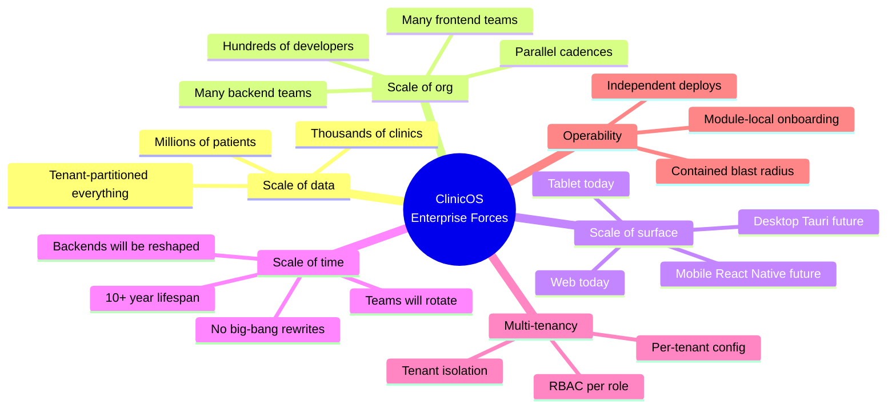

| Force                                           | What breaks a naive frontend                                            | How Phase 2 absorbs it                                                     |
| ----------------------------------------------- | ----------------------------------------------------------------------- | -------------------------------------------------------------------------- |
| **Thousands of clinics / millions of patients** | Global lists, unbounded renders, leaking one tenant's data into another | Tenant-scoped query keys (§6), virtualization (§10), pagination-by-default |
| **Hundreds of developers / many teams**         | Merge collisions, blurry ownership, "everyone edits everything"         | Modules ≈ teams, CODEOWNERS, public-API-only imports (§4–§5)               |
| **Many backend teams reshaping APIs**           | Field renames ripple into hundreds of components                        | DTO→mapper→Model→Repository→Service pipeline per module (§7)               |
| **Web + Tablet + future Mobile/Desktop**        | Logic forked per platform, drifting behavior                            | Shared Domain+Application+Infrastructure, swappable Presentation (§11)     |
| **10+ years**                                   | Framework lock-in, big-bang rewrites                                    | Boundaries via `index.ts` → micro-frontend / federation ready (§12)        |
| **Multi-tenant + RBAC**                         | Cross-tenant leakage, client-trusted permissions                        | Tenant context + permission-gated routes/UI, server-authoritative (§6)     |

> **None of these forces changes a Phase 1 law.** They change only the _physical organization_ — which is exactly the single structural evolution ratified in [README.md §0](./README.md) (ADR-0001): slices are grouped **by bounded context** under `src/modules/<context>/`.

---

## 2. The unified model — "Modular FSD + DDD + Clean Architecture"

ClinicOS uses **one** architectural idea expressed at **two** altitudes:

- **At the top level** — **Feature-Sliced Design**, evolved: slices are grouped into **modules** (bounded contexts). This gives _structure_ and _team ownership_.
- **Inside every module** — **Domain-Driven Design** for language + **Clean Architecture** for decoupling. This gives _longevity_ and _backend independence_.

A module **is** a bounded context (DDD) that is **internally** a Clean Architecture package. The same dependency rule — _downward only, public API only_ — governs both altitudes. This is the Phase 1 model from [Brain.md §5](../Brain.md), reorganized for scale, not replaced.

### 2.1 Top-level layers (the FSD spine, modularized)

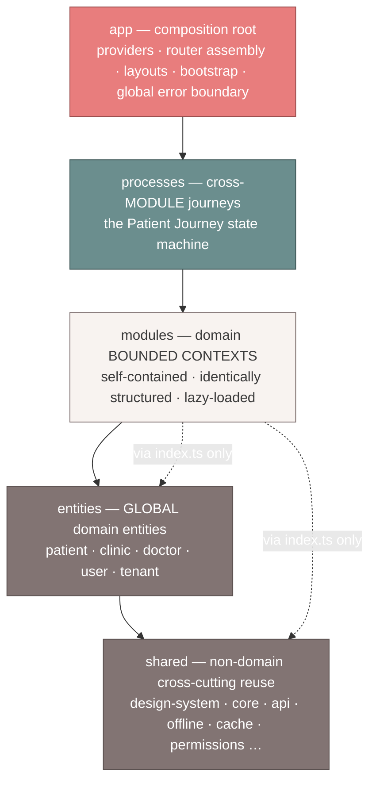

> Top-level order: `app → processes → modules → entities → shared`. Imports flow **downward only**. `shared/` and `entities/` know **nothing** about modules; `shared/` knows **nothing** about the domain. (Restated from [README.md §1](./README.md).)

### 2.2 Inside a module (the Clean Architecture rings)

Every module is a **mini Clean Architecture**. The Domain is the stable core; everything points _toward_ it (dependency inversion). Presentation never reaches Infrastructure directly — it goes through Application.

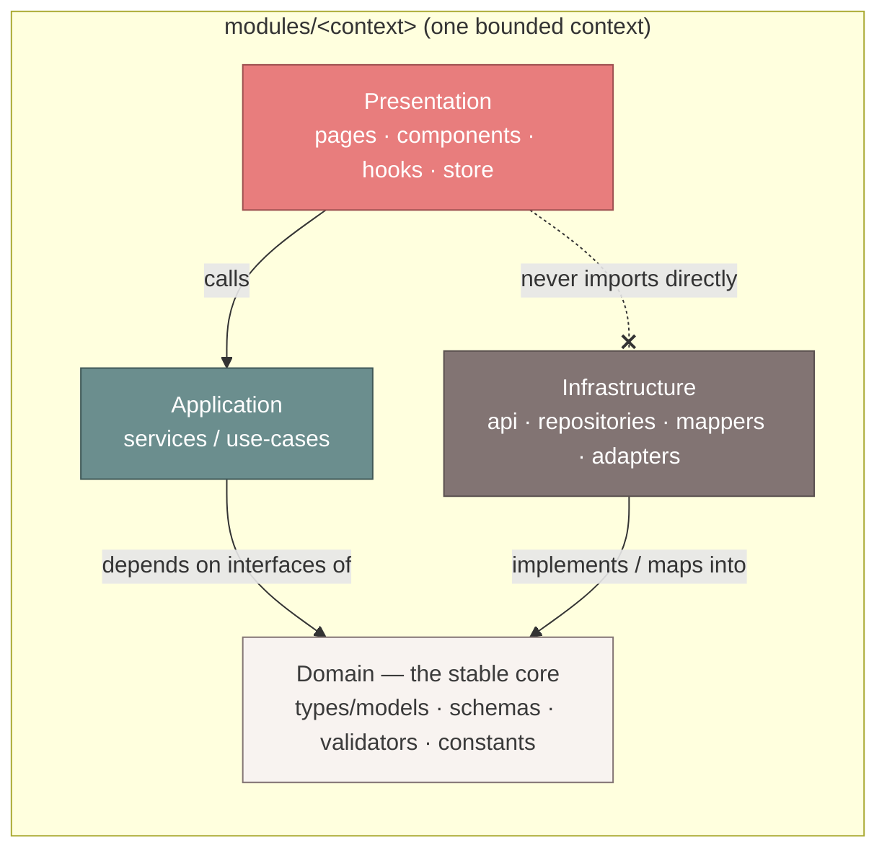

**The mapping (Clean ↔ module folders), per [README.md §2](./README.md):**

| Clean ring         | Module folders                           | Stability                          |
| ------------------ | ---------------------------------------- | ---------------------------------- |
| **Presentation**   | `pages/ components/ hooks/ store/`       | Most volatile (UI changes often)   |
| **Application**    | `services/`                              | Use-cases / business orchestration |
| **Domain**         | `types/ schemas/ validators/ constants/` | **Most stable — the core**         |
| **Infrastructure** | `api/ repositories/ mappers/ adapters/`  | Volatile (backends reshape)        |

> **Decision — One model, two altitudes.**
> **Why:** A single dependency rule that developers already know from Phase 1, now applied recursively, minimizes cognitive load at scale.
> **Benefits:** New devs learn the rule once and apply it everywhere; lint enforces it identically at both levels; the Domain core is protected from both UI churn and backend churn.
> **Trade-offs:** More folders per module than a flat feature; mitigated by an identical template (muscle memory) and generators.
> **Alternatives:** (a) Flat FSD only — blurry ownership at scale (rejected in ADR-0001). (b) Pure Clean per app (one giant onion) — no team boundaries. (c) MVC/MVVM — no backend-independence guarantee.
> **Future scalability:** Because each module is already a self-contained Clean package behind `index.ts`, it can be extracted to a library, package, or remote with zero import changes (§12).
> **Enterprise considerations:** Bounded contexts map 1:1 to team topologies (§5); the stable Domain core is where cross-team contracts live and are least likely to churn.

---

## 3. The module template (reuse from the anchor — do not invent)

Every module is **identical** in shape. This is the exact template ratified in [README.md §2](./README.md); reproduced here as the contract this narrative reasons about. The full per-folder responsibility lives in [FeatureArchitecture.md](./FeatureArchitecture.md).

```
modules/<module-name>/
├── index.ts          # PUBLIC API — the ONLY legal import surface for other modules / app / processes
├── routes.tsx        # Module route subtree (lazy-loaded)
├── permissions.ts    # Module permission definitions (RBAC)
├── README.md         # Module overview, owners, public API, dependencies
├── BRAIN.md          # Module Brain Notes (decisions, local registries, TODOs, debt)
├── pages/            # Route-level screens — composition only         (Presentation)
├── components/       # Module-local presentational components          (Presentation)
├── hooks/            # Module-local hooks                              (Presentation ⇄ Application)
├── services/         # Use-cases / business logic — orchestrate repos  (Application)
├── repositories/     # Data access: interface + impl, returns Models   (Infrastructure)
├── api/              # Endpoints + TanStack Query/mutation hooks        (Infrastructure)
├── mappers/          # DTO ⇄ Model pure mapping                         (Infrastructure→Domain)
├── adapters/         # Adapt 3rd-party / cross-module contracts         (Infrastructure)
├── types/            # Module domain Models + DTO types                 (Domain)
├── schemas/          # Zod schemas: DTO validation + form schemas       (Domain)
├── validators/       # Domain validation rules                          (Domain)
├── constants/        # Module constants                                 (Domain)
├── utils/            # Module pure utilities
├── store/            # Module-local Zustand store (UI state only)
├── config/           # Module config + feature flags
└── tests/            # Module integration tests (unit tests co-located)
```

**The canonical module set (bounded contexts), verbatim from the anchor:**

> `patients · appointments · queue · consultation · prescriptions · pharmacy · billing · follow-up · records · analytics · settings · doctor · reception · admin`

These bounded contexts are exactly the state transitions of the patient journey from [Brain.md §1](../Brain.md): _Appointment → Check-In → Vitals → Queue → Consultation → Prescription → Pharmacy → Billing → Follow-Up → Recovery → Lifetime Medical Record._

---

## 4. The two dependency rules & how both are linted

Phase 2 has **two** dependency rules — one per altitude. Both are the _same idea_ (downward-only, public-API-only) and both are **machine-enforced**. The authoritative import matrix and full lint config live in [DependencyRules.md](./DependencyRules.md); this is the narrative.

### 4.1 Top-level rule

```
app → processes → modules → entities → shared
```

- A module may import `entities/` and `shared/` — and **another module only via its `index.ts`**, never a deep path.
- Cross-module _journeys_ are orchestrated in `processes/`, not by chaining module imports.
- No circular module dependencies.

### 4.2 Intra-module rule

```
Presentation → Application → Domain ← Infrastructure
```

- Presentation (`pages/components/hooks/store`) never imports Infrastructure (`api/repositories/mappers`) directly — only through `services/` (Application) or query hooks.
- Infrastructure depends on Domain interfaces; Domain depends on **nothing**.
- This **is** the Phase 1 backend-independence pipeline ([Brain.md §5.3](../Brain.md)), localized inside the module.

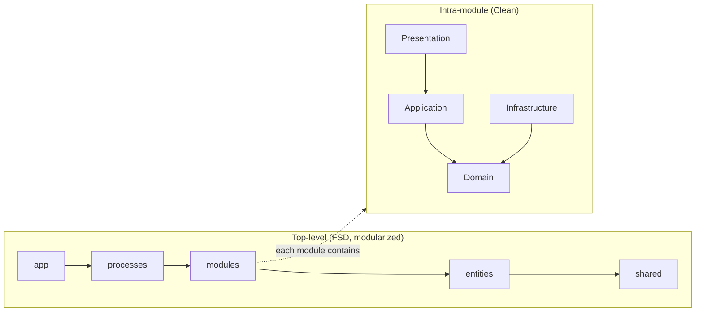

### 4.3 How both are linted (architecture as code)

| Invariant                                                            | Enforcement                                                                            |
| -------------------------------------------------------------------- | -------------------------------------------------------------------------------------- |
| Top-level layer order + module-via-index-only                        | `eslint-plugin-boundaries` (layer elements: app, processes, modules, entities, shared) |
| No deep imports past a module's `index.ts`                           | `eslint-plugin-import` `no-restricted-paths` / `boundaries/element-types`              |
| No circular dependencies (modules or files)                          | `eslint-plugin-import` `import/no-cycle`                                               |
| Intra-module ring order (Presentation ⇏ Infrastructure)              | `boundaries` sub-rules scoped to module internal folders                               |
| No server-state in Zustand, token-only styling, no hardcoded strings | custom ESLint rules + `jsx-a11y` + i18n lint (see §13)                                 |

```jsonc
// .eslintrc — illustrative shape; canonical config in DependencyRules.md
{
  "settings": {
    "boundaries/elements": [
      { "type": "app", "pattern": "src/app/*" },
      { "type": "processes", "pattern": "src/processes/*" },
      { "type": "modules", "pattern": "src/modules/*", "capture": ["module"] },
      { "type": "entities", "pattern": "src/entities/*" },
      { "type": "shared", "pattern": "src/shared/*" },
    ],
  },
  "rules": {
    "boundaries/element-types": [
      "error",
      {
        "default": "disallow",
        "rules": [
          { "from": "app", "allow": ["processes", "modules", "entities", "shared"] },
          { "from": "processes", "allow": ["modules", "entities", "shared"] },
          {
            "from": "modules",
            "allow": ["entities", "shared", ["modules", { "module": "${from.module}" }]],
          },
          { "from": "entities", "allow": ["shared"] },
          { "from": "shared", "allow": ["shared"] },
        ],
      },
    ],
    "import/no-cycle": ["error", { "maxDepth": 1 }],
    "no-restricted-imports": [
      "error",
      {
        "patterns": [
          {
            "group": ["@/modules/*/!(index)", "@/modules/*/*"],
            "message": "Import a module only via its public index.ts.",
          },
        ],
      },
    ],
  },
}
```

> **Decision — Lint the architecture, don't document-and-hope.**
> **Why:** With hundreds of devs, written rules are advisory; CI gates are law. **Benefits:** Violations fail the PR, not a review months later; the dependency graph stays acyclic by construction. **Trade-offs:** Up-front config + the occasional escape hatch; mitigated by a documented exception process in [DependencyRules.md](./DependencyRules.md). **Alternatives:** Manual review (doesn't scale), Nx tags (heavier — future option). **Future scalability:** The same boundary tags become Module-Federation remote boundaries unchanged (§12). **Enterprise considerations:** A green build is the shared contract across all teams.

---

## 5. Module ownership & team topology (one module ≈ one team)

Bounded contexts are not just a code shape — they are the **org chart**. The boundary that the compiler enforces is the boundary the team owns.

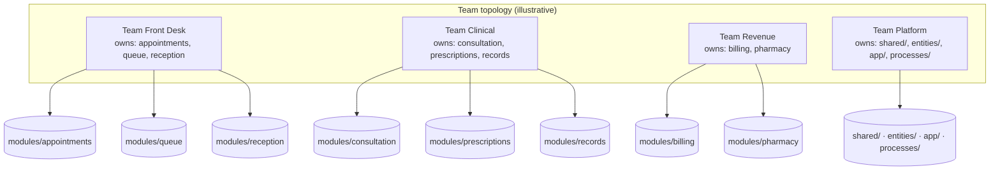

```
# CODEOWNERS — the boundary is the ownership (illustrative)
/src/modules/appointments/   @clinicos/team-front-desk
/src/modules/queue/          @clinicos/team-front-desk
/src/modules/reception/      @clinicos/team-front-desk
/src/modules/consultation/   @clinicos/team-clinical
/src/modules/prescriptions/  @clinicos/team-clinical
/src/modules/records/        @clinicos/team-clinical
/src/modules/billing/        @clinicos/team-revenue
/src/modules/pharmacy/       @clinicos/team-revenue
/src/shared/                 @clinicos/team-platform
/src/entities/               @clinicos/team-platform
/src/app/                    @clinicos/team-platform
/src/processes/              @clinicos/team-platform
```

**How this scales to hundreds of devs:**

- **Module-local onboarding.** A new dev learns _one_ module (its `README.md` + `BRAIN.md`) and the universal template — not the whole monolith.
- **Contained blast radius.** Because cross-module access is only via `index.ts`, a change inside a module cannot silently break another team. The public surface is small and reviewed.
- **Independent cadence.** Lazy-loaded module routes (`routes.tsx`) + module bundles mean teams ship on their own schedule; a deploy touching `billing` doesn't rebuild `consultation`'s contract.
- **Cross-cutting goes to Platform.** `shared/` and `entities/` are owned by a platform team and changed via RFC, because they are everyone's dependency.

> **Decision — One module ≈ one team via CODEOWNERS.**
> **Why:** Conway's Law in our favor — make the code boundaries match the team boundaries so communication overhead drops. **Benefits:** Parallel work without collisions; clear accountability; reviewers are domain experts. **Trade-offs:** Shared/entities can become a bottleneck; mitigated by a platform team + RFC process + reuse-first rule. **Alternatives:** Collective ownership (no accountability at scale), per-file owners (unmanageable). **Future scalability:** Teams can graduate a module to its own repo/remote without changing consumers (§12). **Enterprise considerations:** Maps to independent release trains, on-call rotations, and audit ownership.

> Full ownership, barrel, and module-communication rules: [ProjectStructure.md](./ProjectStructure.md). Live owner registry: [PROJECT_BRAIN.md](../brain/PROJECT_BRAIN.md).

---

## 6. Multi-tenancy & RBAC at the frontend

ClinicOS is multi-tenant: thousands of clinics (tenants), each with isolated data and per-role permissions. The frontend is **not** the security boundary — the backend is — but the frontend must **never leak across tenants** and must **gate UI by permission** for correctness and UX.

### 6.1 Tenant context & tenant-scoped everything

The active tenant (clinic) lives in a **global UI store** (`shared/store`, per [Brain.md §9](../Brain.md): active clinic is Zustand-owned session state). Every server-state query is **keyed by tenant**, so caches can never collide across clinics.

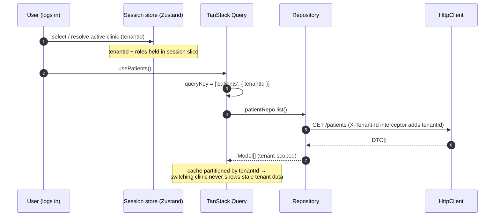

```typescript
// shared/store/session.store.ts — tenant context (UI/session state, NOT server data)
interface SessionState {
  tenantId: string | null; // active clinic
  roles: Role[]; // resolved from server on login
  permissions: Permission[]; // flattened, server-authoritative
  switchTenant: (id: string) => void;
}

// Every query key is tenant-scoped → cache isolation by construction.
export const patientKeys = {
  all: (tenantId: string) => ['patients', { tenantId }] as const,
  detail: (tenantId: string, id: string) => ['patients', { tenantId }, id] as const,
};

// shared/api/interceptors.ts — tenant header added at the HttpClient boundary, once.
httpClient.useRequestInterceptor((req) => {
  const { tenantId } = sessionStore.getState();
  if (tenantId) req.headers.set('X-Tenant-Id', tenantId);
  return req;
});
```

**Isolation guarantees:**

- **Cache isolation:** `tenantId` is part of every query key → no cross-tenant cache bleed; switching clinic invalidates/segregates automatically.
- **Request isolation:** the tenant header is injected once at the `HttpClient` boundary, never hand-written in modules.
- **Storage isolation:** persisted query cache + outbox (§8) are namespaced by `tenantId` so offline data is partitioned too.

### 6.2 RBAC — permission-gated routes & UI

Permissions are **resolved on the server** and merely **reflected** on the client. The client gates for UX and to avoid dead-ends; the server remains the authority (defense in depth).

```typescript
// shared/permissions — declarative gate (also available as <Can> component + useCan hook)
export function useCan(permission: Permission): boolean {
  return useSessionStore((s) => s.permissions.includes(permission));
}

// Route-level gate (composed in app/ router, fed by module permissions.ts)
const guardedRoute = {
  path: 'billing',
  lazy: () => import('@/modules/billing').then((m) => m.routes), // module-level lazy
  loader: requirePermission('billing:view'),                    // redirects if not allowed
};

// UI-level gate inside a module page (Presentation)
<Can permission="billing:refund" fallback={null}>
  <RefundButton />
</Can>
```

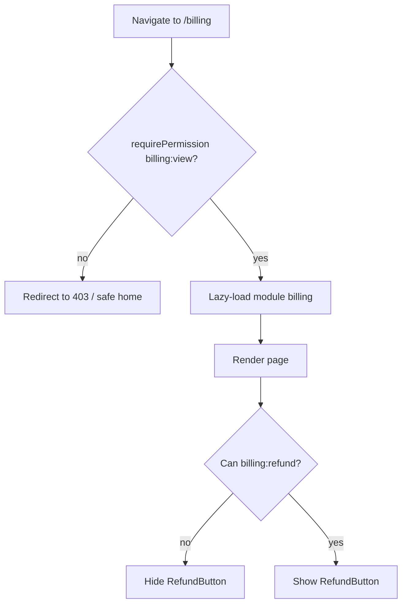

> **Decision — Frontend RBAC is reflective, never authoritative; tenant is part of every query key.**
> **Why:** Correctness + UX (no dead-ends) without trusting the client for security. **Benefits:** Zero cross-tenant cache leaks by construction; permission-driven UI is declarative and testable; works offline (last-known permissions). **Trade-offs:** Permissions must be refetched on role change / tenant switch; mitigated by invalidating on `switchTenant`. **Alternatives:** Client-trusted permissions (insecure), per-tenant subdomains/apps (operationally heavy — possible future for the largest tenants). **Future scalability:** Tenant-scoped keys + namespaced storage extend unchanged to millions of patients and offline (§8). **Enterprise considerations:** Audit/compliance — every read is tenant-tagged; RBAC catalog is a registry in [PROJECT_BRAIN.md](../brain/PROJECT_BRAIN.md), module permissions declared in each module's `permissions.ts`.

> Deeper Phase-1 treatment of multi-tenancy & RBAC: [Phase 1 Architecture.md §13](../Architecture.md).

---

## 7. Backend-independence pipeline at scale

This is **Product Law #6 and #7** ([Brain.md §2](../Brain.md)): _the UI never talks to the backend directly; the frontend is backend-independent._ At enterprise scale, **many backend teams** evolve their APIs on their own schedules. The frontend survives because **every module hides its backend behind the same pipeline** — so an API reshape is a **one-mapper edit**, never a component rewrite.


**Worked example — the `appointments` module** (Infrastructure → Domain → Application → Presentation):

```typescript
// modules/appointments/types/appointment.types.ts        (Domain — the stable Model)
export interface Appointment {
  id: string;
  patientId: string;
  clinicId: string; // tenant-scoped
  startsAt: Date;
  status: 'booked' | 'checked_in' | 'completed' | 'cancelled';
}

// modules/appointments/schemas/appointment.dto.ts         (Domain/Infra boundary — backend shape)
export const AppointmentDtoSchema = z.object({
  appointment_id: z.string(),
  patient_id: z.string(),
  clinic_id: z.string(),
  starts_at: z.string(), // ISO string from backend
  appt_status: z.enum(['BOOKED', 'CHECKED_IN', 'DONE', 'CANCELLED']),
});
export type AppointmentDto = z.infer<typeof AppointmentDtoSchema>;

// modules/appointments/mappers/appointment.mapper.ts      (Infrastructure → Domain — the ONLY place that knows both shapes)
export const toAppointment = (dto: AppointmentDto): Appointment => ({
  id: dto.appointment_id,
  patientId: dto.patient_id,
  clinicId: dto.clinic_id,
  startsAt: new Date(dto.starts_at),
  status: STATUS_MAP[dto.appt_status], // 'BOOKED' → 'booked', etc.
});

// modules/appointments/repositories/appointment.repository.ts   (Infrastructure — returns Models, never DTOs)
export interface AppointmentRepository {
  list(clinicId: string): Promise<Appointment[]>;
}
export class HttpAppointmentRepository implements AppointmentRepository {
  constructor(private http: HttpClient) {}
  async list(clinicId: string): Promise<Appointment[]> {
    const raw = await this.http.get(`/clinics/${clinicId}/appointments`);
    return AppointmentDtoSchema.array().parse(raw).map(toAppointment); // validate + map at boundary
  }
}

// modules/appointments/services/appointment.service.ts    (Application — use-cases, framework-agnostic)
export class AppointmentService {
  constructor(private repo: AppointmentRepository) {}
  getTodaySchedule(clinicId: string): Promise<Appointment[]> {
    return this.repo.list(clinicId); // business rules orchestrate the repo
  }
}

// modules/appointments/api/useAppointments.ts             (Infrastructure — Query hook bridging to Presentation)
export const useAppointments = (clinicId: string) =>
  useQuery({
    queryKey: appointmentKeys.list(clinicId),
    queryFn: () => appointmentService.getTodaySchedule(clinicId),
  });

// modules/appointments/index.ts                           (PUBLIC API — the only legal import surface)
export { useAppointments } from './api/useAppointments';
export type { Appointment } from './types/appointment.types';
export { routes } from './routes';
```

**The payoff at scale.** Backend renames `appt_status` → `status_code`, or splits the endpoint per team? **One mapper + one DTO schema change.** Zero component edits, zero changes in any _other_ module — because everyone imports `appointments` only through its `index.ts` and only ever sees `Appointment` (the Model). That is "10 years without a rewrite," now multiplied across dozens of modules and many backend teams.

> **Decision — The pipeline is non-negotiable and lives inside every module.**
> **Why:** It localizes the single highest-churn risk (backend shape) to one pure function. **Benefits:** Many backend teams move independently; Zod validation catches contract drift at the boundary; the Domain Model is the cross-team contract. **Trade-offs:** Boilerplate per entity; mitigated by generators and a shared base repository (`shared/api`). **Alternatives:** Calling `fetch` in components (couples UI to backend), GraphQL codegen only (still needs a Model boundary for stability). **Future scalability:** Swap REST→gRPC-web→GraphQL by changing repositories/api only. **Enterprise considerations:** MSW mocks the DTO contract so frontend teams are unblocked before any backend ships.

> Phase-1 full pipeline + DI/composition detail: [Phase 1 Architecture.md §8–§9](../Architecture.md), [Brain.md §5.3](../Brain.md).

---

## 8. State architecture at scale (server cache · UI slices · URL · offline)

Phase 1's state law ([Brain.md §9](../Brain.md)) is unchanged: **data lives in exactly one home.** At scale this becomes the line that prevents the classic enterprise disease — server data copied into a dozen stores, drifting out of sync.

| Data kind                                                  | Home                                 | Rule at scale                                                                     |
| ---------------------------------------------------------- | ------------------------------------ | --------------------------------------------------------------------------------- |
| Server data (patients, appointments…)                      | **TanStack Query**                   | The _only_ server-state cache; tenant-scoped keys (§6); never copied into Zustand |
| Global UI/session (theme, locale, **active clinic**, auth) | **Zustand** (sliced, `shared/store`) | Small, selector-based; holds `tenantId` + permissions                             |
| Module-local UI (wizard step, panel open)                  | **Module `store/`** (Zustand)        | UI state only — never server data                                                 |
| Form state                                                 | **React Hook Form**                  | Local to the form                                                                 |
| URL state (filters, tabs, pagination)                      | **Router search params**             | Shareable, restorable — the source of truth for list views                        |
| Ephemeral                                                  | `useState`/`useReducer`              | Keep it local                                                                     |

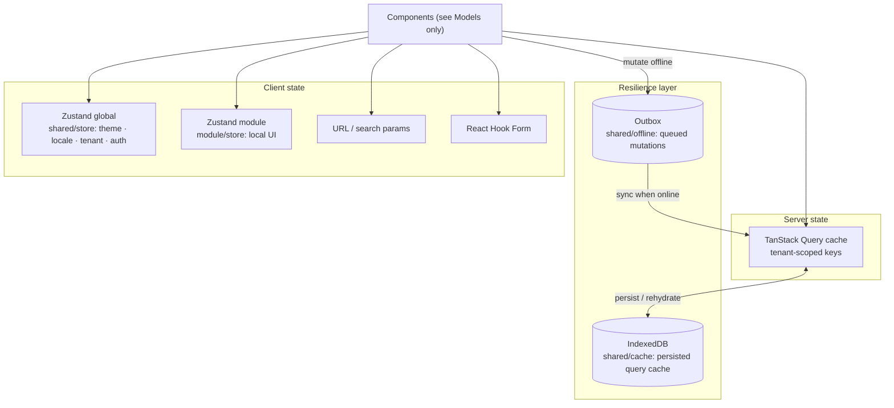

**The cache / offline / outbox layer** (Phase 1 §10, now formalized into `shared/cache` + `shared/offline`):

- **Read offline** — `shared/cache` persists the Query cache to IndexedDB (namespaced by `tenantId`) → last-known data when offline.
- **Write offline** — `shared/offline` implements the **Outbox**: mutations queue locally, sync when online, with a conflict policy; UI shows explicit sync status (never silent data loss).
- **Shell** — Workbox service worker caches the app shell (installable PWA).

> **Decision — One source of truth per data kind; resilience is a shared layer, not per-module.**
> **Why:** Eliminates state drift and prevents every module reinventing offline. **Benefits:** Consistent cache/sync semantics app-wide; modules stay thin; tenant-namespaced persistence. **Trade-offs:** Centralized cache/offline is a platform-team responsibility (bottleneck risk) — accepted, since correctness > local autonomy here. **Alternatives:** Redux global store (boilerplate + tempts server-state caching), per-module offline (inconsistent). **Future scalability:** Outbox + persisted cache extend to millions of records via pagination + LRU eviction. **Enterprise considerations:** Offline + tenant-namespacing are compliance-relevant; both are auditable in one place.

> Full state-flow and offline diagrams: [Diagrams.md](./Diagrams.md). Phase-1 offline narrative: [Phase 1 Architecture.md §14](../Architecture.md).

---

## 9. The three core flows (narratives — full diagrams in Diagrams.md)

The complete sequence diagrams for all three flows live in [Diagrams.md](./Diagrams.md). Here are the concise narratives.

### 9.1 Request / API flow

A component calls a **module's public Query hook** → the hook calls a **Service** → the Service calls a **Repository interface** → the impl calls `HttpClient` → interceptors add **auth + tenant** headers → response is **Zod-validated (DTO)** → **mapped to a Model** → cached under a **tenant-scoped key** → returned to the component as a Model. Components never see DTOs, URLs, or fetch.

### 9.2 Authentication / session flow

On login, the server returns a session + **resolved roles/permissions** + the user's clinics. The **session slice** (`shared/store`) holds `tenantId`, `roles`, `permissions`. An `HttpClient` interceptor attaches the auth token and `X-Tenant-Id`; on 401 it triggers refresh-or-logout. Switching clinic updates `tenantId` and **invalidates tenant-scoped queries** so no stale-tenant data shows. Permissions gate routes (loaders) and UI (`<Can>`), per §6.

### 9.3 Rendering flow (CSR + code-split; SSR-ready)

ClinicOS ships **CSR by default** (a token-driven SPA), **architected to be SSR-ready** but not SSR-coupled. Rendering is aggressively **code-split**:

- **Route-level lazy:** each route loads its page chunk on demand.
- **Module-level lazy:** each module exposes a lazy `routes.tsx`; entering a bounded context loads that module's bundle only.
- **Suspense + 4 async states:** every async surface declares Loading (skeletons) / Empty / Error / Success ([Brain.md §11](../Brain.md)); Suspense boundaries wrap lazy chunks and data.

> **Decision — CSR + code-split now, SSR-ready not SSR-required.**
> **Why:** ClinicOS is an authenticated app behind login (SEO irrelevant); CSR keeps ops simple and offline-PWA natural. **Benefits:** Simple deploy (static + CDN), great offline story, per-module bundles. **Trade-offs:** First paint needs a shell + skeletons (mitigated by app-shell caching). **Alternatives:** SSR/RSC (operational weight, awkward with offline-first) — kept open because the Domain/Application/Infra layers are render-agnostic. **Future scalability:** Move the Presentation layer to an SSR/RSC host without touching Domain/Application/Infrastructure. **Enterprise considerations:** Static hosting + CDN/edge scales to thousands of clinics cheaply (§10).

---

## 10. Performance & scalability architecture

Millions of patients and thousands of clinics make performance an **architectural** concern, not a late optimization.

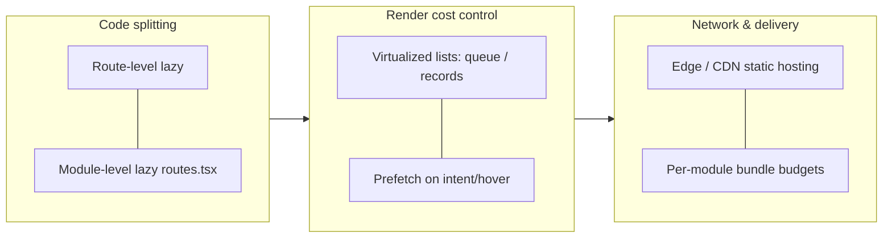

| Technique                     | Where                           | Why it matters at scale                                     |
| ----------------------------- | ------------------------------- | ----------------------------------------------------------- |
| **Code-splitting by module**  | each module's `routes.tsx` lazy | A clinic using only reception never downloads pharmacy code |
| **Route-level lazy**          | `app/` router                   | First load is just the shell + landing route                |
| **Virtualization**            | `queue`, `records`, big lists   | Render only visible rows of million-row datasets            |
| **Bundle budgets per module** | CI size-limit per module chunk  | A team's regression can't bloat everyone's load             |
| **Prefetching**               | on hover/intent + route loaders | Perceived-instant navigation across the patient journey     |
| **Edge / CDN**                | static SPA assets + app shell   | Latency parity across geographies; cheap horizontal scale   |

> **Decision — Performance budgets are per-module and CI-enforced.**
> **Why:** Without a budget, bundles only grow; per-module budgets pin the cost to the owning team. **Benefits:** Localized accountability; one team's bloat can't tax others; lazy modules keep the critical path tiny. **Trade-offs:** Occasional budget negotiation; mitigated by shared design-system reuse. **Alternatives:** Single global bundle (couples everyone), no budgets (entropy wins). **Future scalability:** Per-module budgets become per-remote budgets under Module Federation (§12). **Enterprise considerations:** Web-Vitals tracked per route via the monitoring port; budgets gate the PR.

---

## 11. Platform-reach architecture (Web · Tablet · future Mobile · Desktop)

The most valuable enterprise property: **business logic is written once and reused across every surface.** Only the **Presentation** ring is platform-specific.

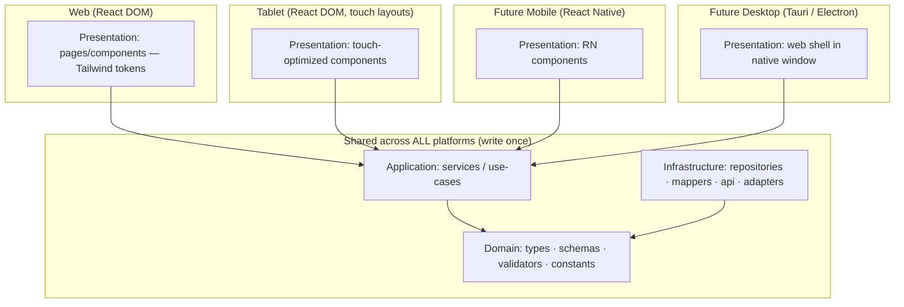

| Layer                                             | Shared or platform-specific?                                                                  |
| ------------------------------------------------- | --------------------------------------------------------------------------------------------- |
| **Domain** (`types/schemas/validators/constants`) | **Shared** — identical everywhere                                                             |
| **Application** (`services`)                      | **Shared** — framework-agnostic                                                               |
| **Infrastructure** (`repositories/mappers/api`)   | **Shared** — only `HttpClient`/storage _adapters_ swap per platform                           |
| **Presentation** (`pages/components`)             | **Platform-specific** — React DOM (Web/Tablet), React Native (Mobile), native shell (Desktop) |

> **Decision — Share Domain+Application+Infrastructure; fork only Presentation.**
> **Why:** Business rules and the backend pipeline must behave identically on every surface; only the rendering differs. **Benefits:** A bug fixed in a service is fixed everywhere; new platforms reuse ~70% of the module; consistent behavior builds trust ([Brain.md §3](../Brain.md)). **Trade-offs:** Presentation must stay strictly free of business logic; enforced by the intra-module rule (§4). **Alternatives:** Separate apps per platform (logic drifts), fully cross-platform UI like RN-Web (compromises web quality). **Future scalability:** Adding React Native = add a Presentation ring + storage adapter; Domain/Application/Infra untouched. **Enterprise considerations:** One team can own a module's logic while platform teams own each surface's Presentation.

> Phase-1 platform-reach treatment: [Phase 1 Architecture.md §16](../Architecture.md).

---

## 12. Evolution path — modular monolith → micro-frontends / federation / Nx

ClinicOS ships today as a **modular monolith**: one deployable, many internally-isolated modules. This is the right default — operational simplicity with strong boundaries. Crucially, **the boundaries already exist**, so future extraction is mechanical, not a rewrite.

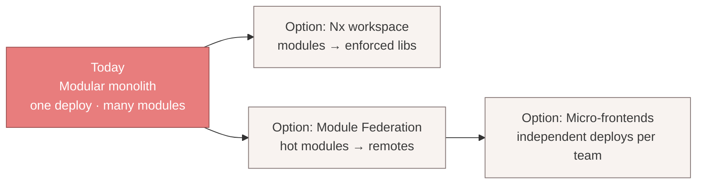

**Why extraction is cheap here:** every cross-module access already flows through `index.ts` (the public API). A module is already a self-contained Clean package. So:

| Future option              | What it buys                                          | Trade-off                              | Trigger to adopt                                   |
| -------------------------- | ----------------------------------------------------- | -------------------------------------- | -------------------------------------------------- |
| **Nx (or Turborepo) libs** | Enforced project graph, affected-builds, caching      | Heavier tooling/config                 | Build times hurt; need affected-only CI            |
| **Module Federation**      | Independent runtime loading of hot modules as remotes | Runtime version skew, shared-deps care | A team needs to deploy a module on its own cadence |
| **Full micro-frontends**   | Fully independent deploys/repos per team              | Cross-cutting consistency + ops cost   | Org outgrows one release train                     |

> **Decision — Modular monolith now; federation/micro-frontends as enabled-but-deferred options.**
> **Why:** Avoid premature distributed-systems cost while keeping every escape hatch open. **Benefits:** Simple ops today; zero-rewrite path tomorrow because boundaries are already real and linted. **Trade-offs:** A monolith CI builds everything (mitigated by per-module budgets §10, and later Nx affected-builds). **Alternatives:** Micro-frontends from day one (premature, per ADR-0001), big-ball-of-mud monolith (no extraction path). **Future scalability:** `boundaries` tags → Nx tags → federation remotes with no import changes. **Enterprise considerations:** The decision can be made _per module_ and _per team_, incrementally — never a big bang.

> The structural ADR that enables this: [README.md §0 (ADR-0001)](./README.md).

---

## 13. Architectural fitness functions (the invariants we lint & test)

Fitness functions are the **executable conscience** of the architecture — automated checks that fail the build when an invariant is violated. They turn the Phase 1 laws and Phase 2 rules into CI gates so that, with hundreds of contributors, the architecture **cannot silently rot**.

| #   | Invariant (from the laws)                                       | How it's enforced                                         | Authority                                      |
| --- | --------------------------------------------------------------- | --------------------------------------------------------- | ---------------------------------------------- |
| 1   | **No cross-module deep imports** (only via `index.ts`)          | `eslint-plugin-boundaries` + `no-restricted-imports`      | [DependencyRules.md](./DependencyRules.md), §4 |
| 2   | **No dependency cycles** (modules or files)                     | `import/no-cycle`                                         | [DependencyRules.md](./DependencyRules.md)     |
| 3   | **Top-level + intra-module layer order** respected              | `boundaries/element-types` (both altitudes)               | §4                                             |
| 4   | **No server-state in Zustand**                                  | custom ESLint rule (ban Query data in stores) + review    | [Brain.md §9](../Brain.md)                     |
| 5   | **Token-only styling** (no hardcoded color/size/space)          | Tailwind theme bound to tokens + stylelint/custom rule    | [Brain.md §6](../Brain.md)                     |
| 6   | **No hardcoded human strings** (i18n keys only)                 | i18n ESLint rule + `jsx-a11y`                             | [Brain.md §8](../Brain.md)                     |
| 7   | **Backend hidden behind the pipeline** (no `fetch`/axios in UI) | `no-restricted-imports` (ban http clients outside `api/`) | §7, [Brain.md §5.3](../Brain.md)               |
| 8   | **WCAG 2.2 AA**                                                 | `jest-axe` / Playwright-axe CI gate                       | [Brain.md §7](../Brain.md)                     |
| 9   | **Tenant-scoped query keys**                                    | review + custom lint on `queryKey` shape                  | §6                                             |
| 10  | **Per-module bundle budget**                                    | `size-limit` per module chunk in CI                       | §10                                            |

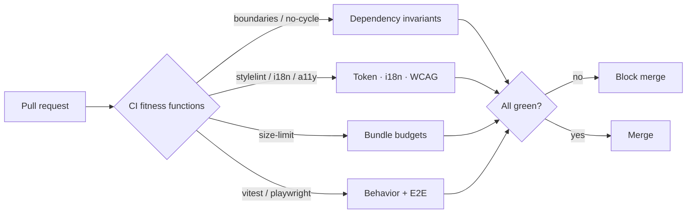

> **Decision — Architecture is verified, not just described.**
> **Why:** At hundreds of devs, documentation is advisory but a red build is law; invariants must be executable. **Benefits:** The architecture is self-defending; new contributors get instant, precise feedback; rot is caught at the PR, not in an audit. **Trade-offs:** Some false positives + maintenance of custom rules; mitigated by a documented exception/escape-hatch process. **Alternatives:** Manual review only (doesn't scale, inconsistent), runtime assertions only (too late). **Future scalability:** New invariants are added as new fitness functions without touching product code. **Enterprise considerations:** Fitness functions are the shared contract across all teams and the gate that keeps a 10-year codebase honest.

---

## 13.5 Theme Engine (Phase 5 — the runtime theming system)

The **Theme Engine** (`src/shared/theme/`) is the runtime that drives the design system's token
theming. The design system ([design-system/Theme.md](../design-system/Theme.md)) defines _what_ the
tokens are and how one `<html>` attribute re-skins the app; the engine is the TypeScript side that
turns user preferences and clinic brands into those attributes — a **manager** (single source of truth)
plus a registry, loader, validator, generator, storage, hooks, utilities, and an injectable
clinic-branding **port**.

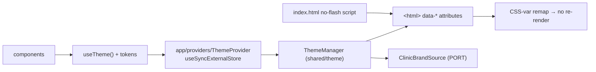

Key properties, consistent with this narrative's laws:

- **It lives in `shared/`** → imports only `shared/*`, never a module/entity/process (§4). It is
  UI/session state, never server data (§8) — preferences persist in `localStorage`, not Zustand or
  Query.
- **Backend-independent branding** (§7): a clinic re-skins ClinicOS by supplying a `ClinicBrand` object
  through the `ClinicBrandSource` **port** — no source change, no redeploy; the brand is validated
  (zod + WCAG contrast) and its ramp generated at runtime.
- **Performance** (§9–§10): a pre-paint no-flash script kills the flash of incorrect theme; theme
  changes are attribute/CSS-var swaps (no component re-render); `useSyncExternalStore` reads a **stable
  snapshot** for minimal re-renders; brands load lazily; every DOM touch is SSR-guarded.
- **A11y + i18n**: high-contrast / large-text / reduced-motion / density compose as orthogonal
  attributes; `dir` (LTR/RTL) stays **i18n-owned** and is only mirrored.

> **Full documentation:** [docs/theme-engine/](../theme-engine/README.md) — engine overview, deep
> architecture + decision contracts, folder structure, types, utilities, clinic branding,
> accessibility, and the developer guide. **AI rule:** consume the theme via `useTheme()`/tokens; never
> bypass `ThemeProvider` or hardcode colors ([AI_RULES.md](./AI_RULES.md)).

---

## 14. How it all holds together (the one-paragraph spine)

At the top, **FSD** gives structure and team ownership (modules as bounded contexts). Inside each module, **DDD + Clean Architecture** give language and longevity (Presentation→Application→Domain←Infrastructure). **One dependency rule** — downward-only, public-API-only — governs both altitudes and is **linted**. **Tenancy** is a query-key + interceptor concern; **RBAC** gates routes and UI but trusts the server. The **backend-independence pipeline** lives in every module, so many backend teams can reshape APIs with one-mapper edits. **State** has exactly one home per kind, with a shared cache/offline/outbox layer. **Performance** is budgeted per module and split per route/module. **Platform reach** shares Domain+Application+Infrastructure and forks only Presentation. And because every boundary already runs through `index.ts`, the **modular monolith can evolve** into federation or micro-frontends with no rewrite. The Phase 1 laws are not merely preserved — at scale, they are what make scale survivable.

---

> **Cross-links:** [Brain.md](../Brain.md) · [PROJECT_BRAIN.md](../brain/PROJECT_BRAIN.md) · Phase 1 deep reference [../Architecture.md](../Architecture.md) · full diagram set [Diagrams.md](./Diagrams.md) · import rules [DependencyRules.md](./DependencyRules.md) · folders [FolderStructure.md](./FolderStructure.md) · module template [FeatureArchitecture.md](./FeatureArchitecture.md) · naming [NamingConvention.md](./NamingConvention.md).

_Phase 2 · Part 7 · Enterprise Architecture Narrative · Foundation v2 · 2026-06-27 · Owner: Frontend Architecture._
_Every decision herein carries the Decision Contract (Why · Benefits · Trade-offs · Alternatives · Future scalability · Enterprise considerations) per [Brain.md §14](../Brain.md)._
