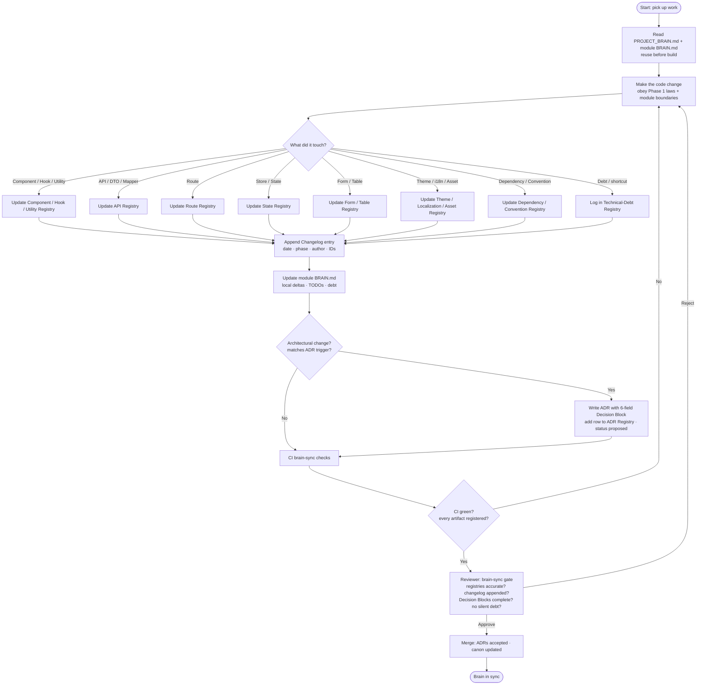

# 🧠 ClinicOS — BrainRules.md (The Living-Memory Protocol)

> **Phase 2 of the ClinicOS Frontend Engineering Bible.**
> This document defines **how the permanent project memory — [PROJECT_BRAIN.md](../brain/PROJECT_BRAIN.md) — and its registries are kept alive, accurate, and in sync.**
> It **extends** [Phase 1](../Brain.md) and **never contradicts** it. Every Phase 1 law (the 8 Non-Negotiable Laws, the Dependency Rule, the backend-independence pipeline, tokens, a11y, i18n) and the **6-field Decision Contract** ([Brain.md](../Brain.md) §14, [Documentation-Guidelines.md](../Documentation-Guidelines.md) §4) are preserved here verbatim in spirit.

**Read order:** [Brain.md](../Brain.md) (Phase 1 constitution) → [Documentation-Guidelines.md](../Documentation-Guidelines.md) (how we document) → [architecture/README.md](./README.md) (Phase 2 anchor) → **this file** → [AI_RULES.md](./AI_RULES.md).

---

## 1. Purpose & Philosophy

### 1.1 Purpose

This document is the **operating manual for the project's memory**. It defines:

- What the **permanent project memory** is, where it lives, and what it must contain.
- The **Brain hierarchy** — `PROJECT_BRAIN.md` (global) → module `BRAIN.md` notes → ADRs → Changelog.
- The **registries** — their schemas, triggers, owners, and example rows.
- The **Brain Update Flow** — the exact protocol for keeping memory in sync during every change.
- The **update rules** (append-only changelog, canonical sorting, supersede-don't-delete, foundation versioning).
- The **"brain sync" review gate** that blocks merges with stale memory.
- **How AI agents** read and write the brain (cross-linked to [AI_RULES.md](./AI_RULES.md)).
- The **templates** every contributor copies.

### 1.2 Philosophy — the brain is permanent memory, and stale memory is worse than none

ClinicOS is architected for **10+ years without a rewrite** ([Brain.md](../Brain.md) §1) at the scale of **thousands of clinics, hundreds of developers, and many teams** ([architecture/README.md](./README.md)). Over that horizon, the people and AI agents acting on this codebase will not be its authors. The **project memory is the mechanism that lets correct intent and current truth survive the author.**

Four governing principles:

1. **PROJECT_BRAIN is the project's permanent memory.** It is the single, exhaustive, always-current record of _what exists_ (every component, hook, API, route, store, decision) and _why_. If something is built and not in the brain, for all practical purposes it does not exist — the next developer and the next AI agent cannot find it, will rebuild it, and will drift.
2. **An accurate brain is the most valuable asset; an inaccurate brain is worse than nothing.** A stale registry actively _lies_: it sends a developer to a component that was deleted, an AI agent to an API that changed shape, a reviewer to a decision that was superseded. A blank slate makes you search; a wrong brain makes you confidently wrong. **Therefore: every change keeps the brain in sync, in the same PR, or the change is not done.**
3. **Memory is updated as part of the work, never after it.** Updating the brain is a Definition-of-Done gate ([Project-Checklist.md](../Project-Checklist.md), [Documentation-Guidelines.md](../Documentation-Guidelines.md) §10.1), not a cleanup task for "later." Later never comes.
4. **Simplicity beats cleverness** ([Brain.md](../Brain.md) §2, law 8). The brain is plain Markdown + Mermaid tables in `git`. No database, no external tool, no separate access surface. It is diffed, reviewed, and bisected like code (docs-as-code, [Documentation-Guidelines.md](../Documentation-Guidelines.md) §13).

### 1.3 Brain.md vs PROJECT_BRAIN.md — constitution vs living memory

These are two different documents with two different jobs. **Do not confuse them, and never let one drift from the other.**

|                   | **[Brain.md](../Brain.md) (Phase 1)**                                              | **[PROJECT_BRAIN.md](../brain/PROJECT_BRAIN.md) (Phase 2)**                                      |
| ----------------- | ---------------------------------------------------------------------------------- | ------------------------------------------------------------------------------------------------ |
| **Role**          | The **constitution** — concise, stable source of truth                             | The **living memory** — exhaustive, continuously updated                                         |
| **Content**       | The 8 laws, the layers, the pipeline, tokens, a11y, i18n, the canon index          | Every registry (components, hooks, APIs, routes, …), the changelog, the live state of the system |
| **Changes**       | Rarely; a change is an **ADR** + a foundation version bump                         | Constantly; every feature PR touches it                                                          |
| **Half-life**     | Years                                                                              | Continuous                                                                                       |
| **Size**          | Small by design (a junior reads it in one sitting)                                 | Large by design (it indexes everything that exists)                                              |
| **Conflict rule** | **Brain.md wins.** If PROJECT_BRAIN contradicts Brain.md, PROJECT_BRAIN is the bug | —                                                                                                |
| **Analogy**       | The country's constitution                                                         | The country's live census + land registry                                                        |

> **Rule:** Brain.md states the **laws that do not change**. PROJECT_BRAIN states the **facts that change every day**. A new law is ratified via ADR and lands in Brain.md (Phase 1) and/or the Phase 2 canon; a new fact (a component was added) lands in PROJECT_BRAIN's registries. Neither file may silently contradict the other — see the conflict-resolution order in [Documentation-Guidelines.md](../Documentation-Guidelines.md) §2.

---

## 2. The Brain Hierarchy

Project memory is **layered**, mirroring the layered architecture ([Brain.md](../Brain.md) §5) and the documentation hierarchy ([Documentation-Guidelines.md](../Documentation-Guidelines.md) §2). Each layer has a narrower scope and a different half-life. **Higher layers win conflicts.**

```
┌──────────────────────────────────────────────────────────────────────┐
│  Brain.md (Phase 1 constitution)        LAWS — wins all conflicts      │  ← changes via ADR only
├──────────────────────────────────────────────────────────────────────┤
│  PROJECT_BRAIN.md (global living memory) GLOBAL FACTS + ALL REGISTRIES │  ← updated every feature PR
│    • Vision & standards (mirror of laws, links to Brain.md)            │
│    • The 15 registries (§3)                                            │
│    • The append-only Changelog (§5)                                    │
├──────────────────────────────────────────────────────────────────────┤
│  modules/<m>/BRAIN.md (per-module notes)  MODULE-LOCAL FACTS           │  ← updated with module changes
│    • Local decisions, local registry deltas, TODOs, module debt       │
├──────────────────────────────────────────────────────────────────────┤
│  docs/adr/NNNN-*.md (ADRs)               POINT-IN-TIME DECISIONS (why) │  ← immutable, append-only
├──────────────────────────────────────────────────────────────────────┤
│  Changelog (inside PROJECT_BRAIN.md)     APPEND-ONLY HISTORY (when/who)│  ← never edited, only appended
└──────────────────────────────────────────────────────────────────────┘
```

### 2.1 What belongs in each layer

| Layer                                                      | Owns (what belongs here)                                                                                                                                                                                                                                                                | Does **not** own                                                                  |
| ---------------------------------------------------------- | --------------------------------------------------------------------------------------------------------------------------------------------------------------------------------------------------------------------------------------------------------------------------------------- | --------------------------------------------------------------------------------- |
| **[Brain.md](../Brain.md)** (Phase 1)                      | The 8 laws, layer set, dependency rule, pipeline, token tiers, a11y/i18n baselines, the canon index. Stable laws only.                                                                                                                                                                  | Lists of what currently exists (those are facts → PROJECT_BRAIN).                 |
| **[PROJECT_BRAIN.md](../brain/PROJECT_BRAIN.md)** (global) | The **15 registries** (§3); the **global changelog** (§5); a short "vision & standards" header that _links_ to Brain.md (never re-states laws — DRY, [Documentation-Guidelines.md](../Documentation-Guidelines.md) §9.3). Anything that is _global_ and spans modules.                  | Module-local detail (→ module `BRAIN.md`); the _rationale_ of a decision (→ ADR). |
| **`modules/<module>/BRAIN.md`** (per module)               | Module-local decisions not worth a global ADR; **deltas to registries this module added** (so the team sees its own surface at a glance); module TODOs; module-scoped technical debt; module owners. Defined by the Phase 2 module template ([architecture/README.md](./README.md) §2). | Global facts (those roll up to PROJECT_BRAIN); cross-module decisions (→ ADR).    |
| **ADRs** (`docs/adr/NNNN-*.md`)                            | **Why** a decision was made: context, decision, the 6-field Decision Block, consequences. Immutable history.                                                                                                                                                                            | The _current_ state (that is canon/registries — ADRs are point-in-time).          |
| **Changelog** (a section inside PROJECT_BRAIN.md)          | **When + who + what + phase** for every brain-affecting change. Append-only.                                                                                                                                                                                                            | The _why_ (that is an ADR) and the _current shape_ (that is a registry).          |

> **One fact, one home** ([Documentation-Guidelines.md](../Documentation-Guidelines.md) §2.1). A component's canonical row lives in PROJECT*BRAIN's Component Registry. Its module `BRAIN.md` \_links* to it (or lists a module-local subset); it never re-types the authoritative row. When a fact moves, exactly one place changes.

### 2.2 Relationship to ADRs and the Changelog

- **ADRs are the "why" ledger.** They are the immutable, append-only decision history defined in [Documentation-Guidelines.md](../Documentation-Guidelines.md) §3. The brain's **Architecture/ADR Registry** (§3.12) is the _index_ into them.
- **The Changelog is the "when/who" ledger.** It records that the brain changed, by whom, on what date, in which phase. It is append-only (§5.1).
- **The registries are the "what exists now" ledger.** They are kept canonical and current (§5.2).

Three ledgers, three questions: registries answer _what exists_, ADRs answer _why_, the changelog answers _when and who_.

---

## 3. The Registries

The registries are the heart of the living memory. Each registry is a **canonical, sorted Markdown table** inside [PROJECT_BRAIN.md](../brain/PROJECT_BRAIN.md). For each registry below you get: its **Purpose**, its **Schema (columns)**, **What triggers an update**, **Who/what updates it**, and an **example row**.

**Universal registry rules** (apply to every registry):

- **Canonical & sorted** — rows are kept in a deterministic order (the registry's stated sort key) so diffs are minimal and merge conflicts are rare (§5.2).
- **Append-and-supersede, never delete** — removing something sets `Status = deprecated` / `removed` with a date and a "superseded by" pointer; the row is **not** deleted (§5.3). History is sacred.
- **Stable IDs** — every row has an immutable ID (e.g. `CMP-0142`) that is never reused, so cross-links and the changelog can point at it forever.
- **Updated in the same PR** as the code it describes (§4, §6). A new artifact without its registry row is an incomplete PR.
- **Status vocabulary** (shared by all registries): `active` · `experimental` · `deprecated` · `removed`. `deprecated`/`removed` rows keep a `Superseded By` value.

> **Who updates them, in one line:** the **author** of the change writes the row; **CI** verifies a row exists for every new artifact (§6); the **reviewer** confirms accuracy; **AI agents** follow the exact same protocol ([AI_RULES.md](./AI_RULES.md), §7).

---

### 3.1 Component Registry

**Purpose:** The catalog of every reusable/shared and module-significant React component, so nobody rebuilds what exists (reuse-first, [architecture/README.md](./README.md) §0).

| Column              | Meaning                                                                                   |
| ------------------- | ----------------------------------------------------------------------------------------- |
| `ID`                | Stable `CMP-NNNN`.                                                                        |
| `Name`              | Component name (`PascalCase`, [Brain.md](../Brain.md) §12).                               |
| `Module / Location` | `shared/design-system` or `modules/<m>/components`.                                       |
| `Public API?`       | Exported from an `index.ts`? (yes = legal to import).                                     |
| `Purpose`           | One line: what it renders / its primary task.                                             |
| `Props (key)`       | Key props or a link to the type.                                                          |
| `Tokens Only?`      | Confirms no hardcoded colors/sizes ([Brain.md](../Brain.md) §6).                          |
| `A11y`              | Roles / focus / states notes ([Brain.md](../Brain.md) §7).                                |
| `Stories?`          | Has Storybook stories ([Documentation-Guidelines.md](../Documentation-Guidelines.md) §7). |
| `Owner`             | Team / individual.                                                                        |
| `Status`            | active · experimental · deprecated · removed.                                             |
| `Superseded By`     | ID of replacement, if any.                                                                |

- **Triggers an update:** adding, renaming, moving, deprecating, or removing a shared/significant component; changing its public props; promoting a module-local component to `shared/design-system`.
- **Who updates:** author (writes the row) → CI (asserts a row exists + stories present) → reviewer (verifies tokens-only & a11y) → AI agents per [AI_RULES.md](./AI_RULES.md).
- **Example row:**

| ID       | Name         | Module / Location                 | Public API? | Purpose                                         | Props (key)         | Tokens Only? | A11y                    | Stories? | Owner              | Status | Superseded By |
| -------- | ------------ | --------------------------------- | ----------- | ----------------------------------------------- | ------------------- | ------------ | ----------------------- | -------- | ------------------ | ------ | ------------- |
| CMP-0142 | `VitalsCard` | `modules/consultation/components` | yes         | Shows a patient's latest vitals in a bento card | `vitals`, `compact` | yes          | `role=group`, focusable | yes      | @consultation-team | active | —             |

---

### 3.2 Hook Registry

**Purpose:** Every reusable hook (shared generic hooks + module-significant hooks), so logic is reused, not duplicated.

| Column              | Meaning                                                                     |
| ------------------- | --------------------------------------------------------------------------- |
| `ID`                | `HOOK-NNNN`.                                                                |
| `Name`              | `useThing` ([Brain.md](../Brain.md) §12).                                   |
| `Module / Location` | `shared/hooks` or `modules/<m>/hooks`.                                      |
| `Public API?`       | Exported from `index.ts`?                                                   |
| `Purpose`           | What capability it provides.                                                |
| `Signature`         | Input → output (or link to type).                                           |
| `Server State?`     | Wraps TanStack Query? (must, for server data — [Brain.md](../Brain.md) §9). |
| `Side Effects`      | Cache invalidation, Outbox, subscriptions.                                  |
| `Owner`             | Team / individual.                                                          |
| `Status`            | active · experimental · deprecated · removed.                               |
| `Superseded By`     | Replacement ID.                                                             |

- **Triggers an update:** adding/renaming/removing a reusable hook; changing its signature, returned shape, or side effects.
- **Who updates:** author → CI (row + TSDoc present, [Documentation-Guidelines.md](../Documentation-Guidelines.md) §6.1) → reviewer → AI agents.
- **Example row:**

| ID        | Name                 | Module / Location            | Public API? | Purpose                              | Signature                  | Server State?  | Side Effects                                               | Owner            | Status | Superseded By |
| --------- | -------------------- | ---------------------------- | ----------- | ------------------------------------ | -------------------------- | -------------- | ---------------------------------------------------------- | ---------------- | ------ | ------------- |
| HOOK-0031 | `useBookAppointment` | `modules/appointments/hooks` | yes         | Mutation hook to book an appointment | `(input) → MutationResult` | yes (mutation) | invalidates `['appointments',clinicId]`; queues via Outbox | @scheduling-team | active | —             |

---

### 3.3 Utility Registry

**Purpose:** Pure utilities/helpers (`shared/utils`, `shared/helpers`, module `utils/`), so we don't re-implement date math, formatters, etc.

| Column              | Meaning                                                            |
| ------------------- | ------------------------------------------------------------------ |
| `ID`                | `UTIL-NNNN`.                                                       |
| `Name`              | Function name (`camelCase`).                                       |
| `Module / Location` | `shared/utils` · `shared/helpers` · `modules/<m>/utils`.           |
| `Purpose`           | What it computes.                                                  |
| `Signature`         | Input → output.                                                    |
| `Pure?`             | No side effects? (utilities must be pure).                         |
| `Locale-aware?`     | Uses `Intl` for date/number/currency ([Brain.md](../Brain.md) §8)? |
| `Owner`             | Team / individual.                                                 |
| `Status`            | active · deprecated · removed.                                     |
| `Superseded By`     | Replacement ID.                                                    |

- **Triggers an update:** adding/renaming/removing a shared or significant utility; changing its signature or contract.
- **Who updates:** author → CI (row present) → reviewer (verifies purity / no domain leakage in `shared`) → AI agents.
- **Example row:**

| ID        | Name             | Module / Location | Purpose                                  | Signature                            | Pure? | Locale-aware?             | Owner     | Status | Superseded By |
| --------- | ---------------- | ----------------- | ---------------------------------------- | ------------------------------------ | ----- | ------------------------- | --------- | ------ | ------------- |
| UTIL-0098 | `formatCurrency` | `shared/utils`    | Formats a minor-unit amount for a locale | `(minor, locale, currency) → string` | yes   | yes (`Intl.NumberFormat`) | @platform | active | —             |

---

### 3.4 API Registry

**Purpose:** Every backend endpoint the frontend consumes, with its DTO, mapper, Model, and repository — the spine of the backend-independence pipeline ([Brain.md](../Brain.md) §5.3).

| Column          | Meaning                                                        |
| --------------- | -------------------------------------------------------------- |
| `ID`            | `API-NNNN`.                                                    |
| `Method + Path` | e.g. `POST /appointments`.                                     |
| `Module`        | Owning module.                                                 |
| `DTO`           | DTO type + Zod schema location ([Brain.md](../Brain.md) §5.3). |
| `Mapper`        | `*.mapper.ts` (the only place that knows both shapes).         |
| `Model`         | Domain Model returned to UI.                                   |
| `Repository`    | Interface + impl that exposes it.                              |
| `Query Key`     | TanStack Query key, if read.                                   |
| `Auth / Tenant` | Required permission / tenant scoping.                          |
| `Owner`         | Team / individual.                                             |
| `Status`        | active · deprecated · removed.                                 |
| `Superseded By` | Replacement ID.                                                |

- **Triggers an update:** adding/removing an endpoint; a backend shape change (DTO) handled in the mapper; a new query key; a permission/tenant change.
- **Who updates:** author → CI (row + Zod schema + mapper present) → reviewer (verifies UI sees Model, never DTO) → AI agents.
- **Example row:**

| ID       | Method + Path        | Module       | DTO                              | Mapper                  | Model         | Repository              | Query Key                   | Auth / Tenant                        | Owner            | Status | Superseded By |
| -------- | -------------------- | ------------ | -------------------------------- | ----------------------- | ------------- | ----------------------- | --------------------------- | ------------------------------------ | ---------------- | ------ | ------------- |
| API-0205 | `POST /appointments` | appointments | `AppointmentDto` (`api/schemas`) | `appointment.mapper.ts` | `Appointment` | `AppointmentRepository` | `['appointments',clinicId]` | `appointments:create`, tenant-scoped | @scheduling-team | active | —             |

---

### 3.5 Route Registry

**Purpose:** Every route/path in the app, its guards, lazy boundary, and the module that owns it ([architecture/README.md](./README.md) §1, §2; `shared/config` route registry).

| Column                | Meaning                                                                            |
| --------------------- | ---------------------------------------------------------------------------------- |
| `ID`                  | `ROUTE-NNNN`.                                                                      |
| `Path`                | URL pattern, e.g. `/patients/:id`.                                                 |
| `Module`              | Owning module.                                                                     |
| `Page Component`      | Page that renders it.                                                              |
| `Lazy?`               | Code-split / lazy-loaded ([architecture/README.md](./README.md) §2)?               |
| `Guards / Permission` | Auth + RBAC required ([architecture/README.md](./README.md) `shared/permissions`). |
| `Layout`              | App layout used.                                                                   |
| `i18n Title Key`      | Localized title key ([Brain.md](../Brain.md) §8) — never hardcoded.                |
| `Owner`               | Team / individual.                                                                 |
| `Status`              | active · deprecated · removed.                                                     |
| `Superseded By`       | Replacement route ID.                                                              |

- **Triggers an update:** adding/removing/renaming a route; changing its guard/permission, layout, or lazy boundary.
- **Who updates:** author → CI (row present + path matches route manifest) → reviewer → AI agents.
- **Example row:**

| ID         | Path            | Module   | Page Component      | Lazy? | Guards / Permission    | Layout     | i18n Title Key          | Owner          | Status | Superseded By |
| ---------- | --------------- | -------- | ------------------- | ----- | ---------------------- | ---------- | ----------------------- | -------------- | ------ | ------------- |
| ROUTE-0044 | `/patients/:id` | patients | `PatientDetailPage` | yes   | auth + `patients:read` | `AppShell` | `patients.detail.title` | @patients-team | active | —             |

---

### 3.6 State Registry

**Purpose:** Every global/module store (Zustand slices) — to enforce "where does data live" ([Brain.md](../Brain.md) §9) and prevent caching server data in Zustand.

| Column         | Meaning                                                                                                           |
| -------------- | ----------------------------------------------------------------------------------------------------------------- |
| `ID`           | `STATE-NNNN`.                                                                                                     |
| `Store`        | `thing.store.ts` name ([Brain.md](../Brain.md) §12).                                                              |
| `Scope`        | `shared/store` (global) or `modules/<m>/store`.                                                                   |
| `Holds`        | What UI/app state it owns (theme, locale, layout, …).                                                             |
| `Server Data?` | **Must be NO** — server data lives in TanStack Query ([Brain.md](../Brain.md) §9).                                |
| `Selectors`    | Key selectors exposed.                                                                                            |
| `Persisted?`   | Persisted to storage? Where?                                                                                      |
| `Owner`        | Team / individual.                                                                                                |
| `Status`       | active · deprecated · removed.                                                                                    |
| `ADR`          | ADR ID (a new global store requires an ADR — [Documentation-Guidelines.md](../Documentation-Guidelines.md) §3.1). |

- **Triggers an update:** adding a store/slice; changing what it holds; adding persistence. A **new global store requires an ADR** ([Documentation-Guidelines.md](../Documentation-Guidelines.md) §3.1).
- **Who updates:** author → CI (row + `Server Data? = no`) → reviewer (blocks if server data is cached here) → AI agents.
- **Example row:**

| ID         | Store            | Scope          | Holds                                         | Server Data? | Selectors                        | Persisted?         | Owner     | Status | ADR      |
| ---------- | ---------------- | -------------- | --------------------------------------------- | ------------ | -------------------------------- | ------------------ | --------- | ------ | -------- |
| STATE-0007 | `theme.store.ts` | `shared/store` | active theme, large-text mode, reduced-motion | no           | `selectTheme`, `selectLargeText` | yes (localStorage) | @platform | active | ADR-0012 |

---

### 3.7 Form Registry

**Purpose:** Every significant form, its Zod schema, and submit target — forms are React Hook Form + Zod ([Brain.md](../Brain.md) §4, §9).

| Column           | Meaning                                               |
| ---------------- | ----------------------------------------------------- |
| `ID`             | `FORM-NNNN`.                                          |
| `Name`           | Form/component name.                                  |
| `Module`         | Owning module.                                        |
| `Schema`         | Zod schema (`*.schema.ts`) location.                  |
| `Submit Target`  | API ID (§3.4) or service it calls.                    |
| `i18n Namespace` | Labels/errors namespace ([Brain.md](../Brain.md) §8). |
| `A11y`           | Field labeling, error association, focus on error.    |
| `Owner`          | Team / individual.                                    |
| `Status`         | active · deprecated · removed.                        |
| `Superseded By`  | Replacement ID.                                       |

- **Triggers an update:** adding/removing a form; changing its schema, fields, or submit target.
- **Who updates:** author → CI (row + Zod schema present) → reviewer (verifies labels/errors are i18n keys, focus-on-error) → AI agents.
- **Example row:**

| ID        | Name                  | Module       | Schema                  | Submit Target | i18n Namespace | A11y                                        | Owner            | Status | Superseded By |
| --------- | --------------------- | ------------ | ----------------------- | ------------- | -------------- | ------------------------------------------- | ---------------- | ------ | ------------- |
| FORM-0019 | `BookAppointmentForm` | appointments | `appointment.schema.ts` | API-0205      | `booking.*`    | labels+errors via keys; focus first invalid | @scheduling-team | active | —             |

---

### 3.8 Table Registry

**Purpose:** Every data table/grid — to standardize the four async states ([Brain.md](../Brain.md) §11), sorting, pagination (URL state, [Brain.md](../Brain.md) §9), and a11y.

| Column          | Meaning                                                                      |
| --------------- | ---------------------------------------------------------------------------- |
| `ID`            | `TABLE-NNNN`.                                                                |
| `Name`          | Table/component name.                                                        |
| `Module`        | Owning module.                                                               |
| `Data Source`   | Query key / API ID (§3.4).                                                   |
| `Columns`       | Column set (or link).                                                        |
| `Pagination`    | URL search-param-driven ([Brain.md](../Brain.md) §9)?                        |
| `States`        | Loading / Empty / Error / Success all defined ([Brain.md](../Brain.md) §11)? |
| `A11y`          | Header scope, sort announcements, keyboard nav.                              |
| `Owner`         | Team / individual.                                                           |
| `Status`        | active · deprecated · removed.                                               |
| `Superseded By` | Replacement ID.                                                              |

- **Triggers an update:** adding/removing a table; changing its columns, data source, or pagination model.
- **Who updates:** author → CI (row + 4-state coverage) → reviewer → AI agents.
- **Example row:**

| ID         | Name         | Module | Data Source                     | Columns                      | Pagination | States | A11y                        | Owner           | Status | Superseded By |
| ---------- | ------------ | ------ | ------------------------------- | ---------------------------- | ---------- | ------ | --------------------------- | --------------- | ------ | ------------- |
| TABLE-0011 | `QueueTable` | queue  | `['queue',clinicId]` / API-0188 | token, patient, status, wait | URL params | all 4  | `scope=col`, sort announced | @reception-team | active | —             |

---

### 3.9 Theme Registry

**Purpose:** Every theme/mode and the semantic-token map it overrides — components never change across themes ([Brain.md](../Brain.md) §6).

| Column                | Meaning                                                                                          |
| --------------------- | ------------------------------------------------------------------------------------------------ |
| `ID`                  | `THEME-NNNN`.                                                                                    |
| `Name`                | `light` · `dark` · `high-contrast` · `large-text` (mode).                                        |
| `Tier Overridden`     | Semantic tier remap ([Brain.md](../Brain.md) §6.1).                                              |
| `Key Token Overrides` | e.g. `--color-surface`, `--color-text`.                                                          |
| `A11y Target`         | Contrast / reduced-motion / large-text goal ([Brain.md](../Brain.md) §7).                        |
| `Location`            | `shared/theme` + `shared/styles` ([architecture/README.md](./README.md)).                        |
| `Owner`               | Team / individual.                                                                               |
| `Status`              | active · experimental · deprecated.                                                              |
| `ADR`                 | ADR for token-tier changes ([Documentation-Guidelines.md](../Documentation-Guidelines.md) §3.1). |

- **Triggers an update:** adding a theme/mode; changing the semantic-token map; adding component-tier tokens.
- **Who updates:** author → CI (row + contrast checks) → reviewer (verifies components consume semantic/component tokens only) → AI agents.
- **Example row:**

| ID         | Name            | Tier Overridden | Key Token Overrides                                 | A11y Target                | Location       | Owner          | Status | ADR      |
| ---------- | --------------- | --------------- | --------------------------------------------------- | -------------------------- | -------------- | -------------- | ------ | -------- |
| THEME-0003 | `high-contrast` | semantic        | `--color-text`, `--color-surface`, `--color-border` | WCAG 2.2 AAA text contrast | `shared/theme` | @design-system | active | ADR-0021 |

---

### 3.10 Localization Registry

**Purpose:** Every i18n namespace, the languages it is translated into, and ownership — enforces "every string is localized" ([Brain.md](../Brain.md) §8; [Documentation-Guidelines.md](../Documentation-Guidelines.md) §12).

| Column          | Meaning                                                 |
| --------------- | ------------------------------------------------------- |
| `ID`            | `I18N-NNNN`.                                            |
| `Namespace`     | `feature.area` namespace ([Brain.md](../Brain.md) §12). |
| `Owning Module` | Module that owns the keys.                              |
| `Languages`     | en / hi / mr / ur status (✓ / pending).                 |
| `ICU?`          | Uses plurals/gender where needed.                       |
| `RTL Verified?` | Logical properties, `dir` ([Brain.md](../Brain.md) §8). |
| `Catalog Path`  | `src/locales/<lang>/<namespace>.json`.                  |
| `Owner`         | Team / individual.                                      |
| `Status`        | active · deprecated.                                    |
| `Superseded By` | Replacement namespace.                                  |

- **Triggers an update:** adding a namespace; adding a language; marking a namespace RTL-verified; deprecating keys.
- **Who updates:** author (registers namespace) → CI (no hardcoded strings; missing-key check) → reviewer → AI agents.
- **Example row:**

| ID        | Namespace | Owning Module | Languages       | ICU? | RTL Verified? | Catalog Path                 | Owner            | Status | Superseded By |
| --------- | --------- | ------------- | --------------- | ---- | ------------- | ---------------------------- | ---------------- | ------ | ------------- |
| I18N-0012 | `booking` | appointments  | en✓ hi✓ mr✓ ur✓ | yes  | yes           | `src/locales/*/booking.json` | @scheduling-team | active | —             |

---

### 3.11 Asset Registry

**Purpose:** Fonts, icons, images, animations (`src/assets`) — to track licensing, optimization, and reuse ([architecture/README.md](./README.md) §1).

| Column             | Meaning                                                                             |
| ------------------ | ----------------------------------------------------------------------------------- |
| `ID`               | `ASSET-NNNN`.                                                                       |
| `Name`             | Asset name / key.                                                                   |
| `Type`             | font · icon · image · animation.                                                    |
| `Path`             | `src/assets/<type>/…`.                                                              |
| `Format / Size`    | e.g. `svg` / `woff2`, weight.                                                       |
| `Source / License` | Origin + license (compliance).                                                      |
| `Optimized?`       | Compressed / tree-shakeable (icons via `lucide-react`, [Brain.md](../Brain.md) §4). |
| `Used By`          | Modules/components referencing it.                                                  |
| `Owner`            | Team / individual.                                                                  |
| `Status`           | active · deprecated · removed.                                                      |

- **Triggers an update:** adding/replacing/removing an asset; license or format change.
- **Who updates:** author → CI (row + size budget) → reviewer (verifies license recorded) → AI agents.
- **Example row:**

| ID         | Name              | Type | Path                | Format / Size     | Source / License   | Optimized?   | Used By           | Owner          | Status |
| ---------- | ----------------- | ---- | ------------------- | ----------------- | ------------------ | ------------ | ----------------- | -------------- | ------ |
| ASSET-0007 | `PlusJakartaSans` | font | `src/assets/fonts/` | woff2 / 4 weights | Google Fonts / OFL | yes (subset) | global typography | @design-system | active |

---

### 3.12 Architecture / ADR Registry

**Purpose:** The **index of all ADRs** — the "why" ledger ([Documentation-Guidelines.md](../Documentation-Guidelines.md) §3). Mirrors `docs/adr/README.md` and is the brain's pointer into decision history.

| Column          | Meaning                                                                                                           |
| --------------- | ----------------------------------------------------------------------------------------------------------------- |
| `ADR`           | `ADR-NNNN` (zero-padded, never reused — [Documentation-Guidelines.md](../Documentation-Guidelines.md) §3.2).      |
| `Title`         | Short decision title.                                                                                             |
| `Status`        | proposed · accepted · rejected · superseded ([Documentation-Guidelines.md](../Documentation-Guidelines.md) §3.3). |
| `Date`          | Decision date (YYYY-MM-DD).                                                                                       |
| `Tags`          | dependency · layer · state · token · i18n · offline · auth · foundation.                                          |
| `Affects`       | Modules / layers / registries touched.                                                                            |
| `Supersedes`    | Prior ADR ID.                                                                                                     |
| `Superseded By` | Newer ADR ID.                                                                                                     |
| `Deciders`      | Names / roles.                                                                                                    |

- **Triggers an update:** opening any ADR; an ADR status change (proposed → accepted/rejected/superseded); a foundation version bump ([Documentation-Guidelines.md](../Documentation-Guidelines.md) §10.5).
- **Who updates:** ADR author → CI (every `docs/adr/NNNN-*.md` has a row; numbers monotonic) → reviewer (Decision Block complete, §8) → AI agents.
- **Example row:**

| ADR      | Title                                                | Status   | Date       | Tags              | Affects     | Supersedes | Superseded By | Deciders              |
| -------- | ---------------------------------------------------- | -------- | ---------- | ----------------- | ----------- | ---------- | ------------- | --------------------- |
| ADR-0001 | Organize slices by bounded context in `src/modules/` | accepted | 2026-06-27 | layer, foundation | all modules | —          | —             | Frontend Architecture |

---

### 3.13 Dependency Registry

**Purpose:** Every third-party dependency — enforces "the tech stack is authoritative; new deps need an ADR" ([Brain.md](../Brain.md) §4; [Documentation-Guidelines.md](../Documentation-Guidelines.md) §3.1).

| Column                 | Meaning                                                                                     |
| ---------------------- | ------------------------------------------------------------------------------------------- |
| `ID`                   | `DEP-NNNN`.                                                                                 |
| `Package`              | npm name + version range.                                                                   |
| `Concern`              | What it provides (maps to [Brain.md](../Brain.md) §4 table).                                |
| `Layer Allowed`        | Where it may be imported (e.g. `shared/api` only; never UI).                                |
| `Wrapped Behind Port?` | Vendor SDKs must sit behind a port ([Brain.md](../Brain.md) §4: analytics/HTTP/monitoring). |
| `ADR`                  | ADR that ratified it ([Documentation-Guidelines.md](../Documentation-Guidelines.md) §3.1).  |
| `License`              | License (compliance).                                                                       |
| `Owner`                | Team / individual.                                                                          |
| `Status`               | active · deprecated · removed.                                                              |
| `Superseded By`        | Replacement dep ID.                                                                         |

- **Triggers an update:** adding, upgrading (major), replacing, or removing any dependency. **Any stack change requires an ADR** ([Brain.md](../Brain.md) §4).
- **Who updates:** author → CI (row + matching ADR; license allowlist) → reviewer → AI agents.
- **Example row:**

| ID       | Package                    | Concern      | Layer Allowed                        | Wrapped Behind Port? | ADR      | License | Owner     | Status | Superseded By |
| -------- | -------------------------- | ------------ | ------------------------------------ | -------------------- | -------- | ------- | --------- | ------ | ------------- |
| DEP-0009 | `@tanstack/react-query@^5` | Server state | `shared/api`, module `api/`+`hooks/` | n/a (is the port)    | ADR-0007 | MIT     | @platform | active | —             |

---

### 3.14 Convention Registry

**Purpose:** Cross-cutting conventions in force (naming, error taxonomy, query-key shape, file layout) — the patterns other slices must copy ([Documentation-Guidelines.md](../Documentation-Guidelines.md) §3.1; [Brain.md](../Brain.md) §12).

| Column          | Meaning                                                                                                                            |
| --------------- | ---------------------------------------------------------------------------------------------------------------------------------- |
| `ID`            | `CONV-NNNN`.                                                                                                                       |
| `Convention`    | The rule (e.g. "query keys: `[entity, scopeId, …filters]`").                                                                       |
| `Scope`         | Global / module.                                                                                                                   |
| `Canonical Doc` | Owning canon doc + section ([Naming-Convention.md](../Naming-Convention.md), [Coding-Standards.md](../Coding-Standards.md), etc.). |
| `Enforced By`   | ESLint rule / CI check / review.                                                                                                   |
| `ADR`           | ADR if it established a new pattern.                                                                                               |
| `Owner`         | Team / individual.                                                                                                                 |
| `Status`        | active · deprecated.                                                                                                               |
| `Superseded By` | Replacement convention.                                                                                                            |

- **Triggers an update:** establishing/changing a repo-wide convention; adding a lint rule that encodes one.
- **Who updates:** author → CI (lint rule exists if claimed) → reviewer → AI agents.
- **Example row:**

| ID        | Convention                                  | Scope  | Canonical Doc                                 | Enforced By      | ADR      | Owner     | Status | Superseded By |
| --------- | ------------------------------------------- | ------ | --------------------------------------------- | ---------------- | -------- | --------- | ------ | ------------- |
| CONV-0005 | Query keys: `[entity, scopeId, ...filters]` | global | [Coding-Standards.md](../Coding-Standards.md) | review + codemod | ADR-0007 | @platform | active | —             |

---

### 3.15 Technical-Debt Registry

**Purpose:** Known, accepted debt and shortcuts — so debt is _visible and tracked_, never silent ([architecture/README.md](./README.md); the brain must stay honest).

| Column          | Meaning                                           |
| --------------- | ------------------------------------------------- |
| `ID`            | `DEBT-NNNN`.                                      |
| `Summary`       | What the debt is.                                 |
| `Module / Area` | Where it lives.                                   |
| `Reason`        | Why we accepted it (deadline, blocked dep, etc.). |
| `Risk`          | low · med · high (what breaks if ignored).        |
| `Remediation`   | The intended fix.                                 |
| `Tracking`      | Issue / ticket link.                              |
| `Logged`        | Date logged.                                      |
| `Owner`         | Team / individual.                                |
| `Status`        | open · in-progress · resolved · wont-fix.         |

- **Triggers an update:** knowingly taking a shortcut, a TODO that outlives the PR, a deferred fix, or resolving prior debt.
- **Who updates:** author (logs debt they incur) → reviewer (refuses silent debt; requires a row) → AI agents (must log, never hide, debt) → owner (resolves).
- **Example row:**

| ID        | Summary                             | Module / Area | Reason               | Risk | Remediation                     | Tracking   | Logged     | Owner           | Status |
| --------- | ----------------------------------- | ------------- | -------------------- | ---- | ------------------------------- | ---------- | ---------- | --------------- | ------ |
| DEBT-0003 | Queue polling instead of websockets | queue         | WS gateway not ready | med  | switch to WS when gateway ships | CLINIC-512 | 2026-06-27 | @reception-team | open   |

---

## 4. The Brain Update Flow (the protocol)

This is the **exact, ordered protocol** for keeping the brain in sync during a change. It runs **inside the same PR** as the code (§6; [Documentation-Guidelines.md](../Documentation-Guidelines.md) §10.1) and mirrors the **"Brain Update Flow"** diagram in [Diagrams.md](./Diagrams.md).

### 4.1 The numbered process

1. **Read the brain first.** Before writing code, read [PROJECT_BRAIN.md](../brain/PROJECT_BRAIN.md) and the target module's `BRAIN.md`. **Reuse before you build** — if the Component/Hook/Utility/API registry already lists it, use the public API; do not duplicate ([architecture/README.md](./README.md) §0).
2. **Make the code change.** Implement the feature/fix, obeying every Phase 1 law (Dependency Rule, pipeline, tokens, a11y, i18n) and the Phase 2 module boundaries.
3. **Classify the change.** Decide what it touched: a new component? a route? an API/DTO? a store? a dependency? a convention? a decision? Each answer maps to one or more registries (§3).
4. **Update the affected registries.** Add/modify the canonical, sorted row(s) (§3, §5.2). Allocate stable IDs. New artifact ⇒ new row; changed artifact ⇒ edit row; removed artifact ⇒ `Status = deprecated/removed` + `Superseded By` (never delete — §5.3).
5. **Append a Changelog entry.** Add one append-only entry to PROJECT_BRAIN's Changelog with **date · phase · author · summary · affected registries/IDs · ADR** (§5.1, §8 template).
6. **Update the module `BRAIN.md`.** Record module-local deltas (new artifacts the team should see), TODOs, and any incurred technical debt (log it in the Technical-Debt Registry, §3.15).
7. **Open an ADR if the change is architectural.** If it matches an ADR trigger ([Documentation-Guidelines.md](../Documentation-Guidelines.md) §3.1 — new dependency, layer change, dependency-rule exception, new global store, cross-cutting contract change, new pattern, foundation bump), write `docs/adr/NNNN-*.md` with the **6-field Decision Block** (§8), set it `proposed`, and add its row to the ADR Registry (§3.12). Canon is updated **after** the ADR is accepted.
8. **Run CI brain-sync checks.** CI verifies every new artifact has a registry row, the changelog grew, links resolve, and ADR triggers were honored (§6).
9. **Reviewer verifies the brain is in sync.** The reviewer runs the brain-sync gate (§6): registries accurate, changelog appended, Decision Blocks complete, no silent debt. **A PR that added a component/route/API/etc. without registering it cannot merge.**
10. **Merge.** On merge, `proposed` ADRs in the PR become `accepted`, canon docs are updated to the new "now," and the brain is, by construction, in sync.

### 4.2 The flowchart (mirrors [Diagrams.md](./Diagrams.md) "Brain Update Flow")



> The flowchart and the numbered list say the same thing two ways (examples-first + process, [Documentation-Guidelines.md](../Documentation-Guidelines.md) §9.2). If they ever disagree, the numbered process wins and the diagram is a bug — fix it in the same PR ([Documentation-Guidelines.md](../Documentation-Guidelines.md) §11).

### 4.3 Tie-in to the PR lifecycle

```
code change → update registries → append changelog → update module BRAIN.md → ADR (if architectural) → CI brain-sync → reviewer verifies brain in sync → merge
```

This is one continuous unit of work. The brain is never updated in a "follow-up PR" — that window is exactly when memory rots ([Documentation-Guidelines.md](../Documentation-Guidelines.md) §10.1).

---

## 5. Update Rules

### 5.1 Append-only Changelog (date + phase + author)

- The Changelog is a section inside [PROJECT_BRAIN.md](../brain/PROJECT_BRAIN.md). It is **append-only**: new entries are added at the top; **existing entries are never edited or deleted.**
- **Every entry carries `date · phase · author`** plus the summary, affected registry IDs, and ADR link (§8 template). `phase` ties the entry to the foundation lineage (Phase 1 / Phase 2 / …).
- The changelog answers **"when and who,"** not "why" (that is the ADR) and not "what is true now" (that is the registry).
- A PR that changes the brain **must** grow the changelog by at least one entry (CI-checked, §6).

### 5.2 Registries are kept sorted & canonical

- Each registry declares a **sort key** (usually `ID`, sometimes `Name`/`Path`) and rows are kept in that order. Canonical ordering makes diffs minimal, review obvious, and merge conflicts rare.
- Columns are fixed per the schemas in §3 — do not add ad-hoc columns in one PR; a schema change is itself a convention change (Convention Registry + possibly an ADR).
- Whitespace/format is normalized (a formatter/linter may enforce it) so the table stays machine- and AI-parseable ([AI_RULES.md](./AI_RULES.md)).

### 5.3 Never delete history — supersede instead

- **Nothing is ever removed from the brain by deletion.** To retire an artifact: set `Status = deprecated` (then `removed` when code is gone) and fill `Superseded By` with the replacement's ID. The row stays.
- This mirrors the ADR immutability rule ([Documentation-Guidelines.md](../Documentation-Guidelines.md) §3.3): a decision is replaced by a _new_ superseding ADR, never edited away. **Stable IDs are never reused.**
- Why: in a healthcare system, "what did `VitalsCard` look like in 2027, and why did we replace it?" must be answerable in 2034. Deleted history makes that impossible.

### 5.4 Versioning the foundation (v1, v2 …)

- The foundation is versioned (**Foundation v1, v2, …**) — see the footers of [Brain.md](../Brain.md) and [architecture/README.md](./README.md).
- A version bump rolls up a coherent set of accepted ADRs and is **itself recorded as an ADR** ([Documentation-Guidelines.md](../Documentation-Guidelines.md) §10.5) and a changelog entry tagged with the new phase.
- PROJECT_BRAIN's header carries the **current foundation version**; a registry or module `BRAIN.md` lagging the current version is flagged for a doc audit ([Documentation-Guidelines.md](../Documentation-Guidelines.md) §10.4–10.5).

---

## 6. The "Brain Sync" Review Gate

> **A PR cannot merge if it added or changed a component, hook, utility, API, route, store, form, table, theme, namespace, asset, dependency, convention, or decision without updating the brain.** This is a hard gate, equal in force to the lint boundaries ([Brain.md](../Brain.md) §5.1) and the docs-as-DoD rule ([Documentation-Guidelines.md](../Documentation-Guidelines.md) §10.1).

### 6.1 What CI checks (automated)

- **Artifact ⇒ row.** Static checks detect new exports/files of known kinds (a new `*.tsx` in `components/`, a new `useX` hook, a new route entry, a new endpoint, a new store, a new `docs/adr/NNNN-*.md`) and **fail the build if no matching registry row exists.**
- **Changelog grew.** If any registry table changed, the changelog must have a new entry — else fail.
- **ID integrity.** IDs are unique, monotonic, never reused; `Superseded By` points at a real ID.
- **ADR triggers honored.** New dependency in `package.json`, a new global store, or a boundary-rule exception without a referenced ADR fails the build ([Documentation-Guidelines.md](../Documentation-Guidelines.md) §3.1).
- **Link & table integrity.** Internal links resolve ([Documentation-Guidelines.md](../Documentation-Guidelines.md) §10.4); registry tables parse; required columns are present.
- **Sort/canonical check.** Rows are in declared order; format normalized (§5.2).

### 6.2 What the reviewer checks (human)

The reviewer runs the brain items on the Definition-of-Done checklist ([Project-Checklist.md](../Project-Checklist.md), extending [Documentation-Guidelines.md](../Documentation-Guidelines.md) §10.3):

- [ ] Every new/changed artifact has an **accurate** registry row (not just _a_ row).
- [ ] Changelog entry present with **date · phase · author** and correct affected IDs (§5.1).
- [ ] Module `BRAIN.md` updated; TODOs and any **technical debt logged** (§3.15) — no silent debt.
- [ ] ADR opened where required, with a **complete 6-field Decision Block** (§8); canon updated only after acceptance.
- [ ] Supersede-don't-delete respected; no IDs reused (§5.3).
- [ ] No fact duplicated across registries/docs — cross-links used (DRY, [Documentation-Guidelines.md](../Documentation-Guidelines.md) §9.3).

> If the reviewer cannot confirm the brain matches the diff, the PR is **blocked** — exactly as a "NEVER" violation is blocked ([Developer-Rules.md](../Developer-Rules.md)).

---

## 7. How AI Agents Use and Update the Brain

AI agents are **first-class citizens of this protocol** and are bound by the same canon as humans ([Documentation-Guidelines.md](../Documentation-Guidelines.md) §1.2.4). Full agent rules and the mandatory update workflow live in [AI_RULES.md](./AI_RULES.md); this section states the brain-specific contract.

**Agents READ the brain before acting:**

- Start every task by reading [PROJECT_BRAIN.md](../brain/PROJECT_BRAIN.md) and the relevant module `BRAIN.md`. The registries are the agent's **map of what already exists** — agents must **reuse registered components/hooks/utilities/APIs** rather than generating duplicates ([architecture/README.md](./README.md) §0; reuse-first).
- Treat the registries as ground truth for public APIs, query keys, routes, and permissions. Do **not** deep-import past an `index.ts` (forbidden, [Brain.md](../Brain.md) §5.2).

**Agents WRITE the brain as part of the change:**

- Execute the **Brain Update Flow** (§4) in full: update registries, append the changelog (author = the agent's identity + the human/PR it acted under), update module `BRAIN.md`, and open an ADR for architectural changes with a complete Decision Block (§8).
- **Never hide debt or skip a registration** to make a diff smaller — log debt in the Technical-Debt Registry (§3.15). An agent that ships an unregistered artifact has produced an incomplete change and the brain-sync gate (§6) will block it.
- Preserve canonical sorting and stable IDs (§5.2–5.3); supersede, never delete.

> Because the brain is plain Markdown tables with stable IDs and fixed schemas, it is equally consumable by humans and agents. Keeping it canonical (§5.2) is what makes it machine-parseable — an agent that corrupts the format degrades the memory for every future agent.

---

## 8. Templates

Copy these verbatim. They encode the rules above so contributors and agents cannot accidentally omit a required field.

### 8.1 Changelog entry template

```markdown
### YYYY-MM-DD · Phase <N> · @author

**Summary:** <one line of what changed>
**Registries:** <e.g. Component (CMP-0142 added), API (API-0205 added)>
**ADR:** <ADR-NNNN or "none">
**Notes:** <migration, follow-up, or debt IDs (DEBT-NNNN) if any>
```

### 8.2 Module `BRAIN.md` template

```markdown
# 🧠 modules/<module-name> — BRAIN.md (Module Notes)

> Module-local living memory. Global facts roll up to ../../brain/PROJECT_BRAIN.md;
> cross-module decisions live in docs/adr/. This file never contradicts Brain.md or PROJECT_BRAIN.md.

## Overview

What this bounded context owns (one paragraph). Public API: see ./index.ts and ./README.md.

## Owners

@team · Reviewers: @arch

## Local decisions

- <decision> → ADR-NNNN (if architectural) — Decision Block lives in the ADR.

## Registry deltas owned by this module

- Components: CMP-0142 (VitalsCard) …
- Hooks: HOOK-0031 (useBookAppointment) …
- APIs: API-0205 …
- Routes: ROUTE-0044 …
- Stores: STATE-0007 … (Server data? NO — Brain.md §9)
- i18n namespaces: I18N-0012 (booking) …

## TODOs

- [ ] <task>

## Technical debt (mirrors Technical-Debt Registry)

- DEBT-0003 — <summary> — risk: med — tracking: CLINIC-512
```

### 8.3 ADR template (with the 6-field Decision Contract)

This is the canon ADR skeleton ([Documentation-Guidelines.md](../Documentation-Guidelines.md) §3.4); the **Decision Block is the mandatory 6-field Decision Contract** ([Brain.md](../Brain.md) §14). An ADR is **not ratified** without all six.

```markdown
# ADR NNNN — <Short decision title>

- **Status:** proposed | accepted | rejected | superseded by ADR-NNNN
- **Date:** YYYY-MM-DD
- **Deciders:** <names / roles>
- **Supersedes:** ADR-NNNN (if any)
- **Tags:** dependency | layer | dependency-rule | state | token | i18n | offline | auth | foundation

## Context

What forces this decision? Problem, constraints, product/architecture pressures
(link Brain.md sections + prior ADRs). State facts neutrally.

## Decision

The change, as a present-tense directive ("We will use X for Y"). One decision per ADR.

## Decision Block (mandatory — Brain.md §14)

- **Why:** The core rationale.
- **Benefits:** What we gain.
- **Trade-offs:** What we knowingly give up / the costs.
- **Alternatives considered:** Options A, B, C — and why each was not chosen.
- **Future scalability:** How this holds at 10×/100× and over the 10-year horizon.
- **Enterprise considerations:** Multi-tenancy, security, audit/compliance (healthcare),
  accessibility, localization, performance, operability.

## Consequences

What gets easier / harder. New constraints on future slices. Follow-up work, migrations,
lint rules, and the **registry rows + changelog entry** this ADR requires.

## References

Related ADRs, canon docs, PRs, registry IDs, external sources.
```

### 8.4 Registry-row templates (per registry type)

Each is the row schema from §3 as a copy-paste stub. Fill every column; use `—` for "n/a".

```markdown
<!-- Component Registry (§3.1) -->

| CMP-NNNN | `Name` | location | yes/no | purpose | key props | yes/no | a11y | yes/no | @owner | active | — |

<!-- Hook Registry (§3.2) -->

| HOOK-NNNN | `useThing` | location | yes/no | purpose | sig | yes/no | side effects | @owner | active | — |

<!-- Utility Registry (§3.3) -->

| UTIL-NNNN | `fn` | location | purpose | sig | yes/no | yes/no | @owner | active | — |

<!-- API Registry (§3.4) -->

| API-NNNN | `METHOD /path` | module | Dto | mapper | Model | Repo | query key | auth/tenant | @owner | active | — |

<!-- Route Registry (§3.5) -->

| ROUTE-NNNN | `/path` | module | PageComponent | yes/no | guards/perm | layout | i18n.title.key | @owner | active | — |

<!-- State Registry (§3.6) -->

| STATE-NNNN | `thing.store.ts` | scope | holds | NO | selectors | persisted? | @owner | active | ADR-NNNN |

<!-- Form Registry (§3.7) -->

| FORM-NNNN | `Form` | module | schema | submit target | i18n ns | a11y | @owner | active | — |

<!-- Table Registry (§3.8) -->

| TABLE-NNNN | `Table` | module | data source | columns | yes/no | all 4 | a11y | @owner | active | — |

<!-- Theme Registry (§3.9) -->

| THEME-NNNN | `name` | tier | key overrides | a11y target | location | @owner | active | ADR-NNNN |

<!-- Localization Registry (§3.10) -->

| I18N-NNNN | `namespace` | module | en/hi/mr/ur | yes/no | yes/no | catalog path | @owner | active | — |

<!-- Asset Registry (§3.11) -->

| ASSET-NNNN | `name` | type | path | format/size | source/license | yes/no | used by | @owner | active |

<!-- Architecture/ADR Registry (§3.12) -->

| ADR-NNNN | title | status | YYYY-MM-DD | tags | affects | supersedes | superseded by | deciders |

<!-- Dependency Registry (§3.13) -->

| DEP-NNNN | `pkg@range` | concern | layer allowed | yes/no | ADR-NNNN | license | @owner | active | — |

<!-- Convention Registry (§3.14) -->

| CONV-NNNN | convention | scope | canonical doc | enforced by | ADR-NNNN | @owner | active | — |

<!-- Technical-Debt Registry (§3.15) -->

| DEBT-NNNN | summary | module/area | reason | low/med/high | remediation | tracking | YYYY-MM-DD | @owner | open |
```

---

## 9. Anti-Patterns (and how to prevent them)

| Anti-pattern                   | What it looks like                                                          | Why it is dangerous                                                                                           | Prevention                                                                                                                                                          |
| ------------------------------ | --------------------------------------------------------------------------- | ------------------------------------------------------------------------------------------------------------- | ------------------------------------------------------------------------------------------------------------------------------------------------------------------- |
| **Stale brain**                | Registry lists a component that was deleted, or an API whose shape changed. | A wrong map is worse than no map (§1.2) — it sends devs/agents to dead or changed code with false confidence. | Same-PR updates (§4, §6); CI artifact⇒row check; reviewer brain-sync gate (§6).                                                                                     |
| **Registry drift**             | Code and registry slowly diverge because updates happen "later."            | Compounds silently until the brain is untrustworthy and people stop reading it.                               | "Later never comes" — updating the brain is in-PR and DoD-gated ([Documentation-Guidelines.md](../Documentation-Guidelines.md) §10.1); CI fails on missing rows.    |
| **Undocumented decision**      | An architectural change merges with no ADR / no Decision Block.             | The _why_ is lost; future devs re-litigate or unknowingly violate it.                                         | ADR triggers ([Documentation-Guidelines.md](../Documentation-Guidelines.md) §3.1); CI fails dep/store/boundary changes without an ADR; 6-field block required (§8). |
| **Silent technical debt**      | A shortcut/TODO ships without a record.                                     | Debt accrues invisibly; nobody can plan it down.                                                              | Mandatory Technical-Debt Registry row (§3.15); reviewer refuses silent debt.                                                                                        |
| **Deleted history**            | A row or ADR is edited/removed to "clean up."                               | Audit trail destroyed; "why did we do this in 2026?" becomes unanswerable.                                    | Supersede-don't-delete (§5.3); immutable ADRs ([Documentation-Guidelines.md](../Documentation-Guidelines.md) §3.3); stable IDs never reused.                        |
| **Duplicated facts**           | The same component/API typed into two registries or two docs.               | They drift; one becomes a lie.                                                                                | One fact, one home ([Documentation-Guidelines.md](../Documentation-Guidelines.md) §2.1); module `BRAIN.md` links to PROJECT_BRAIN, never re-types it (§2.1).        |
| **Brain ≠ Constitution drift** | PROJECT_BRAIN states something that contradicts [Brain.md](../Brain.md).    | Two "sources of truth" — undecidable for the next reader.                                                     | Brain.md wins (§1.3); contradiction in PROJECT_BRAIN is a bug; reviewer blocks.                                                                                     |
| **Registry-format corruption** | A row breaks the schema/sort so tooling and agents can't parse it.          | Degrades the memory for every future human and AI agent (§7).                                                 | Fixed schemas + canonical sort (§5.2); CI table-parse + sort check.                                                                                                 |

---

## 10. Decision Block — Living Memory + Registries

> **Decision: ClinicOS maintains a permanent, in-repo living memory ([PROJECT_BRAIN.md](../brain/PROJECT_BRAIN.md)) — a set of canonical registries plus an append-only changelog, kept in sync with every PR — layered beneath the [Brain.md](../Brain.md) constitution and the immutable ADR record.**
>
> - **Why:** Over a 10+ year, hundreds-of-developers, thousands-of-clinics horizon ([architecture/README.md](./README.md)), the authors will be gone and most readers — human and AI — will arrive cold. A concise constitution ([Brain.md](../Brain.md)) cannot also be an exhaustive index of everything that exists; that index must live somewhere, stay current, and be trustworthy. An **accurate** memory prevents duplication and drift; a **stale** memory actively misleads, so the only acceptable state is "always in sync" (§1.2).
> - **Benefits:** A single, searchable map of every component, hook, utility, API, route, store, form, table, theme, namespace, asset, dependency, convention, decision, and debt; reuse-first development (no rebuilding what exists); an auditable, dated, append-only history; a format equally consumable by humans and AI agents ([AI_RULES.md](./AI_RULES.md)); enforceable currency via CI + the brain-sync review gate (§6); zero tooling lock-in (plain Markdown + Mermaid in `git`).
> - **Trade-offs:** Real authoring discipline — every behavior-changing PR also updates registries, the changelog, and (when architectural) an ADR; the brain-sync gate adds review friction; the registries grow monotonically (supersede-don't-delete) and must be navigated by ID and status; contributors and agents must learn the schemas and the "one fact, one home" rule.
> - **Alternatives considered:** (a) **Only Brain.md, no living registries** — the constitution rots as it tries to track every artifact, or the artifacts go unindexed and get duplicated; rejected. (b) **A database / external catalog tool (Backstage, a wiki, a spreadsheet)** — drifts from code, isn't reviewed in the same PR, adds a separate access surface, can't be bisected; rejected (docs-as-code, [Documentation-Guidelines.md](../Documentation-Guidelines.md) §13). (c) **Auto-generated inventory only** (parse the code at build time) — captures _what exists_ but never _why_, can't hold decisions/debt/conventions, and offers no review moment; rejected as insufficient (kept as a future _augmentation_ to CI checks, §6.1). (d) **Update the brain in follow-up PRs** — the exact window where memory rots; rejected.
> - **Future scalability:** Markdown registries with stable IDs scale to thousands of rows across hundreds of modules; per-module `BRAIN.md` notes keep the global brain navigable while detail pushes down; foundation versioning (§5.4) absorbs a decade of decisions; the canonical, machine-parseable format lets future tooling and AI agents validate and even partially generate registry rows without changing the protocol; a module (and its registry slice) can be extracted to its own package/remote with zero protocol change ([architecture/README.md](./README.md) §0).
> - **Enterprise considerations:** Healthcare/compliance demands an **auditable, dated record** of what the system is and why it changed — the append-only changelog + immutable ADRs + supersede-don't-delete provide it (§5.1, §5.3). The brain inherits the same access controls, review, and history as code (no separate doc-system surface). Per-tenant/RBAC facts are first-class (Route, API, State registries record permissions and tenant scoping), reducing the risk of cross-tenant or unauthorized-access regressions. Accessibility and localization are tracked as enforceable registry facts (Component A11y, Theme contrast targets, Localization languages/RTL), and **AI agents are bound by the identical protocol** ([AI_RULES.md](./AI_RULES.md)), so automated contributions cannot silently degrade the memory.

---

## Related canon

**Phase 2:** [architecture/README.md](./README.md) · [PROJECT_BRAIN.md](../brain/PROJECT_BRAIN.md) · [Architecture.md](./Architecture.md) · [FolderStructure.md](./FolderStructure.md) · [ProjectStructure.md](./ProjectStructure.md) · [FeatureArchitecture.md](./FeatureArchitecture.md) · [NamingConvention.md](./NamingConvention.md) · [DependencyRules.md](./DependencyRules.md) · [Diagrams.md](./Diagrams.md) · [AI_RULES.md](./AI_RULES.md) · [DeveloperGuide.md](./DeveloperGuide.md)

**Phase 1 (still authoritative):** [Brain.md](../Brain.md) · [Documentation-Guidelines.md](../Documentation-Guidelines.md) · [Developer-Rules.md](../Developer-Rules.md) · [Project-Checklist.md](../Project-Checklist.md) · [Naming-Convention.md](../Naming-Convention.md) · [Coding-Standards.md](../Coding-Standards.md) · [AI-Rules.md](../AI-Rules.md)

---

_Phase 2 · Foundation v2 · 2026-06-27 · Owner: Documentation Engineering + Frontend Architecture · Status: **Living-Memory Protocol v1**_
