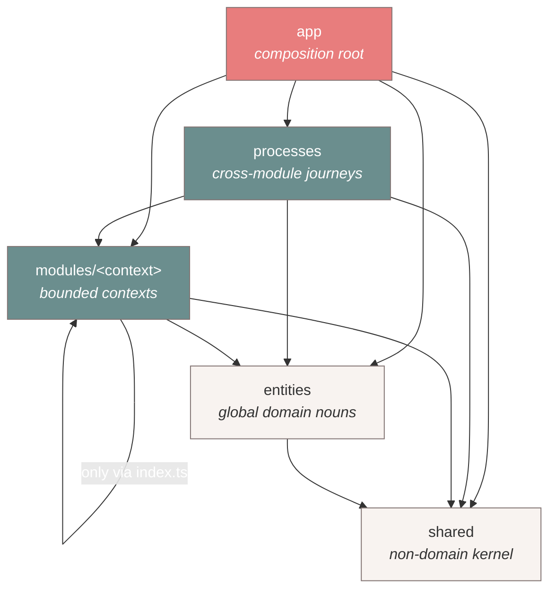
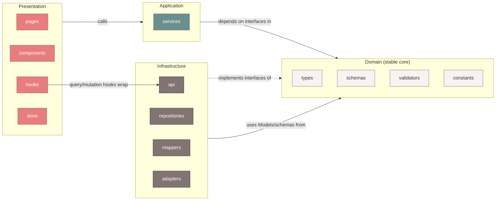

# ClinicOS — Dependency Rules (Part 6)

> **Phase 2 of the ClinicOS Frontend Engineering Bible.**
> This document **extends** and **never contradicts** [Phase 1](../Brain.md). It is the authoritative reference for **who may import whom** and **how we keep coupling, duplication, and "God" code out of the codebase for 10+ years**.
>
> Companion documents: [Brain.md](../Brain.md) · [README.md](./README.md) (Phase 2 anchor) · [FolderStructure.md](./FolderStructure.md) · [ProjectStructure.md](./ProjectStructure.md) · [FeatureArchitecture.md](./FeatureArchitecture.md) · [Diagrams.md](./Diagrams.md)

---

## 1. Purpose

This is **Part 6 — the Dependency Rules reference.** It exists to answer one question with zero ambiguity:

> **"I am in folder X. May I import from folder Y? If not, what do I do instead?"**

It does this by codifying the two dependency axes ratified in Phase 1 and Phase 2, turning them into a machine-checkable **Import Matrix**, an explicit **forbidden-imports** list, real **ESLint enforcement**, and the **anti-coupling / anti-duplication / anti-God** disciplines that keep the architecture honest over a decade.

**This document is law.** It is enforced in CI (see §11 Fitness Functions). A PR that violates it does not merge.

### What this preserves from Phase 1 (unchanged, restated, never weakened)

| Phase 1 law                                                                                                                 | Where it lives here                        |
| --------------------------------------------------------------------------------------------------------------------------- | ------------------------------------------ |
| **The Dependency Rule** — imports flow _downward only_, _never upward, never sideways except via a public API_ (Brain §5.1) | §2, §3, §4                                 |
| **The UI never talks to the backend directly** — it talks to _services_ and _repositories_ (Brain §2.6)                     | §4 (forbidden: UI→api/repo/mapper/dto), §6 |
| **The frontend is backend-independent** — HTTP→DTO→mapper→Model→Repository→Service→Query→UI (Brain §5.3)                    | §2(b), §6 (ports & adapters)               |
| **`shared/` knows nothing about the domain**; `entities/` knows nothing about modules (Brain §5.1, README §1)               | §3, §4                                     |
| **Deep-importing past `index.ts` is forbidden** (Brain §5.2, README §3)                                                     | §4, §5                                     |
| **No circular module dependencies** (README §3.4)                                                                           | §5 (`import/no-cycle`), §11                |
| **Simplicity beats cleverness** (Brain §2.8)                                                                                | §8, §9, §10 (anti-God)                     |
| **The Decision Contract** — Why · Benefits · Trade-offs · Alternatives · Future · Enterprise (Brain §14)                    | every major rule below                     |

> **Reading order:** [Brain.md](../Brain.md) → [README.md](./README.md) → **this file**. If a statement here ever appears to conflict with Phase 1, Phase 1 wins and this file is the bug — open an ADR.

---

## 2. The two dependency axes

ClinicOS has **two** orthogonal dependency orderings. Every import must satisfy **both**.

### (a) TOP-LEVEL layer order (between `src/` layers)

From [README.md](./README.md) §1 — imports flow **downward only**:

```
app → processes → modules → entities → shared
```

- `app` is the composition root; it may import anything below it.
- `processes` orchestrate **cross-module** journeys (the Patient Journey state machine).
- `modules` are bounded contexts; a module may use `entities` and `shared`, and other modules **only via their `index.ts`**.
- `entities` are global domain nouns (patient, clinic, doctor, user, tenant); they may use only `shared`.
- `shared` is non-domain, cross-cutting reuse; it knows **nothing** about the domain and depends on **nothing** above it.



> **Rule of thumb:** an arrow may only ever point **down or sideways-via-index**. There is **no** arrow that points up.

### (b) INTRA-MODULE Clean Architecture order (inside one `modules/<context>/`)

From [README.md](./README.md) §2 — every module is a mini Clean Architecture:

```
Presentation  →  Application  →  Domain  ←  Infrastructure
```

- **Presentation** (`pages`, `components`, `hooks`, `store`) renders and reacts. It calls **Application**.
- **Application** (`services`) holds use-cases/business orchestration. It depends on **Domain** interfaces.
- **Domain** (`types`, `schemas`, `validators`, `constants`) is the **stable core** — pure, framework-free, depends on **nothing** outward.
- **Infrastructure** (`api`, `repositories`, `mappers`, `adapters`) **implements** Domain interfaces. Domain never imports Infrastructure — the dependency is **inverted**.



> The two key inversions: **Presentation never reaches into Infrastructure**, and **Domain never reaches out to Infrastructure**. Both are mediated — UI through `services`/query-`hooks`, Domain through dependency inversion (interfaces).

**Why two axes:** the top-level axis enforces _team & bounded-context boundaries_; the intra-module axis enforces _backend-independence & testability_ inside a team's code. They are independent: a perfectly-layered module can still illegally import another module's internals, and a clean cross-module graph can still hide a UI-imports-DTO violation. We check both.

- **Benefits:** every file has exactly one correct set of allowed imports, derivable mechanically.
- **Trade-offs:** more folders than a naive app; mitigated by an identical template per module (muscle memory).
- **Alternatives:** single flat axis (loses team ownership) — rejected in ADR-0001.
- **Future:** a module can be extracted to a remote (Module Federation) with zero import changes because both axes already force public-API access.
- **Enterprise:** maps 1:1 to CODEOWNERS and independent release cadence.

---

## 3. THE IMPORT MATRIX

Legend: ✅ allowed · ❌ forbidden · ⚠️ allowed **only via the target's public `index.ts`** (never deep) · `—` = self/N/A.

### 3.1 Top-level layer matrix

Rows = **importer**, columns = **target**.

| Importer ↓ \ Target →  | `app` | `processes` |    `modules/A`     | `modules/B` (other) |       `entities`        |        `shared`         |
| ---------------------- | :---: | :---------: | :----------------: | :-----------------: | :---------------------: | :---------------------: |
| **`app`**              |   —   |     ✅      |    ⚠️ via index    |    ⚠️ via index     |           ✅            |           ✅            |
| **`processes`**        | ❌ up |      —      |    ⚠️ via index    |    ⚠️ via index     |           ✅            |           ✅            |
| **`modules/A`** (self) | ❌ up |    ❌ up    | — (internal: §3.2) |    ⚠️ via index     |           ✅            |           ✅            |
| **`entities`**         | ❌ up |    ❌ up    |         ❌         |         ❌          | ✅ (other entity index) |           ✅            |
| **`shared`**           | ❌ up |    ❌ up    |         ❌         |         ❌          |     ❌ (no domain)      | ✅ (sibling, no cycles) |

Key consequences:

- **Nothing imports `app`.** `app` is the root; importing it creates a cycle through the composition root.
- **Modules never import `processes`.** Journeys orchestrate modules, not the reverse (no upward import).
- **`shared` never imports `entities` or `modules`** — that would give the non-domain kernel domain knowledge.
- **`entities` never import `modules`** — global nouns must not depend on a single bounded context.

### 3.2 Intra-module folder matrix (inside one `modules/<context>/`)

Rows = **importer folder**, columns = **target folder**. (`index.ts`, `routes.tsx`, `permissions.ts` compose the public surface and may import from `pages`/`services`/`config` as needed.)

| Importer ↓ \ Target → | pages | components | hooks | services | repositories | api | mappers | adapters | types | schemas | validators | store | utils | constants |
| --------------------- | :---: | :--------: | :---: | :------: | :----------: | :-: | :-----: | :------: | :---: | :-----: | :--------: | :---: | :---: | :-------: |
| **pages** (P)         |  ✅   |     ✅     |  ✅   |    ✅    |      ❌      | ❌  |   ❌    |    ❌    |  ✅   |   ✅¹   |    ❌²     |  ✅   |  ✅   |    ✅     |
| **components** (P)    |  ❌   |     ✅     |  ✅   |   ✅³    |      ❌      | ❌  |   ❌    |    ❌    |  ✅   |   ✅¹   |    ❌²     |  ✅   |  ✅   |    ✅     |
| **hooks** (P⇄A)       |  ❌   |     ❌     |  ✅   |    ✅    |     ❌⁴      | ✅⁴ |   ❌    |    ❌    |  ✅   |   ✅    |     ✅     |  ✅   |  ✅   |    ✅     |
| **services** (A)      |  ❌   |     ❌     |  ❌   |    ✅    |      ✅      | ❌⁵ |   ❌⁵   |    ✅    |  ✅   |   ✅    |     ✅     |  ❌   |  ✅   |    ✅     |
| **repositories** (I)  |  ❌   |     ❌     |  ❌   |    ❌    |      ✅      | ✅  |   ✅    |    ✅    |  ✅   |   ✅    |     ✅     |  ❌   |  ✅   |    ✅     |
| **api** (I)           |  ❌   |     ❌     |  ❌   |    ❌    |     ❌⁶      | ✅  |   ✅    |    ✅    |  ✅   |   ✅    |     ❌     |  ❌   |  ✅   |    ✅     |
| **mappers** (I)       |  ❌   |     ❌     |  ❌   |    ❌    |      ❌      | ❌  |   ✅    |    ❌    |  ✅   |   ✅    |     ❌     |  ❌   |  ✅   |    ✅     |
| **adapters** (I)      |  ❌   |     ❌     |  ❌   |    ❌    |      ❌      | ✅  |   ✅    |    ✅    |  ✅   |   ✅    |     ❌     |  ❌   |  ✅   |    ✅     |
| **types** (D)         |  ❌   |     ❌     |  ❌   |    ❌    |      ❌      | ❌  |   ❌    |    ❌    |  ✅   |   ❌⁷   |     ❌     |  ❌   |  ❌⁸  |    ✅     |
| **schemas** (D)       |  ❌   |     ❌     |  ❌   |    ❌    |      ❌      | ❌  |   ❌    |    ❌    |  ✅   |   ✅    |     ❌     |  ❌   |  ❌⁸  |    ✅     |
| **validators** (D)    |  ❌   |     ❌     |  ❌   |    ❌    |      ❌      | ❌  |   ❌    |    ❌    |  ✅   |   ✅    |     ✅     |  ❌   |  ✅   |    ✅     |
| **store** (P)         |  ❌   |     ❌     |  ❌   |    ❌    |      ❌      | ❌  |   ❌    |    ❌    |  ✅   |   ❌    |     ❌     |  ✅   |  ✅   |    ✅     |
| **utils**             |  ❌   |     ❌     |  ❌   |    ❌    |      ❌      | ❌  |   ❌    |    ❌    |  ✅⁸  |   ❌    |     ❌     |  ❌   |  ✅   |    ✅     |
| **constants** (D)     |  ❌   |     ❌     |  ❌   |    ❌    |      ❌      | ❌  |   ❌    |    ❌    |  ❌   |   ❌    |     ❌     |  ❌   |  ❌   |    ✅     |

P = Presentation · A = Application · I = Infrastructure · D = Domain.

**Footnotes (the load-bearing nuances):**

1. ¹ Presentation may import **form** schemas (RHF + Zod resolver) and Model **types** — never DTO types or DTO-validation schemas.
2. ² Presentation calls **services**/validators _through services or form schemas_; it does not import the domain `validators/` directly to run business rules ad-hoc (keeps a single source of truth — §7).
3. ³ A presentational `component` may call a `service` only when it is acting as a **container**; prefer pushing data-fetching up to `pages`/`hooks`. Pure presentational components take props only.
4. ⁴ `hooks` is the **bridge**: TanStack Query/mutation hooks here wrap `api` query functions and call `services`. This is the _only_ Presentation-side folder permitted to touch `api`, and only to wrap it into a query hook — never to issue raw HTTP from a component.
5. ⁵ `services` orchestrate **repositories**, not `api`/`mappers` directly. The repository owns the api→mapper→Model pipeline; a service that imports `api`/`mappers` is leaking Infrastructure detail.
6. ⁶ `api` does **not** import `repositories` (that's upward within Infrastructure — the repository composes api, not the reverse).
7. ⁷ Domain `types` must not import `schemas` to avoid a Zod runtime dependency leaking into pure types (derive types _from_ schemas inside `schemas/`, export the type, and let `types/` re-export if needed — single direction).
8. ⁸ `utils` and Domain folders may reference Model `types` for signatures but must stay **pure** (no store, no api, no schemas runtime). `types` importing `utils` is forbidden to keep the Domain core dependency-free.

> **Reading the matrix as one sentence:** _Presentation flows down into Application; Application depends on the Domain core; Infrastructure implements the Domain core; nothing flows back up, and the Domain core depends on nothing but itself and constants._

### 3.3 Cross-cutting: importing **`shared` / `entities`** from inside a module

Every intra-module folder may additionally import from `shared/*` (always) and `entities/*` (Domain/Application/Infrastructure folders) **via their public indexes**, subject to §3.1. Presentation may import `shared/design-system` freely (it is the UI kit). No module folder may import another module except through that module's root `index.ts`.

---

## 4. Forbidden imports (explicit, with reasons)

Each line is a **hard ❌**. The "instead" column is the sanctioned path.

| #   | Forbidden                                                                                                              | Why it is forbidden                                                                                            | Do this instead                                                                                  |
| --- | ---------------------------------------------------------------------------------------------------------------------- | -------------------------------------------------------------------------------------------------------------- | ------------------------------------------------------------------------------------------------ |
| F1  | **Cross-module deep import** — `modules/billing/services/x` from `modules/queue`                                       | Bypasses the public contract; couples teams to each other's internals; breaks lazy-loading & future extraction | Import `from '@/modules/billing'` (its `index.ts`) only                                          |
| F2  | **Module → another module's internals at all (even one level)**                                                        | Same as F1; `index.ts` is the _only_ legal surface (Brain §5.2)                                                | Re-export the needed symbol from the target module's `index.ts`                                  |
| F3  | **UI imports `api`** (`pages`/`components` calling endpoints/HTTP)                                                     | Violates "UI never talks to the backend directly" (Brain §2.6); makes UI backend-coupled                       | Use a query/mutation **hook** (`hooks/`) that wraps `api`, or a **service**                      |
| F4  | **UI imports `repositories`**                                                                                          | Repositories are Infrastructure; UI must not know data-access exists                                           | Call a **service** (use-case) via a hook                                                         |
| F5  | **UI imports `mappers`**                                                                                               | Mappers are the DTO⇄Model boundary; UI must only ever see Models                                               | Receive Models from services/hooks; never map in the view                                        |
| F6  | **UI imports `dto` / DTO types / DTO schemas**                                                                         | DTOs are raw backend shapes; leaking them re-couples UI to the backend and defeats backend-independence        | Use **Model** types (`types/`) and **form** schemas only                                         |
| F7  | **Domain imports Infrastructure** (`types`/`schemas`/`validators` importing `api`/`repositories`/`mappers`/`adapters`) | Inverts the dependency the wrong way; the stable core would depend on volatile detail                          | Define an **interface** in Domain; Infrastructure implements it (dependency inversion, §6)       |
| F8  | **`shared` imports `modules` or `entities`**                                                                           | `shared` is the non-domain kernel; domain knowledge in `shared` poisons reuse and creates cycles (Brain §5.1)  | Move the domain logic into `entities/` or the owning module; keep `shared` domain-free           |
| F9  | **`entities` imports `modules`**                                                                                       | A global noun must not depend on a single bounded context; creates fan-in cycles                               | Keep entity logic generic; let modules depend on the entity, not vice-versa                      |
| F10 | **Any upward import** (`shared→entities`, `entities→modules`, `modules→processes`, `*→app`)                            | The Dependency Rule is downward-only (Brain §5.1); upward edges create cycles and destroy layering             | Invert control: pass data/handlers **down**, or lift orchestration **up** into the right layer   |
| F11 | **Relative escape across slices** — `../../..` reaching out of the current slice/module                                | Hides a boundary violation behind path math; defeats lint boundaries; brittle on moves                         | Use the `@/` alias + the target's public index; never climb past your slice root                 |
| F12 | **Circular imports** (A→B→A across modules or layers)                                                                  | Breaks tree-shaking, lazy-loading, and reasoning; a symptom of a missing layer                                 | Extract the shared piece down to `entities`/`shared`, or invert via an interface/event bus (§6)  |
| F13 | **`services` importing `store`** (Application reaching into Presentation state)                                        | Use-cases must be framework- and UI-agnostic so they're testable and reusable                                  | Pass needed values as **arguments**; let Presentation read the store and call the service        |
| F14 | **`api`/`mappers` importing `validators`/`services`**                                                                  | Infrastructure must not run business rules; that re-spreads logic and breaks single-source-of-truth            | Validate DTOs with `schemas` at the boundary; run business rules in `services`/`validators` only |

> **Mnemonic:** _Down only · Public only · Models only in the UI · Interfaces between Domain and Infra · No path math across slices._

---

## 5. ENFORCEMENT (real config)

Architecture is **linted**, not hoped for (Brain §4). Three mechanisms work together:

1. `eslint-plugin-boundaries` — element types + allowed-edges (both axes).
2. `import/no-cycle` — no circular dependencies.
3. `no-restricted-imports` — bans deep module paths and DTO-in-UI by path pattern.

### 5.1 `eslint.config.js` (flat config, ESLint 9)

```js
// eslint.config.js
import boundaries from 'eslint-plugin-boundaries';
import importPlugin from 'eslint-plugin-import';

export default [
  {
    files: ['src/**/*.{ts,tsx}'],
    plugins: { boundaries, import: importPlugin },
    settings: {
      'import/resolver': { typescript: { project: './tsconfig.json' } },

      // ---- AXIS A: top-level layers + AXIS B: intra-module folders ----
      'boundaries/elements': [
        // Top-level layers
        { type: 'app', pattern: 'src/app/**' },
        { type: 'processes', pattern: 'src/processes/**' },
        { type: 'entities', pattern: 'src/entities/*', capture: ['entity'] },
        { type: 'shared', pattern: 'src/shared/**' },
        // A module as a unit (for cross-module rules) — match its public index
        { type: 'module', pattern: 'src/modules/*', capture: ['module'], mode: 'folder' },

        // Intra-module folders (Clean Architecture rings). `family` groups the ring.
        { type: 'm-pages', pattern: 'src/modules/*/pages/**', capture: ['module'] },
        { type: 'm-components', pattern: 'src/modules/*/components/**', capture: ['module'] },
        { type: 'm-hooks', pattern: 'src/modules/*/hooks/**', capture: ['module'] },
        { type: 'm-store', pattern: 'src/modules/*/store/**', capture: ['module'] },
        { type: 'm-services', pattern: 'src/modules/*/services/**', capture: ['module'] },
        { type: 'm-repositories', pattern: 'src/modules/*/repositories/**', capture: ['module'] },
        { type: 'm-api', pattern: 'src/modules/*/api/**', capture: ['module'] },
        { type: 'm-mappers', pattern: 'src/modules/*/mappers/**', capture: ['module'] },
        { type: 'm-adapters', pattern: 'src/modules/*/adapters/**', capture: ['module'] },
        { type: 'm-types', pattern: 'src/modules/*/types/**', capture: ['module'] },
        { type: 'm-schemas', pattern: 'src/modules/*/schemas/**', capture: ['module'] },
        { type: 'm-validators', pattern: 'src/modules/*/validators/**', capture: ['module'] },
        { type: 'm-constants', pattern: 'src/modules/*/constants/**', capture: ['module'] },
        { type: 'm-utils', pattern: 'src/modules/*/utils/**', capture: ['module'] },
        { type: 'm-public', pattern: 'src/modules/*/index.ts', capture: ['module'] },
      ],
    },

    rules: {
      // ---------- AXIS A: who-may-import-whom across layers ----------
      'boundaries/element-types': [
        'error',
        {
          default: 'disallow',
          rules: [
            // app: composition root → may reach anything (modules only via their public index, see no-restricted-imports)
            { from: ['app'], allow: ['processes', 'module', 'entities', 'shared'] },
            // processes: orchestrate modules via public API; never reach up to app
            { from: ['processes'], allow: ['module', 'entities', 'shared'] },
            // a module (any of its rings) → other modules only as 'module' (public index), plus entities/shared
            { from: [/^m-/], allow: ['module', 'entities', 'shared'] },
            // entities → only other entities + shared (never modules, never up)
            { from: ['entities'], allow: ['entities', 'shared'] },
            // shared → only shared (no domain, no up)
            { from: ['shared'], allow: ['shared'] },

            // ---------- AXIS B: intra-module Clean Architecture rings ----------
            // Presentation
            {
              from: ['m-pages'],
              allow: [
                'm-pages',
                'm-components',
                'm-hooks',
                'm-services',
                'm-store',
                'm-types',
                'm-schemas',
                'm-utils',
                'm-constants',
              ],
            },
            {
              from: ['m-components'],
              allow: [
                'm-components',
                'm-hooks',
                'm-services',
                'm-store',
                'm-types',
                'm-schemas',
                'm-utils',
                'm-constants',
              ],
            },
            {
              from: ['m-hooks'],
              allow: [
                'm-hooks',
                'm-services',
                'm-api',
                'm-store',
                'm-types',
                'm-schemas',
                'm-validators',
                'm-utils',
                'm-constants',
              ],
            },
            { from: ['m-store'], allow: ['m-store', 'm-types', 'm-utils', 'm-constants'] },
            // Application
            {
              from: ['m-services'],
              allow: [
                'm-services',
                'm-repositories',
                'm-adapters',
                'm-types',
                'm-schemas',
                'm-validators',
                'm-utils',
                'm-constants',
              ],
            },
            // Infrastructure
            {
              from: ['m-repositories'],
              allow: [
                'm-repositories',
                'm-api',
                'm-mappers',
                'm-adapters',
                'm-types',
                'm-schemas',
                'm-validators',
                'm-utils',
                'm-constants',
              ],
            },
            {
              from: ['m-api'],
              allow: [
                'm-api',
                'm-mappers',
                'm-adapters',
                'm-types',
                'm-schemas',
                'm-utils',
                'm-constants',
              ],
            },
            {
              from: ['m-mappers'],
              allow: ['m-mappers', 'm-types', 'm-schemas', 'm-utils', 'm-constants'],
            },
            {
              from: ['m-adapters'],
              allow: [
                'm-adapters',
                'm-api',
                'm-mappers',
                'm-types',
                'm-schemas',
                'm-utils',
                'm-constants',
              ],
            },
            // Domain (stable core — depends on nothing outward)
            { from: ['m-types'], allow: ['m-types', 'm-constants'] },
            { from: ['m-schemas'], allow: ['m-schemas', 'm-types', 'm-constants'] },
            {
              from: ['m-validators'],
              allow: ['m-validators', 'm-schemas', 'm-types', 'm-utils', 'm-constants'],
            },
            { from: ['m-constants'], allow: ['m-constants'] },
            { from: ['m-utils'], allow: ['m-utils', 'm-types', 'm-constants'] },
            // Public surface may compose Presentation + Application + config
            { from: ['m-public'], allow: [/^m-/] },
          ],
        },
      ],

      // Forbid importing a module's internals from another module (enforce index-only, F1/F2)
      'boundaries/no-private': ['error', { allowUncles: false }],
      'boundaries/entry-point': [
        'error',
        {
          default: 'disallow',
          rules: [
            // Other modules/app/processes may only enter a module through index.ts
            { target: ['module'], allow: ['index.ts'] },
            // Entities are entered through their index.ts
            { target: ['entities'], allow: ['index.ts'] },
          ],
        },
      ],

      // ---------- No cycles (F12) ----------
      'import/no-cycle': ['error', { maxDepth: 1, ignoreExternal: true }],
      'import/no-self-import': 'error',
    },
  },
];
```

### 5.2 `no-restricted-imports` — ban deep module paths & DTO-in-UI

`boundaries` enforces the _graph_; `no-restricted-imports` adds **path-pattern** guards that read clearly in a PR diff and catch the two most common slips (F1/F2 deep paths, and F3–F6 DTO-in-UI).

```js
// add to the same flat-config block's `rules`
'no-restricted-imports': ['error', {
  patterns: [
    // F1/F2 — deep cross-module paths: anything past modules/<x>/ is private
    {
      group: ['@/modules/*/*', '@/modules/*/**'],
      message:
        'Deep module import forbidden. Import a module ONLY via its public index: ' +
        "import { X } from '@/modules/<module>'. (DependencyRules §4 F1/F2)",
    },
    // F11 — relative escape across slices
    {
      group: ['../../*', '../../../*', '**/../../../*'],
      message:
        "Do not climb past a slice with ../../.. — use the '@/' alias + public index. (§4 F11)",
    },
    // F8/F9 — shared & entities must not import the domain upward (path-level backstop)
    // (boundaries also enforces this; this message is friendlier in review)
  ],
  paths: [],
}],
```

```js
// A SEPARATE override block: stricter rules ONLY for UI (Presentation) files.
// This is where DTO-in-UI (F3–F6) is banned by path. Place AFTER the block above.
{
  files: ['src/modules/*/pages/**', 'src/modules/*/components/**'],
  rules: {
    'no-restricted-imports': ['error', {
      patterns: [
        { group: ['@/modules/*/*', '@/modules/*/**'],
          message: 'Deep module import forbidden (§4 F1/F2).' },
        // F3 — UI must not import api/endpoints
        { group: ['**/api', '**/api/**'],
          message: 'UI must not import api/. Use a query/mutation hook or a service. (§4 F3)' },
        // F4 — UI must not import repositories
        { group: ['**/repositories', '**/repositories/**'],
          message: 'UI must not import repositories/. Call a service via a hook. (§4 F4)' },
        // F5 — UI must not import mappers
        { group: ['**/mappers', '**/mappers/**'],
          message: 'UI must not import mappers/. The UI only ever sees domain Models. (§4 F5)' },
        // F6 — UI must not import DTOs
        { group: ['**/*.dto', '**/dto/**', '**/*Dto', '**/*DTO'],
          message: 'UI must not import DTOs. Use Model types + form schemas only. (§4 F6)' },
      ],
    }],
  },
}
```

> **Why both plugins?** `boundaries` reasons about _element types_ (robust to renames/moves); `no-restricted-imports` reasons about _literal paths_ (fast, gives the clearest reviewer message). Defense in depth: a violation must pass **both** to merge.

- **Trade-offs:** two rule sets to maintain; mitigated because both derive from this single matrix.
- **Alternatives:** `dependency-cruiser` (richer graph rules, separate runner) — kept as a **future** addition for visualizing the graph in CI artifacts; `Nx` module boundaries — heavier, deferred per ADR-0001.
- **Enterprise:** rules ship in the shared `eslint-config-clinicos` package so every module repo inherits them identically.

---

## 6. How to AVOID TIGHT COUPLING

> **Goal:** changes stay local. Touching the backend, an external SDK, or one module must not ripple through the UI or other modules.

### 6.1 Dependency Inversion — depend on **interfaces** in the Domain

Application code depends on an **interface that lives in the Domain**, and Infrastructure provides the implementation. The arrow points _into_ the stable core (this is exactly Brain §5.3, localized).

```ts
// modules/patients/types/patient.repository.ts   (DOMAIN — interface only)
import type { Patient } from './patient.model';
export interface PatientRepository {
  getById(id: string): Promise<Patient>;
  search(q: string): Promise<Patient[]>;
}

// modules/patients/repositories/patient.repository.ts   (INFRASTRUCTURE — impl)
import type { PatientRepository } from '../types/patient.repository';
import type { Patient } from '../types/patient.model';
import { httpClient } from '@/shared/api'; // HttpClient interface (swappable)
import { toPatient } from '../mappers/patient.mapper';
import { PatientDtoSchema } from '../schemas/patient.dto.schema';

export const createPatientRepository = (): PatientRepository => ({
  async getById(id) {
    const raw = await httpClient.get(`/patients/${id}`);
    return toPatient(PatientDtoSchema.parse(raw)); // validate at boundary, map to Model
  },
  async search(q) {
    const raw = await httpClient.get(`/patients?query=${encodeURIComponent(q)}`);
    return PatientDtoSchema.array().parse(raw).map(toPatient);
  },
});

// modules/patients/services/get-patient.service.ts   (APPLICATION — uses the interface)
import type { PatientRepository } from '../types/patient.repository';
export const makeGetPatient = (repo: PatientRepository) => (id: string) => repo.getById(id); // pure use-case; no HTTP, no React
```

**Result (the 10-year payoff):** backend renames `patient_first_nm`→`firstName`? Edit **one mapper**. Swap `fetch` for `axios`? Implement `HttpClient` once. The service, hooks, and UI never change.

- **Why:** isolates volatility (backend, transport) behind stable contracts.
- **Trade-offs:** an interface + a factory per repository — minor boilerplate, huge testability win (inject a fake repo in unit tests).
- **Alternatives:** concrete imports everywhere (fast to write, impossible to swap) — rejected by Brain §2.7.
- **Enterprise:** enables MSW-backed dev, contract tests, and backend teams reshaping APIs independently.

### 6.2 Ports & Adapters for external concerns

External concerns (analytics, logging, monitoring, storage, notifications) are **ports** in `shared/core` with adapters behind them — _never_ a vendor SDK in a component (Brain §4).

```ts
// shared/core/ports/analytics.port.ts
export interface AnalyticsPort {
  track(event: string, props?: Record<string, unknown>): void;
}

// shared/analytics/segment.adapter.ts  (swap to Amplitude/PostHog without touching callers)
import type { AnalyticsPort } from '@/shared/core/ports/analytics.port';
export const segmentAdapter: AnalyticsPort = { track: (e, p) => window.analytics?.track(e, p) };
```

### 6.3 Event bus for decoupled **cross-module** signals

When module A must _react to_ something in module B without depending on it, emit a typed event on the `shared/core` event bus. Neither module imports the other; `processes/` may also listen to coordinate journeys.

```ts
// shared/core/events/bus.ts
type DomainEvents = {
  'appointment.checkedIn': { appointmentId: string; patientId: string };
  'vitals.recorded': { patientId: string; encounterId: string };
};
export const bus = createTypedEventBus<DomainEvents>();

// modules/appointments/services/check-in.service.ts  (emit — no import of queue)
bus.emit('appointment.checkedIn', { appointmentId, patientId });

// modules/queue/hooks/useQueueSync.ts  (listen — no import of appointments)
useEffect(() => bus.on('appointment.checkedIn', ({ patientId }) => enqueue(patientId)), []);
```

> Use the bus for **notifications/reactions**, not for request/response. Synchronous cross-module _use-cases_ belong in `processes/` calling each module's public service via its `index.ts`.

### 6.4 Props & composition over shared mutable state

Prefer passing data/handlers **down** via props and composing components over reaching into a global store. Shared mutable state is the most common hidden coupling; reserve Zustand for genuinely global UI state (theme, locale, session — Brain §9) and keep server data in TanStack Query only.

- **Trade-offs:** the event bus can hide flows if overused — cap it to documented domain events, registered in `PROJECT_BRAIN` (BrainRules).
- **Alternatives:** direct module-to-module calls (tight, but explicit) for _synchronous_ journeys via `processes/`; the bus is for _fire-and-forget_ signals.

---

## 7. How to AVOID DUPLICATED LOGIC

> **Goal:** one rule, one place. Domain logic exists exactly once and everyone reuses it.

### 7.1 Reuse-first + the promotion path

Before writing logic, **search for it** (it may already exist in a module, `entities/`, or `shared/`). When the same logic is needed in a second place, **promote** it down the layers:

```
slice-local utils  →  module utils/validators  →  entities/  (domain reuse)  →  shared/  (non-domain reuse)
```

Promote **down** to the lowest layer that all consumers can legally import (per §3). Never copy upward or sideways.

### 7.2 The Rule of Three

- **1st** occurrence: write it locally.
- **2nd** occurrence: note the duplication (a `// DUPLICATE-OF:` marker + BRAIN.md entry) — do **not** abstract yet.
- **3rd** occurrence: **extract & promote** to the right shared home, delete the copies.

> Abstracting at the 2nd occurrence risks the wrong abstraction; waiting past the 3rd risks drift. Three is the ratified threshold.

### 7.3 Shared kernel & single source of truth

- **Non-domain** reuse (formatters, `useDebounce`, date/currency wrappers) → `shared/` (the shared kernel). Domain-free by §3.1.
- **Domain** reuse (a `Patient` model, age calc) → `entities/`.
- **Domain rules** (e.g. "an appointment cannot be booked in the past", "BP is valid when systolic > diastolic") live **once** in `validators/`/`services/` and are imported by forms, services, and tests — never re-implemented in the UI.

```ts
// modules/appointments/validators/appointment.rules.ts  (SINGLE SOURCE OF TRUTH)
export const isBookableSlot = (start: Date, now: Date) => start.getTime() > now.getTime();

// reused by the form schema…
export const bookSchema = z
  .object({ start: z.date() })
  .refine(({ start }) => isBookableSlot(start, new Date()), {
    message: 'appointments.errors.past',
  });
// …by the service…
if (!isBookableSlot(input.start, clock.now())) throw new AppError('APPOINTMENT_IN_PAST');
// …and by tests — all three call the same function. Change the rule once.
```

- **Why:** duplicated rules drift and produce inconsistent behavior (the form allows what the service rejects) — a classic clinical-safety bug.
- **Trade-offs:** a tiny indirection; mitigated by colocation in `validators/`.
- **Enterprise:** a shared rule is testable once and audited once.

---

## 8. How to AVOID GOD COMPONENTS

> **Symptom:** a component that fetches, transforms, validates, holds half the page's state, and renders 600 lines of JSX.

### 8.1 Limits (CI-checked, §11)

| Limit                                | Threshold               | Rationale                                    |
| ------------------------------------ | ----------------------- | -------------------------------------------- |
| Lines per component file             | **≤ 200** (warn 150)    | Readability; one screenful of responsibility |
| Props on one component               | **≤ 7**                 | More props ⇒ split or compose                |
| `useState`/`useEffect` per component | **≤ 5 combined** (warn) | More ⇒ extract a hook                        |
| JSX nesting depth                    | **≤ 4**                 | Deep trees ⇒ extract subcomponents           |
| Responsibilities                     | **exactly 1**           | Single Responsibility Principle              |

### 8.2 Container / Presentational split + extracted hooks

```tsx
// ❌ GOD COMPONENT — fetches, maps, validates, holds state, renders (forbidden by F3–F6, too)
function PatientDashboard({ id }: { id: string }) {
  const [patient, setPatient] = useState<any>();
  const [edit, setEdit] = useState(false);
  useEffect(() => {
    fetch(`/api/patients/${id}`) // F3: UI calling backend
      .then((r) => r.json())
      .then((dto) =>
        setPatient({ name: dto.first_nm + ' ' + dto.last_nm /* F5: mapping in UI */ }),
      );
  }, [id]);
  // …200+ lines: vitals chart, appointment list, billing summary, edit form, validation…
}
```

```tsx
// ✅ REFACTORED — container fetches via hook; small presentational pieces; logic in hooks
function PatientDashboardPage({ id }: { id: string }) {
  // pages/ — composition only
  const { data: patient, isLoading, error } = usePatient(id); // hooks/ wraps service+query
  if (isLoading) return <PatientDashboardSkeleton />; // 4 async states (Brain §11)
  if (error) return <ErrorState error={error} />;
  if (!patient) return <EmptyState action={<AddPatientCta />} />;
  return (
    <DashboardLayout>
      <PatientHeader patient={patient} /> {/* presentational: props only */}
      <VitalsPanel patientId={patient.id} />
      <AppointmentsPanel patientId={patient.id} />
      <BillingSummaryCard patientId={patient.id} />
    </DashboardLayout>
  );
}
// usePatient(id) lives in hooks/ → calls the service → returns a Model. No DTOs, no fetch in the view.
```

- **Why:** small components are testable, reusable, and reviewable; blast radius shrinks.
- **Trade-offs:** more files; navigated via the identical module template.
- **Alternatives:** "smart everything" components — rejected (Brain §2.8 simplicity).

---

## 9. How to AVOID GOD HOOKS

> **One hook = one concern.** A hook that fetches _and_ validates _and_ manages a wizard _and_ talks to three services is a God hook.

### 9.1 Compose small hooks; push orchestration to services

```ts
// ❌ GOD HOOK — fetch + form + pagination + websocket + business rules in one
function usePatientScreen(id) {
  // 180 lines: query, RHF, table paging, socket, eligibility math, billing totals…
}
```

```ts
// ✅ small, single-concern hooks — composed where needed
function usePatient(id: string) {
  // 1 concern: read a patient
  return useQuery({ queryKey: ['patient', id], queryFn: () => patientService.getById(id) });
}
function usePatientVitals(id: string) {
  /* 1 concern: vitals */
}
function useUpdatePatient() {
  // 1 concern: a mutation
  return useMutation({ mutationFn: patientService.update });
}

// The screen composes them; orchestration/business rules live in the SERVICE, not the hook:
function PatientEditor({ id }: { id: string }) {
  const { data } = usePatient(id);
  const update = useUpdatePatient();
  // hook stays thin; eligibility/derivation rules are in services/validators (single source, §7)
}
```

**Rules:** a hook may **compose** other hooks and call **one** service area; multi-step business orchestration belongs in `services/` (Application), not in a hook. Keep hooks under ~50 lines / one return concern.

- **Why:** thin hooks are unit-testable and reusable; orchestration in services keeps it framework-agnostic.
- **Trade-offs:** more hooks — but each is trivially named (`usePatient`, `usePatientVitals`).

---

## 10. How to AVOID GOD SERVICES

> **One service = one use-case (a verb).** Services **orchestrate repositories**; they are not dumping grounds for "everything patient-related."

### 10.1 Split by use-case

```ts
// ❌ GOD SERVICE — every patient operation in one 500-line object
export const patientService = {
  getById,
  search,
  create,
  update,
  archive,
  merge,
  exportPdf,
  calculateEligibility,
  computeOutstandingBalance,
  scheduleFollowUp,
  sendReminder, // ← unrelated
};
```

```ts
// ✅ one use-case per service (verb-named files; FeatureArchitecture template)
// services/get-patient.service.ts
export const makeGetPatient = (repo: PatientRepository) => (id: string) => repo.getById(id);

// services/archive-patient.service.ts
export const makeArchivePatient =
  (repo: PatientRepository, audit: AuditPort) => async (id: string) => {
    await repo.archive(id);
    audit.record('patient.archived', { id });
  };

// services/merge-patients.service.ts  (orchestrates the repository; rules from validators/)
export const makeMergePatients = (repo: PatientRepository) => async (a: string, b: string) => {
  assertMergeable(a, b);
  return repo.merge(a, b);
};
```

**Rules:**

- A service **orchestrates** repositories/adapters and applies **Domain** rules (from `validators/`). It must not perform HTTP (that's `api`/`repositories`, F14) nor read the UI store (F13).
- Cross-aggregate workflows (e.g. _follow-up scheduling_ that spans patients + appointments) move **up** to `processes/`, calling each module's public service via `index.ts` — not crammed into one module's service.

- **Why:** verb-sized services are independently testable, named after the use-case, and obey SRP.
- **Trade-offs:** many small files; the verb naming makes them discoverable.
- **Enterprise:** maps to clear audit points and per-use-case feature flags.

---

## 11. Fitness functions (automated checks that keep these rules true in CI)

"Fitness functions" are automated tests that fail the build when an architectural property erodes. **Green CI = the architecture still holds.**

| #    | Fitness function                                                                                          | Tool / how                                                                                                | Gate                      |
| ---- | --------------------------------------------------------------------------------------------------------- | --------------------------------------------------------------------------------------------------------- | ------------------------- |
| FF1  | **Layer boundaries hold** (both axes, §3)                                                                 | `eslint-plugin-boundaries` (§5.1)                                                                         | `eslint --max-warnings 0` |
| FF2  | **No deep module imports / no DTO-in-UI** (§4 F1–F6)                                                      | `no-restricted-imports` (§5.2)                                                                            | ESLint error              |
| FF3  | **No import cycles** (§4 F12)                                                                             | `import/no-cycle` + `dependency-cruiser` graph check                                                      | ESLint error + CI step    |
| FF4  | **Public-API only** — every module exports through `index.ts`; no internal is imported across modules     | `boundaries/entry-point` + a `dependency-cruiser` rule `modules/*/!(index.ts)` not reachable cross-module | CI error                  |
| FF5  | **Domain purity** — `types`/`schemas`/`validators` import no `api`/`repositories`/`mappers`/React         | `dependency-cruiser` `forbidden` rule on Domain folders                                                   | CI error                  |
| FF6  | **Component size limits** (§8.1)                                                                          | ESLint `max-lines-per-function`, `max-lines`, `react/jsx-max-depth`, custom props-count rule              | warn→error                |
| FF7  | **Hook size/concern** (§9)                                                                                | ESLint `max-lines-per-function` scoped to `hooks/**`; custom "hooks call ≤1 service" lint                 | warn                      |
| FF8  | **Service shape** (§10) — services don't import `store`/`api`/`fetch`                                     | `dependency-cruiser` rule on `services/**`                                                                | CI error                  |
| FF9  | **No backend SDK in components** (ports only, §6.2)                                                       | `no-restricted-imports` banning vendor SDK packages in `**/components/**`,`**/pages/**`                   | ESLint error              |
| FF10 | **No hardcoded strings / values** (Brain §2.4–2.5) — adjacent guard so logic stays in the right layer     | `eslint-plugin-i18next`, token lint                                                                       | ESLint error              |
| FF11 | **Architecture graph snapshot** — the allowed-edges graph is committed; PRs that change it require review | `dependency-cruiser --output-type json` diffed in CI                                                      | review gate               |
| FF12 | **Husky pre-commit + CI** run FF1–FF11                                                                    | `husky` + `lint-staged` + GitHub Actions                                                                  | blocks merge              |

```jsonc
// .dependency-cruiser.jsonc (excerpt — the "forbidden" fitness rules)
{
  "forbidden": [
    {
      "name": "no-deep-module-import",
      "severity": "error",
      "from": { "path": "^src/modules/([^/]+)/" },
      "to": { "path": "^src/modules/(?!\\1/)([^/]+)/(?!index\\.ts$)" },
    },
    {
      "name": "domain-is-pure",
      "severity": "error",
      "from": { "path": "^src/modules/[^/]+/(types|schemas|validators|constants)/" },
      "to": { "path": "(api|repositories|mappers|adapters)/|react|@tanstack" },
    },
    {
      "name": "no-ui-to-infra",
      "severity": "error",
      "from": { "path": "^src/modules/[^/]+/(pages|components)/" },
      "to": { "path": "/(api|repositories|mappers)/|\\.dto" },
    },
    { "name": "no-circular", "severity": "error", "from": {}, "to": { "circular": true } },
    {
      "name": "shared-no-domain",
      "severity": "error",
      "from": { "path": "^src/shared/" },
      "to": { "path": "^src/(modules|entities)/" },
    },
    {
      "name": "entities-no-modules",
      "severity": "error",
      "from": { "path": "^src/entities/" },
      "to": { "path": "^src/modules/" },
    },
  ],
}
```

- **Why fitness functions:** docs rot; tests don't. Encoding §3–§10 as CI gates makes the architecture **self-defending**.
- **Enterprise:** the same gates run in every module's pipeline, so hundreds of devs get identical, instant feedback.

---

## 12. Quick-reference cheat-sheet

### ✅ ALLOWED

- Import **downward** only: `app → processes → modules → entities → shared`.
- Import another module **only** via `@/modules/<name>` (its `index.ts`).
- UI (`pages`/`components`) gets data from **hooks** (query/mutation) and **services** — receiving **Models**.
- `hooks/` may wrap `api` into a query hook; `services/` orchestrate `repositories`; `repositories/` use `api`+`mappers`.
- Domain (`types`/`schemas`/`validators`/`constants`) imports only Domain (+ `constants`); Infrastructure **implements** Domain interfaces.
- Promote reused logic **down** to the lowest legal layer (rule of three). Cross-module signals via the **event bus**; cross-module journeys via **`processes/`**.
- External concerns (analytics, logging, http) behind **ports** in `shared/core`.

### ❌ FORBIDDEN

- ❌ Deep import past a module's `index.ts` (`@/modules/x/services/...`).
- ❌ UI importing `api` / `repositories` / `mappers` / `dto` / DTO schemas.
- ❌ Domain importing Infrastructure (`types`→`api`/`repositories`/`mappers`).
- ❌ `shared` importing `modules`/`entities`; `entities` importing `modules`.
- ❌ Any **upward** import (`modules→processes`, `*→app`, `shared→entities`).
- ❌ `../../..` escaping a slice; ❌ circular imports.
- ❌ `services` reading the UI `store`; ❌ `api`/`mappers` running business rules; ❌ vendor SDK inside a component.
- ❌ God component (>200 lines, >1 responsibility) · God hook (>1 concern) · God service (>1 use-case).

> **One line to remember:** _Down only · Public-API only · Models-only in the UI · Interfaces between Domain and Infra · No path-math across slices · One file, one job._

---

_Phase 2 · Part 6 · Foundation v2 · 2026-06-27 · Owner: Frontend Architecture · Extends [Brain.md](../Brain.md), never contradicts it._
