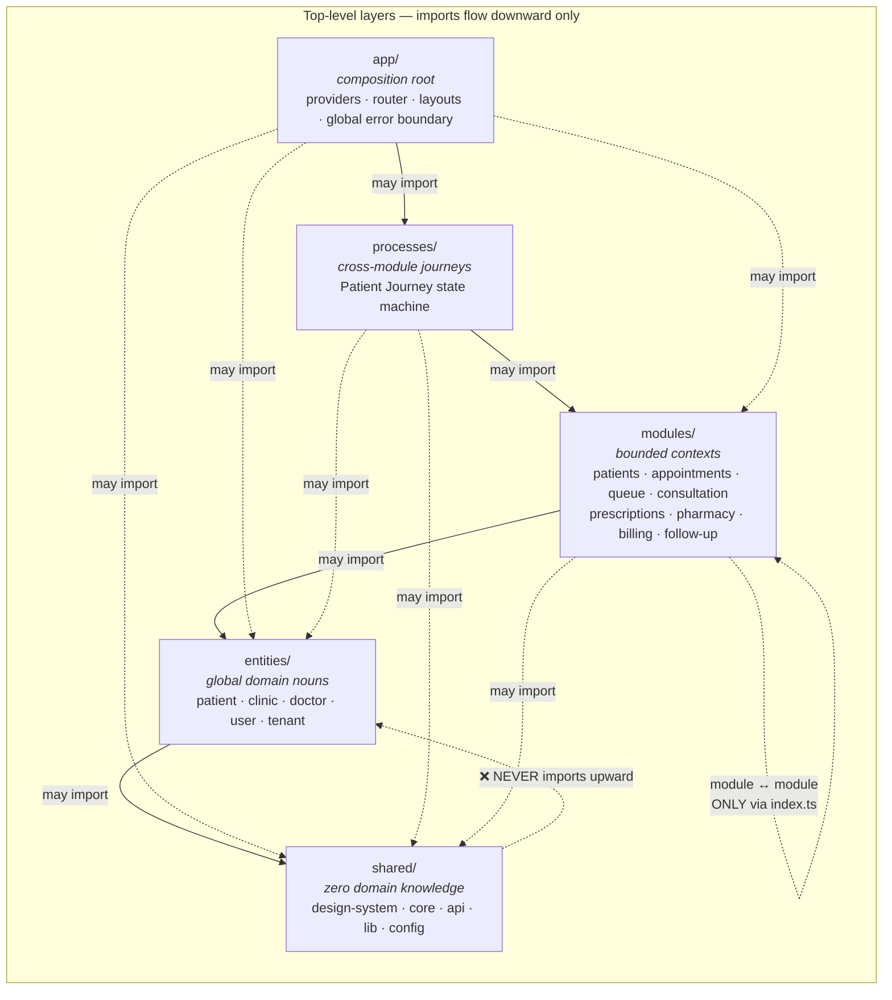
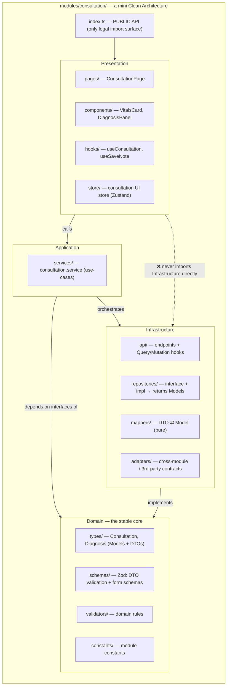
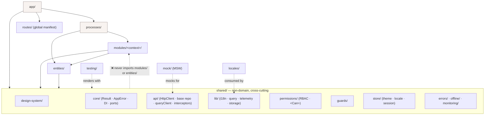
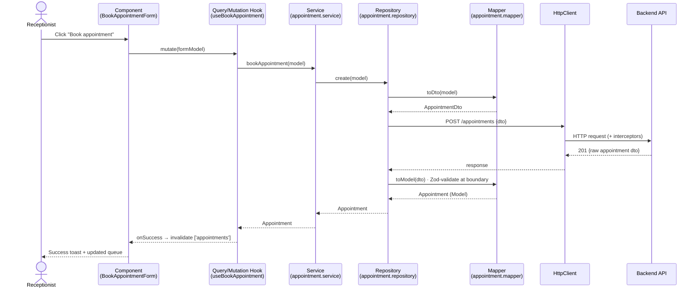
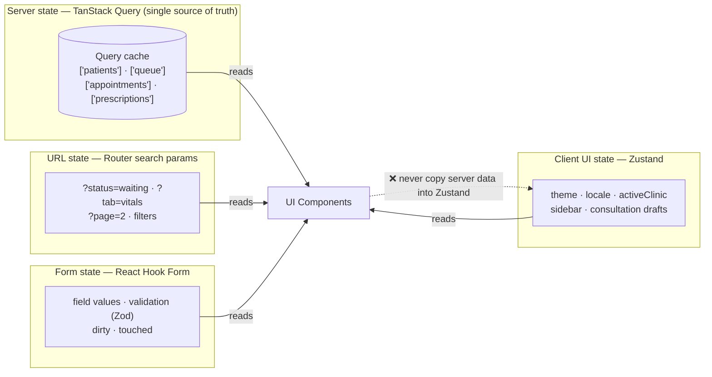
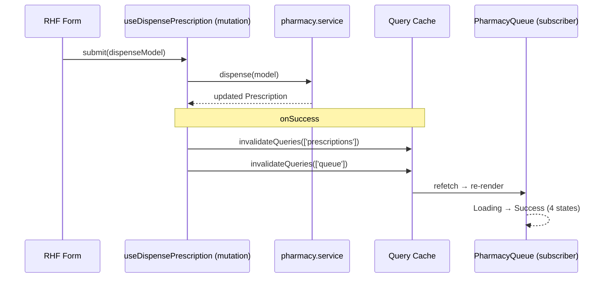
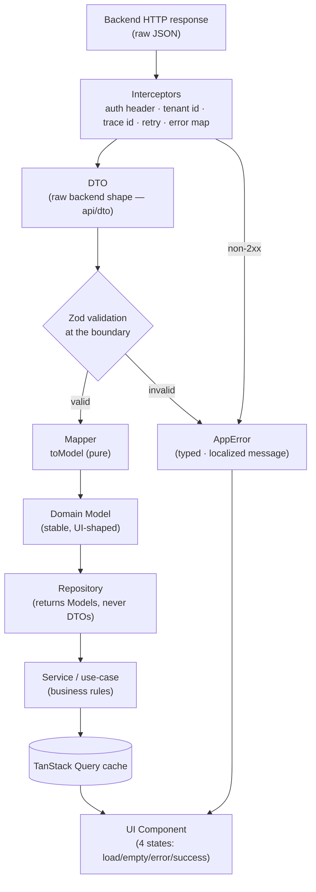
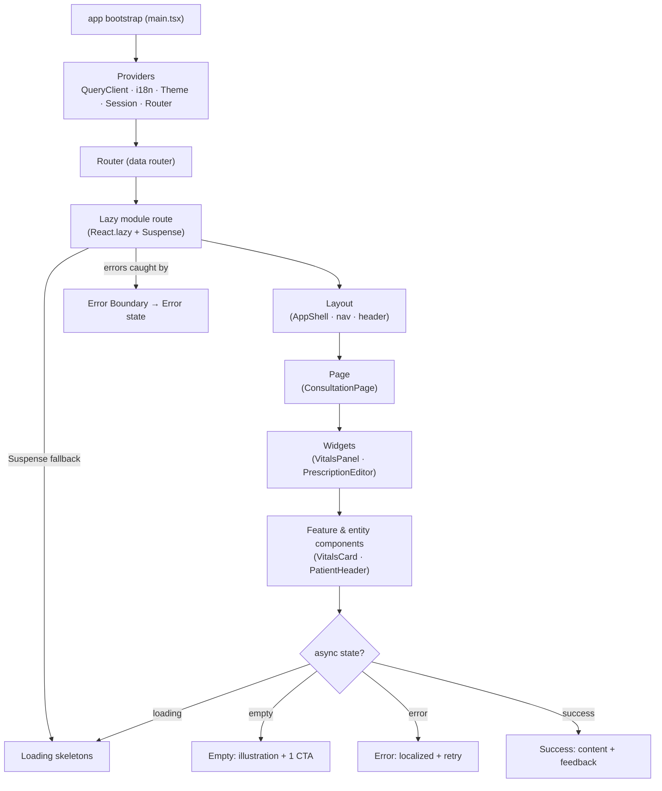
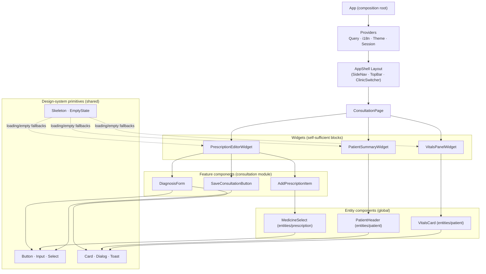
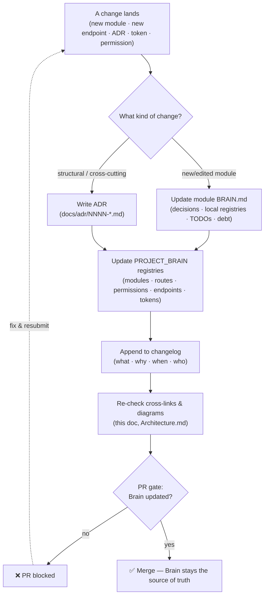

# ClinicOS — Architecture Diagrams (Part 7)

> **Phase 2 of the ClinicOS Frontend Engineering Bible — the visual canon.**
> This document **extends** and **never contradicts** [Phase 1 (Brain.md)](../Brain.md) or the [Phase 2 enterprise blueprint (README.md)](./README.md).
> Every diagram below is a faithful picture of laws already ratified elsewhere — it adds **clarity, not new rules**. If a diagram ever appears to conflict with a written law, **the law wins** and the diagram is the bug.

---

## 0. How to read this document

These ten diagrams are the **single visual reference** for how ClinicOS is structured and how data, control, and rendering flow through it. They use real ClinicOS vocabulary — **patient, appointment, queue, consultation, prescription, pharmacy, billing, follow-up** — so that a diagram and the code it describes share one language (DDD ubiquitous language).

**The laws every diagram obeys (restated, not redefined):**

1. **The Dependency Rule** — imports flow **downward only**: `app → processes → modules → entities → shared`. Never upward, never sideways except through a public `index.ts`. (Brain.md §5.1, README §1.)
2. **Public-API-only** — a module is reached **only** through its `index.ts`; deep imports are linted out. (README §2–3.)
3. **The Backend-Independence Pipeline** — `HTTP → DTO (Zod) → mapper → Model → Repository → Service → Query → UI`. The UI **never** touches the backend directly. (Brain.md §5.3.)
4. **State homes** — server state lives **only** in TanStack Query; UI state in Zustand; form state in React Hook Form; shareable state in the URL. (Brain.md §9.)
5. **Four async states everywhere** — Loading · Empty · Error · Success. (Brain.md §11.)
6. **Tokens, a11y, i18n are always-on** — no hardcoded color/size/string. (Brain.md §6–8.)

Each diagram is a valid [Mermaid](https://mermaid.js.org/) code block, followed by a short prose explanation and a **deep-dive cross-link** to the document that owns that topic.

---

## Table of contents

| #   | Diagram                                                      | Owned by                                                        |
| --- | ------------------------------------------------------------ | --------------------------------------------------------------- |
| 1   | [Application Layers](#1-application-layers)                  | [Architecture.md](./Architecture.md)                            |
| 2   | [Feature/Module Architecture](#2-featuremodule-architecture) | [FeatureArchitecture.md](./FeatureArchitecture.md)              |
| 3   | [Folder Relationships](#3-folder-relationships)              | [FolderStructure.md](./FolderStructure.md)                      |
| 4   | [Request Flow](#4-request-flow)                              | [DependencyRules.md](./DependencyRules.md)                      |
| 5   | [State Flow](#5-state-flow)                                  | [Architecture.md](./Architecture.md)                            |
| 6   | [API Flow](#6-api-flow)                                      | [FeatureArchitecture.md](./FeatureArchitecture.md)              |
| 7   | [Authentication Flow](#7-authentication-flow)                | [DependencyRules.md](./DependencyRules.md)                      |
| 8   | [Rendering Flow](#8-rendering-flow)                          | [Architecture.md](./Architecture.md)                            |
| 9   | [Component Hierarchy](#9-component-hierarchy)                | [FeatureArchitecture.md](./FeatureArchitecture.md)              |
| 10  | [Brain Update Flow](#10-brain-update-flow)                   | [BrainRules.md](./BrainRules.md) · [AI_RULES.md](./AI_RULES.md) |

---

## 1. Application Layers



**What it shows.** The five top-level layers and the **only** legal import directions. Solid arrows are the canonical downward chain (`app → processes → modules → entities → shared`); dotted arrows are the permitted "skip-down" shortcuts (e.g. `app` may use `shared` directly). The self-loop on `modules/` is the **single most enforced rule**: one module may reference another **only** through its public `index.ts`, never via a deep path. `shared/` and `entities/` know **nothing** about modules, and `shared/` knows nothing about the domain — that is why the upward red arrow is forbidden. This is Brain.md §5.1 and README §1, drawn.

**Deep dive:** [Architecture.md](./Architecture.md) (enterprise layer narrative) · [DependencyRules.md](./DependencyRules.md) (full import matrix).

---

## 2. Feature/Module Architecture



**What it shows.** The inside of a module (here `consultation`) is itself a **four-layer Clean Architecture**: **Presentation → Application → Domain ← Infrastructure**. Domain is the **stable core** that depends on nothing; Infrastructure implements Domain interfaces; Application orchestrates Infrastructure to fulfil use-cases; Presentation talks to Application only (via `services`/`hooks`), **never** to Infrastructure directly. The crucial labels are the **folders inside each layer**, lifted verbatim from the README §2 module template. Everything reaches the outside world through one `index.ts`. This **is** the Phase 1 backend-independence pipeline, localized to a single bounded context.

**Deep dive:** [FeatureArchitecture.md](./FeatureArchitecture.md) (module template + worked example) · [ProjectStructure.md](./ProjectStructure.md).

---

## 3. Folder Relationships



**What it shows.** How the `src/` **top-level folders** relate and, critically, **who may import whom**. The backbone is the same downward chain, but this view adds the support folders: `routes/` (global path manifest consumed by `app/`), `testing/` and `mock/` (cross-cutting harnesses), and `locales/` (i18n catalogs consumed by `shared/lib`). It also expands `shared/` into its real sub-folders (`design-system`, `core`, `api`, `permissions`, `guards`, `store`, …) so you can see that even _inside_ `shared/` the dependency arrows point down toward `core`. The forbidden arrow restates the boundary law: **`shared/` may never reach up into `modules/` or `entities/`.**

**Deep dive:** [FolderStructure.md](./FolderStructure.md) (every folder's 7-field contract) · [ProjectStructure.md](./ProjectStructure.md) (barrels & ownership).

---

## 4. Request Flow



**What it shows.** One full round-trip for a real action — a receptionist **booking an appointment** — walking the exact pipeline from Brain.md §5.3. The user's action enters a **component**, which calls a **query/mutation hook** (the only React-facing surface), which calls a **service** (business rules), which calls a **repository**. The repository uses the **mapper** to convert the domain `Model` → `Dto`, sends it through `HttpClient` (where interceptors attach auth/trace headers), and on the way back maps the raw `Dto` → `Model` with **Zod validation at the boundary**. The component only ever sees stable `Model`s; it never sees a DTO. On success the hook invalidates the `['appointments']` query key (see Diagram 5).

**Deep dive:** [DependencyRules.md](./DependencyRules.md) (call-direction rules) · [FeatureArchitecture.md](./FeatureArchitecture.md).

---

## 5. State Flow





**What it shows.** The **four homes of state** (Brain.md §9) and the **golden anti-pattern**: server data lives **only** in the TanStack Query cache and is **never copied into Zustand**. The first diagram maps each state kind to its owner — server (Query), client UI (Zustand), URL (router search params), form (React Hook Form). The second shows the mutation→invalidation contract: dispensing a **prescription** in the pharmacy module triggers `onSuccess → invalidateQueries(['prescriptions'], ['queue'])`, which makes every subscriber (the pharmacy queue) refetch and re-render through the **four async states**. No manual cache surgery, no duplicated state.

**Deep dive:** [Architecture.md](./Architecture.md) (state strategy) · [FeatureArchitecture.md](./FeatureArchitecture.md) (where stores live).

---

## 6. API Flow



**What it shows.** The **inbound** half of the backend-independence pipeline in detail. A raw HTTP response passes through **interceptors** (which attach auth/tenant/trace headers on the way out and map transport errors on the way back), surfaces as a **DTO** matching the backend's exact shape, and is **Zod-validated at the boundary**. Valid data flows `mapper → Model → Repository → Service → Query cache → UI`; **invalid** data (or a non-2xx response) becomes a typed, localized `AppError` that the UI renders as its **Error** state. This is the mechanical guarantee behind "10 years without a rewrite": a backend field rename touches **one mapper**, and nothing above the `Model` line ever notices.

**Deep dive:** [FeatureArchitecture.md](./FeatureArchitecture.md) (api/mappers/repositories) · [DependencyRules.md](./DependencyRules.md).

---

## 7. Authentication Flow

```mermaid
sequenceDiagram
    actor User as Doctor
    participant Login as LoginPage
    participant AuthSvc as auth.service
    participant Token as Token storage<br/>(memory + secure)
    participant Session as session store (Zustand)
    participant Guard as Route Guard / &lt;Can&gt;
    participant Route as Protected route<br/>(/consultation/:id)
    participant Http as HttpClient interceptor

    User->>Login: submit credentials
    Login->>AuthSvc: login(credentials)
    AuthSvc->>Token: store access + refresh token
    AuthSvc->>Session: set user · roles · permissions · tenant
    Session-->>Guard: session ready
    User->>Route: navigate /consultation/:id
    Guard->>Session: hasPermission('consultation:write')?
    alt authorized
        Guard-->>Route: render (permission-gated UI via <Can>)
    else denied
        Guard-->>User: redirect /forbidden
    end

    Note over Http,Token: during any request
    Http->>Token: attach access token
    Http->>AuthSvc: 401 → refresh()
    AuthSvc->>Token: rotate tokens
    Http-->>Route: retry original request

    Note over Session: idle timeout / logout
    Session->>Token: clear tokens
    Session->>User: redirect /login
```

**What it shows.** The full session lifecycle. **Login** runs through `auth.service`, which stores tokens (access in memory, refresh in secure storage) and hydrates the **session store** (Zustand) with user, roles, **permissions**, and active tenant — consistent with Brain.md §9 (auth session is global UI state) and §3 (multi-tenant, role/permission matrix). **Route guards** and the `<Can>` component gate both routes and individual UI affordances by permission (e.g. `consultation:write`). The `HttpClient` interceptor transparently attaches the access token and, on a `401`, calls `refresh()` to rotate tokens and **retry** the original request. **Idle-timeout or explicit logout** clears tokens and returns the user to login.

**Deep dive:** [DependencyRules.md](./DependencyRules.md) (guards & permissions placement) · [FolderStructure.md](./FolderStructure.md) (`shared/permissions`, `shared/guards`).

---

## 8. Rendering Flow



**What it shows.** How a screen comes to life, top to bottom. App **bootstrap** mounts the **providers** (QueryClient, i18n, Theme, Session, Router), the **data router** resolves a **lazily code-split module route** wrapped in `Suspense` (skeleton fallback) and an **error boundary**, then renders **Layout → Page → Widgets → Feature/entity components**. Crucially, every data-driven node resolves into exactly one of the **four async states** from Brain.md §11 — Loading (skeletons, no layout shift), Empty (illustration + one CTA), Error (typed, localized, retry), Success (content + feedback). Code-splitting at the module boundary is what keeps the initial bundle small at enterprise scale.

**Deep dive:** [Architecture.md](./Architecture.md) (bootstrap & providers) · [FeatureArchitecture.md](./FeatureArchitecture.md) (pages & widgets).

---

## 9. Component Hierarchy



**What it shows.** A **real ClinicOS screen — the Consultation page — drawn as a render tree**, demonstrating the composition order: `App → Providers → Layout → Page → Widgets → Feature components → Entity components → design-system primitives`. Note the layering discipline: **widgets** are large self-sufficient blocks; **feature components** belong to the `consultation` module; **entity components** (`PatientHeader`, `VitalsCard`, `MedicineSelect`) are global and reused across modules from `entities/`; and at the leaves, everything bottoms out in **tokenized design-system primitives** from `shared/design-system`. Dependencies only ever point downward — exactly Diagram 1, expressed as components instead of folders.

**Deep dive:** [FeatureArchitecture.md](./FeatureArchitecture.md) (component layering) · [FolderStructure.md](./FolderStructure.md) (`entities/`, `shared/design-system`).

---

## 10. Brain Update Flow



**What it shows.** How any change keeps the project's "brain" honest. When a change lands — a new module, a new endpoint, an ADR, a token, or a permission — it must propagate: **module-local** changes update that module's `BRAIN.md`; **structural** changes additionally require an **ADR**. Both paths then update the live **PROJECT_BRAIN registries** (modules, routes, permissions, endpoints, tokens), append a **changelog** entry, and **re-verify cross-links and diagrams** (including this document). The **PR gate** blocks any merge whose brain/registry wasn't updated — this is what makes the documentation a _living_ source of truth rather than stale prose. The same workflow is mandatory for **AI agents**, who must read the brain before acting and update it after.

**Deep dive:** [BrainRules.md](./BrainRules.md) (registry & changelog maintenance) · [AI_RULES.md](./AI_RULES.md) (mandatory AI update workflow) · [PROJECT_BRAIN.md](../brain/PROJECT_BRAIN.md) (the registries themselves).

---

_Phase 2 · Part 7 (Diagrams) · Foundation v2 · 2026-06-27 · Owner: Frontend Architecture · Extends [Brain.md](../Brain.md) & [README.md](./README.md), contradicts neither._
