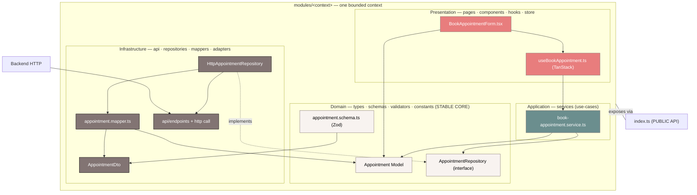

# ClinicOS — Feature / Module Architecture (Phase 2 · Part 4)

> **Phase 2 of the ClinicOS Frontend Engineering Bible — Part 4.**
> This document **extends** [Phase 1](../Brain.md) and the [Phase 2 README](./README.md). It **never contradicts** them. It specifies the **one** internal structure that **every** ClinicOS module follows, the responsibility of **every** folder and file in that template, and a **fully worked, copy-paste-real** example module.
>
> If you are about to write code inside a module, this is the law for _where_ each line goes.

**Read first:** [Brain.md](../Brain.md) (Phase 1 laws) → [README.md](./README.md) (Phase 2 evolution) → this file.
**Read alongside:** [FolderStructure.md](./FolderStructure.md) · [DependencyRules.md](./DependencyRules.md) · [BrainRules.md](./BrainRules.md).

---

## 1. Purpose

This is the **Feature / Module Architecture**: the rulebook for the **inside** of a module. Where [FolderStructure.md](./FolderStructure.md) describes the whole `src/` tree and [DependencyRules.md](./DependencyRules.md) describes the import matrix _between_ layers and modules, **this document zooms into a single `modules/<context>/` package** and proves that all of them are structurally identical.

It exists so that:

- A developer who has worked in **one** module can work in **every** module on day one.
- An AI agent scaffolding a feature has **exactly one** correct answer for "which folder does this file go in?"
- The **Phase 1 backend-independence pipeline** — `HTTP → DTO → Mapper → Model → Repository → Service → Query-hook → UI` — is reproduced, byte-for-byte, **inside** each bounded context.

| Linked canon                               | Why you need it here                                                            |
| ------------------------------------------ | ------------------------------------------------------------------------------- |
| [Brain.md](../Brain.md)                    | The 8 Non-Negotiable Laws, the decoupling pipeline, tokens, a11y, i18n, naming. |
| [FolderStructure.md](./FolderStructure.md) | The full `src/` tree and the 7-field contract per top-level folder.             |
| [DependencyRules.md](./DependencyRules.md) | The cross-layer / cross-module import matrix and anti-God rules.                |
| [BrainRules.md](./BrainRules.md)           | How scaffolding a module updates the PROJECT_BRAIN registries.                  |

This document **inherits, and does not restate, the eight non-negotiable product laws** from [Brain.md](../Brain.md) §2. Every example below already obeys them: tokens not hex, i18n keys not strings, repositories not `fetch`, services not components-calling-HTTP.

---

## 2. Module philosophy — a module is a mini Clean Architecture app

> **A module is a bounded context.** A bounded context is a **mini Clean Architecture application** with its own Presentation, Application, Domain, and Infrastructure layers — living behind a single `index.ts` public API.

This is the **single structural evolution** ratified in [README.md](./README.md) §0 (ADR-0001). Phase 1's flat FSD slices (`features/ entities/ widgets/`) are now organized **by bounded context** inside `src/modules/<context>/`. **Nothing else changed** — the Dependency Rule, the decoupling pipeline, tokens, a11y, and i18n are identical.

### The 4 internal layers and which folders belong to each

| Internal layer     | Owns                                          | Folders in the template                              | Knows about                                                                       |
| ------------------ | --------------------------------------------- | ---------------------------------------------------- | --------------------------------------------------------------------------------- |
| **Presentation**   | Pixels, interaction, local UI state           | `pages/` · `components/` · `hooks/` · `store/`       | Application (via services/hooks) + Domain **Models**. Never Infrastructure.       |
| **Application**    | Use-cases / business rules                    | `services/`                                          | Domain interfaces + Domain Models. Orchestrates repositories. Framework-agnostic. |
| **Domain**         | The stable core — the language of the context | `types/` · `schemas/` · `validators/` · `constants/` | **Nothing.** No React, no HTTP, no framework. The center of the onion.            |
| **Infrastructure** | Talking to the outside world                  | `api/` · `repositories/` · `mappers/` · `adapters/`  | Domain (it _implements_ Domain interfaces) + `shared/api`.                        |

> Module-root files (`index.ts`, `routes.tsx`, `permissions.ts`, `README.md`, `BRAIN.md`) and `utils/` + `config/` + `tests/` are **layer-crossing infrastructure of the module itself** — they wire the four layers together and expose them. See §3.

### The intra-module Dependency Rule (verbatim from [README.md](./README.md) §2)

```
Presentation (pages, components, hooks, store)
        ↓ may call
Application (services / use-cases)
        ↓ depends on interfaces of
Domain (types/models, schemas, validators, constants)   ← the stable core
        ↑ implemented by
Infrastructure (api, repositories, mappers, adapters)
```

- **Presentation never imports Infrastructure directly** — it goes through `services`/`hooks`.
- **Infrastructure depends on Domain interfaces, never the reverse.**
- This **is** the Phase 1 backend-independence pipeline, localized to one context.

### Mermaid — the module as an onion + the pipeline through it



**Read the arrows:** data flows **down** through Presentation → Application → Domain interface, and Infrastructure points **up** into the Domain it implements. The Domain core points at nothing. That is Clean Architecture, and it is exactly the Phase 1 pipeline.

---

## 3. THE CANONICAL MODULE TEMPLATE

Every module reproduces **this exact tree** (from [README.md](./README.md) §2 — do not add, rename, or reorder folders):

```
modules/<module-name>/
├── index.ts          # PUBLIC API — the ONLY legal import surface for other modules / app / processes
├── routes.tsx        # Module route subtree (lazy-loaded)
├── permissions.ts    # Module permission definitions (RBAC)
├── README.md         # Module overview, owners, public API, dependencies
├── BRAIN.md          # Module Brain Notes (decisions, local registries, TODOs, debt)
├── pages/            # Route-level screens — composition only (Presentation)
├── components/       # Module-local presentational components (Presentation)
├── hooks/            # Module-local hooks (Presentation ⇄ Application)
├── services/         # Use-cases / business logic — orchestrate repositories (Application)
├── repositories/     # Data access: interface + impl, returns domain Models (Infrastructure)
├── api/              # Endpoints + TanStack Query/mutation hooks + http calls (Infrastructure)
├── mappers/          # DTO ⇄ Model pure mapping (Infrastructure→Domain boundary)
├── adapters/         # Adapt 3rd-party / cross-module contracts (Infrastructure)
├── types/            # Module domain Models + DTO types (Domain)
├── schemas/          # Zod schemas: DTO validation + form schemas (Domain)
├── validators/       # Domain validation rules (Domain)
├── constants/        # Module constants (Domain)
├── utils/            # Module pure utilities
├── store/            # Module-local Zustand store (UI state only — never server data)
├── config/           # Module config + feature flags
└── tests/            # Module integration tests (unit tests co-located with source)
```

Below, **one tight subsection per folder/file**: what lives here · what must NOT · naming · one-line example. Naming follows [Brain.md](../Brain.md) §12 and [NamingConvention.md](./NamingConvention.md).

### `index.ts` — the public API (the only legal import surface)

- **What lives here:** Re-exports of the module's _intended_ surface — `routes`, `permissions`, a few widget-grade components, selected hooks and Domain **types**.
- **Must NOT:** Re-export repositories, mappers, DTOs, services, or the store. No `export *` of internal folders. Deep-importing past this file is **linted-forbidden**.
- **Naming:** Always `index.ts` at the module root.
- **Example:** `export { appointmentsRoutes } from './routes';`

### `routes.tsx` — the lazy-loaded route subtree

- **What lives here:** The module's `RouteObject[]`, each `page` wrapped in `React.lazy` + a permission `<Can>`/loader guard, using path constants from `shared/config` / `src/routes`.
- **Must NOT:** Contain page JSX, data fetching, or business logic. It maps paths → lazy pages only.
- **Naming:** `routes.tsx` (one per module).
- **Example:** `{ path: 'appointments/book', element: lazy(() => import('./pages/BookAppointmentPage')) }`.

### `permissions.ts` — module RBAC definitions

- **What lives here:** The permission **constants** this module owns (`UPPER_SNAKE_CASE`) plus their registration metadata, consumed by `shared/permissions`.
- **Must NOT:** Implement the RBAC engine (that's `shared/permissions`) or call the API.
- **Naming:** `permissions.ts`; keys like `APPOINTMENTS_BOOK`.
- **Example:** `export const APPOINTMENTS_PERMISSIONS = { BOOK: 'appointments:book', CANCEL: 'appointments:cancel' } as const;`

### `README.md` — module overview

- **What lives here:** One-paragraph purpose, owning team (CODEOWNERS), the **public API list**, allowed dependencies, and links to global canon.
- **Must NOT:** Duplicate global architecture; link to it instead.
- **Naming:** `README.md`.
- **Example:** "Owner: @clinicos/scheduling-team. Public API: `appointmentsRoutes`, `AppointmentChip`, `useUpcomingAppointments`."

### `BRAIN.md` — module Brain Notes

- **What lives here:** Module-local **decisions** (mini-ADRs), local registries (entities/services/permissions defined here), TODOs, and tech debt. Feeds the global PROJECT_BRAIN per [BrainRules.md](./BrainRules.md).
- **Must NOT:** Hold secrets or contradict the global Brain.
- **Naming:** `BRAIN.md` (uppercase, distinct from `Brain.md`).
- **Example:** "DEBT: `slot.adapter` still polls; migrate to WS when gateway ships (TODO-APPT-14)."

### `pages/` — route-level screens (Presentation)

- **What lives here:** One component per route; **composition only** — arrange components, wire hooks, define the 4 async states ([Brain.md](../Brain.md) §11), set page title/SEO/skip-link.
- **Must NOT:** Contain business rules, mappers, or direct repository/HTTP calls.
- **Naming:** `PascalCasePage.tsx` → `AppointmentsPage.tsx`.
- **Example:** `BookAppointmentPage.tsx` renders `<BookAppointmentForm/>` inside the page layout.

### `components/` — module-local presentational components (Presentation)

- **What lives here:** Components specific to this context (forms, cards, chips) built **only** from `shared/design-system` primitives + tokens + i18n.
- **Must NOT:** Fetch data, hold server state, hardcode color/size/string, or be imported by another module (promote to `shared/design-system` or expose via `index.ts` if shared).
- **Naming:** `PascalCase.tsx` → `BookAppointmentForm.tsx`.
- **Example:** `AppointmentSlotPicker.tsx` renders selectable slots from props.

### `hooks/` — module-local hooks (Presentation ⇄ Application)

- **What lives here:** Hooks that bind Presentation to Application — TanStack Query/mutation wrappers that call **services**, plus small view-model hooks.
- **Must NOT:** Call `HttpClient` directly or contain mapping logic.
- **Naming:** `useThing.ts` → `useBookAppointment.ts`.
- **Example:** `useUpcomingAppointments.ts` wraps a query over `appointmentRepository.listUpcoming()`.

### `services/` — use-cases / business logic (Application)

- **What lives here:** Framework-agnostic use-case functions/classes that orchestrate repositories and enforce business rules ("can't double-book a slot").
- **Must NOT:** Import React, `fetch`/`axios`, DTOs, or mappers. Depends on **repository interfaces**, not impls.
- **Naming:** `thing.service.ts` → `book-appointment.service.ts`.
- **Example:** `bookAppointment(input)` validates availability, then calls `repo.create(model)`.

### `repositories/` — data access (Infrastructure)

- **What lives here:** The repository **interface** (Domain-owned shape) + its HTTP **implementation**; returns domain **Models**, never DTOs; depends on `shared/api` `HttpClient` and the module's mappers.
- **Must NOT:** Leak DTOs upward, contain UI, or hold React state.
- **Naming:** `thing.repository.ts` → `appointment.repository.ts`.
- **Example:** `HttpAppointmentRepository.create(model)` → maps to DTO, POSTs, maps response back to Model.

### `api/` — endpoints + http calls (Infrastructure)

- **What lives here:** Endpoint path builders and the thin `HttpClient` calls used by repositories; optionally low-level query-key factories.
- **Must NOT:** Contain mapping, business rules, or components. (UI-facing query hooks live in `hooks/`; this is the wire layer.)
- **Naming:** `thing.endpoints.ts`, `thing.api.ts`.
- **Example:** `export const appointmentEndpoints = { create: () => '/v1/appointments' };`

### `mappers/` — DTO ⇄ Model pure mapping (Infrastructure→Domain boundary)

- **What lives here:** Pure `toModel` / `toDto` functions — the **only** place that knows both the DTO and the Model shape.
- **Must NOT:** Do I/O, throw on network, or import React. Pure in, pure out.
- **Naming:** `thing.mapper.ts` → `appointment.mapper.ts`.
- **Example:** `toAppointment(dto): Appointment` renames `scheduled_at` → `scheduledAt`.

### `adapters/` — adapt 3rd-party / cross-module contracts (Infrastructure)

- **What lives here:** Adapters that translate an external SDK or **another module's public type** into this module's Domain shape (anti-corruption layer).
- **Must NOT:** Be a dumping ground for business logic; keep them thin translators.
- **Naming:** `thing.adapter.ts` → `patient-summary.adapter.ts`.
- **Example:** `toAppointmentPatient(entityPatient)` narrows `entities/patient` Model to the fields this module needs.

### `types/` — Domain Models + DTO types (Domain)

- **What lives here:** The stable, UI-shaped **Model** types components see, plus the **DTO** type aliases (raw backend shape). The language of the context.
- **Must NOT:** Import React, Zod runtime, or Infrastructure. Types only.
- **Naming:** `thing.types.ts` → `appointment.types.ts`.
- **Example:** `export interface Appointment { id: string; scheduledAt: string; status: AppointmentStatus; }`

### `schemas/` — Zod schemas (Domain)

- **What lives here:** Zod schemas for **DTO validation at the boundary** and **form schemas** (RHF resolver source).
- **Must NOT:** Perform I/O. (DTO _types_ are inferred from these schemas to keep them in lockstep.)
- **Naming:** `thing.schema.ts` → `appointment.schema.ts`.
- **Example:** `export const appointmentDtoSchema = z.object({ id: z.string().uuid(), scheduled_at: z.string() });`

### `validators/` — domain validation rules (Domain)

- **What lives here:** Pure business-rule validators beyond shape ("slot must be in the future", "duration within clinic hours").
- **Must NOT:** Touch HTTP, React, or i18n rendering (return error codes, not localized strings).
- **Naming:** `thing.validator.ts` → `slot.validator.ts`.
- **Example:** `isSlotBookable(slot, now): Result<true, SlotError>`.

### `constants/` — module constants (Domain)

- **What lives here:** `UPPER_SNAKE_CASE` constants and enums specific to the context (statuses, limits, default durations).
- **Must NOT:** Hold env config (that's `config/`) or design values (those are tokens).
- **Naming:** `thing.constants.ts`; keys `UPPER_SNAKE_CASE`.
- **Example:** `export const DEFAULT_SLOT_MINUTES = 15;`

### `utils/` — module pure utilities

- **What lives here:** Small pure helpers used only inside this module (formatting a slot label from Model fields).
- **Must NOT:** Import Infrastructure or React; if reused across modules, promote to `shared/utils`.
- **Naming:** `thing.utils.ts` → `slot.utils.ts`.
- **Example:** `formatSlotRange(start, end): string` (locale-aware via `shared/lib`).

### `store/` — module-local Zustand store (UI state only)

- **What lives here:** A sliced Zustand store for **module UI state** (selected tab, draft filters, wizard step).
- **Must NOT:** Cache server data — that lives in TanStack Query ([Brain.md](../Brain.md) §9). No DTOs, no Models-from-server.
- **Naming:** `thing.store.ts` → `appointments.store.ts`.
- **Example:** `useAppointmentsUiStore` holding `{ view: 'day' | 'week' }`.

### `config/` — module config + feature flags

- **What lives here:** Module feature flags and tunables read from `shared/config`/env at the module edge.
- **Must NOT:** Hardcode secrets or duplicate global env parsing.
- **Naming:** `thing.config.ts` → `appointments.config.ts`.
- **Example:** `export const appointmentsConfig = { waitlistEnabled: flags.waitlist };`

### `tests/` — module integration tests

- **What lives here:** Integration tests that exercise the module through its public surface (render a page, MSW-mock the API, assert the journey). Unit tests are **co-located** with source (`*.test.ts(x)` next to the file).
- **Must NOT:** Reach into another module's internals; use `testing/` helpers + `mock/` handlers.
- **Naming:** `*.test.tsx` / `*.spec.ts` (E2E).
- **Example:** `book-appointment.flow.test.tsx` renders `BookAppointmentPage` and books a slot end-to-end.

---

## 4. FULLY WORKED EXAMPLE — `modules/appointments/`

The bounded context for scheduling. Populated tree with realistic names:

```
modules/appointments/
├── index.ts
├── routes.tsx
├── permissions.ts
├── README.md
├── BRAIN.md
├── pages/
│   ├── AppointmentsPage.tsx
│   └── BookAppointmentPage.tsx
├── components/
│   ├── BookAppointmentForm.tsx
│   ├── AppointmentSlotPicker.tsx
│   └── AppointmentChip.tsx
├── hooks/
│   ├── useBookAppointment.ts
│   └── useUpcomingAppointments.ts
├── services/
│   ├── book-appointment.service.ts
│   └── book-appointment.service.test.ts        # co-located unit test
├── repositories/
│   └── appointment.repository.ts               # interface + http impl
├── api/
│   └── appointment.endpoints.ts
├── mappers/
│   ├── appointment.mapper.ts
│   └── appointment.mapper.test.ts              # co-located unit test
├── adapters/
│   └── patient-summary.adapter.ts
├── types/
│   └── appointment.types.ts                    # Model + DTO types
├── schemas/
│   ├── appointment.dto.ts                      # Zod DTO (boundary)
│   └── appointment.schema.ts                   # Zod form schema
├── validators/
│   └── slot.validator.ts
├── constants/
│   └── appointment.constants.ts
├── utils/
│   └── slot.utils.ts
├── store/
│   └── appointments.store.ts
├── config/
│   └── appointments.config.ts
└── tests/
    └── book-appointment.flow.test.tsx          # integration
```

Now the **end-to-end code path** for **"book an appointment,"** in pipeline order. Every file below is real, strict TypeScript consistent with Phase 1 naming and laws.

### 4.1 `schemas/appointment.dto.ts` — Zod DTO (boundary validation)

> Per [Brain.md](../Brain.md) §5.3, the **DTO is the raw backend shape, validated with Zod at the boundary.** DTO _types_ are inferred from the schema so they can never drift.

```ts
// modules/appointments/schemas/appointment.dto.ts
import { z } from 'zod';

/** Raw backend shape. snake_case, exactly as the API returns it. */
export const appointmentDtoSchema = z.object({
  id: z.string().uuid(),
  patient_id: z.string().uuid(),
  doctor_id: z.string().uuid(),
  scheduled_at: z.string().datetime(), // ISO 8601 from backend
  duration_min: z.number().int().positive(),
  status: z.enum(['pending', 'confirmed', 'cancelled', 'completed']),
  reason: z.string().nullable(),
  created_at: z.string().datetime(),
});

/** The request body the backend expects when creating an appointment. */
export const createAppointmentDtoSchema = z.object({
  patient_id: z.string().uuid(),
  doctor_id: z.string().uuid(),
  scheduled_at: z.string().datetime(),
  duration_min: z.number().int().positive(),
  reason: z.string().nullable(),
});

export type AppointmentDto = z.infer<typeof appointmentDtoSchema>;
export type CreateAppointmentDto = z.infer<typeof createAppointmentDtoSchema>;
```

### 4.2 `schemas/appointment.schema.ts` — form schema (RHF + Zod resolver)

> The **form** schema is UI-shaped and **localizes errors via i18n keys** ([Brain.md](../Brain.md) §8) — never hardcoded strings.

```ts
// modules/appointments/schemas/appointment.schema.ts
import { z } from 'zod';
import { DEFAULT_SLOT_MINUTES } from '../constants/appointment.constants';

/** Form values the user fills in. Errors are i18n KEYS, resolved at render. */
export const bookAppointmentFormSchema = z.object({
  patientId: z.string().uuid({ message: 'appointments.book.error.patientRequired' }),
  doctorId: z.string().uuid({ message: 'appointments.book.error.doctorRequired' }),
  scheduledAt: z.string().datetime({ message: 'appointments.book.error.slotInvalid' }),
  durationMin: z.number().int().positive().default(DEFAULT_SLOT_MINUTES),
  reason: z.string().max(280, 'appointments.book.error.reasonTooLong').nullable(),
});

export type BookAppointmentFormValues = z.infer<typeof bookAppointmentFormSchema>;
```

### 4.3 `mappers/appointment.mapper.ts` — pure DTO ⇄ Model

> The **only** place that knows both shapes. Pure. Renaming `scheduled_at` → `scheduledAt` lives **here and nowhere else** — that is the "10 years without a rewrite" promise ([Brain.md](../Brain.md) §5.3).

```ts
// modules/appointments/mappers/appointment.mapper.ts
import type { Appointment, CreateAppointmentInput } from '../types/appointment.types';
import type { AppointmentDto, CreateAppointmentDto } from '../schemas/appointment.dto';

/** DTO (snake_case backend) → Model (camelCase, UI-shaped, stable). */
export function toAppointment(dto: AppointmentDto): Appointment {
  return {
    id: dto.id,
    patientId: dto.patient_id,
    doctorId: dto.doctor_id,
    scheduledAt: dto.scheduled_at,
    durationMin: dto.duration_min,
    status: dto.status,
    reason: dto.reason,
    createdAt: dto.created_at,
  };
}

/** Model input → DTO (request body the backend expects). */
export function toCreateAppointmentDto(input: CreateAppointmentInput): CreateAppointmentDto {
  return {
    patient_id: input.patientId,
    doctor_id: input.doctorId,
    scheduled_at: input.scheduledAt,
    duration_min: input.durationMin,
    reason: input.reason ?? null,
  };
}
```

### 4.4 `types/appointment.types.ts` — the Domain Model

> The **stable, UI-shaped domain type** components see. No React, no Zod runtime, no Infrastructure.

```ts
// modules/appointments/types/appointment.types.ts

export type AppointmentStatus = 'pending' | 'confirmed' | 'cancelled' | 'completed';

/** The Model. Every component, hook, and service speaks THIS shape. */
export interface Appointment {
  id: string;
  patientId: string;
  doctorId: string;
  scheduledAt: string; // ISO 8601
  durationMin: number;
  status: AppointmentStatus;
  reason: string | null;
  createdAt: string;
}

/** Use-case input for booking — Model-shaped, never a DTO. */
export interface CreateAppointmentInput {
  patientId: string;
  doctorId: string;
  scheduledAt: string;
  durationMin: number;
  reason: string | null;
}
```

### 4.5 `repositories/appointment.repository.ts` — interface + HTTP impl

> Repository = **interface + impl; returns Models, never DTOs; depends on `HttpClient`** ([Brain.md](../Brain.md) §5.3). It validates the DTO at the boundary, then maps to Model.

```ts
// modules/appointments/repositories/appointment.repository.ts
import type { HttpClient } from '@/shared/api';
import { appointmentDtoSchema } from '../schemas/appointment.dto';
import { appointmentEndpoints } from '../api/appointment.endpoints';
import { toAppointment, toCreateAppointmentDto } from '../mappers/appointment.mapper';
import type { Appointment, CreateAppointmentInput } from '../types/appointment.types';

/** Domain-owned interface. Services depend on THIS, not the impl. */
export interface AppointmentRepository {
  create(input: CreateAppointmentInput): Promise<Appointment>;
  listUpcoming(patientId: string): Promise<Appointment[]>;
}

/** Infrastructure implementation. Knows HTTP; returns Models only. */
export class HttpAppointmentRepository implements AppointmentRepository {
  constructor(private readonly http: HttpClient) {}

  async create(input: CreateAppointmentInput): Promise<Appointment> {
    const body = toCreateAppointmentDto(input);
    const raw = await this.http.post(appointmentEndpoints.create(), body);
    const dto = appointmentDtoSchema.parse(raw); // validate at the boundary
    return toAppointment(dto);
  }

  async listUpcoming(patientId: string): Promise<Appointment[]> {
    const raw = await this.http.get(appointmentEndpoints.listUpcoming(patientId));
    return appointmentDtoSchema.array().parse(raw).map(toAppointment);
  }
}
```

```ts
// modules/appointments/api/appointment.endpoints.ts
export const appointmentEndpoints = {
  create: () => '/v1/appointments',
  listUpcoming: (patientId: string) => `/v1/patients/${patientId}/appointments?filter=upcoming`,
} as const;
```

### 4.6 `services/book-appointment.service.ts` — the use-case (Application)

> Business rules orchestrating repositories; **framework-agnostic**. Depends on the **interface**, gets it via the DI container from `shared/core`. No React, no HTTP.

```ts
// modules/appointments/services/book-appointment.service.ts
import type { Result } from '@/shared/core';
import { ok, err } from '@/shared/core';
import type { AppointmentRepository } from '../repositories/appointment.repository';
import type { Appointment, CreateAppointmentInput } from '../types/appointment.types';
import { isSlotBookable, type SlotError } from '../validators/slot.validator';

export interface BookAppointmentDeps {
  repo: AppointmentRepository;
  now: () => Date;
}

/**
 * Use-case: book an appointment.
 * Enforces the business rule "slot must be bookable" before persisting.
 */
export async function bookAppointment(
  input: CreateAppointmentInput,
  deps: BookAppointmentDeps,
): Promise<Result<Appointment, SlotError>> {
  const check = isSlotBookable(
    { scheduledAt: input.scheduledAt, durationMin: input.durationMin },
    deps.now(),
  );
  if (!check.ok) return err(check.error);

  const appointment = await deps.repo.create(input);
  return ok(appointment);
}
```

```ts
// modules/appointments/validators/slot.validator.ts
import type { Result } from '@/shared/core';
import { ok, err } from '@/shared/core';

export type SlotError = 'SLOT_IN_PAST' | 'SLOT_TOO_SHORT';

export function isSlotBookable(
  slot: { scheduledAt: string; durationMin: number },
  now: Date,
): Result<true, SlotError> {
  if (new Date(slot.scheduledAt).getTime() <= now.getTime()) return err('SLOT_IN_PAST');
  if (slot.durationMin < 5) return err('SLOT_TOO_SHORT');
  return ok(true);
}
```

### 4.7 `hooks/useBookAppointment.ts` — TanStack mutation hook (Presentation ⇄ Application)

> The hook binds UI to the use-case. **Server state lives only in TanStack Query** ([Brain.md](../Brain.md) §9). It calls the **service**, never the repository or HTTP directly.

```ts
// modules/appointments/hooks/useBookAppointment.ts
import { useMutation, useQueryClient } from '@tanstack/react-query';
import { useContainer } from '@/shared/core';
import { useNotify } from '@/shared/notifications';
import { bookAppointment } from '../services/book-appointment.service';
import type { AppointmentRepository } from '../repositories/appointment.repository';
import type { CreateAppointmentInput } from '../types/appointment.types';

export function useBookAppointment(patientId: string) {
  const queryClient = useQueryClient();
  const notify = useNotify();
  const repo = useContainer<AppointmentRepository>('appointments.repository');

  return useMutation({
    mutationKey: ['appointments', 'book'],
    mutationFn: async (input: CreateAppointmentInput) => {
      const result = await bookAppointment(input, { repo, now: () => new Date() });
      if (!result.ok) {
        // typed AppError → localized message, per Brain §11 (error state)
        throw new Error(`appointments.book.error.${result.error}`);
      }
      return result.value;
    },
    onSuccess: () => {
      queryClient.invalidateQueries({ queryKey: ['appointments', 'upcoming', patientId] });
      notify.success('appointments.book.success'); // i18n key
    },
    onError: (e) => notify.error(e.message), // already an i18n key
  });
}
```

### 4.8 `components/BookAppointmentForm.tsx` — RHF + Zod, tokens, i18n, a11y

> Built **only** from `shared/design-system` primitives. Tokens not hex, i18n keys not strings, labels/aria/errors localized, ≥44px targets, `:focus-visible` rings — all per [Brain.md](../Brain.md) §6–8.

```tsx
// modules/appointments/components/BookAppointmentForm.tsx
import { useForm } from 'react-hook-form';
import { zodResolver } from '@hookform/resolvers/zod';
import { useTranslation } from 'react-i18next';
import { Form, Field, Select, Textarea, Button } from '@/shared/design-system';
import {
  bookAppointmentFormSchema,
  type BookAppointmentFormValues,
} from '../schemas/appointment.schema';
import { AppointmentSlotPicker } from './AppointmentSlotPicker';
import { useBookAppointment } from '../hooks/useBookAppointment';

interface BookAppointmentFormProps {
  patientId: string;
  onBooked?: (appointmentId: string) => void;
}

export function BookAppointmentForm({ patientId, onBooked }: BookAppointmentFormProps) {
  const { t } = useTranslation('appointments');
  const book = useBookAppointment(patientId);

  const form = useForm<BookAppointmentFormValues>({
    resolver: zodResolver(bookAppointmentFormSchema),
    defaultValues: { patientId, reason: null },
  });

  const onSubmit = form.handleSubmit(async (values) => {
    const result = await book.mutateAsync({ ...values, reason: values.reason ?? null });
    onBooked?.(result.id);
  });

  return (
    <Form onSubmit={onSubmit} aria-busy={book.isPending} noValidate>
      <Field
        label={t('book.field.doctor')}
        error={form.formState.errors.doctorId && t(form.formState.errors.doctorId.message!)}
      >
        <Select {...form.register('doctorId')} aria-label={t('book.field.doctor')} />
      </Field>

      <Field
        label={t('book.field.slot')}
        error={form.formState.errors.scheduledAt && t(form.formState.errors.scheduledAt.message!)}
      >
        <AppointmentSlotPicker
          doctorId={form.watch('doctorId')}
          value={form.watch('scheduledAt')}
          onChange={(iso) => form.setValue('scheduledAt', iso, { shouldValidate: true })}
        />
      </Field>

      <Field label={t('book.field.reason')} optional>
        <Textarea {...form.register('reason')} maxLength={280} />
      </Field>

      {/* tokens + i18n + a11y: Button is a design-system primitive; ≥44px target, focus ring built in */}
      <Button type="submit" variant="primary" loading={book.isPending}>
        {t('book.action.confirm')}
      </Button>
    </Form>
  );
}
```

### 4.9 `pages/AppointmentsPage.tsx` & `pages/BookAppointmentPage.tsx`

> Pages **compose only** and define the 4 async states ([Brain.md](../Brain.md) §11).

```tsx
// modules/appointments/pages/BookAppointmentPage.tsx
import { useTranslation } from 'react-i18next';
import { PageLayout, PageHeader } from '@/shared/design-system';
import { BookAppointmentForm } from '../components/BookAppointmentForm';

export default function BookAppointmentPage() {
  const { t } = useTranslation('appointments');
  return (
    <PageLayout>
      <PageHeader title={t('book.title')} subtitle={t('book.subtitle')} />
      <BookAppointmentForm patientId="" /> {/* patientId injected by route loader/context */}
    </PageLayout>
  );
}
```

```tsx
// modules/appointments/pages/AppointmentsPage.tsx
import { useTranslation } from 'react-i18next';
import { PageLayout, PageHeader, EmptyState, Skeleton, ErrorState } from '@/shared/design-system';
import { useUpcomingAppointments } from '../hooks/useUpcomingAppointments';
import { AppointmentChip } from '../components/AppointmentChip';

export default function AppointmentsPage({ patientId }: { patientId: string }) {
  const { t } = useTranslation('appointments');
  const q = useUpcomingAppointments(patientId);

  return (
    <PageLayout>
      <PageHeader title={t('list.title')} />
      {q.isPending && <Skeleton rows={4} />} {/* Loading */}
      {q.isError && <ErrorState message={t('list.error')} onRetry={q.refetch} />} {/* Error  */}
      {q.isSuccess && q.data.length === 0 && (
        <EmptyState title={t('list.empty.title')} actionLabel={t('list.empty.cta')} /> /* Empty */
      )}
      {q.isSuccess && q.data.map((a) => <AppointmentChip key={a.id} appointment={a} />)}{' '}
      {/* Success */}
    </PageLayout>
  );
}
```

### 4.10 `routes.tsx` — lazy route subtree

```tsx
// modules/appointments/routes.tsx
import { lazy } from 'react';
import type { RouteObject } from 'react-router-dom';
import { Can } from '@/shared/permissions';
import { APPOINTMENTS_PERMISSIONS } from './permissions';

const AppointmentsPage = lazy(() => import('./pages/AppointmentsPage'));
const BookAppointmentPage = lazy(() => import('./pages/BookAppointmentPage'));

export const appointmentsRoutes: RouteObject[] = [
  { path: 'appointments', element: <AppointmentsPage patientId="" /> },
  {
    path: 'appointments/book',
    element: (
      <Can permission={APPOINTMENTS_PERMISSIONS.BOOK} fallback="/403">
        <BookAppointmentPage />
      </Can>
    ),
  },
];
```

### 4.11 `permissions.ts`

```ts
// modules/appointments/permissions.ts
export const APPOINTMENTS_PERMISSIONS = {
  BOOK: 'appointments:book',
  CANCEL: 'appointments:cancel',
  RESCHEDULE: 'appointments:reschedule',
  VIEW: 'appointments:view',
} as const;

export type AppointmentPermission =
  (typeof APPOINTMENTS_PERMISSIONS)[keyof typeof APPOINTMENTS_PERMISSIONS];
```

### 4.12 The path, in one line

```
appointment.dto.ts (Zod boundary) ─► appointment.schema.ts (form) ─► appointment.mapper.ts (pure)
   ─► appointment.types.ts (Model) ─► appointment.repository.ts (iface+http) ─► book-appointment.service.ts (use-case)
   ─► useBookAppointment.ts (TanStack mutation) ─► BookAppointmentForm.tsx (RHF+Zod+tokens+i18n+a11y)
   ─► AppointmentsPage.tsx ─► routes.tsx ─► permissions.ts
```

That is the Phase 1 pipeline, executed inside one module, with **zero** component-to-HTTP coupling.

---

## 5. SECOND & THIRD EXAMPLES — proof every module is identical

The **same template**, folders only, for two more contexts. Note: structurally indistinguishable from `appointments/`.

### `modules/queue/`

```
modules/queue/
├── index.ts
├── routes.tsx
├── permissions.ts
├── README.md
├── BRAIN.md
├── pages/            # QueueBoardPage.tsx, QueueDetailPage.tsx
├── components/       # QueueTicketCard.tsx, CallNextButton.tsx
├── hooks/            # useLiveQueue.ts, useCallNext.ts
├── services/         # call-next.service.ts, requeue.service.ts
├── repositories/     # queue.repository.ts (interface + http impl)
├── api/              # queue.endpoints.ts
├── mappers/          # queue-ticket.mapper.ts
├── adapters/         # patient-summary.adapter.ts
├── types/            # queue.types.ts (QueueTicket Model + DTO types)
├── schemas/          # queue-ticket.dto.ts, queue.schema.ts
├── validators/       # ticket.validator.ts
├── constants/        # queue.constants.ts (MAX_QUEUE_SIZE)
├── utils/            # wait-time.utils.ts
├── store/            # queue.store.ts (board view UI state)
├── config/           # queue.config.ts
└── tests/            # call-next.flow.test.tsx
```

### `modules/pharmacy/`

```
modules/pharmacy/
├── index.ts
├── routes.tsx
├── permissions.ts
├── README.md
├── BRAIN.md
├── pages/            # DispensePage.tsx, StockPage.tsx
├── components/       # DispenseForm.tsx, StockLevelBadge.tsx
├── hooks/            # useDispense.ts, useStockLevels.ts
├── services/         # dispense.service.ts, reconcile-stock.service.ts
├── repositories/     # pharmacy.repository.ts (interface + http impl)
├── api/              # pharmacy.endpoints.ts
├── mappers/          # dispense.mapper.ts, stock-item.mapper.ts
├── adapters/         # prescription.adapter.ts
├── types/            # pharmacy.types.ts (StockItem, DispenseRecord Models)
├── schemas/          # dispense.dto.ts, dispense.schema.ts
├── validators/       # dispense.validator.ts
├── constants/        # pharmacy.constants.ts
├── utils/            # dosage.utils.ts
├── store/            # pharmacy.store.ts
├── config/           # pharmacy.config.ts
└── tests/            # dispense.flow.test.tsx
```

> Same 18 folders + 5 root files, every time. That uniformity **is** the architecture (see the Decision block, §10). The canonical module set is fixed in [README.md](./README.md) §2:
> `patients · appointments · queue · consultation · prescriptions · pharmacy · billing · follow-up · records · analytics · settings · doctor · reception · admin`.

---

## 6. How features compose entities and shared design-system

A module is **not** an island. It composes two kinds of reusable code, per the top-level dependency order `app → processes → modules → entities → shared` ([README.md](./README.md) §1).

### Composing global `entities/` (shared domain nouns)

Domain nouns shared across **many** modules — `patient`, `clinic`, `doctor`, `user`, `tenant` — live in top-level `entities/`, **not** inside a module. `appointments/` needs the patient, but does **not** own it.

- A module imports an entity **only via the entity's public API**: `import { usePatient, type Patient } from '@/entities/patient';`
- It **narrows** that entity to its own needs through an **adapter** (anti-corruption layer), keeping the module's Domain stable if the entity evolves:

```ts
// modules/appointments/adapters/patient-summary.adapter.ts
import type { Patient } from '@/entities/patient';

export interface AppointmentPatient {
  id: string;
  displayName: string;
}

/** Narrow the global Patient entity to what this module actually needs. */
export function toAppointmentPatient(p: Patient): AppointmentPatient {
  return { id: p.id, displayName: p.fullName };
}
```

> Rule: a local concept used by one module stays in that module's `types/`; a concept used by **two or more** modules is promoted to `entities/`. Never duplicate; never import another module's internal types — that is what `entities/` and `adapters/` are for.

### Composing `shared/design-system` (the UI kit)

Every visual atom comes from `shared/design-system` (Phase 1's `shared/ui`): tokenized primitives, CVA variants, stories. Module `components/` **assemble** these — they never reinvent buttons, never hardcode tokens.

```tsx
import { Button, Card, Field, Select } from '@/shared/design-system'; // ✅ always
// ❌ never: a bespoke <button style={{ background: '#E87D7D' }}> — that violates Brain §2 laws 5 & 6
```

If a module-local component becomes useful to **two** modules, promote it to `shared/design-system` (if domain-agnostic) or expose it via the owning module's `index.ts` (if domain-bearing).

---

## 7. Module public API (`index.ts`) — what's exposed, what stays private

> A module imports another module **only via its `index.ts`** ([README.md](./README.md) §3). The `index.ts` is the **contract**; everything else is private and deep-imports are linted-forbidden.

```ts
// modules/appointments/index.ts

// ── Routing & RBAC (consumed by app/ router and shared/permissions) ──
export { appointmentsRoutes } from './routes';
export { APPOINTMENTS_PERMISSIONS, type AppointmentPermission } from './permissions';

// ── A few widget-grade components other modules / pages may render ──
export { AppointmentChip } from './components/AppointmentChip';

// ── Selected hooks other contexts legitimately need ──
export { useUpcomingAppointments } from './hooks/useUpcomingAppointments';

// ── Selected Domain types (Models only — never DTOs) ──
export type { Appointment, AppointmentStatus } from './types/appointment.types';

// NOTHING else is exported. Repositories, services, mappers, schemas,
// the store, endpoints, and DTOs are PRIVATE to this module.
```

### ✅ Expose vs ❌ keep private

| Surface                                                   | Expose? | Why                                                          |
| --------------------------------------------------------- | ------- | ------------------------------------------------------------ |
| `routes`, `permissions`                                   | ✅      | The app router and RBAC engine must wire them.               |
| A few widget-grade `components` (e.g. `AppointmentChip`)  | ✅      | Other modules legitimately render them.                      |
| Selected query **hooks** (e.g. `useUpcomingAppointments`) | ✅      | Read access to this context's data, decoupled from its repo. |
| Domain **Model** types (`Appointment`)                    | ✅      | Other contexts type against the Model.                       |
| **DTO** types / `*.dto.ts`                                | ❌      | Backend shape must never leak past the module.               |
| `repositories`, `services`, `mappers`, `api`, `adapters`  | ❌      | Internal mechanics; swapping them must not break consumers.  |
| `store`, `validators`, `constants`, `utils`, `config`     | ❌      | Module-private implementation detail.                        |
| Internal `pages` / form `components`                      | ❌      | Composition detail; not a contract.                          |

> Litmus test: _if I rename or delete this file, should another module break?_ If **no**, it must **not** be in `index.ts`.

---

## 8. "Scaffold a new module" checklist

Follow in order. Ties into PROJECT_BRAIN per [BrainRules.md](./BrainRules.md).

1. **Confirm the bounded context** exists in the canonical module set ([README.md](./README.md) §2). If new, raise an **ADR** (`docs/adr/NNNN-*.md`) first — a new context is a structural change.
2. **Create `modules/<context>/`** and copy the **canonical template** (§3) verbatim — all 18 folders + 5 root files. Leave empty folders with a `.gitkeep` until filled. Do **not** add or rename folders.
3. **Write `README.md`**: purpose, owning team (CODEOWNERS), public API list, allowed dependencies.
4. **Seed `BRAIN.md`**: initial decisions, local registries, TODOs.
5. **Define the Domain first** (inside-out): `types/` (Models + DTO types) → `schemas/` (DTO + form Zod) → `validators/` → `constants/`.
6. **Build Infrastructure**: `api/` endpoints → `mappers/` (pure) → `repositories/` (interface + http impl) → `adapters/` if it consumes entities/other modules.
7. **Register the repository** in the DI container (`shared/core`) so services resolve it by token.
8. **Write Application**: `services/` use-cases against the repository **interface** (+ co-located `*.test.ts`).
9. **Build Presentation**: `hooks/` (TanStack wrappers over services) → `components/` (design-system + tokens + i18n + a11y) → `pages/` (compose + 4 async states) → `store/` for UI state.
10. **Declare `permissions.ts`** and wire `routes.tsx` (lazy + `<Can>` guards).
11. **Curate `index.ts`** — expose only routes, permissions, a few widgets, selected hooks/Model types (§7).
12. **Add i18n catalogs** under `locales/<lang>/<context>.json` for en/hi/mr/ur; **no hardcoded strings**.
13. **Tests**: co-located unit tests + `tests/` integration flow (§9).
14. **Update PROJECT_BRAIN registries** ([BrainRules.md](./BrainRules.md)): add the module to the **Module Registry**, its permissions to the **Permission Registry**, new entities to the **Entity Registry**, and any ADR to the **Decision Log**. _A module is not "done" until the registries reflect it._
15. **Wire the module's `routes` into `app/`** and confirm `eslint-plugin-boundaries` + `import/no-cycle` pass.

---

## 9. Testing inside a module

Two tiers, both using the **Phase 1 toolchain** ([Brain.md](../Brain.md) §4): **Vitest + React Testing Library**, **MSW** for the network, **jest-axe** for a11y, **Playwright** for cross-module E2E.

| Tier                   | Location                                                                                                   | Tool               | Tests                                                                                                                        |
| ---------------------- | ---------------------------------------------------------------------------------------------------------- | ------------------ | ---------------------------------------------------------------------------------------------------------------------------- |
| **Unit** (co-located)  | next to source: `appointment.mapper.test.ts`, `book-appointment.service.test.ts`, `slot.validator.test.ts` | Vitest             | Pure mappers, validators, services in isolation (services with a fake repository).                                           |
| **Integration**        | `modules/<context>/tests/`                                                                                 | Vitest + RTL + MSW | Render a page through the **public surface**, MSW-mock the API, assert the journey + the 4 async states + a11y (`jest-axe`). |
| **E2E** (cross-module) | top-level `e2e/` (not in-module)                                                                           | Playwright         | Full patient-journey flows spanning modules (orchestrated in `processes/`).                                                  |

```ts
// modules/appointments/services/book-appointment.service.test.ts (co-located unit)
import { describe, it, expect, vi } from 'vitest';
import { bookAppointment } from './book-appointment.service';
import type { AppointmentRepository } from '../repositories/appointment.repository';

describe('bookAppointment', () => {
  it('rejects a slot in the past without calling the repo', async () => {
    const repo: AppointmentRepository = { create: vi.fn(), listUpcoming: vi.fn() };
    const result = await bookAppointment(
      {
        patientId: 'p1',
        doctorId: 'd1',
        scheduledAt: '2000-01-01T10:00:00Z',
        durationMin: 15,
        reason: null,
      },
      { repo, now: () => new Date('2026-06-27T00:00:00Z') },
    );
    expect(result.ok).toBe(false);
    expect(repo.create).not.toHaveBeenCalled();
  });
});
```

```tsx
// modules/appointments/tests/book-appointment.flow.test.tsx (integration)
import { render, screen } from '@/testing'; // RTL render helper from src/testing
import { server, rest } from '@/mock'; // MSW handlers from src/mock
import userEvent from '@testing-library/user-event';
import { axe } from 'jest-axe';
import BookAppointmentPage from '../pages/BookAppointmentPage';

it('books an appointment end-to-end and is accessible', async () => {
  server.use(rest.post('/v1/appointments', (_req, res, ctx) => res(ctx.json(/* dto */))));
  const { container } = render(<BookAppointmentPage />);

  await userEvent.click(screen.getByRole('button', { name: /confirm/i }));
  expect(await screen.findByText(/booked/i)).toBeInTheDocument();
  expect(await axe(container)).toHaveNoViolations(); // a11y is a CI gate, Brain §7
});
```

> Rule: tests never reach into another module's internals; they use `src/testing` helpers and `src/mock` MSW handlers — which is exactly what backend-independence buys us.

---

## 10. Decision block — "every module uses the identical template"

> Per the **Decision Contract** ([Brain.md](../Brain.md) §14, [README.md](./README.md) §5), every architectural decision states: Why · Benefits · Trade-offs · Alternatives · Future scalability · Enterprise considerations.

**Decision:** Every module reproduces the **exact same** 18-folder + 5-root-file internal template (§3), each an internally-layered Clean Architecture package behind one `index.ts`.

- **Why:** Predictability is the highest-leverage property at scale. With hundreds of developers and many teams, "where does this file go?" must have **one** answer in **every** module. The template encodes the Phase 1 backend-independence pipeline structurally, so the architecture is enforced by _folders and lint_, not by memory.

- **Benefits:**
  - **Zero-ramp mobility** — a dev who knows one module knows them all; onboarding is module-local.
  - **Contained blast radius** — internals are private behind `index.ts`; swapping a repo or mapper never breaks consumers.
  - **Parallelism** — teams work in separate modules without collisions (one module ≈ one CODEOWNERS team).
  - **Lint-enforced correctness** — `eslint-plugin-boundaries` + `import/no-cycle` make the layering mechanical.
  - **Lazy boundaries & micro-frontend-readiness** — each module is independently code-split and extractable.

- **Trade-offs:**
  - **Boilerplate for tiny contexts** — a small module still carries all folders (mitigation: `.gitkeep` empty folders; the consistency tax is worth it).
  - **Risk of cross-module duplication** — solved by `entities/` (shared domain) + `shared/` (non-domain) + a reuse-first rule.
  - **Indirection** — DTO→mapper→Model→repo→service→hook→UI is more files than a direct `fetch` (the entire point: that indirection is the 10-year decoupling).

- **Alternatives considered:**
  - **(a) Per-module bespoke structure** — fastest locally, fatal globally; ownership and review become guesswork. Rejected.
  - **(b) Flat FSD layers (Phase 1 shape) at enterprise scale** — blurry ownership across hundreds of devs (the exact problem ADR-0001 solves). Rejected for Phase 2.
  - **(c) Micro-frontends now** — premature operational cost; the template keeps us _ready_ without paying it yet. Deferred.
  - **(d) Nx-style enforced libraries** — heavier tooling than needed today; kept as a future option since the template maps cleanly onto it.

- **Future scalability:** Because all cross-module access already flows through `index.ts`, a module can later become its own package/repo or a **Module Federation remote** with **zero import changes**. The identical template is the precondition for that extraction.

- **Enterprise considerations:** Maps 1:1 to **team topologies** (one module → one team → one CODEOWNERS entry), independent release cadences, and audit-friendly change boundaries. Permissions, entities, and decisions per module roll up into the PROJECT_BRAIN registries ([BrainRules.md](./BrainRules.md)), giving leadership a live, queryable map of the system.

---

_Phase 2 · Part 4 · Feature / Module Architecture · Foundation v2 · 2026-06-27 · Owner: Frontend Architecture._
_Extends [Brain.md](../Brain.md) and [README.md](./README.md); contradicts neither. Companion to [FolderStructure.md](./FolderStructure.md) · [DependencyRules.md](./DependencyRules.md) · [BrainRules.md](./BrainRules.md)._
