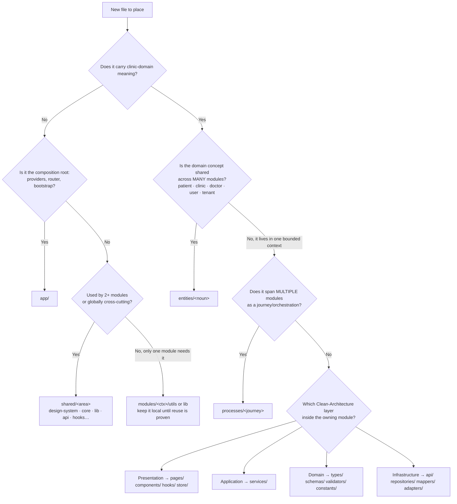
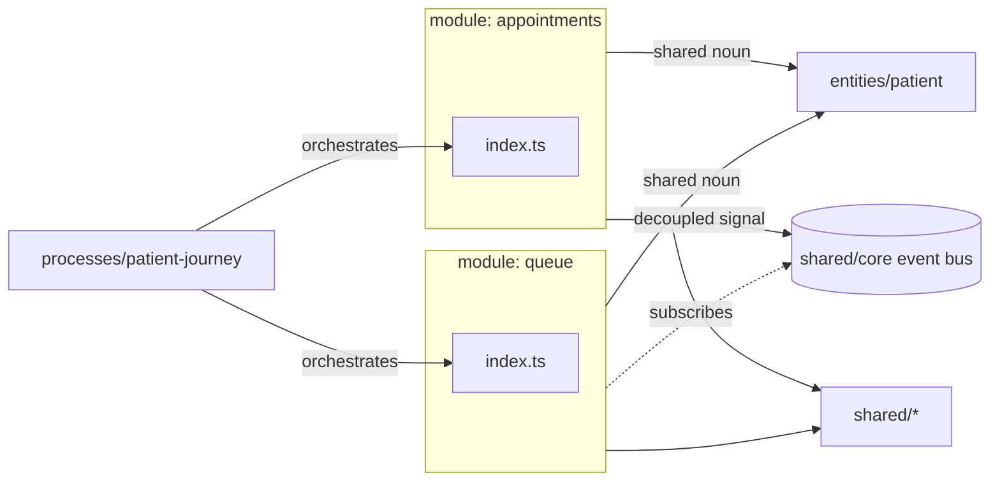
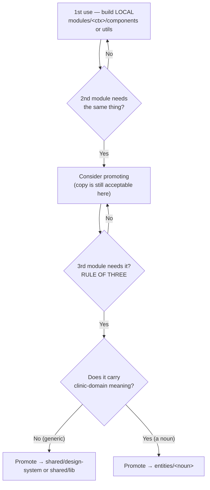
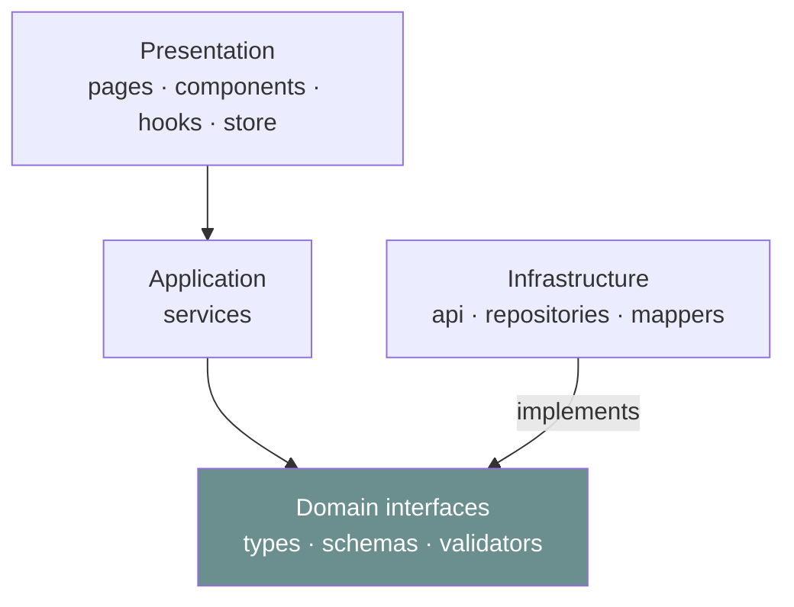

# ClinicOS — File Organization Strategy (Phase 2 · Part 3)

> **Phase 2 of the ClinicOS Frontend Engineering Bible — Part 3.**
> This document **extends** [Phase 1](../Brain.md) and the [Phase 2 README](./README.md). It never contradicts them. Where Phase 1 ratified the **architectural laws** and the Phase 2 README ratified the **physical organization at enterprise scale** (modules by bounded context), this document ratifies **how files, modules, barrels, imports, and ownership are organized day-to-day** so that hundreds of developers across many teams can work in one repo for **10+ years without a rewrite**.

**Read first (in order):**

1. [Brain.md](../Brain.md) — the single source of truth (Phase 1).
2. [Phase 2 README](./README.md) — the enterprise canon, ADR-0001 (modules by bounded context).
3. [FolderStructure.md](./FolderStructure.md) — every folder with its 7-field contract.
4. [DependencyRules.md](./DependencyRules.md) — the import matrix and anti-God rules.

**Sibling anchors this part relies on:** [FeatureArchitecture.md](./FeatureArchitecture.md) (module template), [NamingConvention.md](./NamingConvention.md), [Diagrams.md](./Diagrams.md).

---

## 0. What this part decides (and what it does NOT)

| This part DECIDES                                                                  | This part DEFERS to                                                         |
| ---------------------------------------------------------------------------------- | --------------------------------------------------------------------------- |
| _Where a new file belongs_ (module vs entities vs shared, and which folder inside) | [FolderStructure.md](./FolderStructure.md) for each folder's full contract  |
| _How modules talk_ (only via `index.ts`, processes, entities, event bus)           | [DependencyRules.md](./DependencyRules.md) for the full import matrix       |
| _How shared code is reused_ (promotion path, rule of three)                        | [FeatureArchitecture.md](./FeatureArchitecture.md) for the module internals |
| _How circular deps are prevented_                                                  | [DependencyRules.md](./DependencyRules.md) for the lint config of record    |
| _How imports stay clean_ (aliases, ordering, no `../../..`)                        | [NamingConvention.md](./NamingConvention.md) for symbol/file casing         |
| _How barrels are curated_ (public API only)                                        | —                                                                           |
| _How ownership works_ (CODEOWNERS, README + BRAIN.md)                              | [BrainRules.md](./BrainRules.md) for BRAIN maintenance                      |

> **The one sentence that governs this entire document:**
> Code is organized **by bounded context (module) first, then by Clean-Architecture layer**, every cross-boundary reference flows **downward through a curated `index.ts`**, and the structure **defends itself with lint**, not goodwill.

Every key decision below carries the **Decision Contract** (Brain.md §14): _Why · Benefits · Trade-offs · Alternatives · Future scalability · Enterprise considerations._

---

## 1. Purpose

This document exists to answer, the same way every time, the questions a 300-person engineering org asks dozens of times a day:

1. **I have a new file — where does it go?** → §3 decision framework (flowchart + table).
2. **Module A needs something from Module B — how?** → §4 communication rules.
3. **Two modules need the same code — do I copy or share?** → §5 promotion path.
4. **My import created a cycle — how do I break it?** → §6 circular-dependency prevention.
5. **Why is this import ugly / why did CI reject it?** → §7 clean-imports rules.
6. **What may I export from my module?** → §8 barrel discipline.
7. **Who owns this folder and who may change it?** → §9 code ownership.

It is the **organization contract**. Like all of Phase 2, it is **linted and enforced** (`eslint-plugin-boundaries`, `import/no-cycle`, `import/no-internal-modules`, `simple-import-sort`). A PR that violates the organization fails CI before a human ever sees it (Developer-Rules §1, §3).

This is **Part 3** of the canon; it presumes the structure ratified in the README:

```
src/
├── app/         # composition root
├── processes/   # cross-MODULE journeys (the Patient Journey)
├── modules/     # domain BOUNDED CONTEXTS (each an internal Clean Architecture package)
├── entities/    # GLOBAL domain entities shared across modules
└── shared/      # non-domain, cross-cutting reuse (design-system, core, lib, api…)
```

**Top-level dependency order (downward-only, from README §1):**

```
app → processes → modules → entities → shared
```

---

## 2. Organizing principles

Three principles, ranked. When they conflict, the **earlier** one wins.

### 2.1 Principle 1 — Organize by bounded context (module), then by Clean-Architecture layer

This is **ADR-0001** from the README, restated as a file-placement principle. The **first** axis of organization is the **domain** (`patients`, `appointments`, `pharmacy`…). The **second** axis, _inside_ a module, is the **Clean-Architecture layer** (Presentation → Application → Domain → Infrastructure).

```
modules/pharmacy/            ← axis 1: bounded context (domain)
├── pages/        ┐
├── components/   ├─ Presentation
├── hooks/        ┘
├── services/     ─ Application
├── types/        ┐
├── schemas/      ├─ Domain (the stable core)
├── validators/   ┘
├── repositories/ ┐
├── api/          ├─ Infrastructure
├── mappers/      ┘
└── index.ts      ← the membrane (public API)
```

> **Never** organize the _top_ level by technical type (`/components`, `/hooks`, `/services` at the root). That smears every feature across every folder and makes the blast radius of a change the whole app (Folder-Structure §10, "by-type rejected"). Type-folders are legal **only inside a module**, where they are scoped to one bounded context.

**Decision Contract**

- **Why.** Domain is the axis of change in a clinic OS; teams own domains, not technologies. Grouping by domain makes the _unit of ownership_ and the _unit of change_ the same folder.
- **Benefits.** One module ≈ one team (§9); lazy-loadable boundary; module is independently testable, deletable, and extractable to a package/remote later with zero import changes (README §0 future scalability).
- **Trade-offs.** Some code is genuinely cross-domain and needs a home outside any module → solved by `entities/` (shared domain) and `shared/` (non-domain).
- **Alternatives.** (a) Flat FSD layers — blurry ownership at scale (README §0). (b) By-type top level — change smears everywhere (Folder-Structure §10). (c) Nx libs now — heavier tooling than needed (kept as a future option).
- **Future scalability.** New context → new module folder. The graph stays acyclic by construction (§6).
- **Enterprise considerations.** Maps 1:1 to team topologies, CODEOWNERS, and independent release cadences.

### 2.2 Principle 2 — Co-locate by reason-for-change

Files that **change together live together.** A component, its test, its story, and its styles are siblings (§10). A module's mapper lives beside the repository that uses it, because a backend rename changes both. Conversely, things that change for **different reasons** are separated — UI changes for design reasons, mappers change for backend reasons, so they live in different folders inside the module.

> This is the Single-Responsibility Principle applied to the filesystem: a folder should have **one reason to change**.

### 2.3 Principle 3 — Screaming architecture (the folders reveal the domain, not the framework)

Open `src/modules/` and you should read the **clinic**, not the **toolchain**:

```
modules/
├── patients/        ✅ the domain screams
├── appointments/
├── queue/
├── consultation/
├── prescriptions/
├── pharmacy/
├── billing/
├── follow-up/
└── records/
```

```
src/                 ❌ the framework screams — REJECTED
├── components/
├── hooks/
├── contexts/
├── reducers/
└── utils/
```

A newcomer (or an AI agent) should infer "this is a clinic operating system" from the top-level folders alone, never "this is a React app." React, Vite, Zustand, and TanStack Query are **implementation details** confined to `shared/` and the inner layers of modules.

**Decision Contract (screaming architecture)**

- **Why.** The folder tree is the cheapest, most-read documentation in the repo; it should teach the domain.
- **Benefits.** Onboarding is domain-first; framework swaps (e.g. a future router) touch `shared/`/`app/`, not the domain map.
- **Trade-offs.** Requires discipline to keep framework names out of module folders.
- **Alternatives.** Framework-first trees (CRA defaults) — rejected: they hide the domain.
- **Future scalability.** Adding `lab-orders` or `telemedicine` is a self-describing folder.
- **Enterprise considerations.** Auditors and new teams navigate by domain, not by React trivia.

---

## 3. The placement decision framework — _why files belong where they do_

> The question is never "where is there room?" It is **"what is this file's reason to exist, and who owns its change?"**

### 3.1 The placement flowchart



### 3.2 The three disambiguating questions (when the flowchart feels abstract)

1. **Domain or plumbing?** No clinic meaning → `shared/`. Clinic meaning → continue.
2. **Shared noun or one context?** A noun used across many modules (`Patient`, `Clinic`) → `entities/`. Lives inside one bounded context → that `module/`.
3. **One context or a journey across contexts?** Within one module → place by layer (§3.4). Spanning modules → `processes/`.

> These extend — and do not replace — the Phase-1 "3-question disambiguator" (Folder-Structure §6). Phase 1 disambiguated _layers_; Phase 2 first disambiguates _bounded context_, then layer **inside** the module.

### 3.3 Decision table — "I'm building X → it belongs in Y because Z"

| I'm building…                                                                           | It belongs in                                 | Because                                                    |
| --------------------------------------------------------------------------------------- | --------------------------------------------- | ---------------------------------------------------------- |
| A generic `Button`, `Dialog`, `Skeleton` with **no clinic meaning**                     | `shared/design-system/<comp>`                 | Domain-free primitive; themeable via tokens only (ARCH-4). |
| A framework-agnostic kernel piece (`Result`, `AppError`, event bus, DI)                 | `shared/core`                                 | Cross-cutting, zero domain, zero React coupling.           |
| A pure utility used by **2+ modules**                                                   | `shared/lib` or `shared/utils`                | Generic reuse target (rule of three, §5).                  |
| A `Patient`/`Clinic`/`Doctor`/`User`/`Tenant` **model used across modules**             | `entities/<noun>`                             | Shared domain vocabulary; one canonical home (README §1).  |
| A domain **noun that lives in exactly one context** (e.g. `DispenseRecord` in pharmacy) | `modules/pharmacy/types`                      | Context-local domain Model; not shared, so not promoted.   |
| A **route-level screen** in a module                                                    | `modules/<ctx>/pages`                         | Presentation; composition only.                            |
| A **module-local presentational component**                                             | `modules/<ctx>/components`                    | Presentation; module-private until promoted.               |
| A **use-case / business rule** (orchestrates repositories)                              | `modules/<ctx>/services`                      | Application layer; framework-agnostic.                     |
| A **raw backend shape + Zod schema**                                                    | `modules/<ctx>/api` + `modules/<ctx>/schemas` | DTOs are boundary-only; never escape the module (DATA-2).  |
| A **DTO↔Model mapper**                                                                  | `modules/<ctx>/mappers`                       | The single shape-bridge (DATA-4).                          |
| A **multi-module journey** (check-in → vitals → queue)                                  | `processes/<journey>`                         | Orchestrates modules that must not import each other (§4). |
| A **module-local Zustand store** (UI state only)                                        | `modules/<ctx>/store`                         | Transient UI state; never server data (DATA-6).            |
| A **global UI store** (theme, locale, session, layout)                                  | `shared/store`                                | App-wide UI state, domain-free.                            |
| A **route path constant / permissions catalog**                                         | `shared/config`                               | Single source of route strings + RBAC matrix.              |
| A **decoupled signal** ("vitals recorded") many modules react to                        | publish on `shared/core` **event bus**        | Decoupled fan-out without import edges (§4.4).             |

### 3.4 Choosing the layer _inside_ a module

Once §3.1 lands you in `modules/<ctx>/`, the Clean-Architecture layer follows the _reason to change_:

| The file changes because…                            | Layer          | Folder                                            |
| ---------------------------------------------------- | -------------- | ------------------------------------------------- |
| Design/UX changed                                    | Presentation   | `pages/`, `components/`, `hooks/`, `store/`       |
| A business rule / use-case changed                   | Application    | `services/`                                       |
| The **domain concept** changed (rare, deliberate)    | Domain         | `types/`, `schemas/`, `validators/`, `constants/` |
| The **backend** changed (shape, endpoint, transport) | Infrastructure | `api/`, `repositories/`, `mappers/`, `adapters/`  |

> **The litmus question for any file:** _"When this file changes, what real-world event caused it?"_ That event names its layer. A file that would change for **two different events** is doing two jobs — split it.

---

## 4. How modules communicate

Four legal channels — and exactly one illegal one.

### 4.1 The four legal channels



1. **Public API (`index.ts`) only.** A module imports another module **only through its `index.ts`**. The internal folders (`api/`, `repositories/`, `services/`…) are invisible to the outside world.
2. **Cross-module journeys via `processes/`.** A user flow that touches several modules (e.g. _Check-In → Vitals → Queue_) is orchestrated in `processes/`, which _may_ import multiple module public APIs. Modules themselves **never** chain into each other.
3. **Shared domain via `entities/`.** When two modules both need `Patient`, neither owns it — `entities/patient` does. Both import the entity; neither imports the other.
4. **Decoupled signals via the `shared/core` event bus.** For fire-and-forget notifications where the publisher must not know the subscriber (e.g. "appointment booked" → analytics, follow-up, audit), publish a typed event. This creates **zero import edge** between modules — the strongest decoupling available.

### 4.2 The one illegal channel — deep imports

```ts
// ❌ ILLEGAL — reaching into another module's internals (CI fails this line)
import { dispenseRepository } from '@modules/pharmacy/repositories/dispense.repository';
import { BillingDto } from '@modules/billing/api/billing.dto';

// ✅ LEGAL — through the public API only
import { useDispense } from '@modules/pharmacy';
import { type Invoice } from '@modules/billing';
```

### 4.3 Worked ✅/❌ example — billing needs the active prescription

```ts
// ❌ WRONG — billing reaches into prescriptions' guts and into another module's store
import { prescriptionStore } from '@modules/prescriptions/store/prescription.store';
import { toPrescription } from '@modules/prescriptions/mappers/prescription.mapper';
// breaks ARCH-2 (deep import) AND couples billing to prescriptions' internals.

// ✅ RIGHT — billing consumes the curated public API
import { usePrescription, type Prescription } from '@modules/prescriptions';

function InvoiceFromConsultation({ prescriptionId }: { prescriptionId: string }) {
  const { data: prescription } = usePrescription(prescriptionId); // Model only, no DTO
  // …compose the invoice from the Model
}
```

> If billing and prescriptions must be **sequenced** (finish the Rx, then bill), that sequencing is a **journey** and belongs in `processes/patient-journey`, not in either module.

### 4.4 The event bus — when to use it vs a direct public-API call

| Situation                                                   | Use                                                             |
| ----------------------------------------------------------- | --------------------------------------------------------------- |
| Caller needs a **return value** / awaits a result           | Direct public-API call (`usePrescription`, a service)           |
| Caller fires a **signal** and does not care who listens     | `shared/core` event bus (`bus.publish(appointmentBooked(...))`) |
| Several modules react to **one domain event** independently | Event bus (fan-out, zero import edges)                          |
| A **strict ordered journey** across modules                 | `processes/` orchestration                                      |

**Decision Contract (event bus)**

- **Why.** Some couplings are _notifications_, not _dependencies_; an import edge over-states the relationship and risks cycles.
- **Benefits.** Zero static coupling between publisher and subscriber; new subscribers added without touching the publisher; cannot create an import cycle.
- **Trade-offs.** Indirection — harder to trace statically; mitigate with **typed events** and an event registry in PROJECT_BRAIN.
- **Alternatives.** Direct calls (tighter coupling); `processes/` (for ordered flows). The bus is only for **decoupled, unordered fan-out**.
- **Future scalability.** Survives module extraction to a remote (events serialize across a Module Federation boundary).
- **Enterprise considerations.** Audit/analytics subscribe centrally without feature teams wiring them in.

---

## 5. How shared code is reused — the promotion path

> **Reuse-first, but promote last.** Search before you build; duplicate before you abstract; promote only when reuse is _proven_.

### 5.1 The reuse-first rule

Before creating any component, hook, or util, **search in this order** (CMP-4):

1. `shared/design-system` and `shared/lib` (generic, domain-free).
2. The relevant `entities/<noun>` (shared domain pieces).
3. The current module's `components/` / `utils/` (local).

If it exists, **import it**. If it does not, build it **locally first** (in the owning module), not in `shared/`.

### 5.2 The promotion ladder (rule of three)



### 5.3 The promotion decision block

```
PROMOTE TO SHARED WHEN, AND ONLY WHEN, ALL of:
  ✅ A THIRD slice/module now needs it (rule of three — two is a coincidence, three is a pattern).
  ✅ It is generalizable WITHOUT module-specific props, strings, or domain branching.
  ✅ Its change-reason is genuinely cross-cutting (not "we happened to copy it").

THEN route it:
  • Domain-free (Button, Tooltip, useDebounce)  → shared/design-system | shared/lib
  • Domain-bearing noun (PatientAvatar, Patient) → entities/<noun>

DO NOT PROMOTE WHEN:
  ❌ Only two modules use it and the implementations are quietly diverging.
  ❌ "We might need it elsewhere someday" (speculative — premature abstraction).
  ❌ It still contains module-specific assumptions you'd have to parameterize into a god-component.
```

### 5.4 Avoiding premature abstraction

Premature promotion is **as harmful as duplication** (Folder-Structure §8). A `shared/` component that serves two divergent callers grows flags and conditionals until it is a **god-component** nobody dares touch — the opposite of reuse.

> **Heuristic:** the cost of a wrong abstraction is higher than the cost of duplication, because duplication is _visible and deletable_ while a bad abstraction is _load-bearing and entangled_. Keep two copies until the third caller proves the shape, then extract the **common shape only**.

**Decision Contract (promotion / rule of three)**

- **Why.** Reuse is the goal, but the _right_ abstraction only becomes visible after three concrete uses.
- **Benefits.** Avoids god-components; keeps `shared/` small and stable; promotions are deliberate and tested.
- **Trade-offs.** Temporary, bounded duplication (1–2 copies) is tolerated on purpose.
- **Alternatives.** Promote-on-first-reuse (causes premature abstraction); never-promote (causes copy-paste rot). Rule of three is the calibrated middle.
- **Future scalability.** `shared/` grows by proven need, not speculation — it stays a curated kit, not a junk drawer.
- **Enterprise considerations.** A platform team owns `shared/` (§9); the rule of three gives them an objective intake bar for promotions.

---

## 6. How circular dependencies are prevented

Cycles are the single most corrosive failure in a long-lived codebase: they break tree-shaking, defeat lazy-loading, and make modules impossible to extract. ClinicOS prevents them **structurally**, not by review alone.

### 6.1 The five mechanisms

1. **Strict downward dependency order.** `app → processes → modules → entities → shared`. Because dependencies only ever point _down_, the top-level graph is **acyclic by construction** (a lower layer can never import a higher one).
2. **Sibling modules never import each other.** Module↔module coupling is the most common source of cycles. It is illegal; cross-module needs go through `processes/`, `entities/`, or the event bus (§4). This removes the entire class of `A→B→A` module cycles.
3. **Public-API-only imports.** Reaching only `index.ts` means the dependency graph has _module-level_ edges, not _file-level_ edges — far fewer edges, far fewer chances to close a loop.
4. **Dependency inversion in the Domain layer.** Inside a module, Infrastructure depends on **Domain interfaces**, never the reverse. Services depend on a repository _interface_ (in `types/`), and the concrete repository (in `repositories/`) implements it. The arrow points _into_ the stable Domain core, so Presentation/Application/Infrastructure can never form a loop with Domain.
5. **Lint of record.** `import/no-cycle` (file-level cycles) + `eslint-plugin-boundaries` (layer/module-level illegal edges) fail CI. See [DependencyRules.md](./DependencyRules.md) for the authoritative config.



### 6.2 A circular-dependency example and its fix

**The problem** — `appointments` and `patients` reach into each other:

```ts
// modules/appointments/services/booking.service.ts
import { getPatientHistory } from '@modules/patients'; // appointments → patients

// modules/patients/services/patient.service.ts
import { getNextAppointment } from '@modules/appointments'; // patients → appointments
//  ⇒ appointments → patients → appointments  ❌  import/no-cycle FAILS
```

**Fix A — extract a shared kernel (preferred when both need a shared concept).**
The shared concept (`Patient` identity, scheduling primitives) is _neither_ module's private property. Lift it to `entities/`:

```ts
// entities/patient/index.ts   ← the shared kernel both depend on
export type { Patient } from './model/patient.types';
export { usePatient } from './api/patient.queries';

// modules/appointments/…   ✅ depends DOWN on the entity
import { type Patient, usePatient } from '@entities/patient';
// modules/patients/…       ✅ depends DOWN on the entity
import { type Patient } from '@entities/patient';
// No module↔module edge remains. Cycle eliminated.
```

**Fix B — dependency inversion (when one truly needs a behavior of the other).**
Define the needed capability as an **interface in the consumer's Domain**, and let `processes/` (or `app/` composition) inject the implementation:

```ts
// modules/appointments/types/ports.ts  (Domain interface — owned by appointments)
export interface PatientHistoryPort {
  getHistory(id: string): Promise<VisitSummary[]>;
}

// modules/appointments/services/booking.service.ts  ✅ depends on its OWN interface
export function makeBookingService(history: PatientHistoryPort) {
  /* … */
}

// processes/patient-journey/…  composes the two, wiring the concrete impl in:
import { makeBookingService } from '@modules/appointments';
import { patientHistoryAdapter } from '@modules/patients'; // public API
const booking = makeBookingService(patientHistoryAdapter);
//  appointments depends only on an interface it owns; the wiring lives ABOVE both. No cycle.
```

**Fix C — decouple with the event bus** (when it's a signal, not a query): `patients` publishes `patientUpdated`; `appointments` subscribes. No import edge at all (§4.4).

> **Rule of thumb:** shared _data/noun_ → extract to `entities/` (Fix A). Shared _behavior_ → invert with an interface (Fix B). Shared _notification_ → event bus (Fix C).

**Decision Contract (cycle prevention)**

- **Why.** Cycles silently destroy tree-shaking, lazy-loading, and extractability — the three pillars of a 10-year, micro-frontend-ready codebase.
- **Benefits.** Acyclic-by-construction graph; every module independently lazy-loadable and extractable; deterministic build output.
- **Trade-offs.** Dependency inversion adds an interface + a wiring point — more indirection than a direct call.
- **Alternatives.** Allow cycles + "be careful" (rejected — unenforceable at scale); a global mediator object (rejected — becomes a god-object, §11).
- **Future scalability.** An acyclic graph is the precondition for Module Federation / package extraction.
- **Enterprise considerations.** `import/no-cycle` is a _governance control_ in CI, not a style preference (Developer-Rules §1).

---

## 7. How imports stay clean

### 7.1 Path aliases (no relative climbs across slices)

One alias per top-level layer. Both styles below are ratified; **pick one per repo and lint it** — ClinicOS Phase 1 (`tsconfig` `"@/*" → "src/*"`) and the named aliases here are compatible (named aliases are a stricter subset).

```jsonc
// tsconfig.json  — paths (extends Phase 1's "@/*": ["src/*"])
{
  "compilerOptions": {
    "baseUrl": "src",
    "paths": {
      "@app/*": ["app/*"],
      "@processes/*": ["processes/*"],
      "@modules/*": ["modules/*"],
      "@entities/*": ["entities/*"],
      "@shared/*": ["shared/*"],
      "@/*": ["*"], // single-alias fallback (Phase 1 compatible)
    },
  },
}
```

```ts
// vite.config.ts  — alias must mirror tsconfig EXACTLY (one source of truth, two readers)
import { fileURLToPath, URL } from 'node:url';
import { defineConfig } from 'vite';
import react from '@vitejs/plugin-react';

const r = (p: string) => fileURLToPath(new URL(`./src/${p}`, import.meta.url));

export default defineConfig({
  plugins: [react()],
  resolve: {
    alias: {
      '@app': r('app'),
      '@processes': r('processes'),
      '@modules': r('modules'),
      '@entities': r('entities'),
      '@shared': r('shared'),
      '@': r(''),
    },
  },
});
```

**The relative-vs-absolute rule (ARCH-7):**

- **Absolute (alias) across slices/layers** — always. `@modules/billing`, `@entities/patient`, `@shared/design-system`.
- **Relative within the same slice** — only for true siblings/children. `./InvoiceRow`, `../mappers/invoice.mapper` **inside the same module**.
- **`../../..` climbing out of a slice is forbidden** — it hides a layer violation and breaks on every move.

```ts
// ❌ relative climb out of the module — hides a boundary crossing, breaks on move
import { Patient } from '../../../entities/patient/model/patient.types';
// ✅ absolute alias to the public API
import { type Patient } from '@entities/patient';
// ✅ relative is fine WITHIN the same module
import { InvoiceRow } from './InvoiceRow';
```

### 7.2 Import ordering (`eslint-plugin-simple-import-sort`)

Imports are **auto-sorted** into stable groups so diffs stay clean and reviewers scan fast:

```ts
// 1. Side-effect imports (polyfills, css)            e.g. import '@shared/styles/global.css';
// 2. Node / external packages                        react, @tanstack/react-query, zod
// 3. @app, @processes                                (higher layers — should be RARE in a module)
// 4. @modules (other modules' public APIs)
// 5. @entities
// 6. @shared
// 7. Relative within the slice (./, ../)
// 8. Type-only imports (grouped last within their group)
```

```jsonc
// .eslintrc.cjs (excerpt)
'simple-import-sort/imports': ['error', {
  groups: [
    ['^\\u0000'],                                  // side-effects
    ['^node:', '^react', '^@?\\w'],                // externals
    ['^@app', '^@processes'],
    ['^@modules'],
    ['^@entities'],
    ['^@shared'],
    ['^\\.\\.(?!/?$)', '^\\.\\./?$', '^\\./'],     // relative
  ],
}],
'simple-import-sort/exports': 'error',
```

> Combined with §7.1, the **import block of any file visually encodes its layer**: a module file with a fat `@app`/`@processes` group is an instant smell (a module importing upward).

---

## 8. How barrel exports (`index.ts` public API) are used

### 8.1 A barrel is a **curated public API**, not a re-export-everything dump

Every module and every shared slice exposes **one** `index.ts`. It lists **only** what the outside world is allowed to consume. Everything else in the slice is **private** and unreachable (enforced by `import/no-internal-modules`, §8.4).

```ts
// modules/prescriptions/index.ts — the ONLY legal import surface for this module.

// ── Presentation the rest of the app may render
export { PrescriptionForm } from './components/PrescriptionForm';
export { PrescriptionsPage } from './pages/PrescriptionsPage';

// ── Application/read hooks
export { usePrescription, usePrescriptions } from './hooks/usePrescriptions';
export { useWritePrescription } from './hooks/useWritePrescription';

// ── Domain Models (TYPE-ONLY — DTOs are NEVER exported)
export type { Prescription } from './types/prescription.types';

// ── Routing & RBAC (consumed by app/router + processes)
export { prescriptionsRoutes } from './routes';
export { prescriptionPermissions } from './permissions';

// ❌ Intentionally NOT exported (slice-private):
//    api/*.dto.ts, schemas/*, mappers/*, repositories/*, store/*, services/* internals
```

### 8.2 What to export vs keep private

| Export from `index.ts`                              | Keep private (never export)                         |
| --------------------------------------------------- | --------------------------------------------------- |
| Public components & pages other layers render       | Presentational sub-components used only internally  |
| Read/mutation **hooks** (the Application surface)   | Raw `repositories/`, `api/` endpoints, `mappers/`   |
| Domain **Models** (`type`-only)                     | **DTOs & Zod schemas** (DATA-2 — must never escape) |
| Query-key factories (for cross-module invalidation) | Module-local Zustand `store/` internals             |
| `routes`, `permissions` (for `app/`/`processes`)    | `services/` wiring details, internal `lib/`/`utils` |

### 8.3 Barrels must not hurt tree-shaking (no barrel bloat)

A barrel that **re-exports everything** (`export * from './everything'`) pulls the whole module into any consumer's graph and defeats tree-shaking. ClinicOS bans this:

```ts
// ❌ barrel bloat — drags the entire module in, breaks tree-shaking, blurs the contract
export * from './components';
export * from './services';
export * from './api';

// ✅ named, intentional, minimal — only the contract
export { PrescriptionForm } from './components/PrescriptionForm';
export { usePrescription } from './hooks/usePrescriptions';
export type { Prescription } from './types/prescription.types';
```

> **Rule:** named re-exports only; **no `export *`** in a public barrel; **no side effects** in `index.ts` (a barrel must be import-cost-free). Deep `shared/` sub-paths (`@shared/design-system/button`) are addressable for tree-shaking; **domain slices are not** (only their `index.ts`).

### 8.4 The lint rule banning deep imports (the membrane)

```jsonc
// .eslintrc.cjs (excerpt) — barrels are the ONLY surface; internals are unreachable.
'import/no-internal-modules': ['error', {
  allow: [
    '@shared/**',                 // shared sub-paths are addressable (tree-shaking)
    '@entities/*/index',          // entities only via their barrel
    '@modules/*/index',           // modules only via their barrel
    '@modules/*/routes',          // routes/permissions are explicit public files
    '@modules/*/permissions',
  ],
}],
```

```ts
// ✅ LEGAL
import { usePrescription } from '@modules/prescriptions';
import { Button } from '@shared/design-system/button'; // deep allowed in shared only
// ❌ ILLEGAL (CI fails)
import { repo } from '@modules/prescriptions/repositories/prescription.repository';
```

**Decision Contract (barrels)**

- **Why.** A curated `index.ts` is the _membrane_ that keeps DTOs in and lets only Models out, and the _one file_ a dev/AI reads to learn a module's capabilities.
- **Benefits.** Refactor-safety (internals move freely behind a stable contract); DTO containment (DATA-2); tree-shakeable consumers; the boundary lint has exactly one place to police.
- **Trade-offs.** Maintaining the barrel is manual work; `export *` is tempting and must be lint-banned.
- **Alternatives.** No barrels (everything public — boundary collapses); `export *` barrels (tree-shaking + contract collapse). Curated named barrels are the only option that preserves both.
- **Future scalability.** Because all cross-module access already flows through `index.ts`, a module can be extracted to a package/remote with **zero consumer changes** (README §0).
- **Enterprise considerations.** The barrel **is** the inter-team API contract; changes to it are reviewable, versionable (Changesets), and ownable (§9).

---

## 9. How code ownership works

### 9.1 CODEOWNERS maps teams to modules

Ownership is **physical**: a team owns a folder. `CODEOWNERS` auto-requests the owning team on any PR that touches their module, and **shared/** is gated behind a platform/architecture team.

```text
# .github/CODEOWNERS — ClinicOS frontend ownership map
# Last matching pattern wins; order matters.

# ── Default: architecture team reviews anything unclaimed
*                                   @clinicos/frontend-architecture

# ── The canon itself (changing the rules requires architecture)
/docs/architecture/                 @clinicos/frontend-architecture
/docs/Brain.md                      @clinicos/frontend-architecture

# ── Composition root + cross-module journeys = architecture/platform
/src/app/                           @clinicos/frontend-architecture
/src/processes/                     @clinicos/frontend-architecture @clinicos/journey-team

# ── shared/ = PLATFORM team ONLY (design-system needs design-systems team too)
/src/shared/                        @clinicos/frontend-platform
/src/shared/design-system/          @clinicos/frontend-platform @clinicos/design-systems

# ── entities/ = shared domain, co-owned by architecture (cross-team contract)
/src/entities/                      @clinicos/frontend-architecture

# ── Modules = FEATURE TEAMS own their bounded context end-to-end
/src/modules/patients/              @clinicos/team-patients
/src/modules/appointments/          @clinicos/team-scheduling
/src/modules/queue/                 @clinicos/team-scheduling
/src/modules/consultation/          @clinicos/team-clinical
/src/modules/prescriptions/         @clinicos/team-clinical
/src/modules/pharmacy/              @clinicos/team-pharmacy
/src/modules/billing/               @clinicos/team-billing
/src/modules/follow-up/             @clinicos/team-clinical
/src/modules/records/               @clinicos/team-records
/src/modules/analytics/             @clinicos/team-insights
/src/modules/settings/              @clinicos/team-platform-apps
/src/modules/admin/                 @clinicos/team-admin

# ── Cross-cutting tooling reviewed by architecture
/.eslintrc.cjs                      @clinicos/frontend-architecture
/tsconfig*.json                     @clinicos/frontend-architecture
/vite.config.ts                     @clinicos/frontend-architecture
/.github/CODEOWNERS                 @clinicos/frontend-architecture
```

### 9.2 Team boundaries = module boundaries

| Layer / folder          | Owner                                               | Who may change it                                                  |
| ----------------------- | --------------------------------------------------- | ------------------------------------------------------------------ |
| `modules/<ctx>/`        | The one feature team that owns that bounded context | That team (self-merge after review)                                |
| `entities/<noun>/`      | Architecture (shared domain contract)               | Any team **with** architecture review (it's a cross-team contract) |
| `shared/`               | **Platform / architecture team**                    | Platform team only; feature teams propose via PR + RFC             |
| `shared/design-system/` | Platform **+ design-systems**                       | Both teams; tokens are the contract (Brain.md §6)                  |
| `app/`, `processes/`    | Architecture / journey team                         | Architecture + relevant journey owners                             |

> **Why feature teams cannot edit `shared/` freely:** `shared/` is the blast-radius epicenter — a change there can break every module. Gating it behind a platform team turns "a tweak that breaks 14 teams" into "a reviewed platform change with a migration note." This is the structural reason the **rule of three** (§5) routes promotions _through_ the platform team's review.

### 9.3 Module README + BRAIN.md carry ownership in-tree

Every module ships two ownership documents (README §2 module template):

```text
modules/pharmacy/
├── README.md   # Owner team, public API summary, dependencies, "how to extend"
└── BRAIN.md    # Module decisions, local registries, TODOs, tech debt (per BrainRules.md)
```

- **`README.md`** answers _"what is this module, who owns it, what does its `index.ts` expose, what does it depend on."_ It is the human entry point and names the CODEOWNERS team.
- **`BRAIN.md`** is the module's permanent memory: ratified local decisions, debt log, and registries — maintained per [BrainRules.md](./BrainRules.md). It keeps ownership _knowledge_, not just ownership _assignment_, in the tree.

### 9.4 Review rules

| Change touches…                                          | Required reviewers                                       |
| -------------------------------------------------------- | -------------------------------------------------------- |
| One module only                                          | The owning feature team (≥1 approval, GIT-5)             |
| `entities/` (shared domain)                              | Owning proposer **+ architecture**                       |
| `shared/`                                                | **Platform team** (and design-systems for design-system) |
| `app/`, `processes/`, lint/tsconfig/vite, the canon docs | **Architecture team**                                    |
| Anything in Developer-Rules §14 (shape-changing)         | Architecture **+ ADR**                                   |

**Decision Contract (ownership)**

- **Why.** At hundreds of devs, "who reviews this?" must be answerable by the filesystem, automatically.
- **Benefits.** Auto-routed reviews; clear blast-radius gating (shared/ protected); module teams move independently; in-tree README/BRAIN keep ownership knowledge local.
- **Trade-offs.** CODEOWNERS must be maintained as teams/modules evolve; cross-cutting PRs need multiple approvals (intentional friction).
- **Alternatives.** Free-for-all ownership (rejected — no accountability, shared/ rots); a single gatekeeper team for everything (rejected — bottleneck).
- **Future scalability.** A module extracted to its own repo carries its CODEOWNERS + README + BRAIN with it, unchanged.
- **Enterprise considerations.** Maps to team topologies and audit/compliance ("who approved this PHI-touching change?").

---

## 10. File co-location rules

> **Default: things that change together live together.** A component, its test, its story, its styles, and its local types are siblings.

```text
modules/pharmacy/components/DispenseCard/
├── DispenseCard.tsx          # source
├── DispenseCard.test.tsx     # ✅ test beside source (behavior test)
├── DispenseCard.stories.tsx  # ✅ story beside source (if it's a reusable visual)
├── DispenseCard.module.css   # ✅ styles beside source (if not pure Tailwind)
├── DispenseCard.types.ts     # ✅ component-local props/types beside source
└── index.ts                  # local barrel (optional, for a multi-file component folder)
```

**Rules:**

- **Tests** (`*.test.tsx` / `*.spec.ts`) sit **next to** the file they test. Never a parallel `__tests__` mirror tree. (Module-wide _integration_ tests may live in `modules/<ctx>/tests/`, per README §2.)
- **Stories** (`*.stories.tsx`) sit **next to** the component.
- **Styles** (CSS module / `.css`) sit **next to** the component when not pure Tailwind utility classes.
- **Local types** sit next to the component when they are _that component's_ props/shape; **domain Models** live in the module's `types/` (Domain layer), not beside a component.
- **Slice-local helpers** start in the module's `utils/`/`lib/` — never pre-emptively in `shared/`.

**When to extract (out of co-location):**

1. A type/helper used by **the whole module** → move from beside-the-component to the module's `types/` or `utils/`.
2. A component used by a **second module** → candidate for promotion (rule of three, §5).
3. A type used by **another module** → it is a shared contract → `entities/<noun>` or the exporting module's public Model.

> **Co-location vs the layer rule (resolving the tension):** co-location groups by _file-set that changes together_; the layer rule groups by _reason to change_. They agree because a component + its test + its story all change for the **same** reason (the component changed). A mapper does **not** co-locate with a component, because it changes for a **different** reason (the backend changed) — it lives in `mappers/`.

---

## 11. Anti-patterns gallery (organization)

| #   | Anti-pattern                     | What it looks like                                                                              | Why it's poison                                                                             | The fix                                                                                                        |
| --- | -------------------------------- | ----------------------------------------------------------------------------------------------- | ------------------------------------------------------------------------------------------- | -------------------------------------------------------------------------------------------------------------- |
| A1  | **God folder / God module**      | `modules/core/` or `modules/common/` that 12 teams dump into; one module that owns half the app | No clear owner; merge-conflict magnet; unbounded blast radius; defeats §9 ownership         | Split by bounded context; give each part a real domain home; if it's domain-free, it's `shared/`, not a module |
| A2  | **Util dumping ground**          | `shared/utils/misc.ts`, `helpers.ts`, a 1,000-line `index.ts` of unrelated functions            | Zero cohesion; nobody owns it; imports drag the whole file in (tree-shaking dead)           | One file per concern with a descriptive name; promote via rule of three (§5); split by reason-to-change        |
| A3  | **Cross-module reach-in**        | `import … from '@modules/billing/repositories/...'`                                             | Breaks the barrel membrane; couples to internals; creates cycles; bypasses ownership review | Import the **public API** only (§4); orchestrate in `processes/`; share the noun via `entities/`               |
| A4  | **Barrel bloat**                 | `export * from './everything'` in `index.ts`                                                    | Defeats tree-shaking; blurs the contract; turns the whole module into the public API        | Named, curated exports only; **no `export *`** (§8.3); lint deep imports (§8.4)                                |
| A5  | **Premature shared abstraction** | A `shared/` component with 9 boolean flags serving 2 divergent callers                          | God-component nobody can change; worse than duplication                                     | Apply the **rule of three** (§5); keep 2 copies until the 3rd proves the shape; extract the common shape only  |
| A6  | **Framework-first tree**         | top-level `src/components/`, `src/hooks/`, `src/reducers/`                                      | The framework screams, the domain hides (violates §2.3); change smears across folders       | Organize by bounded context first (§2.1); type-folders only **inside** a module                                |
| A7  | **DTO leak**                     | `import { PatientDto } from '@modules/patients/api/...'` in a component                         | Backend shape escapes the boundary; a rename now breaks UI (violates DATA-2/L7)             | Export **Models only** from the barrel; keep `api/`, `schemas/`, `mappers/` private (§8)                       |
| A8  | **Hidden cycle via deep import** | `A/services` imports `B/mappers` which imports `A/types`                                        | `import/no-cycle` may not even catch file-paths that dodge the barrel; lazy-loading breaks  | Public-API-only (§4); extract shared kernel to `entities/` or invert with an interface (§6)                    |
| A9  | **Relative climb across slices** | `import x from '../../../shared/...'`                                                           | Hides a layer crossing; breaks on every file move; defeats `simple-import-sort` groups      | Absolute aliases across slices, relative only within a slice (§7.1)                                            |
| A10 | **Mirror test tree**             | `__tests__/` mirroring `src/`                                                                   | Tests drift from source; renames orphan tests; co-change is invisible                       | Co-locate tests beside source (§10)                                                                            |

---

## 12. The organization checklist (Definition-of-Placed)

Before a PR that adds or moves files merges, confirm:

- [ ] Every new file ran through the §3 flowchart; its home matches its **reason to change**.
- [ ] No module imports another module except via its `index.ts` (§4); cross-module flows live in `processes/`.
- [ ] No DTO/schema/mapper/repository is exported from any barrel (§8.2); Models only.
- [ ] The module's `index.ts` is **curated** (named exports, no `export *`, no side effects) (§8.3).
- [ ] No `../../..` climbs across slices; absolute aliases used across layers (§7.1).
- [ ] Imports auto-sorted into the §7.2 groups (no `simple-import-sort` violations).
- [ ] `import/no-cycle` + `eslint-plugin-boundaries` pass (§6).
- [ ] Tests/stories/styles are co-located with source (§10).
- [ ] If code was promoted to `shared/`/`entities/`, the **rule of three** held (§5) and the right owner reviewed it (§9).
- [ ] Any shape-changing move escalated to an ADR (Developer-Rules §14).

> This checklist is the placement-specific extension of [Project-Checklist.md](../Project-Checklist.md). Green lint = the structure approved itself; this list is the human judgment lint cannot make.

---

## 13. Cross-references

| For…                                               | Read                                                                                |
| -------------------------------------------------- | ----------------------------------------------------------------------------------- |
| The laws this part must never break                | [Brain.md](../Brain.md) §2, §5; [Developer-Rules.md](../Developer-Rules.md) §3, §14 |
| The enterprise structure & ADR-0001                | [Phase 2 README](./README.md) §0–§3                                                 |
| Each folder's full 7-field contract                | [FolderStructure.md](./FolderStructure.md)                                          |
| The module template & each folder's responsibility | [FeatureArchitecture.md](./FeatureArchitecture.md)                                  |
| The authoritative import matrix & lint config      | [DependencyRules.md](./DependencyRules.md)                                          |
| Naming for files, symbols, imports/exports         | [NamingConvention.md](./NamingConvention.md)                                        |
| Architecture diagrams (mermaid)                    | [Diagrams.md](./Diagrams.md)                                                        |
| Module BRAIN/registry maintenance                  | [BrainRules.md](./BrainRules.md)                                                    |

---

_Phase 2 · Part 3 · Foundation v2 · 2026-06-27 · Owner: Frontend Architecture · Governed by [Brain.md](../Brain.md) and the [Phase 2 README](./README.md)._
</content>
</invoke>
