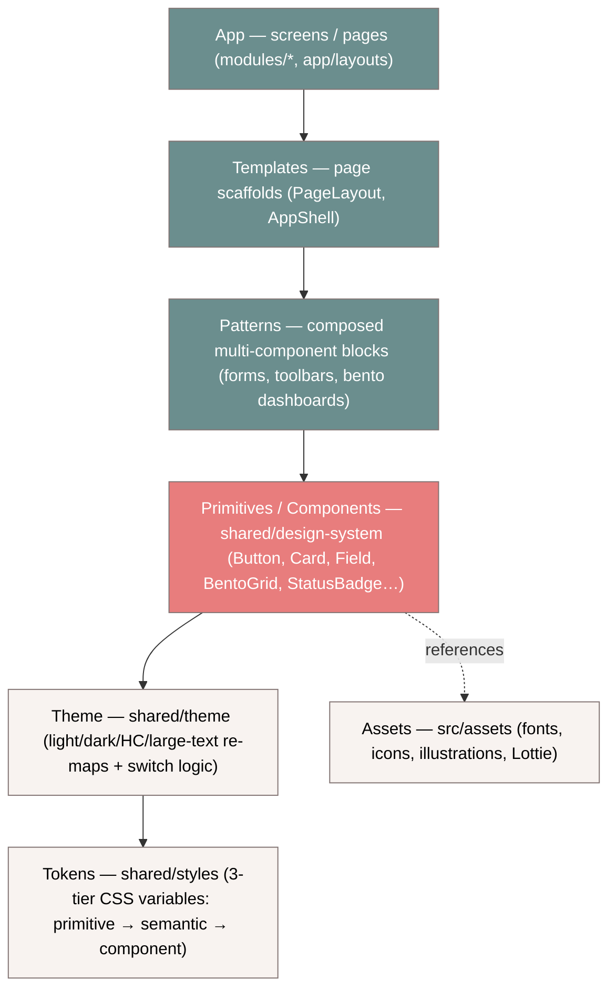

# ClinicOS — Design System (the flagship blueprint)

> **This is the architecture blueprint for the ClinicOS Design System — not a component cookbook.**
> It answers _why a design system exists_, _what layers it is built from_, _which component categories
> it ships_, and _how the system is kept honest_. It **extends** the canon; it never restates it.
>
> **Read first (the canon this builds on):**
> [Frontend-Bible.md](../Frontend-Bible.md) (§1–2 philosophy · §3 tokens · §5 type · §8 component catalog · §9 a11y · §12 governance) ·
> [README](./README.md) (token consumption rule) · [DesignTokens](./DesignTokens.md) ·
> [DesignGuidelines](./DesignGuidelines.md) · [Theme](./Theme.md) ·
> [architecture/FeatureArchitecture.md](../architecture/FeatureArchitecture.md) ·
> [architecture/FolderStructure.md](../architecture/FolderStructure.md) · [Coding-Standards.md](../Coding-Standards.md).
>
> **Siblings (this doc cross-links, never duplicates):**
> [ArchitectureGuide.md](./ArchitectureGuide.md) (folder + component architecture + performance) ·
> [ComponentRegistry.md](./ComponentRegistry.md) (the generated component catalog).
>
> _Token values live in the token docs above. Per-component props live in Storybook + the registry.
> This document does not re-derive either — it explains the system that holds them together._

---

## Table of contents

1. [Part 1 — Design System Philosophy](#part-1--design-system-philosophy)
2. [The layered model (Tokens → Theme → Primitives/Components → Patterns → Templates → App)](#the-layered-model)
3. [Part 4 — Component Categories](#part-4--component-categories)
4. [Part 8 — The Component Registry (overview)](#part-8--the-component-registry-overview)

---

## Part 1 — Design System Philosophy

A design system is the **contract** that lets dozens of developers and AI agents build hundreds of
screens that look, feel, behave, theme, localize, and pass accessibility audits **identically** —
for 10+ years, without a rewrite. ClinicOS is _Apple · Linear · Stripe · Notion · Vercel_ calm, but
usable by an elderly, low-literacy, non-English-reading patient on the first try
([Frontend-Bible §1](../Frontend-Bible.md#1-purpose--philosophy)). Every principle below carries a
compact **Decision Contract** (Why · Benefits · Trade-offs · Alternatives · Future · Enterprise) per
the governance contract in [Frontend-Bible §12.1](../Frontend-Bible.md#12-governance).

> The principles are not independent slogans — they **stack**. Tokens enable theming; theming enables
> accessibility modes; component-driven + composition enable reusability; reusability + scalability are
> what make the whole thing survive a decade. Read them as one argument.

### 1.1 Why a design system at all

- **Why:** Without a shared system, every screen re-decides color, spacing, focus behavior, and copy —
  producing drift, inconsistency, accessibility gaps, and unmaintainable duplication.
- **Benefits:** One visual + behavioral language; review becomes "does it use the system?" not "is this
  pixel right?"; onboarding is one library, not N bespoke screens.
- **Trade-offs:** Up-front investment; a governance burden (the [registry](#part-8--the-component-registry-overview)
  and token discipline must be enforced, not hoped for).
- **Alternatives:** Ad-hoc per-screen styling (drifts immediately); a third-party kit adopted whole
  (wrong palette, wrong a11y posture, no healthcare semantics, vendor lock-in).
- **Future:** The system is the substrate every later phase composes; new domains add features, not new
  visual languages.
- **Enterprise:** A single auditable surface for brand, a11y compliance, and security review across all
  teams and tenants.

### 1.2 Enterprise-grade

- **Why:** ClinicOS is multi-tenant, multi-team, audited, and long-lived; "works on my screen" is not a
  bar an enterprise health product can clear.
- **Benefits:** Predictable, consistent, themeable, accessible, localized **at scale**; maps 1:1 onto
  the module/team topology in [FeatureArchitecture §10](../architecture/FeatureArchitecture.md#10-decision-block--every-module-uses-the-identical-template).
- **Trade-offs:** More ceremony (stories, tests, registry entry, contrast checks) per component.
- **Alternatives:** "Move fast" libraries that skip a11y/i18n/theming — fatal in healthcare procurement
  (Section 508 / EN 301 549).
- **Future:** Extractable as a versioned internal package (`@clinicos/ui`) consumed by future apps —
  see [FolderStructure §4 `shared/design-system`](../architecture/FolderStructure.md).
- **Enterprise:** Centralized governance, changesets/SemVer, deprecation policy
  ([Frontend-Bible §12.3](../Frontend-Bible.md#12-governance)).

### 1.3 Component-driven

- **Why:** UI is assembled from a small set of well-tested building blocks, not hand-rolled per screen.
- **Benefits:** Build once, audit once, reuse everywhere; bugs and a11y fixes land in one place.
- **Trade-offs:** A component API is a contract — changing it is a versioned event.
- **Alternatives:** Copy-paste markup (drift + N× the audit surface).
- **Future:** New categories (navigation, analytics, more healthcare) slot in without disturbing existing
  components — they are already reserved in the [registry](#part-8--the-component-registry-overview).
- **Enterprise:** Components are the unit of ownership, review, and SemVer.

### 1.4 Token-driven

- **Why:** _If a visual value is not a token, it does not exist_ ([Frontend-Bible §3](../Frontend-Bible.md#3-the-token-system)).
  Three tiers — **Primitive → Semantic → Component** — let a single `data-theme` swap re-skin the app
  at runtime.
- **Benefits:** Zero hardcoded hex/px reaches JSX; dark / high-contrast / large-text / RTL are
  CSS-variable swaps, not code changes; brand/tenant re-skins are token-file edits.
- **Trade-offs:** Discipline required — arbitrary Tailwind values are lint-blocked; an indirection cost.
- **Alternatives:** Inline styles (no cascade, no a11y media-query overrides); per-theme duplicated CSS
  (combinatorial blow-up across light×dark×HC×LTR×RTL).
- **Future:** Per-tenant white-label and seasonal themes are "just more semantic maps."
- **Enterprise:** Auditable, centralized, A/B-able theming as a config concern, not a code rewrite.

> Tokens ship today under [`src/shared/styles/`](../../src/shared/styles/) and are documented in
> [DesignTokens.md](./DesignTokens.md) / [ColorSystem.md](./ColorSystem.md) / [Theme.md](./Theme.md).
> **This doc does not repeat token values** — it states the system that consumes them.

### 1.5 Healthcare components

- **Why:** Generic kits have no concept of a queue status or a vital severity; ClinicOS does, and these
  must be **consistent and safe** across the product.
- **Benefits:** One `StatusBadge` (queue lifecycle), one future `VitalBadge` (severity) — encoded with
  the never-color-alone rule baked in, so safety is structural.
- **Trade-offs:** Domain-aware components blur the "shared is domain-free" line — mitigated by keeping
  them **presentational and prop-driven** (they render a status; they don't fetch one).
- **Alternatives:** Re-implementing clinical status chips per module (drift = a patient-safety risk).
- **Future:** The `healthcare` category in the [registry](#part-8--the-component-registry-overview)
  reserves `VitalBadge` and grows with the clinical domain.
- **Enterprise:** Clinical semantics are reviewed and standardized once, not per team.

### 1.6 Minimal UI

- **Why:** _One Screen · One Task · One CTA_ ([Frontend-Bible §2](../Frontend-Bible.md#2-design-principles-do--dont)).
  Remove until it breaks, then add one back.
- **Benefits:** Lower cognitive load for stressed/elderly users; faster task completion; calmer product.
- **Trade-offs:** Saying no to features-on-screen; progressive disclosure takes design effort.
- **Alternatives:** Dense "power" UIs (fail the 65-year-old litmus test).
- **Future:** A `data-density="compact"` mode exists for power users without dropping below the 44px
  target ([DesignGuidelines §9.4](./DesignGuidelines.md)).
- **Enterprise:** Fewer support tickets; measurable task-success.

### 1.7 Bento

- **Why:** At-a-glance dashboards are best expressed as self-contained tiles of varying span on one
  uniform grid ([Frontend-Bible §7.3](../Frontend-Bible.md#7-layout-system)).
- **Benefits:** Each tile has one job; layout is responsive and skeleton-stable; spans are tokens, not px.
- **Trade-offs:** Requires layout discipline (uniform gap, one job per tile).
- **Alternatives:** Bespoke per-dashboard grids (inconsistent, hard to make responsive).
- **Future:** `BentoGrid` + `BentoItem` ship today (layout category); new tile types are just content.
- **Enterprise:** Dashboards across modules share one grammar.

### 1.8 Accessibility-first

- **Why:** _Accessibility is a feature, not a setting_ ([Frontend-Bible §9](../Frontend-Bible.md#9-accessibility-guide)).
  Our users **are** the edge cases (low-vision, low-literacy, elderly, RTL). WCAG 2.2 AA is the floor.
- **Benefits:** High-contrast, large-text, reduced-motion, and RTL are first-class **modes** built on the
  same semantic-token swap as dark mode → zero per-component work; CI-gated via axe.
- **Trade-offs:** Every component must obey never-color-alone + the focus-ring contract; more token maps.
- **Alternatives:** Bolt-on a11y per component (rots) or a separate "accessible site" (a 2-system trap).
- **Future:** User-authored a11y profiles, dyslexia-friendly font mode — all additional modes.
- **Enterprise:** Demonstrable WCAG 2.2 AA / Section 508 / EN 301 549 conformance as a config guarantee.

### 1.9 Localization-first

- **Why:** _Every string is localized_; nothing ships as a literal ([Frontend-Bible §11](../Frontend-Bible.md#11-content--voice)).
  The kit hardcodes **no copy** — text arrives as props/children; callers pass `t(...)`.
- **Benefits:** Runtime language switch (en/hi/mr/ur) with no rebuild; RTL via logical properties;
  `Intl` for dates/numbers/currency.
- **Trade-offs:** Every `aria-label`/`alt` must be an i18n key (linted) — a discipline, not a default.
- **Alternatives:** English-baked components (a re-localization rewrite later).
- **Future:** Unlimited languages and per-tenant overrides are new catalogs, not code.
- **Enterprise:** TMS integration; translation is a content workflow, not an engineering one.

### 1.10 Reusability

- **Why:** A component built once and reused everywhere is the cheapest correctness multiplier.
- **Benefits:** One fix propagates; one audit covers all usages; the [registry](#part-8--the-component-registry-overview)
  prevents re-inventing what exists.
- **Trade-offs:** Designing for reuse is harder than designing for one screen.
- **Alternatives:** Per-screen components (the duplication the system exists to kill).
- **Future:** Rule-of-three promotion — a module-local component used by two modules graduates to the kit
  ([FeatureArchitecture §6](../architecture/FeatureArchitecture.md#6-how-features-compose-entities-and-shared-design-system)).
- **Enterprise:** Reuse is enforced by the registry's `ds:registry` check, not by goodwill.

### 1.11 Composition

- **Why:** Compose with children/slots over boolean-prop explosions ([Coding-Standards §3.5](../Coding-Standards.md)).
- **Benefits:** `asChild` (Slot) renders the styling onto an `<a>`/router `Link` without wrapper soup;
  `Card` + `Card.Header/Title/Content/Footer` reads obviously.
- **Trade-offs:** A composition API is less "discoverable" than a flat prop list.
- **Alternatives:** Configuration soup (`hasHeader title=… footerButtonLabel=…`) — rigid and unreadable.
- **Future:** New compound components follow the same slot pattern.
- **Enterprise:** Fewer, more flexible primitives = a smaller surface to own and audit.

### 1.12 Scalability

- **Why:** The system must absorb hundreds of components and screens without its complexity exploding.
- **Benefits:** Tokens + categories + the identical component architecture mean the kit grows
  **additively**; tree-shaking keeps the bundle proportional to what's imported (see
  [ArchitectureGuide Part 11](./ArchitectureGuide.md#part-11--performance)).
- **Trade-offs:** Boilerplate per component (folder, stories, test, registry entry) — the consistency tax.
- **Alternatives:** A monolithic UI file (unscalable, unsplittable, unauditable).
- **Future:** Extractable to `@clinicos/ui`; categories reserve room for navigation/analytics/healthcare.
- **Enterprise:** Predictability is the highest-leverage property at scale — "where does this go?" has
  exactly one answer.

---

## The layered model

The design system is **one layer in a stack**, not the whole stack. It **composes** what lives below it
(tokens, themes, assets) and is **composed by** what lives above it (patterns, templates, app screens).
It does **not own** tokens, themes, or illustrations — it _consumes_ them. This is the reconciliation
that keeps every layer single-responsibility.

| Layer                       | Lives today in                                                                                                                | Owns                                                                          | Reads from                                                         | Reference (don't re-derive)                                                                                               |
| --------------------------- | ----------------------------------------------------------------------------------------------------------------------------- | ----------------------------------------------------------------------------- | ------------------------------------------------------------------ | ------------------------------------------------------------------------------------------------------------------------- |
| **Tokens**                  | [`src/shared/styles/`](../../src/shared/styles/) (`tokens.css` + `tokens/{primitives,semantic,components}.css`, `themes.css`) | The 3-tier CSS-variable source of truth                                       | nothing (primitives are literals)                                  | [DesignTokens.md](./DesignTokens.md) · [Frontend-Bible §3](../Frontend-Bible.md#3-the-token-system)                       |
| **Theme**                   | [`src/shared/theme/`](../../src/shared/theme/) (`tokens.ts` JS mirror + switch logic)                                         | Semantic-tier re-maps + runtime `data-theme`/mode switching + JS token mirror | tokens (semantic tier only)                                        | [Theme.md](./Theme.md) · [FolderStructure §4 `shared/theme`](../architecture/FolderStructure.md)                          |
| **Primitives / Components** | [`src/shared/design-system/`](../../src/shared/design-system/)                                                                | Tokenized, domain-free (and a few healthcare-presentational) components       | **component + semantic tokens only**, theme, assets, `lib/`, icons | this doc · [ArchitectureGuide.md](./ArchitectureGuide.md) · [Frontend-Bible §8](../Frontend-Bible.md#8-component-library) |
| **Patterns**                | _planned_ `design-system/patterns/` + module `components/`                                                                    | Composed multi-component blocks (a form, a toolbar, a bento dashboard)        | components, tokens, i18n                                           | [ArchitectureGuide Part 2](./ArchitectureGuide.md#part-2--folder-structure)                                               |
| **Templates**               | _planned_ `design-system/templates/` + [`src/app/layouts/`](../../src/app/layouts/)                                           | Page scaffolds (AppShell, PageLayout)                                         | patterns, components                                               | [FolderStructure §3 `app/layouts`](../architecture/FolderStructure.md)                                                    |
| **App**                     | [`src/modules/*`](../../src/modules/), [`src/app/`](../../src/app/)                                                           | Screens, routes, composition                                                  | everything below, via public APIs                                  | [FeatureArchitecture.md](../architecture/FeatureArchitecture.md)                                                          |

> **The reconciliation (memorize this):** **tokens live in `shared/styles`, themes in `shared/theme`,
> illustrations/fonts/icons-source in `assets` — the design-system COMPOSES them, it does not own them.**
> A component reads `bg-primary` (a Tailwind utility mapped to a semantic token); it never reads a
> primitive, never a raw hex/px, and never re-defines a theme. See the consumption rule in
> [README](./README.md#the-consumption-rule-memorize-this).

---

## Part 4 — Component Categories

Every component declares **exactly one primary category** in the
[Component Registry](../../src/shared/design-system/registry/component-registry.ts) (`ComponentCategory`).
Categories exist so the catalog is navigable, ownership is clear, and the kit grows in known buckets
rather than ad-hoc. The ten categories below are the **real** registry categories — each entry maps to
the components actually tracked today.

| Category         | Why it exists                                                                                                                                 | Shipped today                                                                                                               | Reserved (planned)                            |
| ---------------- | --------------------------------------------------------------------------------------------------------------------------------------------- | --------------------------------------------------------------------------------------------------------------------------- | --------------------------------------------- |
| **primitive**    | Text-agnostic atoms / building blocks others compose on                                                                                       | (Slot + `lib` vocabulary; most atoms file under `utility`/`form`)                                                           | —                                             |
| **form**         | Interactive inputs/controls — the data-entry surface elderly users rely on                                                                    | `Button`, `IconButton`, `Input`, `Textarea`, `Label`, `FormField`, `Checkbox`, `Radio` (+ `RadioGroup`), `Switch`, `Select` | `Combobox`, `DatePicker`                      |
| **layout**       | Structure & composition surfaces — the page's bones                                                                                           | `Card` (+ Header/Title/Description/Content/Footer), `BentoGrid` (+ `BentoItem`), `Divider`                                  | —                                             |
| **navigation**   | Wayfinding — moving between tasks/screens                                                                                                     | —                                                                                                                           | `Tabs`, `Breadcrumb`, `Pagination`, `Stepper` |
| **data-display** | Present data calmly and legibly                                                                                                               | `Badge`, `Avatar`                                                                                                           | `Table`                                       |
| **feedback**     | The four async states + status — Loading / Empty / Error / Success ([Frontend-Bible §2.1](../Frontend-Bible.md#2-design-principles-do--dont)) | `Alert`, `EmptyState`, `ErrorState`, `Spinner`, `Skeleton`                                                                  | `Toast`, `Progress`                           |
| **overlay**      | Floating layers (focus-trapped, dismissible)                                                                                                  | `Tooltip`                                                                                                                   | `Dialog`, `Drawer`, `DropdownMenu`            |
| **healthcare**   | Clinical-domain presentational components — safety encoded once                                                                               | `StatusBadge` (queue lifecycle)                                                                                             | `VitalBadge` (vital severity)                 |
| **analytics**    | Charts/metrics, token-themed and a11y-fallback-capable                                                                                        | —                                                                                                                           | `Chart`                                       |
| **utility**      | A11y / headless helpers with no visual chrome                                                                                                 | `Icon` (consumes the [Icon Registry](../../src/shared/design-system/icons/registry.ts)), `VisuallyHidden`                   | —                                             |

**Why these categories, specifically:**

- **form / layout / data-display / feedback / overlay** are the universal UI-kit spine — they mirror the
  [Frontend-Bible §8.1 catalog](../Frontend-Bible.md#8-component-library) grouped by job.
- **navigation** is split out (not folded into layout) because wayfinding has distinct a11y contracts
  (roving tabindex, `aria-current`) and is largely **planned** — reserving the category stops it being
  re-invented ad-hoc.
- **healthcare** is the deliberate, contained exception to "shared is domain-free": these components are
  presentational (they render a clinical _status_, they never fetch one), which is why they may live in
  the kit. See [§1.5](#15-healthcare-components).
- **analytics** is reserved so charts are token-themed and accessible (named + data-table fallback) from
  day one, not bolted on.
- **utility** holds the headless a11y plumbing (`Icon`, `VisuallyHidden`) the visible components lean on.

> **Planned entries are tracked on purpose.** A `planned` registry row (slug `null`) is how the system
> says "this exists conceptually — do not invent your own" before any code lands. See
> [Part 8](#part-8--the-component-registry-overview).

---

## Part 8 — The Component Registry (overview)

The **Component Registry** is the permanent, machine-checkable source of truth for every ClinicOS
design-system component. It lives in code at
[`src/shared/design-system/registry/component-registry.ts`](../../src/shared/design-system/registry/component-registry.ts)
and is re-exported from the [design-system barrel](../../src/shared/design-system/index.ts).

**What it tracks** (per `ComponentEntry`):

- `name` (PascalCase public export) · `category` (one of the ten in [Part 4](#part-4--component-categories)) ·
  `status` (`stable | beta | experimental | deprecated | planned`) · `since` (foundation version) ·
  `slug` (the `components/<kebab>/` folder, or `null` for planned).
- `composes` (other components it ships alongside) · `hasStories` · `hasTests` (incl. axe) ·
  a one-line `a11y` contract · a one-line `description`.

**Why a code registry, not just a doc:** it is **type-checked**, it **powers tooling**, and it **generates**
the human catalog. It is how the rule _"check the registry / never duplicate a component"_ is **enforced**,
not merely requested.

- It is **code-enforced via `pnpm ds:registry`**: the check validates that every registered (non-planned)
  component has a matching `components/<slug>/` folder **and** a public export, and flags any unregistered
  folder. **Adding a component without registering it fails `ds:registry`.**
- The same command **generates** [ComponentRegistry.md](./ComponentRegistry.md) (marked
  `GENERATED … DO NOT EDIT BY HAND`) — the human-readable catalog, grouped by category, with totals
  (today: 24 shipped · 14 planned · 38 tracked).

> **Full catalog → [ComponentRegistry.md](./ComponentRegistry.md).** The architecture of a single
> component (folder shape, files, the registry entry it must add) is documented in
> [ArchitectureGuide Part 3](./ArchitectureGuide.md#part-3--component-architecture); the contribution flow
> (status lifecycle, deprecation) follows [Frontend-Bible §12](../Frontend-Bible.md#12-governance).

---

_Foundation blueprint · Owner: Design System / Frontend Architecture · Extends [Frontend-Bible.md](../Frontend-Bible.md);_
_contradicts nothing. Siblings: [ArchitectureGuide.md](./ArchitectureGuide.md) · [ComponentRegistry.md](./ComponentRegistry.md)._
