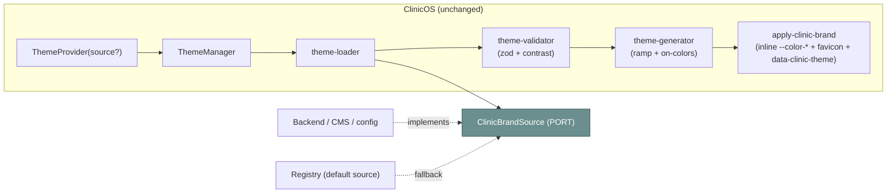
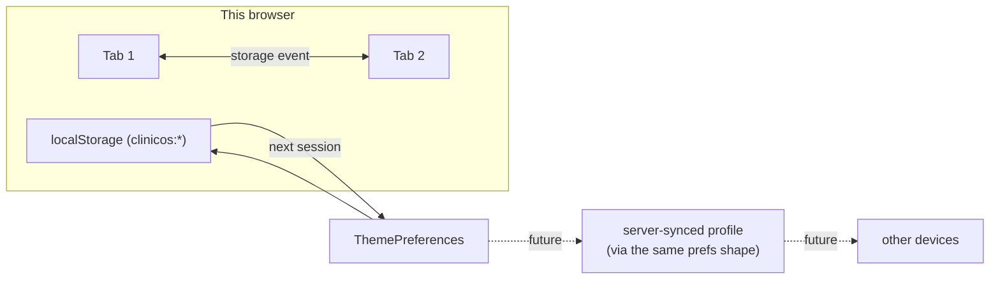

# 🏥 ClinicBranding — white-label with no source changes, and persistence

> **Parts 6 & 7 — the branding engine and persistence.** The design system defines the **CSS hook**
> for white-labelling (`[data-clinic-theme='<id>']` re-maps only brand/accent semantics —
> [Theme.md §12.4](../design-system/Theme.md)). **This doc covers the runtime that drives it**: how a
> clinic customizes its entire look **without a single source change** via the `ClinicBrandSource`
> port + generator, and how every preference (theme/language/density/a11y/brand) persists.
>
> Siblings: [README](./README.md) · [ThemeTypes](./ThemeTypes.md) · [ThemeUtilities](./ThemeUtilities.md)
> · [AccessibilityTheme](./AccessibilityTheme.md).

---

## Part 6 — The branding engine

### What a clinic can re-brand

A clinic supplies **one `ClinicBrand` object**; the engine re-skins everything below from it — **with no
code change and no redeploy**:

| Surface                          | Brand field                                                             | How it's applied                                                                   |
| -------------------------------- | ----------------------------------------------------------------------- | ---------------------------------------------------------------------------------- |
| **Primary / accent colors**      | `colors.primary`, `colors.accent` (hex)                                 | Generator derives the full ramp + on-colors → inline `--color-*` vars on `<html>`. |
| **Logo (full / mark)**           | `logo.full`, `logo.mark`                                                | Consumed by the shell via the brand from `useClinicBrand()`.                       |
| **Sidebar / header**             | `sidebarStyle`, `headerStyle` (`solid\|subtle\|branded`)                | How strongly those surfaces carry the brand.                                       |
| **Login screen**                 | `login.backgroundUrl`, `login.tagline`                                  | The unauthenticated entry point.                                                   |
| **Favicon**                      | `faviconUrl`                                                            | `applyClinicBrand` updates `<link rel="icon">`.                                    |
| **Loader / splash**              | `loaderUrl`                                                             | Brand splash while the app boots.                                                  |
| **Illustrations**                | `illustrations` (record)                                                | Empty-state and onboarding art per clinic.                                         |
| **PDF / prescription / invoice** | `document.headerLogoUrl`, `document.footerText`, `document.accentColor` | Document branding for printed/exported artifacts.                                  |

> **The discipline is the design system's:** only the **brand/accent** semantics change; surfaces,
> text, functional, status, vital, and emergency tokens carry meaning across clinics and are **never**
> re-branded ([Theme.md §12.4 rules 1–4](../design-system/Theme.md)). The engine enforces the
> color part of this by only emitting `--color-primary*`/`--color-accent*` vars.

### The `ClinicBrandSource` port — why no source change is needed

```ts
// branding/clinic-brand.types.ts
export interface ClinicBrandSource {
  getBrand(id: string): Promise<ClinicBrand | null>; // PORT — the backend implements this
}
```

A clinic is added by **providing brand data through this port**, not by editing the app:



- **Default source** = registry-backed (`registryBrandSource(registry)`) for tests, demos, and seeded
  brands. **Production source** = a backend/CMS adapter injected via the provider's `source` prop.
- Swapping how brands are fetched (REST → GraphQL → a config service) is **one adapter** — the engine,
  the generator, and every component are untouched. This is the codebase's backend-independence law
  applied to branding ([Architecture.md §7](../architecture/Architecture.md)).

### The load pipeline (id → painted brand)

```mermaid
sequenceDiagram
  autonumber
  participant Comp as useClinicBrand()
  participant Mgr as ThemeManager
  participant Ldr as Loader
  participant Src as ClinicBrandSource (PORT)
  participant Val as Validator
  participant Gen as Generator
  participant DOM as &lt;html&gt;
  Comp->>Mgr: loadClinicBrand('northside')
  Mgr->>Ldr: load('northside')
  Ldr->>Src: getBrand('northside')  (cache-checked)
  Src-->>Ldr: ClinicBrand | null
  Ldr-->>Mgr: brand
  Mgr->>Val: validateTheme(brand)   (zod shape + contrast audit)
  alt invalid
    Val-->>Mgr: { valid:false, errors } → reject, keep current brand
  else valid
    Mgr->>Gen: generateBrand(brand)  (ramp + on-colors)
    Gen-->>Mgr: { --color-primary: …, --color-on-primary: …, … }
    Mgr->>DOM: applyClinicBrand → inline vars + data-clinic-theme + favicon
    Mgr->>Mgr: new snapshot (clinicBrand set) → persist id → notify
  end
```

- **`applyClinicBrand(brand)`** computes the vars via the generator, sets `--color-*` inline on
  `<html>`, sets `data-clinic-theme=<id>`, and updates the favicon if `faviconUrl` is present.
  **`removeClinicBrand()`** clears those inline props + the attribute (back to the base theme). Both are
  SSR-guarded.
- **`validateTheme`** is the gate: a brand with an unreadable on-color (fails AA) is **warned/rejected**
  before it ever paints — see [AccessibilityTheme.md §10](./AccessibilityTheme.md).

### Consuming branding from React

```ts
import { useClinicBrand } from '@/shared/theme';

function Sidebar() {
  const { brand, loadClinicBrand, resetClinicBrand } = useClinicBrand();
  // brand?.logo?.full, brand?.sidebarStyle, etc. — tokens still come from CSS vars
}
```

Components read the brand **object** for assets (logos, illustrations) and read **colors via tokens**
(`var(--color-primary)`), never the raw hex — so a component works under any brand unchanged.

### Decision Contract — branding through a port + runtime generator

- **Why:** Thousands of tenants can't each have a hand-authored CSS block in the repo, and the frontend
  must stay backend-independent. A port + a runtime generator means a clinic supplies _data_, the
  engine derives the _skin_.
- **Benefits:** No source change / no redeploy per clinic; a brand is validated + contrast-audited
  before it paints; logos/documents/illustrations all flow from one object; the default registry source
  keeps tests/demos hermetic.
- **Trade-offs:** Brand colors are inline vars (dynamic), not a static CSS map; the generator must
  produce a complete, accessible ramp from two hex values.
- **Future scalability:** Swap the source adapter (CMS, per-tenant config service) with zero engine
  change; pre-seed the registry; add document/illustration fields without breaking older brands.
- **Alternatives:** (a) A checked-in CSS block per clinic — fine for a couple of static skins, doesn't
  scale, needs a redeploy (kept only as the design system's worked _example_, not the mechanism).
  (b) Fetch arbitrary brand CSS — unvalidated, no contrast gate (rejected).
- **Enterprise:** White-label is a first-class multi-tenant capability; the validator is the compliance
  gate; the port is the seam a platform team owns.

---

## Part 7 — Persistence

Preferences and the active brand persist so a returning user (and a new tab) sees the same experience.

### What persists, where, and who owns it

| Preference           | Storage key (`clinicos:` namespace) | Owner    | Read by no-flash script?                  |
| -------------------- | ----------------------------------- | -------- | ----------------------------------------- |
| Theme mode           | `theme`                             | engine   | ✅                                        |
| Large text           | `largeText`                         | engine   | ✅                                        |
| Reduced motion       | `reducedMotion`                     | engine   | ✅                                        |
| **Density**          | `density` _(new)_                   | engine   | ✅                                        |
| **Clinic brand id**  | `clinicBrand` _(new)_               | engine   | ✅ (sets `data-clinic-theme`)             |
| Language / direction | `locale`                            | **i18n** | locale read by i18n; engine mirrors `dir` |

- **Individual keys, not one blob** — so the pre-paint no-flash script can read each with a bare
  `localStorage.getItem` and zero modules ([ThemeArchitecture.md §3.5](./ThemeArchitecture.md)).
- **`theme-storage.ts`** owns `loadPreferences` / `savePreferences` (validating + falling back to
  defaults) and `subscribeStorage` for cross-tab sync.

### Persistence across browser / sessions / future devices



- **Across sessions** — keys live in `localStorage`; the next visit restores them pre-paint.
- **Across tabs** — the manager subscribes to the `storage` event and re-applies, so a change in one tab
  reflects in another immediately.
- **Across future devices** — `exportPreferences`/`importPreferences` produce a **versioned envelope**
  (`{ v: 1, preferences }`), which is exactly the payload a future "sync my preferences to my account"
  feature would push to the server and pull on another device — **no shape change required**. The
  clinic brand re-loads from its persisted **id** through the port, so it follows the user too.

> **PHI note:** preferences are non-PHI UI settings (theme, density, a11y, language, brand id). Nothing
> sensitive is stored here ([AI_RULES.md §8](../architecture/AI_RULES.md)); the persisted Query cache
> (PHI) is a separate, tenant-namespaced concern owned by `shared/cache`.

---

_Phase 5 · ClinicBranding · the runtime behind the design system's white-label hook
([Theme.md §12.4](../design-system/Theme.md)) · 2026-06-27._
