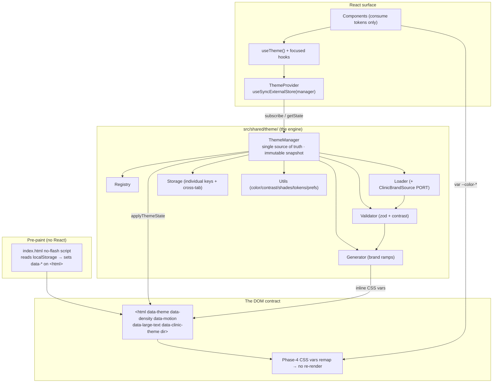

# 🎨 ClinicOS Theme Engine (Phase 5)

> **The runtime side of theming.** Phase 4 (the design system) defined _what_ the tokens are and how
> a single `<html>` attribute re-skins the app. **Phase 5 — this folder — is the TypeScript engine
> that drives those attributes at runtime**: the provider, manager, registry, loader, validator,
> generator, types, hooks, utilities, and clinic-branding port that turn user preferences and clinic
> brands into the data-attributes and CSS variables the design system already understands.
>
> **Token rationale lives in the design system, never here.** For _why_ a token exists, what the four
> modes remap, or the white-label CSS hook, read
> **[docs/design-system/Theme.md](../design-system/Theme.md)** (and its siblings
> [ColorSystem](../design-system/ColorSystem.md) · [DesignTokens](../design-system/DesignTokens.md)).
> These engine docs **defer** to those and document only the runtime.

---

## The one rule that governs everything

> **Consume the theme. Never bypass it.**
>
> - **Read tokens** (`var(--color-primary)`, or `getColor('primary')`) — **NEVER hardcode a color, size,
>   space, radius, shadow, duration, or font.**
> - **Read state through `useTheme()`** (and its focused siblings) — **NEVER reach into
>   `localStorage`, `matchMedia`, or `document.documentElement` from a component, and NEVER bypass
>   `ThemeProvider`.**
> - The **manager is the single source of truth**. Components subscribe; they do not mutate the DOM.
>
> This is the same Token Rule the whole codebase already enforces
> ([AI_RULES.md §5](../architecture/AI_RULES.md)) — the engine just makes it ergonomic.

---

## The engine at a glance



**The flow in one breath:** the no-flash script paints the right theme _before_ React mounts →
`ThemeManager.init()` adopts that state, wires `matchMedia` + cross-tab storage, and becomes the single
source of truth → `ThemeProvider` subscribes via `useSyncExternalStore` with a **stable snapshot** so
re-renders are minimal → components call `useTheme()` to read and to mutate → mutations are **CSS-var /
attribute swaps**, so the app re-skins with **no component re-render**.

---

## Documents in this folder

| Doc                                                      | What it covers (spec parts)                                                                                                    |
| -------------------------------------------------------- | ------------------------------------------------------------------------------------------------------------------------------ |
| **[ThemeEngine.md](./ThemeEngine.md)**                   | Why a theme engine, the parts overview, the modes, performance, and the AI rules (Parts 1 · 2 · 5 · 9 · 13).                   |
| **[ThemeArchitecture.md](./ThemeArchitecture.md)**       | Deep architecture: the data-attribute contract, the full state-flow (mermaid), and a Decision Contract for every major choice. |
| **[ThemeFolderStructure.md](./ThemeFolderStructure.md)** | Every file under `src/shared/theme/` — purpose + allowed/forbidden deps (Part 3).                                              |
| **[ThemeTypes.md](./ThemeTypes.md)**                     | Every type (`ThemePreferences`, `ThemeState`, `ClinicBrand`, `Density`, …) and why it exists (Part 4).                         |
| **[ThemeUtilities.md](./ThemeUtilities.md)**             | Every pure util — signature + example (Part 8).                                                                                |
| **[ClinicBranding.md](./ClinicBranding.md)**             | White-labelling with **no source changes** via the `ClinicBrandSource` port, plus persistence (Parts 6 · 7).                   |
| **[AccessibilityTheme.md](./AccessibilityTheme.md)**     | WCAG / contrast / color-blind / reduced-motion / high-contrast, and LTR/RTL/mixed + language fonts (Parts 10 · 11).            |
| **[DeveloperGuide.md](./DeveloperGuide.md)**             | Usage, migration, contribution, best practices, common mistakes, and a checklist (Part 12).                                    |

> Related canon: design-system theming [Theme.md](../design-system/Theme.md) · architecture narrative
> [Architecture.md](../architecture/Architecture.md) · AI operating manual
> [AI_RULES.md](../architecture/AI_RULES.md) · global developer guide
> [DeveloperGuide.md](../architecture/DeveloperGuide.md).

---

## Public surface (the only things you import)

The engine ships through `src/shared/theme/index.ts`. From a component, you only ever need:

```ts
import {
  useTheme,
  useThemeMode,
  useColorScheme,
  useDensity,
  useDirection,
  useClinicBrand,
} from '@/shared/theme';
// values + actions only — never the manager, never the DOM
```

`ThemeProvider` is mounted **once** in `src/app/providers/`. Everything else (manager, registry,
loader, validator, generator, storage) is **internal** — wired by the provider, never imported by a
component. See **[ThemeFolderStructure.md](./ThemeFolderStructure.md)** for the allowed/forbidden import
matrix.

---

_Phase 5 · Theme Engine · the RUNTIME companion to [design-system/Theme.md](../design-system/Theme.md) ·
token rationale defers to the design system · 2026-06-27._
