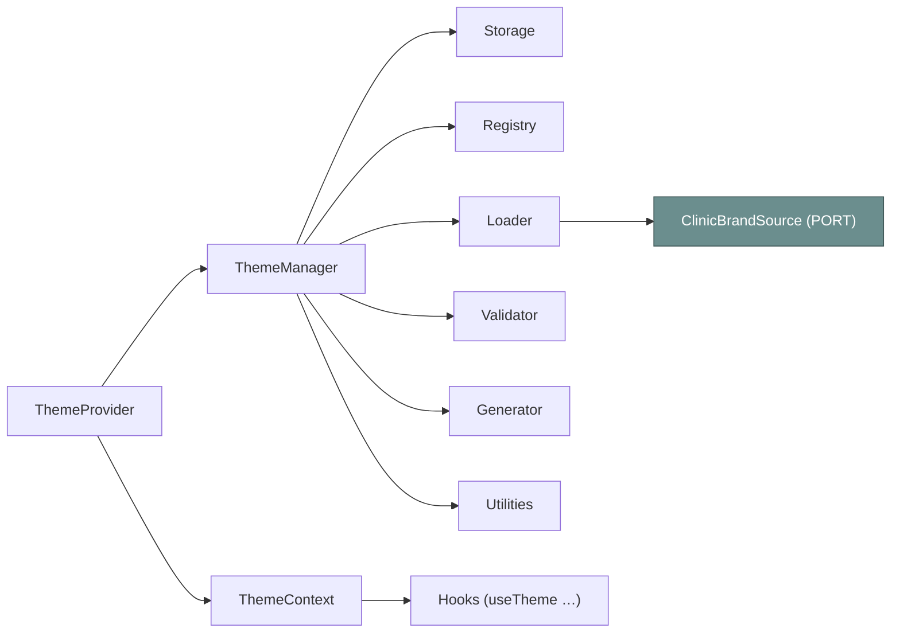
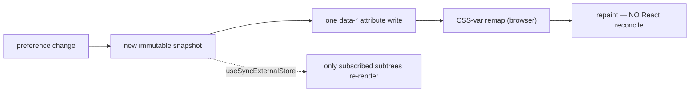

# 🎨 ThemeEngine — the runtime theming system

> **The RUNTIME companion to [design-system/Theme.md](../design-system/Theme.md).** The design system
> defines the tokens, the four modes, and the white-label CSS hook (`data-clinic-theme`). **This doc
> covers the engine that drives them at runtime** — why it exists, the parts it is made of, the modes
> it manages, how it performs, and the AI rules that bind it.
>
> For _why a token exists_ or _what a mode remaps in CSS_, read the design system — this doc will link
> to it and not repeat it. Siblings: [README](./README.md) · [ThemeArchitecture](./ThemeArchitecture.md)
> · [ThemeFolderStructure](./ThemeFolderStructure.md) · [ThemeTypes](./ThemeTypes.md) ·
> [ThemeUtilities](./ThemeUtilities.md) · [ClinicBranding](./ClinicBranding.md) ·
> [AccessibilityTheme](./AccessibilityTheme.md) · [DeveloperGuide](./DeveloperGuide.md).

---

## Part 1 — Why a theme engine at all

The design system already proves that **one attribute on `<html>` re-skins the whole app** with no
rebuild and no re-render (a pure CSS-variable swap). So why build a TypeScript engine on top?

Because the _attribute_ is the easy part. The hard parts are everything around it:

| Concern                                   | Without an engine                                                  | With the engine                                                                   |
| ----------------------------------------- | ------------------------------------------------------------------ | --------------------------------------------------------------------------------- |
| **Where preferences live**                | Scattered `localStorage.getItem` calls in components               | One **manager** is the single source of truth; components never touch storage     |
| **System theme (`prefers-color-scheme`)** | Each component subscribes to `matchMedia` (leaks, dupes)           | Manager owns one `matchMedia` subscription; `system` mode stays live              |
| **No flash on first paint**               | Theme applied after React mounts → flash of wrong theme            | A pre-paint **no-flash script** sets attributes before the bundle loads           |
| **Cross-tab consistency**                 | One tab's change never reaches another                             | Manager subscribes to the `storage` event and re-applies                          |
| **Clinic branding**                       | Hardcoded per-clinic CSS, redeploy per tenant                      | An injectable **port** loads a brand; a **generator** derives the ramp at runtime |
| **Minimal re-renders**                    | Context value changes on every render → app re-renders             | `useSyncExternalStore` + a **stable snapshot** → only affected subtrees re-render |
| **A11y + RTL**                            | Each feature re-implements large-text / reduced-motion / direction | First-class **modes** the engine manages and persists                             |

### The forces the engine is built for

- **Semantic colors, not literals.** Components consume `--color-primary*` / `--color-accent*` and
  never primitives, exactly as the design system mandates ([Theme.md §12.4](../design-system/Theme.md)).
  The engine's job is to make the _right_ semantic values land on `<html>`.
- **CSS variables over JS theme objects.** The theme is a CSS-variable swap, so toggling it costs one
  attribute write — **no React tree walk, no inline-style churn** on every node. (Decision Contract in
  [ThemeArchitecture.md](./ThemeArchitecture.md).)
- **Dynamic themes.** Light / dark / high-contrast / large-text / reduced-motion / density compose at
  runtime from user preference and OS signals.
- **White-label / clinic branding.** A clinic re-skins ClinicOS by supplying a **brand object**
  (primary + accent + logos + document branding) through a **port** — _no source change, no redeploy_.
  See [ClinicBranding.md](./ClinicBranding.md).

> **Defer:** the token tiers, the semantic-remap discipline, and the four modes' exact CSS values are
> the design system's domain — [Theme.md §12.1–§12.4](../design-system/Theme.md). The engine never
> redefines them; it only chooses _which_ map is active and injects brand vars.

---

## Part 2 — The parts of the engine (each responsibility)

The engine lives under `src/shared/theme/` (full tree + import rules in
[ThemeFolderStructure.md](./ThemeFolderStructure.md)). Each part has exactly one responsibility.

| Part                         | File(s)                                                       | Single responsibility                                                                                                                                                                                                                                  |
| ---------------------------- | ------------------------------------------------------------- | ------------------------------------------------------------------------------------------------------------------------------------------------------------------------------------------------------------------------------------------------------ |
| **Provider**                 | `src/app/providers/ThemeProvider.tsx`                         | Creates the manager **once**, calls `init()` on mount (and `destroy()` on unmount), subscribes via `useSyncExternalStore`, and provides a memoized context value (state + bound actions). It does **not** own logic — it bridges the manager to React. |
| **Context**                  | `context/theme-context.ts` · `context/theme-context.types.ts` | The typed `ThemeContextValue` (state + actions) and the `ThemeContext` object. Null by default so a missing provider throws loudly.                                                                                                                    |
| **Manager**                  | `manager/theme-manager.ts`                                    | **The single source of truth.** Holds an immutable `ThemeState` snapshot, exposes `getState()`/`subscribe()`, and every mutator (`setMode`, `setDensity`, …). On every change: recompute → `applyThemeState` → save → notify.                          |
| **Registry**                 | `manager/theme-registry.ts`                                   | In-memory catalog of known clinic brands (`registerBrand`, `getBrand`, `listBrands`, `hasBrand`) and the built-in modes. The default brand source reads from it.                                                                                       |
| **Loader**                   | `manager/theme-loader.ts`                                     | Resolves a brand **by id** through the injectable `ClinicBrandSource` port, with an in-memory cache. Lets the backend swap how brands are fetched without touching the manager.                                                                        |
| **Validator**                | `manager/theme-validator.ts`                                  | Validates a brand: zod shape check (`validateClinicBrand`) **plus** a contrast audit (primary vs surfaces) so a brand can't ship an unreadable on-color.                                                                                               |
| **Generator**                | `manager/theme-generator.ts`                                  | Thin composition over the utils: derives the brand CSS-variable map (ramps + on-colors) from `primary`/`accent`. Logic lives in `utils/`; this just composes.                                                                                          |
| **Types**                    | `model/theme.types.ts` · `model/theme.constants.ts`           | The vocabulary: `ThemePreferences`, `ThemeState`, `Density`, `Direction`, `ColorTokenName`, the data-attr names, the defaults. See [ThemeTypes.md](./ThemeTypes.md).                                                                                   |
| **Hooks**                    | `hooks/use-theme.ts` · `hooks/use-clinic-brand.ts`            | The **only** component-facing surface: `useTheme`, `useThemeMode`, `useColorScheme`, `useReducedMotion`, `useLargeText`, `useDensity`, `useDirection`, `useClinicBrand`. Each reads `ThemeContext`.                                                    |
| **Utilities**                | `utils/*`                                                     | Pure functions: color math, contrast, shade generation, token reads, `applyThemeState`, preference merge/export/import. See [ThemeUtilities.md](./ThemeUtilities.md).                                                                                  |
| **Storage**                  | `manager/theme-storage.ts`                                    | Reads/writes the **individual** storage keys (so the no-flash script can read them with no modules) and subscribes to the cross-tab `storage` event.                                                                                                   |
| **Persistence**              | `manager/theme-storage.ts` + `STORAGE_KEYS`                   | Theme, language (i18n-owned), density, a11y, and clinic-brand id persist across sessions via individual keys. Detail in [ClinicBranding.md §7](./ClinicBranding.md).                                                                                   |
| **Synchronization**          | `manager.init()` wiring                                       | Three live signals: OS `prefers-color-scheme` (affects `system` mode), OS `prefers-reduced-motion` (affects `motion='system'`), and the cross-tab `storage` event.                                                                                     |
| **API (the public surface)** | `index.ts` barrel + hooks                                     | Everything consumable: types, constants, brand types, `validateClinicBrand`, all utils, `createThemeManager`, `ThemeContext`, the hooks. The manager itself is created only by the provider.                                                           |

> **Preserves Phase 4.** The manager **uses** the existing `theme.ts` functions (`resolveTheme`,
> `applyTheme`, `setThemeMode`, `applyLargeText`, `applyReducedMotion`, `initTheme`, …) internally —
> it wraps them, it does not replace them. The new applier is `applyThemeState` (so it never clashes
> with `applyTheme`). `tokens.ts` is untouched.

---

## Part 5 — The modes the engine manages

The engine manages a small, composable set of modes. **What each mode remaps in CSS is the design
system's contract** ([Theme.md §12.3](../design-system/Theme.md)); the engine's job is to choose and
persist the mode and write the attribute.

| Mode                          | Attribute the engine writes                                 | Engine behavior                                                 | CSS contract                                              |
| ----------------------------- | ----------------------------------------------------------- | --------------------------------------------------------------- | --------------------------------------------------------- |
| **Light**                     | `data-theme="light"`                                        | Default; `resolveTheme('system')` lands here when OS is light   | [Theme.md §12.3 Light](../design-system/Theme.md)         |
| **Dark**                      | `data-theme="dark"`                                         | From `mode='dark'`, or `system` when OS is dark                 | [Theme.md §12.3 Dark](../design-system/Theme.md)          |
| **High-contrast**             | `data-theme="high-contrast"`                                | From `mode='high-contrast'`                                     | [Theme.md §12.3 High-contrast](../design-system/Theme.md) |
| **Large text**                | `data-large-text="true"` (present only when on)             | From `textScale='large'`; composes with any theme               | [Theme.md §12.3 Large Text](../design-system/Theme.md)    |
| **Reduced motion**            | `data-motion="reduced" \| "normal"` (or absent = follow OS) | `motion`: `system`→absent, `full`→`normal`, `reduced`→`reduced` | [Motion.md](../design-system/Motion.md)                   |
| **Clinic branding (compose)** | `data-clinic-theme="<brandId>"` + inline `--color-*` vars   | Loader + generator + applier; composes with `data-theme`        | [Theme.md §12.4 white-label](../design-system/Theme.md)   |
| **Density (new)**             | `data-density="comfortable" \| "compact"`                   | `setDensity`; `compact` tightens padding tokens                 | new block in `themes.css` (`[data-density='compact']`)    |
| **Direction**                 | `dir="ltr" \| "rtl"`                                        | **i18n-owned**; the engine **mirrors**, never fights it         | [AccessibilityTheme.md §11](./AccessibilityTheme.md)      |

**Modes compose.** A clinic can run `data-theme="dark" data-clinic-theme="northside"
data-large-text="true" data-density="compact" dir="rtl"` simultaneously — each attribute is orthogonal
and the CSS cascade resolves them. The engine never encodes the combinations; it just sets each
attribute from the corresponding preference.

> **Seasonal / future modes.** Because a mode is just "an attribute the engine writes + a CSS map the
> design system supplies," a future _seasonal_ or _campaign_ skin needs **no engine change** — add a
> `data-clinic-theme`-style hook and a CSS block. The engine's brand pipeline is the extension point.

---

## Part 9 — Performance

Theming is a **hot path** — it can touch the whole tree. The engine is built so a theme change is
cheap and never flashes.

| Technique                                    | Where                      | Why it matters                                                                                                                                                                                                                |
| -------------------------------------------- | -------------------------- | ----------------------------------------------------------------------------------------------------------------------------------------------------------------------------------------------------------------------------- |
| **`useSyncExternalStore` + stable snapshot** | provider ↔ manager         | `getState()` returns the **same reference** until something actually changes, so React doesn't loop and only components that read changed slices re-render. (Golden rule: a stable snapshot or `useSyncExternalStore` tears.) |
| **Attribute swap, no re-render**             | `applyThemeState`          | A theme/density/motion change is an attribute write on `<html>`; the CSS cascade re-skins. **Zero components reconcile.**                                                                                                     |
| **No-flash pre-paint script**                | `index.html` `<head>`      | A tiny inline script reads `localStorage` and sets the attributes **before** the module bundle loads — no flash of incorrect theme, no module dependency.                                                                     |
| **Lazy brand loading**                       | `theme-loader.ts`          | Clinic brands resolve **on demand** through the port and are cached; the default bundle ships zero brand data.                                                                                                                |
| **SSR-ready guards**                         | utils + storage + branding | Every DOM/`localStorage`/`matchMedia` touch is guarded (`typeof document`/`window`), so the Domain logic is render-host-agnostic and the engine can move under SSR/RSC later without rewrites.                                |
| **Single subscriptions**                     | `manager.init()`           | One `matchMedia` listener per signal and one `storage` listener for the whole app — not one per component.                                                                                                                    |

> **The snapshot contract is load-bearing.** Mutators replace the snapshot with a **new** object only
> on real change; unchanged calls keep the reference. This is what keeps `useSyncExternalStore` from
> re-rendering in a loop. See the Decision Contract in [ThemeArchitecture.md](./ThemeArchitecture.md).

---

## Part 13 — The AI rules for the theme engine

These bind every agent and developer (they specialize the global
[AI_RULES.md](../architecture/AI_RULES.md) for theming):

- **NEVER hardcode a color / size / space / radius / shadow / duration / font.** Read a token —
  `var(--color-primary)` in CSS, `getColor('primary')` / `getToken('--space-4')` in TS. Literals are a
  CI failure.
- **NEVER bypass `ThemeProvider`.** Components read and mutate the theme **only** through `useTheme()`
  and its focused siblings. No component touches `localStorage`, `matchMedia`, or
  `document.documentElement` for theming.
- **ALWAYS consume tokens** (semantic tier) — components use `--color-primary*` / `--color-accent*`,
  never primitives, exactly as [Theme.md §12.4](../design-system/Theme.md) requires.
- **ALWAYS keep the manager the single source of truth.** New preferences flow through a manager
  mutator → recompute → `applyThemeState` → persist → notify. Don't write attributes from anywhere else.
- **ALWAYS update the Brain + docs** in the same change (per [AI_RULES.md §4](../architecture/AI_RULES.md)):
  new tokens/mappings → Theme Registry; new behavior → these theme-engine docs + Changelog. A new clinic
  brand or a new mode that touches tier discipline is an **escalation trigger**.

---

_Phase 5 · ThemeEngine · runtime companion to [design-system/Theme.md](../design-system/Theme.md) ·
every decision carries the Decision Contract (see [ThemeArchitecture.md](./ThemeArchitecture.md)) ·
2026-06-27._
