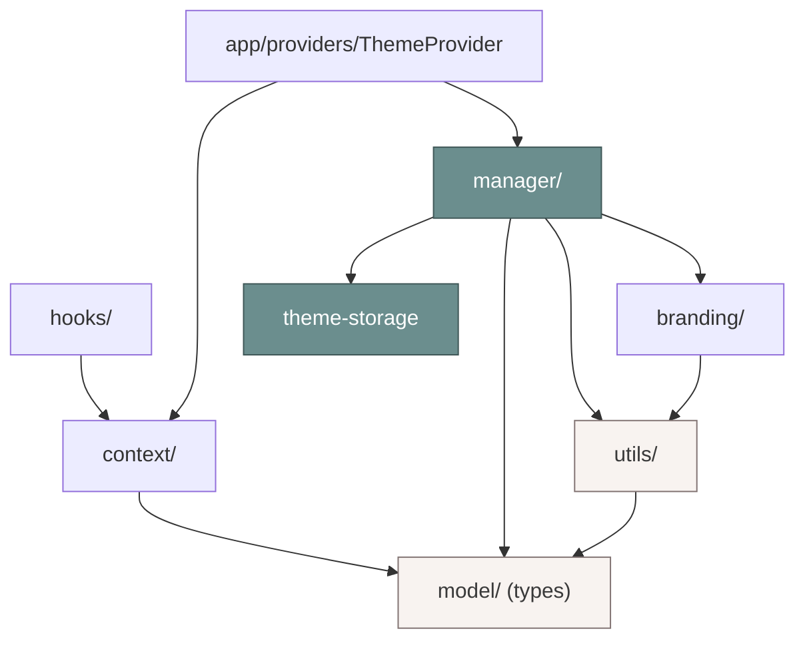

# 📁 ThemeFolderStructure — every file in `src/shared/theme/`

> **Part 3 — the physical shape of the engine.** This documents every file under `src/shared/theme/`,
> its single purpose, and its **allowed / forbidden** dependencies. The token files it wraps
> (`theme.ts`, `tokens.ts`) and the token rationale are the design system's domain —
> [design-system/Theme.md](../design-system/Theme.md). This doc is the runtime engine's map only.
>
> Siblings: [README](./README.md) · [ThemeEngine](./ThemeEngine.md) ·
> [ThemeArchitecture](./ThemeArchitecture.md) · [ThemeTypes](./ThemeTypes.md) ·
> [ThemeUtilities](./ThemeUtilities.md). Canon: [FolderStructure.md](../architecture/FolderStructure.md)
> · [DependencyRules.md](../architecture/DependencyRules.md).

---

## The tree

```
src/shared/theme/
├── index.ts                 # PUBLIC API barrel — the only legal import surface
├── theme.ts                 # KEEP (Phase 4) — pure DOM/storage theme functions
├── tokens.ts                # KEEP (Phase 4) — JS token values
├── model/
│   ├── theme.types.ts       # engine vocabulary (types)
│   └── theme.constants.ts   # modes, scales, data-attr names, defaults
├── branding/
│   ├── clinic-brand.types.ts    # ClinicBrand + ClinicBrandSource (the PORT)
│   ├── clinic-brand.schema.ts    # zod schema + validateClinicBrand
│   └── apply-clinic-brand.ts     # applyClinicBrand / removeClinicBrand (DOM)
├── utils/
│   ├── color.ts             # hex/rgb/hsl math, lighten/darken, luminance
│   ├── contrast.ts          # WCAG contrast ratio + AA/AAA + pickReadableText
│   ├── generate-shades.ts   # 50–900 ramp + brand token map
│   ├── get-token.ts         # getToken / getColor (read CSS vars)
│   ├── apply-theme.ts       # applyThemeState (write all data-attrs)
│   ├── preferences.ts       # default/merge/export/import/compare prefs
│   └── index.ts             # internal utils barrel
├── manager/
│   ├── theme-storage.ts     # individual-key persistence + cross-tab
│   ├── theme-registry.ts    # in-memory brand catalog
│   ├── theme-loader.ts      # brand resolution via the port + cache
│   ├── theme-validator.ts   # zod + contrast audit
│   ├── theme-generator.ts   # brand CSS-var map (thin, composes utils)
│   └── theme-manager.ts     # THE single source of truth
├── context/
│   ├── theme-context.ts     # ThemeContext object
│   └── theme-context.types.ts   # ThemeContextValue
├── hooks/
│   ├── use-theme.ts         # useTheme + focused hooks
│   └── use-clinic-brand.ts  # useClinicBrand
└── __tests__/
    └── theme-engine.test.ts # smoke: generateShades + contrastRatio + mergePreferences
```

Also touched outside the folder: `src/app/providers/ThemeProvider.tsx` (the React bridge),
`index.html` (the no-flash script), `src/shared/styles/themes.css` (the `[data-density='compact']`
block), and `src/shared/constants/storage-keys.constants.ts` (`density`, `clinicBrand` keys).

---

## Per-file contract

Legend — **Allowed:** what the file may import. **Forbidden:** what it must never import.

### Barrel & Phase-4 (kept)

| File        | Purpose                                                                                                                                                                                                                                                                     | Allowed                                | Forbidden                        |
| ----------- | --------------------------------------------------------------------------------------------------------------------------------------------------------------------------------------------------------------------------------------------------------------------------- | -------------------------------------- | -------------------------------- |
| `index.ts`  | Public API barrel. Keeps all existing exports and adds types, constants, brand types, `validateClinicBrand`, all utils, `createThemeManager`, `ThemeContext`, `ThemeContextValue`, the hooks. Avoids name clashes (the new applier is `applyThemeState`, not `applyTheme`). | every sibling in `theme/`              | anything outside `shared/theme/` |
| `theme.ts`  | **(Phase 4, kept)** Pure DOM + storage theme functions (`resolveTheme`, `applyTheme`, `setThemeMode`, `applyLargeText`, `applyReducedMotion`, `initTheme`, …). The manager uses these.                                                                                      | `tokens.ts`, browser globals (guarded) | React, manager, hooks            |
| `tokens.ts` | **(Phase 4, kept)** JS token values.                                                                                                                                                                                                                                        | none                                   | everything (leaf)                |

### `model/` (Domain — most stable)

| File                 | Purpose                                                                                                                                                                                                                           | Allowed                                                          | Forbidden                    |
| -------------------- | --------------------------------------------------------------------------------------------------------------------------------------------------------------------------------------------------------------------------------- | ---------------------------------------------------------------- | ---------------------------- |
| `theme.types.ts`     | The engine vocabulary: re-exports `Theme`/`ThemeMode` from `theme.ts`; defines `ColorScheme`, `TextScale`, `MotionPreference`, `Density`, `Direction`, `ThemePreferences`, `ThemeState`, `ThemeChangeListener`, `ColorTokenName`. | `../theme` (types), `../branding/clinic-brand.types` (type-only) | utils, manager, hooks, React |
| `theme.constants.ts` | `THEME_MODES`, `TEXT_SCALES`, `MOTION_PREFERENCES`, `DENSITIES`, `DIRECTIONS`, `RTL_LOCALES`, `DATA_ATTR`, `DEFAULT_PREFERENCES`.                                                                                                 | `./theme.types`                                                  | utils, manager, hooks, React |

### `branding/`

| File                     | Purpose                                                                                                                                              | Allowed                                                                                         | Forbidden               |
| ------------------------ | ---------------------------------------------------------------------------------------------------------------------------------------------------- | ----------------------------------------------------------------------------------------------- | ----------------------- |
| `clinic-brand.types.ts`  | `SurfaceStyle`, `ClinicBrand`, and **`ClinicBrandSource`** (the injectable port the backend implements).                                             | none                                                                                            | everything (leaf types) |
| `clinic-brand.schema.ts` | Zod `clinicBrandSchema` (hex regex, optional url-ish strings), `ClinicBrandInput`, and `validateClinicBrand(input)`.                                 | `zod`, `./clinic-brand.types`                                                                   | manager, hooks, React   |
| `apply-clinic-brand.ts`  | `applyClinicBrand(brand)` (compute brand vars via generator, set them + `data-clinic-theme`, update favicon) and `removeClinicBrand()`. SSR-guarded. | `../manager/theme-generator` (or `../utils`), `./clinic-brand.types`, browser globals (guarded) | hooks, React            |

### `utils/` (pure — the leaf layer)

| File                 | Purpose                                                                                                   | Allowed                                                       | Forbidden                       |
| -------------------- | --------------------------------------------------------------------------------------------------------- | ------------------------------------------------------------- | ------------------------------- |
| `color.ts`           | Hex/RGB/HSL conversions, `lighten`/`darken`, `relativeLuminance`.                                         | none                                                          | everything (pure)               |
| `contrast.ts`        | `contrastRatio`, `meetsWcagAA/AAA`, `pickReadableText`.                                                   | `./color`                                                     | everything else                 |
| `generate-shades.ts` | `generateShades` (50–900 ramp), `generateBrandColorTokens`.                                               | `./color`, `./contrast`                                       | manager, branding, hooks, React |
| `get-token.ts`       | `getToken(varName, el?)`, `getColor(name)` — read CSS vars (SSR returns `''`).                            | `../model/theme.types` (type-only), browser globals (guarded) | manager, hooks, React           |
| `apply-theme.ts`     | `applyThemeState(state)` — write all data-attrs (reuses `theme.ts` setters). SSR-guarded.                 | `../theme`, `../model/*`, browser globals (guarded)           | manager, hooks, React           |
| `preferences.ts`     | `defaultPreferences`, `mergePreferences`, `exportPreferences`, `importPreferences`, `comparePreferences`. | `../model/*`                                                  | DOM, manager, hooks, React      |
| `index.ts`           | Internal utils barrel.                                                                                    | the utils above                                               | anything outside `utils/`       |

### `manager/` (the runtime)

| File                 | Purpose                                                                                                                                                                                       | Allowed                                                                                                                                                                 | Forbidden                   |
| -------------------- | --------------------------------------------------------------------------------------------------------------------------------------------------------------------------------------------- | ----------------------------------------------------------------------------------------------------------------------------------------------------------------------- | --------------------------- |
| `theme-storage.ts`   | `loadPreferences`, `savePreferences` (individual `STORAGE_KEYS`), `subscribeStorage` (cross-tab). SSR-guarded.                                                                                | `../model/*`, `../utils` (prefs), `@/shared/constants/storage-keys`, browser globals (guarded)                                                                          | hooks, React                |
| `theme-registry.ts`  | `createThemeRegistry()` → in-memory brand `Map` + `BUILTIN_MODES`.                                                                                                                            | `../model/*`, `../branding/clinic-brand.types`                                                                                                                          | DOM, hooks, React           |
| `theme-loader.ts`    | `createThemeLoader(source)` → `load(id)` with cache; `registryBrandSource(registry)`.                                                                                                         | `../branding/*`, `./theme-registry`                                                                                                                                     | DOM, hooks, React           |
| `theme-validator.ts` | `validateTheme(brand)` → zod (`validateClinicBrand`) + contrast audit.                                                                                                                        | `../branding/clinic-brand.schema`, `../utils/contrast`                                                                                                                  | hooks, React                |
| `theme-generator.ts` | `generateBrand(brand)`, `previewShades(hex)` — thin composition over utils.                                                                                                                   | `../utils`, `../branding/clinic-brand.types`                                                                                                                            | manager state, hooks, React |
| `theme-manager.ts`   | **The single source of truth.** `createThemeManager(opts?)` → the `ThemeManager` interface (`getState`, `subscribe`, `init`, all mutators, brand ops, `export/importPreferences`, `destroy`). | `../model/*`, `../utils`, `../branding/*`, `./theme-storage`, `./theme-registry`, `./theme-loader`, `./theme-validator`, `./theme-generator`, browser globals (guarded) | hooks, React, context       |

### `context/` & `hooks/` (Presentation bridge)

| File                        | Purpose                                                                                                                                                          | Allowed                                                   | Forbidden                      |
| --------------------------- | ---------------------------------------------------------------------------------------------------------------------------------------------------------------- | --------------------------------------------------------- | ------------------------------ |
| `theme-context.types.ts`    | `ThemeContextValue` (extends `ThemeState` with the bound action signatures).                                                                                     | `../model/*`, `../branding/clinic-brand.types`            | manager impl, DOM              |
| `theme-context.ts`          | `createContext<ThemeContextValue \| null>(null)`.                                                                                                                | `react`, `./theme-context.types`                          | manager impl, DOM              |
| `hooks/use-theme.ts`        | `useThemeContext` (throws if no provider), `useTheme` alias, `useThemeMode`, `useColorScheme`, `useReducedMotion`, `useLargeText`, `useDensity`, `useDirection`. | `react`, `../context/*`, `../model/*`                     | manager directly, DOM, storage |
| `hooks/use-clinic-brand.ts` | `useClinicBrand()` → `{ brand, applyClinicBrand, loadClinicBrand, resetClinicBrand }`.                                                                           | `react`, `../context/*`, `../branding/clinic-brand.types` | manager directly, DOM, storage |

### Outside the folder (touched)

| File                                             | Purpose                                                                                                                                                                         |
| ------------------------------------------------ | ------------------------------------------------------------------------------------------------------------------------------------------------------------------------------- |
| `src/app/providers/ThemeProvider.tsx`            | Creates the manager once, `init()`/`destroy()`, `useSyncExternalStore`, memoized `ThemeContextValue`, `<ThemeContext.Provider>`. Optional `source?: ClinicBrandSource` DI prop. |
| `index.html`                                     | The pre-paint **no-flash script** (self-contained, no imports).                                                                                                                 |
| `src/shared/styles/themes.css`                   | Append the additive `[data-density='compact']` block.                                                                                                                           |
| `src/shared/constants/storage-keys.constants.ts` | Add `density` + `clinicBrand` keys.                                                                                                                                             |

---

## The dependency rule, visualized



**Invariants:**

- The engine is in `shared/` → it may import **only** `shared/*`, **never** a module/entity/process.
- **Hooks never import the manager.** They read `ThemeContext`. The provider is the only thing that
  touches the manager.
- **Utils are pure leaves.** No manager, no hooks, no React; DOM/storage touches are SSR-guarded.
- **The barrel is the only public surface.** Everything a consumer needs is re-exported from
  `index.ts`; internals stay internal.

---

_Phase 5 · ThemeFolderStructure · the engine's map; token files defer to
[design-system/Theme.md](../design-system/Theme.md) · aligned with
[FolderStructure.md](../architecture/FolderStructure.md) · 2026-06-27._
