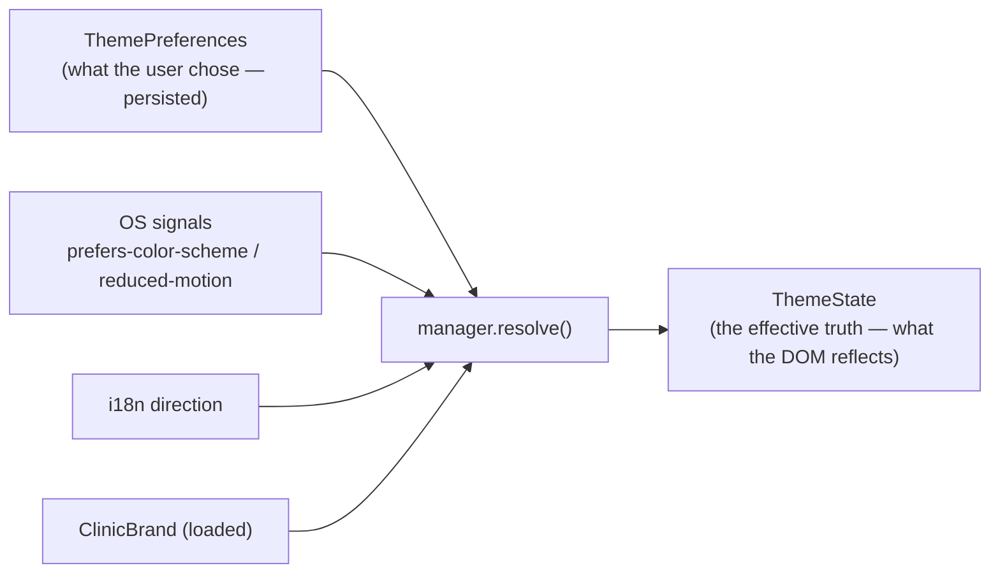

# 🧬 ThemeTypes — every type in the engine, and why

> **Part 4 — the engine's vocabulary.** These are the runtime types that model preferences, the
> resolved state, and a clinic brand. The token names they reference (`--color-primary`, …) and their
> rationale are the design system's domain — [design-system/Theme.md](../design-system/Theme.md). This
> doc explains the **types**, not the tokens.
>
> Siblings: [README](./README.md) · [ThemeEngine](./ThemeEngine.md) ·
> [ThemeArchitecture](./ThemeArchitecture.md) · [ThemeUtilities](./ThemeUtilities.md) ·
> [ClinicBranding](./ClinicBranding.md). Naming canon:
> [NamingConvention.md](../architecture/NamingConvention.md) (kebab files: `x.types.ts`).

---

## The mental model



**`ThemePreferences` is intent; `ThemeState` is effect.** Preferences are what the user picked and what
persists. State is preferences **resolved** against the OS, i18n direction, and the active brand — it's
what actually lands on `<html>` and what components read.

---

## Mode & scale types (re-exported from Phase 4)

| Type                            | Definition                             | Why                                                                                                                 |
| ------------------------------- | -------------------------------------- | ------------------------------------------------------------------------------------------------------------------- |
| `Theme` _(from `theme.ts`)_     | `'light' \| 'dark' \| 'high-contrast'` | The **concrete** themes that land on `data-theme`. Owned by Phase 4; re-exported so the engine has one name for it. |
| `ThemeMode` _(from `theme.ts`)_ | `Theme \| 'system'`                    | The user's **choice**, which may defer to the OS (`system`). Resolved to a `Theme` for the DOM.                     |
| `ColorScheme`                   | `= ThemeMode`                          | A friendly alias for APIs that speak in "color scheme"; same set as `ThemeMode`.                                    |

> The concrete vs. choice split is the design system's contract
> ([Theme.md §12.2](../design-system/Theme.md)); the engine reuses it rather than redefining it.

## Preference dimension types

| Type               | Definition                        | Why                                                                                                                                                          |
| ------------------ | --------------------------------- | ------------------------------------------------------------------------------------------------------------------------------------------------------------ |
| `TextScale`        | `'normal' \| 'large'`             | Drives `data-large-text`. Large-text is a first-class a11y mode (composes with any theme), so it deserves a named type, not a boolean buried in a component. |
| `MotionPreference` | `'system' \| 'full' \| 'reduced'` | Three states, not two: `system` defers to the OS (`data-motion` absent), `full`→`normal`, `reduced`→`reduced`. A boolean can't express "follow the OS".      |
| `Density`          | `'comfortable' \| 'compact'`      | **New.** Drives `data-density`; `compact` tightens padding tokens for data-dense clinic screens. Comfortable is the default (no attribute needed).           |
| `Direction`        | `'ltr' \| 'rtl'`                  | Mirrors i18n's text direction into theme state so consumers read it from one place. The engine **never owns** `dir`; it reflects it.                         |

## `ThemePreferences` — the persisted intent

```ts
interface ThemePreferences {
  mode: ThemeMode; // light | dark | high-contrast | system
  textScale: TextScale; // normal | large
  motion: MotionPreference; // system | full | reduced
  density: Density; // comfortable | compact
  clinicBrandId: string | null; // active brand, or none
}
```

- **Why a flat object:** it's exactly what persists (one key per field), what `mergePreferences`
  patches, and what `export/importPreferences` serializes. Keeping it flat keeps the no-flash script
  and the storage layer trivial ([ThemeArchitecture.md §3.5](./ThemeArchitecture.md)).
- **Why `clinicBrandId` not the brand object:** the id is the only thing that needs to persist; the
  brand object is **loaded** from it via the port (so a brand can change server-side without re-saving
  preferences).

`DEFAULT_PREFERENCES` (in `theme.constants.ts`):
`{ mode: 'system', textScale: 'normal', motion: 'system', density: 'comfortable', clinicBrandId: null }`.

## `ThemeState` — the effective truth

```ts
interface ThemeState {
  preferences: ThemePreferences; // the intent, carried along
  resolvedTheme: Theme; // 'system' resolved to a concrete theme
  reducedMotion: boolean; // effective: override > OS
  direction: Direction; // mirrored from i18n
  clinicBrand: ClinicBrand | null; // the loaded brand object (not just the id)
}
```

- **Why both `preferences` and the resolved fields:** consumers sometimes need the _choice_ (e.g. a
  settings toggle showing "System") and sometimes the _effect_ (e.g. an icon that depends on whether
  dark is _actually_ active). Carrying both avoids re-deriving in components.
- **Why `reducedMotion: boolean` here but `MotionPreference` in prefs:** the preference is tri-state;
  the **effective** value (after resolving `system` against the OS) is a boolean — what a component
  actually needs to branch on.
- **This object is the snapshot.** It's what `getState()` returns and what `useSyncExternalStore`
  reads — so it must be **referentially stable** until a real change
  ([ThemeArchitecture.md §3.3](./ThemeArchitecture.md)).

## `ThemeChangeListener`

```ts
type ThemeChangeListener = (state: ThemeState) => void;
```

The manager's subscriber signature. `subscribe(listener)` returns an unsubscribe function;
`useSyncExternalStore` uses exactly this.

## `ColorTokenName` — type-safe token names

```ts
type ColorTokenName =
  | 'primary'
  | 'primary-hover'
  | 'primary-active'
  | 'primary-subtle'
  | 'on-primary'
  | 'accent'
  | 'accent-hover'
  | 'on-accent'
  | 'surface'
  | 'surface-raised'
  | 'surface-sunken'
  | 'text'
  | 'text-muted'
  | 'text-subtle'
  | 'border'
  | 'focus'
  | 'success'
  | 'warning'
  | 'danger'
  | 'info';
```

- **Why a curated union, not `string`:** `getColor(name)` gets autocomplete and a typo becomes a compile
  error for the common semantic colors. It is **curated, not exhaustive** — `getToken('--any-var')`
  still accepts any string for the long tail. The names mirror the design system's semantic tier
  ([ColorSystem.md](../design-system/ColorSystem.md)); this is the only place the engine restates them,
  and only as a typing aid.

## Clinic brand types (the port)

| Type                                                     | Why                                                                                                                                                                                                                                                                                                                    |
| -------------------------------------------------------- | ---------------------------------------------------------------------------------------------------------------------------------------------------------------------------------------------------------------------------------------------------------------------------------------------------------------------- |
| `SurfaceStyle` = `'solid' \| 'subtle' \| 'branded'`      | How strongly a sidebar/header carries the brand. A small closed set keeps brand surfaces consistent across clinics.                                                                                                                                                                                                    |
| `ClinicBrand`                                            | The whole white-label payload: `id`, `name`, `colors {primary, accent}` (hex; the generator derives ramps + on-colors), optional `logo`, `faviconUrl`, `loaderUrl`, `illustrations`, `sidebarStyle`/`headerStyle`, `login`, and `document` (PDF/prescription/invoice branding). One object = one clinic's entire skin. |
| `ClinicBrandSource`                                      | **The port:** `getBrand(id): Promise<ClinicBrand \| null>`. The single seam the backend implements so brands load without coupling the engine to any backend. Full treatment in [ClinicBranding.md](./ClinicBranding.md).                                                                                              |
| `ClinicBrandInput` = `z.infer<typeof clinicBrandSchema>` | The validated input shape from `clinic-brand.schema.ts`; the boundary between "untrusted brand data" and a trusted `ClinicBrand`.                                                                                                                                                                                      |

## Context type

| Type                | Why                                                                                                                                                                                                                                                                                                                                                                     |
| ------------------- | ----------------------------------------------------------------------------------------------------------------------------------------------------------------------------------------------------------------------------------------------------------------------------------------------------------------------------------------------------------------------- |
| `ThemeContextValue` | `extends ThemeState` and adds the bound actions (`setMode`, `setTextScale`, `setMotion`, `setDensity`, `setDirection`, `applyClinicBrand`, `loadClinicBrand`, `resetClinicBrand`, `reset`, `exportPreferences`, `importPreferences`). It's the entire surface a hook exposes — state to read + actions to call, mirroring the manager so the provider is a thin bridge. |

> **Type discipline:** no `any`, honor `strict` / `noUncheckedIndexedAccess` /
> `exactOptionalPropertyTypes` ([AI_RULES.md §6](../architecture/AI_RULES.md)). Optional brand fields
> use `exactOptionalPropertyTypes`-safe shapes (a field is absent, not `undefined`-valued).

---

_Phase 5 · ThemeTypes · the engine vocabulary; token meanings defer to
[design-system/Theme.md](../design-system/Theme.md) · 2026-06-27._
